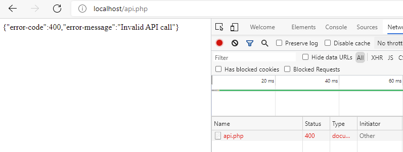
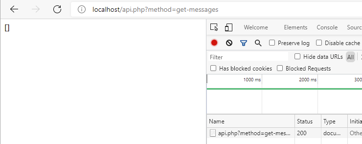
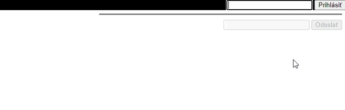

<div class="hidden">

> ## Rozcestník
> - [Späť na úvod](../../README.md)
> - Repo: [Štartér](/../../tree/main/ajax/chat), [Riešenie](/../../tree/solution/ajax/chat)
> - [Zobraziť zadanie](zadanie.md)

# *Chat* aplikácia (DB, PHP, JS, AJAX, CSS)

</div>

## Riešenie

<div class="hidden">

> Toto riešenie obsahuje všetky potrebné služby v `docker-compose.yml`. Po ich spustení sa vytvorí:
> - webový server, ktorý do __document root__ namapuje adresár tejto úlohy s modulom __PDO__. Port __80__ a bude dostupný na adrese [http://localhost/](http://localhost/). Server má pridaný modul pre ladenie [__Xdebug 3__](https://xdebug.org/) nastavený na port __9000__ v "auto-štart móde" (`xdebug.start_with_request=yes`).
> - databázový server s vytvorenou _databázou_ a tabuľkami `messages` a `users` na porte __3306__ a bude dostupný na `localhost:3306`. Prihlasovacie údaje sú:
>   - MYSQL_ROOT_PASSWORD: db_user_pass
>   - MYSQL_DATABASE: dbchat
>   - MYSQL_USER: db_user
>   - MYSQL_PASSWORD: db_user_pass
> - phpmyadmin server, ktorý sa automatický nastavený na databázový server na porte __8080__ a bude dostupný na adrese [http://localhost:8080/](http://localhost:8080/)

</div>

Na začiatok si navrhneme architektúru celého riešenia. Aplikáciu rozdelíme na dve samostatné časti. Serverová časť bude reprezentovaná dvomi súbormi:

1. `index.html` - statická stránka s klientom chat aplikácie.
2. `api.php` - predstavuje vstupný bod, ktorý bude slúžiť ako *webové API*.

Klient aplikácie bude úplne nezávislý od servera, napísaný vo *Vanilla JavaScript* (skript, ktorý nepoužíva žiadne externé knižnice ako napr. *jQuery*). Všetky dáta pre fungovanie chatu bude klient získavať z webového API. Klient bude zo serverom komunikovať pomocou výmeny dát v JSON formáte.

### Vytvorenie anonymného chatu

V prvom kroku vytvoríme verziu "anonymného" chatu, kde môže pridať príspevok hocikto. Perzistentné úložisku dát bude predstavovať databáza, preto si v nej vytvoríme tabuľku pre správy s názvom `messages`. DDL pre jej vytvorenie bude:

```sql
create table messages
(
    `id`      int auto_increment,
    `message` text NOT NULL,
    `created` datetime NOT NULL,
    constraint messages_pk  primary key (id)
);
```

#### Odpovede servera s použitím HTTP stavových kódov

Súčasťou odpovede servera je [*HTTP stavový kód*](https://developer.mozilla.org/en-US/docs/Web/HTTP/Status). Ten je súčasťou hlavičky odosielanej serverom v HTTP odpovedi. V jej tele by sme mali posielať kód a chybovú hlášku (ak nastala chyba), ktorú spracuje klient.

Každá PHP výnimka má svoje číslo a popis, tie sa však nemusia a nebudú zhodovať s&nbsp;definovanými HTTP kódmi. Preto v niektorých častiach budeme musieť PHP výnimky odchytávať a transformovať, aby ich bolo možné posielať pomocou HTTP.

Prečo implementovať komunikáciu s klientom pomocou HTTP stavových kódov? Dôležité je, aby klient používal komunikačný štandard (HTTP protokol) a vedel tak reagovať na prípadné problémy hlásené serverom. Pri posielaní asynchrónnych žiadostí klient vie následne správne vyhodnotiť a vykonať adekvátnu reakciu bez nutnosti odpovede spracovávať vlastným kódom. Niektoré frameworky a knižnice tretích strán vedia statusové kódy ošetriť automaticky.

Vytvoríme si PHP súbor `api.php`. Celý jeho kód bude obalený do jedného `try-catch` bloku, ktorý bude vzniknuté výnimky transformovať na HTTP odpoveď a jej telo vytvárať vo formáte JSON.

To, ktorá metóda API sa zavolá, budeme rozhodovať na základe GET parametra `method`. Vetvenie budeme realizovať pomocou bloku `switch`, kde vetva `default` bude odchytávať nevhodné alebo nepoužité hodnoty tohto parametra. Teda všetko, čo skončí vo vetve `default`, budeme považovať za chybnú HTTP žiadosť. V prípade, že sa tak stane, na klienta pošleme HTTP kód [`400 Bad Request`](https://developer.mozilla.org/en-US/docs/Web/HTTP/Status/400), vyhodíme preto nasledujúcu výnimku:

```php
throw new Exception("Invalid API call", 400);
```

Na vytvorenie odpovede si vytvoríme globálnu funkciu `sendResponse()`, ktorú budeme v&nbsp;kompletnom riešení volať na viacerých miestach. Táto funkcia má tri vstupné argumenty: *HTTP kód*, *HTTP status* a textový reťazec, ktorý bude vypísaný do tela HTTP odpovede.

Pri odchytení výnimky upravíme hlavičku HTTP odpovede pomocou PHP funkcie [`header()`](https://www.php.net/manual/en/function.header.php). Pripájame do nej HTTP kód, kód výnimky a jej text. Následne pridávame do tela odpovede kód a text chyby v podobe poľa, ktoré serializujeme do formátu [JSON](https://developer.mozilla.org/en-US/docs/Learn/JavaScript/Objects/JSON) pomocou PHP funkcie [`json_encode()`](https://www.php.net/manual/en/function.json-encode.php).

Kód v súbore `api.php` bude vyzerať nasledujúco:

```php
function sendResponse($httpCode, $httpStatus, $body = "")
{
    header($_SERVER["SERVER_PROTOCOL"] . " {$httpCode} {$httpStatus}");
    echo $body;
}
try {
    switch (@$_GET['method']) {

        default:  
            throw new Exception("Invalid API call", 400);
                        
    }
} catch (Exception $exception) {
    sendResponse(
        $exception->getCode(),
        $exception->getMessage(),
        json_encode([
            "error-code" => $exception->getCode(),
            "error-message" => $exception->getMessage()
        ])
    );
}
```

#### Ukladanie dát

Ďalej si vytvoríme tri PHP triedy. Prvá bude predstavovať dátový objekt reprezentujúci jeden riadok v databáze. Nazveme ju `Message` a bude vyzerať takto:

```php
class Message {
    public int $id;
    public string $message;
    public string $created;
}
```

Druhá trieda, ktorá bude sprostredkúvať pripojenie na databázu, sa bude volať `Db`. Táto trieda bude mať statickú metódu, ktorá vráti inštanciu `PDO`.

Vzhľadom na to, že chybové výnimky musí odchytávať súbor `api.php`, upravíme chovanie `PDO` tak, aby pri vzniku chyby pri práci databázou bola vyhodená výnimka. To urobíme ihneď po vytvorení jej inštancie nastavením atribútu na príslušnú hodnotu `$this->pdo->setAttribute(PDO::ATTR_ERRMODE, PDO::ERRMODE_EXCEPTION);` ([toto nastavenie je predvolené](https://www.php.net/manual/en/pdo.error-handling.php#:~:text=PDO%3A%3AERRMODE_EXCEPTION&text=0%2C%20this%20is%20the%20default,error%20code%20and%20error%20information.) až od verzie PHP8).
Keďže chybové stavy musí odchytávať súbor `api.php`, upravíme správanie `PDO` tak, aby pri vzniku chyby pri práci databázou bola vyhodená výnimka. To urobíme ihneď po vytvorení jej inštancie `PDO` zavolaním tejto metódy s príslušnými parametrami `  $this->pdo->setAttribute(PDO::ATTR_ERRMODE, PDO::ERRMODE_EXCEPTION);` (toto [nastavenie je predvolené](https://www.php.net/manual/en/pdo.error-handling.php#:~:text=PDO%3A%3AERRMODE_EXCEPTION&text=0%2C%20this%20is%20the%20default,error%20code%20and%20error%20information.) až od verzie PHP8).

Následne si ešte musíme transformovať chybový kód tak, aby zodpovedal HTTP stavovým kódom. Preto po odchytení výnimky vytvoríme novú výnimku, nastavíme jej rovnakú správu a upravíme jej kód na [`500 Internal Server Error`](https://developer.mozilla.org/en-US/docs/Web/HTTP/Status/500).

Účelom tejto triedy je iba vrátiť tú istú inštanciu `PDO` pre komunikáciu s databázou.

Trieda bude vyzerať nasledujúco:

```php
class Db {
    private const DB_HOST = "db:3306";
    private const DB_NAME = "dbchat";
    private const DB_USER = "db_user";
    private const DB_PASS = "db_user_pass";

    private static ?PDO $connection = null;

    public static function conn(): PDO
    {
        if (Db::$connection == null) {
            self::connect();
        }
        return Db::$connection;
    }

    private static function connect() {
        try {
            Db::$connection = new PDO("mysql:host=".self::DB_HOST.";dbname=".self::DB_NAME, self::DB_USER, self::DB_PASS);
            Db::$connection->setAttribute(PDO::ATTR_ERRMODE, PDO::ERRMODE_EXCEPTION);
        } catch (PDOException $e) {
            throw new Exception($e->getMessage(), 500);
        }
    }
}
```

#### Zobrazenie správ v chate

Posledná trieda `MessageStorage` bude obsahovať kód pokrývajúcu výlučne aplikačnú logiku týkajúcu sa PHP triedy `Message`. Aj keď sa to sprvu nezdá, umiestniť túto logiku do triedy `Db` by nebolo vhodné, nakoľko by sa nám v nej zmiešavali viaceré navzájom nesúvisiace programové celky.

Jej prvá metóda bude `getMessages()`, ktorej výstup bude posledných 50 záznamov z&nbsp;databázovej tabuľky `messages` v podobe poľa inštancií triedy `Message`.

```php
class MessageStorage {
    /**
     * @return Message[]
     * @throws Exception
     */
    public function getMessages(): array
    {
        try {
            return Db::conn()
                ->query("SELECT * FROM messages ORDER by created DESC LIMIT 50")
                ->fetchAll(PDO::FETCH_CLASS, Message::class);
        }  catch (PDOException $e) {
            throw new Exception($e->getMessage(), 500);
        }
    }
}
```

Ak bude chcieť klient získať kolekciu posledných 50 správ, bude musieť na server odoslať HTTP žiadosť s GET parametrom `method`, ktorého hodnota bude  `get-messages`. V súbore `api.php` do bloku `switch` pridáme vetvu pre hodnotu `get-messages`. V nej získame pole správ zavolaním metódy `UserStorage::getMessages()`. To následne otočíme tak, aby ako prvá správa bola tá najstaršia pomocou [`array_reverse()`](https://www.php.net/manual/en/function.array-reverse.php) a následne ho serializujeme do formátu JSON a vypíšeme do tela odpovede. Kód bude vyzerať takto:

```php
require "php/Message.php";
require "php/Db.php";
require "php/MessageStorage.php";

try {
    switch (@$_GET['method']) {

        case 'get-messages':
            $messageStorage = new MessageStorage();
            $messages = array_reverse($messageStorage->getMessages());
            echo json_encode($messages);
            break;
            
       // ...     
    }
} catch (Exception $exception) {
    // ...    
}
```

Ak teraz zavoláme naše API a nepošleme žiadne GET parametre, dostaneme chybovú hlášku spolu s HTTP stavovým kódom.



Ak však pridáme GET parameter `method=get-messages`, dostaneme odpoveď bez chyby, aj keď v podobe prázdneho poľa, nakoľko v databáze nemáme žiadne záznamy.



#### Prijímanie správ

Základným súborom klienta je súbor `index.html` obsahujúci statickú webovú stránku. Ten bude načítavať súbor `main.js`, ako *JavaScript modul*, a bude obsahovať inicializáciu klienta aplikácie.

Do elementu `body` vložíme element `div`, ktorému pridáme atribút `id="messages"` a bude slúžiť na zobrazovanie získaných správ. Súbor `index.html` bude obsahovať:

```html
<!DOCTYPE html>
<html lang="en">
<head>
    <meta charset="UTF-8">
    <title>Jednoduchý chat</title>
    <script type="module" src="js/main.js"></script>
</head>
<body>
    <div id="messages">
    </div>
</body>
</html>
```

Odosielanie a spracovanie asynchrónnych žiadostí budeme realizovať pomocou JavaScript funkcie [`fetch()`](https://developer.mozilla.org/en-US/docs/Web/API/Fetch_API). `Fetch API` používa pre spracovanie asynchrónnych volaní [`*promise*`](https://developer.mozilla.org/en-US/docs/Web/JavaScript/Reference/Global_Objects/Promise/then) (prísľub). Namiesto reťazenia *callback* funkcií použijeme kľúčové slová [`async/await`](https://developer.mozilla.org/en-US/docs/Learn/JavaScript/Asynchronous/Async_await). 

<div style="page-break-after: always;"></div>

To značne zjednoduší a sprehľadní kód.

Teraz vytvoríme súbor `chat.js`, v ktorom vytvoríme triedu `Chat`. Tejto triede pridáme metódu `getMessages()`, ktorá pomocou `fetch()` získa pole posledných 50 správ zo servera. Nakoľko budeme používať `async/await`, musíme tú metódu označiť `async`. Funkcia `fetch()` však vyhadzuje výnimky, ktoré nastanú iba v prípade problémov pri komunikácii so serverom, teda v prípade sieťovej chyby.

Pokiaľ klient obdrží odpoveď s ľubovoľným HTTP kódom (aj chybovým), žiadna výnimka nebude vyhodená. Vyhodnotenie, či nastala chyba, budeme musieť implementovať sami. Z tohto dôvodu bude kód metódy `getMessages()` umiestnený do `try-catch` bloku.

Najskôr zavoláme `fetch()`, kde ako parameter doplníme URL `api.php?method=get-messages` a výsledok umiestnime do lokálnej premennej `response`. Nakoľko ide o&nbsp;asynchrónne volanie, vložíme pred `fetch()` kľúčové slovo `await`.

Potom overíme, či má odpoveď HTTP stavový kód `200`. Pokiaľ nie, vytvoríme a vyhodíme výnimku. Ak chyba nenastala, načítame správy. Správy budeme postupne vypisovať do elementu `div` s atribútom `id="messages"`. Jednotlivé elementy správ budeme zostavovať pomocou textového reťazca.

Každá správa bude samostatne zabalená do elementu `div` s atribútom `class="message"`. Dátum vytvorenia a text správy bude v samostatnom `span` elemente. Každému `span` elementu pridáme vlastnú CSS triedu, aby im bolo možné neskôr pridať štýl.

HTML kód každej správy pridávame do lokálnej premennej `messagesHTML`, ktorú po spracovaní všetkých správ pridáme do `innerHTML` daného elementu. Zobrazené správy sa tak zakaždým nanovo zobrazia.

Kód v bloku `catch` vloží do elementu `div` s atribútom `class="message"` text o chybe s jej detailným popisom. Výsledná metóda bude obsahovať nasledujúci kód:

```javascript
class Chat {
    async getMessages() {
        try {
            let response = await fetch("api.php?method=get-messages");
            if (response.status != 200) {
                throw new Error("ERROR:" + response.status + " " + response.statusText);
            }
            let messages = await response.json();
            let messagesHTML = "";
            messages.forEach(message => {
                messagesHTML += `
                        <div class="message">
                            <span class="date">${message.created}</span>             
                            <span>${message.message}</span>
                        </div>`;
            })
            document.getElementById("messages").innerHTML = messagesHTML;
        } catch (e) {
            document.getElementById("messages").innerHTML = `<h2>Nastala chyba na strane servera.</h2><p>${e.message}</p>`;
        }
    }
}
export default Chat;
```

Súbor `main.js` vytvorí po inicializácii stránky v prehliadači inštanciu triedy `Chat` a pridá ju do `window.chat`. Klient má za úlohu každú sekundu získavať správy, čo implementujeme vytvorením periodického časovača pomocou funkcie [`setInterval()`](https://developer.mozilla.org/en-US/docs/Web/API/WindowOrWorkerGlobalScope/setInterval), ktorá bude volať metódu `Chat.getMessages()`. Časovač sa však prvýkrát nespustí ihneď, ale až po uplynutí 1 sekundy. Aby používateľ nemusel čakať, zavoláme po nastavení intervalu metódu `getMessages()`. Asynchrónne volania nemôžeme umiestniť do konštruktora, pretože konštruktor vracia novú inštanciu danej triedy a nie prísľub (*promise*). Preto vytvoríme novú asynchrónnu metódu `Chat.run()`, ktorá bude obsahovať:

```javascript
class Chat {
    // ...
    async run() {
        setInterval(this.getMessages, 1000);
        await this.getMessages()
    }
}
```

<div style="page-break-after: always;"></div>

Skript teda najprv vytvorí inštanciu triedy `Chat` a následne zavolá jej metódu `Chat.init()`:

```javascript
import Chat from "./chat.js";

window.onload = async function () {
    window.chat = new Chat();
    await window.chat.run();
}
```

V tomto momente bude chat zobrazovať iba dáta, ktoré sú v databáze. Aby sme dáta mohli na server odosielať, musíme upraviť `index.html`. Najprv pridáme za element `div` s&nbsp;`id="messages"` nový element `div`, do ktorého umiestnime element `input` s atribútom `id="message"`, ktorý zobrazí textové pole a element `button` s atribútom `id="send-button"` pre odoslanie napísanej správy.

```html
<div>
    <input type="text" id="message">
    <button id="send-button">Odoslať</button>
</div>
```

#### Posielanie správ

Teraz do triedy `Chat` pridáme metódu `postMessage()`, ktorej zavolaním odošleme dáta novej správy na server. Zasielanie parametrov pomocou HTTP metódy POST je trochu komplikovanejšie ako pomocou HTTP GET, pretože je potrebné pridať zopár doplňujúcich informácií. Tie pridáme metóde `fetch()` ako druhý parameter:

1. Aby `fetch()` poslal žiadosť typu HTTP POST, musíme doplniť nastavenie `method: "POST"`.
2. Doplníme HTTP hlavičku, ktorá bude informovať server, že telo HTTP požiadavky bude obsahovať dáta: `'Content-Type': 'application/x-www-form-urlencoded'`.
3. Nakoniec do tela pridáme POST parameter `body` a naplníme ho hodnotou z `input` elementu správy.

Teraz skontrolujeme HTTP kód odpovede. Nakoľko server nepotrebuje odoslať po uložení správy na klienta žiadne dáta, budeme očakávať návratový HTTP kód [`204 No Content`](https://developer.mozilla.org/en-US/docs/Web/HTTP/Status/204).

Ako posledný krok nastavíme obsah elementu `input` s atribútom `id="message"` ako prázdny. Takto bude používateľ môcť ihneď po odoslaní správy začať písať novú. Metóda `postMessage()` bude vyzerať:

```javascript
class Chat {
    // ...
    async postMessage() {
        try {
            let response = await fetch(
                "api.php?method=post-message",
                {
                    headers: {
                        'Content-Type': 'application/x-www-form-urlencoded'
                    },
                    method: "POST",
                    body: "message=" + document.getElementById("message").value
                });
    
            if (response.status != 204) {
                throw new Error("ERROR:" + response.status + " " + response.statusText);
            }
    
            document.getElementById("message").value = "";
        } catch (err) {
            console.log('Request Failed', err);
        }
    }
}
```

Používateľ bude môcť odoslať správu dvoma spôsobmi:

1. Kliknutím na element `button`. Zavoláme metódu `Chat.postMessage()` v udalosti `onclick`.
2. Stlačením klávesa `ENTER`. V udalosti `onkeyup` elementu `input` najprv skontrolujeme, či bol stlačený kláves `ENTER` pomocou `event.code === "Enter"` a ak áno, spustíme opäť metódu `Chat.postMessage()`. 

<div style="page-break-after: always;"></div>

Kód, ktorý bude implementovať túto funkcionalitu, umiestnime do konštruktora triedy `Chat`.

```javascript
class Chat {
    // ...
    constructor() {
        document.getElementById("send-button").onclick = () => this.postMessage();
        document.getElementById("message").onkeyup = async (event) => {
            if (event.code === "Enter") {
                await this.postMessage();
            }
        }
    }
    // ...
}
```

Odoslaná správa sa ešte neuloží do databázy. Do triedy `MessageStorage` pridáme novú metódu `storeMessage()`, ktorej jediný vstupný parameter bude inštancia triedy `Message`. V nej si vytvoríme SQL príkaz `INSERT` s použitím triedy [`PDOStatement`](https://www.php.net/manual/en/class.pdostatement.php), následne vložíme potrebné hodnoty pre vytvorenie záznamu v databáze a SQL dopyt spustíme. Pridaná metóda bude vyzerať:

```php
class MessageStorage {
    // ...   
    public function storeMessage(Message $message)
    {
        try {
            $sql = "INSERT INTO messages (message, created) VALUES (?, ?)";
            Db::conn()->prepare($sql)->execute([$message->message, $message->created]);
        }  catch (PDOException $e) {
            throw new Exception($e->getMessage(), 500);
        }
    }
    // ...
}
```

V súbore `api.php` do `switch` bloku pridáme vetvu `post-message`. Samotný text správy bude prenášaný v tele HTTP POST žiadosti v POST parametri s názvom `message`. Preto vyhodíme výnimku, ak tento parameter nebude existovať alebo bude obsahovať prázdnu hodnotu. Následne si vytvoríme novú inštanciu triedy `Message` a jej jednotlivé atribúty naplníme hodnotami. Následne túto inštanciu uložíme pomocou volania metódy `MessageStorage::storeMessage()`.

Po úspešnom vykonaní uloženia vrátime HTTP stavový kód `204`. Kód bude nasledujúci:

```php
// ..
switch (@$_GET['method']) {
    // ...
    case 'post-message':
      if (!empty($_POST['message'])) {
          $m = new Message();          
          $m->message = $_POST['message'];          
          $m->created = date('Y-m-d H:i:s');
          
          $messageStorage = new MessageStorage();
          $messageStorage->storeMessage($m);
          sendResponse(204, 'No Content');
      } else {
          throw new Exception("Invalid API call", 400);
      }
      break;
    // ...
}
```

### Stav AJAX žiadosti

Pri odoslaní správy na server naša aplikácia používateľovi nijako neoznamuje, že sa na pozadí vykonáva nejaká logika. Bude preto dobré pridať toto oznámenie do kódu našej aplikácie. Ako prvé vytvoríme CSS štýl, ktorý zobrazí komponent [*spinner*](https://projects.lukehaas.me/css-loaders/). Ide o vizuálny animovaný prvok, ktorý používateľovi naznačuje, že ním spustená akcia sa vykonáva na pozadí.

<div style="page-break-after: always;"></div>

Pridáme preto do našej aplikácie nasledujúci CSS štýl<span class="hidden">([zdroj](https://www.w3schools.com/howto/howto_css_loader.asp))</span>:

```css
.loader {
    border: 4px solid #f3f3f3; /* Light grey */
    border-top: 4px solid #3498db; /* Blue */
    border-radius: 50%;
    width: 12px;
    height: 12px;
    animation: spin 2s linear infinite;
    display: inline-block;
}
@keyframes spin {
    0% {
        transform: rotate(0deg);
    }
    100% {
        transform: rotate(360deg);
    }
}
```

Tento CSS kód vytvorí kruhový sivý rámček, kde jedna štvrtina je modrá. Je k nemu pridaná animácia, ktorá ho za dve sekundy otočí okolo svojej osi o 360 stupňov.

Informáciu o prebiehajúcom procese na pozadí momentálne zobrazujeme pri odoslaní správy. Volaním metódy `Chat.postMessage()` musíme zablokovať elementy: `input` s&nbsp;`id="message` a `button` s&nbsp;`id="send-button"`. Tým pádom nebude možné túto metódu spustiť znovu, ale iba, ak už spustená AJAX žiadosť skončí. Taktiež zmeníme text elementu `button` s&nbsp;`id="send-button"` z `Odoslať` na `Posielam...`.

Na začiatku metódy `Chat.postMessage()` preto zmeníme HTML obsah elementu `button` s&nbsp;`id="send-button"` a následne nastavíme elementom `input` s&nbsp;`id="message"` a `button` s&nbsp;`id="send-button"` atribút `disabled` na hodnotu `true`. Znemožníme tak používateľovi zmeniť správu a kliknúť na tlačidlo `Odoslať`. Za `try-catch` bloky pridáme blok `finally`, ktorého kód sa spustí, keď AJAX žiadosť skončí. V ňom opäť zmeníme HTML obsah elementu `button` s&nbsp;`id="send-button"` a následne nastavíme elementom `input` s&nbsp;`id="message"` a `button` s&nbsp;`id="send-button"` atribút `disabled` na hodnotu `false`.

Po vymazaní dát z elementu `input` s `id="message"` môžeme presunúť *focus* na tento element pomocou metódy [`HTMLElement.focus()`](https://developer.mozilla.org/en-US/docs/Web/API/HTMLOrForeignElement/focus), čím umožníme používateľovi priamo písať ďalšiu správu. Inak by naň používateľ musel opätovne kliknúť.

Kód metódy `Chat.postMessage()` bude po úprave nasledujúci:

```javascript
class Chat {
    // ...
    async postMessage() {
        document.getElementById("send-button").innerHTML = `<span class="loader"></span> Posielam...`;
        document.getElementById("send-button").disabled = true;
        document.getElementById("message").disabled = true;
        try {
            let response = await fetch(
                "api.php?method=post-message",
                {
                    headers: {
                        'Content-Type': 'application/x-www-form-urlencoded'
                    },
                    method: "POST",
                    body: "message=" + document.getElementById("message").value
                });
            if (response.status != 204) {
                throw new Error("ERROR:" + response.status + " " + response.statusText);
            }
            document.getElementById("message").value = "";
        } catch (err) {
            console.log('Request Failed', err);
        } finally {
            document.getElementById("send-button").innerHTML = `Odoslať`;
            document.getElementById("send-button").disabled = false;
            document.getElementById("message").disabled = false;
            document.getElementById("message").focus();
        }
    }
    // ...
}
```

### Posielanie správ až po prihlásení

Teraz upravíme posielanie správ tak, aby sa používateľ musel pre ich odosielanie prihlásiť, inak ich bude môcť iba čítať. Používateľ bude musieť zadať meno, pod ktorým bude v chate vystupovať. Aby sme nekomplikovali celú aplikáciu, heslo nebudeme vyžadovať.

Ďalej nebude možné, aby používali chat súčasne dvaja používatelia s rovnakým menom. Z&nbsp;tohto dôvodu vytvoríme v databáze novú tabuľku `users`, ktorá bude obsahovať mená aktuálne prihlásených používateľov. DDL pre tabuľku bude:

```sql
create table users
(
    `id`   int auto_increment primary key,
    `name` varchar(100) NOT NULL
);
```

Do existujúcej tabuľky `messages` pridáme stĺpec `user`, ktorý bude obsahovať meno používateľa, ktorý správu odoslal. Lepšie by bolo použiť *cudzie kľúče*, ale kvôli tomu, aby sme aplikáciu udržali jednoduchú, ich nepoužijeme. Pred samotným pridaním stĺpca odporúčame vymazať staré správy, pretože staré záznamy neobsahujú položku `user`. DDL upravenej tabuľky `messages` je nasledujúce:

```sql
create table messages
(
    `id`      int  auto_increment primary key,
    `message` text NOT NULL,
    `created` datetime default current_timestamp() NOT NULL,
    `user`    varchar(100) NOT NULL
);
```

Do PHP triedy `Message` doplníme atribút `$user`, aby trieda reflektovala úpravu databázovej tabuľky `messages`:

```php
class Message
{
    public int $id;
    public string $message;
    public string $created;
    public string $user;
}
```

Vytvoríme novú PHP triedu `User` a doplníme do nej atribúty tak, aby zodpovedala svojej databázovej verzii:

```php
class User
{
    public int $id;
    public string $name;
}
```

#### Správa používateľov

Podobne, ako sme vytvorili triedu `MessageStorage` obsahujúcu ukladanie správ, vytvoríme triedu `UserStorage`. Tá bude obsahovať štyri verejné metódy na: 

- získanie zoznamu všetkých používateľov (výpis prihlásených používateľov),
- overenie existencie používateľa v DB (kontrola duplicitného mena)
- pridanie nového používateľa (používateľ sa úspešne prihlásil),
- vymazanie používateľa (používateľ sa odhlásil).

Metóda na získanie zoznamu prihlásených používateľov:

```php
class UserStorage 
{
    // ...
    public function getUsers() : array
    {
        try {
            return Db::conn()
                ->query("SELECT * FROM users")
                ->fetchAll(PDO::FETCH_CLASS, User::class);
        }  catch (PDOException $e) {
            throw new Exception($e->getMessage(), 500);
        }
    }
    // ...
}
```

Kontrola, či je používateľ prihlásený:

```php
class UserStorage 
{   
    // ...
    public function isLogged($name): bool
    {
        try {
            $stmt = Db::conn()
                ->prepare("SELECT COUNT(*) FROM users WHERE name LIKE ?");
            if (!$stmt->execute([$name])) {
                return false;
            }
            return $stmt->fetchColumn() > 0;
    }  catch (PDOException $e) {
            throw new Exception($e->getMessage(), 500);
        }
    }
    // ...
}
```

Pridávanie používateľa je podobné ako pridávanie správy a vyzerá nasledujúco:

```php
class UserStorage {   
    // ...
    public function addUser($name)
    {
        try {
            $sql = "INSERT INTO users (name) VALUES (?)";
            Db::conn()->prepare($sql)->execute([$name]);
        } catch (PDOException $e) {
            throw new Exception($e->getMessage(), 500);
        }
    }
    // ...
}
```

A ako poslednú pridáme metódu, ktorou budeme na základe mena mazať záznamy používateľov:

```php
class UserStorage {   
    // ...
    public function removeUser($name)
    {
        try {
            $sql = "DELETE FROM users WHERE name = ?";
            Db::conn()->prepare($sql)->execute([$name]);
        }  catch (PDOException $e) {
            throw new Exception($e->getMessage(), 500);
        }
    }
    // ...
}
```

#### Prihlásenie používateľa

Teraz rozšírime skript `api.php` tak, aby umožňoval prihlásenie používateľa. Aby si server pamätal, aké je meno prihláseného používateľa, budeme toto meno ukladať do [`session`](https://www.php.net/manual/en/book.session.php). PHP umožňuje dáta pre *session* uložiť do špeciálnej superglobálnej premennej [`$_SESSION`](https://www.php.net/manual/en/reserved.variables.session.php). Na začiatku PHP skriptu treba nastaviť, že aplikácia bude *session* používať. Preto prvý riadok v skripte `api.php` bude volanie funkcie [`session_start()`](https://www.php.net/manual/en/function.session-start.php).

`$_SESSION` je pole, v ktorom index `user` bude obsahovať informáciu o mene aktuálne prihláseného používateľa pre danú *session*. Pokiaľ tento index nebude existovať alebo bude obsahovať prázdnu hodnotu (`null` alebo prázdny textový reťazec), bude aplikácia považovať používateľa sa neprihláseného.

Za prihláseného budeme používateľa považovať, ak odošle na server meno, ktoré nikto z&nbsp;ostatných prihlásených používateľov nepoužíva (implementáciu chceme udržať čo najjednoduchšiu, preto nevytvoríme kompletné prihlasovanie menom a heslom).

Samotné prihlásenie bude prebiehať tak, že pošleme HTTP POST žiadosť na adresu `api.php?method=login`, kde meno používateľa pošleme v tele ako POST parameter. Nesmieme zabudnúť, že pokiaľ už je používateľ prihlásený (existuje hodnota v&nbsp;`$_SESSION['user']`), nesmieme v procese prihlasovania pokračovať.

Následne skontrolujeme, či tabuľka `users` už neobsahuje rovnaké meno používateľa. Ak ho bude obsahovať, server vráti odpoveď s chybou, že používateľ s rovnakým menom je už prihlásený. Pre zjednodušenie implementácie na strane klienta v tomto špecifickom prípade vrátime HTTP stavový kód s vlastnou hodnotou `455`. V tomto prípade si používateľ bude musieť zvoliť iné meno. Ak taký používateľ v tabuľke ešte nie je, tak sa meno používateľa uloží do databázy a v `$_SESSION` vytvoríme index `user`, kde túto hodnotu rovnako uložíme. Následne v odpovedi s HTTP stavovým kódom `200` vrátime túto hodnotu.

V príklade sa nebudeme zaoberať čo s používateľmi, ktorí sa neodhlásia, pokým majú platnú *session*. V tomto prípade je potrebné si viesť záznam o tom, kedy používateľ naposledy odoslal správu a po vypršaní platnosti jeho *session* je nutné jeho meno z&nbsp;tabuľky `users` odstrániť (inak sa týmto menom už nebude možné v chate prihlásiť).

Do súboru `api.php` v bloku `switch` pridáme novú vetvu pre hodnotu `login`, ktorej kód bude nasledujúci:

```php
// ...
switch (@$_GET['method']) {
    // ...
    case 'login':
        if (!empty($_POST['name'])){
            if (!empty($_SESSION['user'])) {
                throw new Exception("User already logged", 400);
            }
            $userStorage = new UserStorage();
            if ($userStorage->isLogged($_POST['name'])) {
                throw new Exception("User already exists", 455);
            };
            $userStorage->addUser($_POST['name']);
            $_SESSION['user'] = $_POST['name'];
            echo json_encode($_SESSION['user']);
        } else {
            throw new Exception("Invalid API call", 400);
        }
        break;
    // ...
}
```

Kontrolu v súbore `api.php`, či je používateľ prihlásený, pridáme aj do časti, ktorá je zodpovedná za pridávanie správ. Tým podmienime poslanie správy prihlásením. Taktiež doplníme informáciu o tom, kto správu vytvoril tak, že do atribútu `$user` pridáme hodnotu z `$_SESSION['user']`:

```php
// ...
switch (@$_GET['method']) {
   // ...
   case 'post-message':
        if (empty($_SESSION['user'])){
            throw new Exception("Must be logged to post messages.", 400);
        }
        if (!empty($_POST['message'])) {
            $m = new Message();
            $m->user = $_SESSION['user'];
            $m->message = $_POST['message'];
            $m->created = date('Y-m-d H:i:s');
            
            $messageStorage = new MessageStorage();
            $messageStorage->storeMessage($m);      
            //No content
            http_response_code(204);
        } else {
            throw new Exception("Invalid API call", 400);
        }
        break;        
    // ...
}
```

Nesmieme zabudnúť na pridanie mena používateľa pri ukladaní novej správy v&nbsp;`MessageStorage::storeMessage()`:

```php
class MessageStorage {
    // ...
    public function storeMessage(Message $message){
        try {
            $sql = "INSERT INTO messages (message, created, user) VALUES (?, ?, ?)";
            Db::conn()->prepare($sql)
                ->execute([$message->message, $message->created, $message->user]);
        }  catch (PDOException $e) {
            throw new Exception($e->getMessage(), 500);
        }
    }
    // ...
}
```

#### Odhlásenie používateľa

Teraz pridáme kód na odhlásenie, ktorý sa bude spúšťať pomocou `api.php?method=logout`. Pri spustení odhlasovania musíme najskôr overiť, či je používateľ prihlásený. Pokiaľ je, najprv ho vymažeme z databázy a následne vymažeme dáta v *session* pomocou funkcie [`session_destroy()`](https://www.php.net/manual/en/function.session-destroy.php) a vrátime HTTP kód `204`.

```php
// ...
switch (@$_GET['method']) {
     // ...
     case 'logout' :
           if (!empty($_SESSION['user'])){
               $userStorage = new UserStorage();
               $userStorage->removeUser($_SESSION['user']);
               session_destroy();
               sendResponse(204, 'No Content');
           } else {
               throw new Exception("Invalid API call", 400);
           }
       break;
    // ...
}
```

#### Overenie stavu používateľa

Klient bude môcť kedykoľvek overiť, či je používateľ prihlásený. Bude to overovať v&nbsp;prípade prihlásenia a odhlásenia (či prebehlo v poriadku) a pri inicializácii triedy `Chat` (používateľ napr. zatvorí stránku a následne ju znovu otvorí ešte predtým než jeho *session* vyprší).

Preto pridáme do servera ďalšiu metódu, ktorá vráti hodnotu `false`, ak nie je používateľ prihlásený alebo jeho meno, ak je prihlásený. Táto metóda bude dostupná na URL adrese `?method=is-logged` a bude iba kontrolovať, či je v `$_SESSION` index `user` a ak áno, či obsahuje nejakú hodnotu. Kód bude vyzerať nasledujúco:

<div class="end">

```php
switch (@$_GET['method']) {
    // ...
    case 'is-logged' :
        echo json_encode(empty($_SESSION['user']) ? false : $_SESSION['user']);
        break;
    // ...
}
```
</div>

#### Integrácia prihlásenia a odhlásenia do aplikácie

Do súboru `index.html` pridáme prvky, ktoré budú predstavovať jednoduché menu. Toto menu bude obsahovať buď formulár na prihlásenie, alebo element zobrazujúci meno aktuálne prihláseného používateľa s tlačidlom na odhlásenie.

Vytvoríme preto element `div` s atribútom `id="status-bar"`. Ten bude slúžiť ako kontajner, ktorý zobrazí vnútorné komponenty pomocou `position: fixed` navrchu okna prehliadača. Ak nebude používateľ prihlásený, zobrazí sa element `div` s atribútom `id="login-form"` obsahujúci polia formulára na prihlásenie. V opačnom prípade, po úspešnom prihlásení, bude zobrazený element `div` s atribútom `id="logout-form"` zobrazujúci informáciu o mene aktuálneho používateľa a tlačidlo na odhlásenie.

<div style="page-break-after: always;"></div>

Doplnený HTML kód bude vyzerať takto:

```html
<div id="status-bar">
    <div id="logout-form" class="hidden">
        <span>Prihlásený ako: </span><span id="user-name"></span>
        <button id="logout-button">Odhlásiť</button>
    </div>
    <div id="login-form">
        <input type="text" id="login">
        <button id="login-button">Prihlásiť</button>
    </div>
</div>
<div id="messages">
</div>
<div id="chat-bar">
    <input type="text" id="message">
    <button id="send-button">Odoslať</button>
</div>
```

Doplníme ešte CSS pre spomenuté elementy. V ďalšom JavaScript kóde budeme používať CSS triedu `.hidden` pre skrývanie elementov, ktoré nechceme používateľovi zobraziť. Pridáme nasledujúce CSS:

```css
body {
    padding-top: 20px;
}
#status-bar {
    top: 0;
    left: 0;
    position: fixed;
    width: 100%;
    background-color: black;
    margin: 0;
    text-align: right;
    color: white;
}
.user {
    font-weight: bold;
}
.hidden {
    display: none;
}
```

#### Pridanie informácie o odosielateľovi správy 

Prvá a najjednoduchšia úprava bude v metóde `getMessages()` triedy `Chat` pre výpis správ získaných zo servera. Pridali sme do dát informáciu o používateľovi, ktorý správu napísal, preto ju doplníme do výpisu:

<div class="end">

```javascript
class Chat {
    // ...
    async getMessages() {
        try {
    
            let response = await fetch("api.php?method=get-messages");
    
            if (response.status != 200) {
                throw new Error("ERROR:" + response.status + " " + response.statusText);
            }
            let messages = await response.json();
            let messagesHTML = "";
            messages.forEach(message => {
                messagesHTML += `
                        <div class="message">
                            <span class="date">${message.created}</span>
                            <span class="user">${message.user} &gt; </span>
                            <span>${message.message}</span>
                        </div>`;
            })
            document.getElementById("messages").innerHTML = messagesHTML;
        } catch (e) {
            document.getElementById("messages").innerHTML = `<h2>Nastala chyba na strane servera.</h2><p>${e.message}</p>`;
        }
    }
    // ...
}
```

</div>

#### Úprava chatu pre prihlásených používateľov

Keďže chceme, aby kód JavaScriptu bol čo najprehľadnejší, vytvoríme novú triedu `UIHelper`, ktorá bude obsahovať iba kód na modifikáciu HTML elementov. Najprv tu presunieme kód, ktorým povolíme, alebo zablokujeme odoslanie správy. Vzhľadom na to, že nechceme neprihlásenému používateľovi umožniť odosielať správy a naopak prihlásenému používateľovi chceme zobraziť pri odosielaní správy komponent *spinner*, doplníme do metódy pre zablokovanie formulára správy parameter pre zobrazenie komponentu *spinner*. Trieda `UIHelper` bude mať nasledujúci obsah:

```javascript
class UIHelper {

    enableMessageSubmit() {
        document.getElementById("send-button").innerHTML = `Odoslať`;
        document.getElementById("send-button").disabled = false;
        document.getElementById("message").disabled = false;
    }

    disableMessageSubmit(showLoading = true) {
        let sendB = document.getElementById("send-button");
        if (showLoading) {
            sendB.innerHTML = `<span class="loader"></span> Posielam...`;
        }
        sendB.disabled = true;
        document.getElementById("message").disabled = true;
    }
}
export default UIHelper;
```

Inštanciu triedy `UIHelper` vložíme do triedy `Chat` ako atribút `UI` takto:

```javascript
import UIHelper from "./UIHelper.js";

class Chat {
    /**
     *
     * @type {UIHelper}
     */
    UI = new UIHelper();
    // ...
}
```

Upravíme kód metódy `Chat.postMessage()` tak, aby zmena v HTML bola vykonaná triedou `UIHelper` takto:

```javascript
class Chat {
    // ...
    async postMessage() {
        this.UI.disableMessageSubmit();
        try {
            let response = await fetch(
                "api.php?method=post-message",
                {
                    headers: {
                        'Content-Type': 'application/x-www-form-urlencoded'
                    },
                    method: "POST",
                    body: "message=" + document.getElementById("message").value
                });
    
            if (response.status != 204) {
                throw new Error("ERROR:" + response.status + " " + response.statusText);
            }
    
            document.getElementById("message").value = "";
    
        } catch (err) {
            console.log('Request Failed', err);
        } finally {
            this.UI.enableMessageSubmit();
            document.getElementById("message").focus();
        }
    }
    // ...
}
```

Následne si v triede `UIHelper` pripravíme metódy na zobrazovanie formulára na prihlásenie a element na odhlásenie. Metóda na zobrazenie elementu odhlásenia má parameter, ktorým zobrazíme aktuálne prihlásenému používateľovi meno, pod ktorým píše správy. Taktiež pri zobrazení prihlasovacieho formulára zmažeme obsah elementu `input` s atribútom `id="message"` (pole na zapisovanie textu správy), pokiaľ používateľ má správu rozpísanú a rozhodne sa odhlásiť. Metódy budú nasledujúce:

```javascript
class UIHelper {
    // ...
    showLoginForm() {
        document.getElementById("logout-form").classList.add("hidden");
        document.getElementById("login-form").classList.remove("hidden");
        document.getElementById("message").value = "";
    }
    showLogoutForm(userName) {
        document.getElementById("logout-form").classList.remove("hidden");
        document.getElementById("login-form").classList.add("hidden");
        document.getElementById("user-name").innerText = userName;
    }
}
```

Do triedy `Chat` pridáme ako prvú metódu `checkLoggedState()` na overenie toho, či je používateľ prihlásený. Tá bude posielať žiadosť na URL adresu `api.php?method=is-logged` a pokiaľ získa ako odpoveď HTTP stavový kód `200` a telo odpovede nebude obsahovať hodnotu `false`, povolí sa posielanie správ a zobrazí sa element na odhlásenie. V opačnom prípade sa vyhodí výnimka.

Ak pri behu metódy `checkLoggedState()` nastane výnimka, pri jej odchytení sa zablokuje odosielanie správ a zobrazí sa formulár na prihlásenie. Aplikácia sa bude chovať, ako by bol používateľ neprihlásený. Nesmieme zabudnúť zavolať metódu `this.UI.disableMessageSubmit(false)`, pretože nechceme zobraziť komponent *spinner*. Kód metódy `checkLoggedState()` bude:

```javascript
class Chat {
    // ...
    async checkLoggedState() {
        try {
            let response = await fetch("api.php?method=is-logged");
    
            if (response.status != 200) {
                throw new Error("ERROR:" + response.status + " " + response.statusText);
            }
            let isLogged = await response.json();
    
            if (!isLogged) {
                throw new Error("User not logged.")
            } else {
                this.UI.enableMessageSubmit();
                this.UI.showLogoutForm(isLogged);
            }
        } catch (er) {
            this.UI.disableMessageSubmit(false);
            this.UI.showLoginForm();
        }
    }
    // ...
}
```

Metódu `checkLoggedState()` pridáme do metódy `run()` triedy `Chat` tak, aby bola spustená ako prvá:

```javascript
class Chat {
    // ...
    async run() {
        await this.checkLoggedState();
        setInterval(this.getMessages, 1000);
        await this.getMessages()
    }
    // ...
}
```

Do triedy `Chat` pridáme novú metódu `makeLogin()`, ktorou budeme odosielať potrebné dáta na prihlásenie. Informácia o mene sa bude odosielať v POST parametri `name` a jeho hodnotu získame z elementu `input` s atribútom `id="login"`.

Ak server vráti HTTP kód `200`, vieme, že prihlásenie prebehlo úspešne a spustíme overenie prihlásenia pomocou metódy `checkLoggedState()` (tá sa postará aj o správnu úpravu používateľského rozhrania klienta). V prípade návratu HTTP stavového kódu `455` (klient s rovnakým menom už existuje), zobrazíme používateľovi dialógové okno so správou, že si musí zvoliť iné meno pomocou funkcie [`alert()`](https://developer.mozilla.org/en-US/docs/Web/API/Window/alert).

Kód prihlasovacej metódy `makeLogin()` bude vyzerať:

```javascript
class Chat {
    // ...
    async makeLogin() {
        try {
            let response = await fetch(
                "api.php?method=login",
                {
                    headers: {
                        'Content-Type': 'application/x-www-form-urlencoded'
                    },
                    method: "POST",
                    body: "name=" + document.getElementById("login").value
                });
    
            if (response.status != 200) {
                if (response.status == 455) {
                    alert(
                        "Meno '"
                        + document.getElementById("login").value
                        + "' už používa iný používateľ. Zadajte iné meno."
                    )
                }
                throw new Error("ERROR:" + response.status + " " + response.statusText);
            }
        } catch (e) {
            console.log('Request Failed', e);
        } finally {
            await this.checkLoggedState();
        }
    }
    // ...
}
```

Po prihlásení pridáme kód na odhlásenie. V triede `Chat` vytvoríme metódu `makeLogout()`, ktorá pošle AJAX žiadosť na URL adresu `api.php?method=logout` a následne zavolá metódu `checkLoggedState()`, ktorá overí stav prihlásenia a upraví používateľské rozhranie na klientovi:

```javascript
class Chat {
    // ...
    async makeLogout() {
        try {
            let result = await fetch("api.php?method=logout");
        } catch (err) {
            console.log('Request Failed', err);
        } finally {
            await this.checkLoggedState();
        }
    }
    // ...
}
```

Následne do konštruktora triedy `Chat` pridáme obsluhu príslušných udalostí tlačidlám pre prihlásenie a odhlásenie:

```javascript
class Chat {
    // ...
    constructor() {
        document.getElementById("login-button").onclick = () => this.makeLogin();
        document.getElementById("logout-button").onclick = () => this.makeLogout();
        document.getElementById("send-button").onclick = () => this.postMessage();
        document.getElementById("message").onkeyup = async (event) => {
            if (event.code === "Enter") {
                await this.postMessage();
            }
        }
    }
    // ...
}
```

#### Indikácia odosielania AJAX žiadosti

Teraz pridáme indikáciu odosielania AJAX žiadosti na pozadí pridaním komponentu *spinner* pri prihlasovaní a odhlasovaní na klientovi. Do triedy `UIHelper` pridáme metódu `showStatusBarLoading()`. Jej úlohou bude skryť prihlasovací formulár a aj element pre odhlásenie.

Potom zobrazíme animáciu signalizujúcu načítavanie správ. Element s animáciou budeme musieť vytvoriť ako nový element a pridať ho do elementu `input` s atribútom `id="status-bar"`. 

Tento element budeme musieť následne pri zobrazení prihlásenia alebo odhlásenia vymazať. Jeho zmazanie vykonáme príkazom `document.querySelector("#status-bar > .loader")?.remove();`. Nakoľko element obsahujúci komponent *spinner* nemusí byť v&nbsp;momente volania ešte vytvorený, pred metódou `remove()` použijeme operátor `?`:

```javascript
class UIHelper {
    // ...
    showStatusBarLoading() {
        let loader = document.createElement("div");
        loader.classList.add("loader");
        document.getElementById("logout-form").classList.add("hidden");
        document.getElementById("login-form").classList.add("hidden");
        document.getElementById("status-bar").append(loader);
    }
    showLoginForm() {
        document.getElementById("logout-form").classList.add("hidden");
        document.getElementById("login-form").classList.remove("hidden");
        document.getElementById("message").value = "";
        document.querySelector("#status-bar > .loader")?.remove();
    }
    showLogoutForm(userName) {
        document.getElementById("logout-form").classList.remove("hidden");
        document.getElementById("login-form").classList.add("hidden");
        document.getElementById("user-name").innerText = userName;
        document.querySelector("#status-bar > .loader")?.remove();
    }
}
```

<div style="page-break-after: always;"></div>

Posledne vytvorenú metódu `showStatusBarLoading()` doplníme na začiatok metód `makeLogin()` a `makeLogout()` v triede `Chat`:

```javascript
class Chat {
    // ...
    async makeLogin() {
        try {
            this.UI.showStatusBarLoading();
            // ...
        } catch (e) {
            console.log('Request Failed', e);
        }
    }
    async makeLogout() {
        try {
            this.UI.showStatusBarLoading();
            let result = await fetch("api.php?method=logout");
        } catch (err) {
            console.log('Request Failed', err);
        } finally {
            await this.checkLoggedState();
        }
    }
    // ...
}
```

### Súkromné správy

Posledná časť, ktorú do nášho chatu pridáme, bude posielanie súkromných správ. Ako prvé upravíme tabuľku `Users` a pridáme do nej stĺpec `private_for`, ktorý bude obsahovať informáciu, pre koho je daná správa určená. Tento stĺpec označíme ako `null`, čo znamená, že nie je povinný. 

DDL pre tabuľku `Users` bude po pridaní takéto:

```sql
create table messages
(
    `id`          int auto_increment primary key,
    `message`     text NOT NULL,
    `created`     datetime default current_timestamp() NOT NULL,
    `user`        varchar(100) NOT NULL,
    `private_for` varchar(100) NULL
);
```

Nesmieme zabudnúť doplniť do PHP triedy `User` nový atribút `$private_for`. Tento atribút sme označili ako *nullable string* (syntax s otáznikom), pretože nemusí byť vyplnený a môže obsahovať hodnotu `null`.

```php
class Message
{
    public int $id;
    public string $message;
    public string $created;
    public string $user;
    public ?string $private_for;
}
```

Najprv musíme pozmeniť štruktúru HTML elementov v súbore `index.html` tak, že existujúce elementy `div` s atribútom `id="messages"` a `div` s atribútom `id="chat-bar"` vložíme do nového elementu `div` s atribútom `id="chat-content"`. Tento nový element následne umiestnime ako potomka do elementu `div` s atribútom `id="frame"`. Do neho potom pridáme ako prvého potomka ďalší element `div` s atribútom `id="users-list"`. 

HTML kód bude po úpravách vyzerať nasledujúco:

```html
<body>
<div id="status-bar">
    // ...
</div>
<div id="frame">
    <div id="users-list">
    </div>
    <div id="chat-content">
        <div id="messages">
        </div>
        <div id="chat-bar">
            // ...
        </div>
    </div>
</div>
</body>
```

#### Písanie súkromnej správy

Ďalej doplníme elementy, ktoré budú používateľovi zobrazovať informáciu o tom, že píše súkromnú správu a taktiež tlačidlo, ktorým bude možné písanie súkromnej správy zrušiť, ak sa rozhodne, že nechce súkromnú správu dokončiť.

```html
<div id="chat-bar">
    <span id="private-area" class="hidden">
        <button id="cancel-private">x</button>
        Súkromná správa pre <span id="private"></span>
    </span>
    <input type="text" id="message">
    <button id="send-button">Odoslať</button>
</div>
```

Zoznam používateľov a chat zobrazíme vedľa seba pomocou CSS *flexbox* rozloženia a doplníme nasledujúce CSS štýly:

```css
#frame {
    display: flex;
    flex-direction: row;
    width: 100%;
}
#chat-content {
    flex-grow: 1;
}
#users-list {
    width: 200px;
}
```

#### Vrátenie zoznamu používateľov zo servera

Potom do serverovej časti aplikácie v súbore `api.php` pridáme do bloku `switch` vetvu `users`. V nej si na začiatku vytvoríme lokálnu premennú, do ktorej priradíme prázdne pole. V prípade, ak je používateľ prihlásený, pridáme do tejto premennej pole aktívnych používateľov. Zoznam používateľov prefiltrujeme pomocou funkcie [`array_filter()`](https://www.php.net/manual/en/function.array-filter.php). Výstup tejto funkcie ale neupraví čísla indexov, preto na ich resetovanie použijeme funkciu [`array_values()`](https://www.php.net/manual/en/function.array-values.php). Tento "reset" je dôležitý pre to, aby nám funkcia `json_encode()` výsledné dáta vrátila vo formáte JSON ako pole, a nie ako objekt. Následne ho posielame na výstup v JSON formáte. V prípade, ak používateľ nie je prihlásený, klient dostane prázdne pole. Doplnený kód bude nasledujúci:

Doplnený kód bude nasledovný:

```php
// ...
switch (@$_GET['method']) {
    // ...
    case 'users' :
         $out = [];
         if (!empty($_SESSION['user'])) {
             $userStorage = new UserStorage();
             $out = array_filter($userStorage->getUsers(), function (User $user) {
                 return $user->name != $_SESSION['user'];
             });
         }
         echo json_encode(array_values($out));
        break;
        //...
}
// ...
```

#### Zobrazenie zoznamu používateľov 

Do JavaScript triedy `UIHelper` doplníme metódy, ktoré budú zobrazovať a skrývať element `span` s atribútom `id="private-area"` obsahujúci informáciu o písaní súkromnej správy. Samotnú hodnotu `innerText` elementu `span` s atribútom `id="private"` budeme používať na získanie mena používateľa, ktorému je správa určená. Pridaný kód bude:

```javascript
class UIHelper {
    // ...
    addPrivate(name) {
        document.getElementById("private-area").classList.remove("hidden");
        document.getElementById("private").innerText = name;
    }
    removePrivate() {
        document.getElementById("private-area").classList.add("hidden");
        document.getElementById("private").innerText = "";
    }
    // ...
}
```

V JavaScript triede `Chat` doplníme metódu `getUsers()`, ktorej úlohou bude získať zo servera zoznam používateľov a zobraziť ho, ak je používateľ prihlásený. Pokiaľ bude vrátený iný HTTP stavový kód ako `200`, zoznam používateľov sa nezobrazí. Ak všetko prebehne v poriadku, tak budeme zoznam aktívnych používateľov prechádzať a z každého vytvoríme tlačidlo.

Keďže budeme zoznam používateľov žiadať pravidelne, podobne ako správy, vzniká problém s referenciou na `this`, pretože `setInterval()` sa spúšťa v inom kontexte a bude obsahovať hodnotu `window`, preto pri iterácii pomocou `users.forEach` bude referencia `this` nedefinovaná. Z tohto dôvodu máme v `main.js` priradenie vytvorenej inštancie nášho chatu do `window.chat`, ktorú teraz použijeme. Kód bude nasledujúci:

```javascript
class Chat {
    // ...
    async getUsers() {
        try {
            let response = await fetch("api.php?method=users");
            if (response.status != 200) {
                throw new Error("ERROR:" + response.status + " " + response.statusText);
            }
            let users = await response.json();
            let userList = document.getElementById("users-list");
            userList.innerHTML = "";
            users.forEach(user => {
                let btn = document.createElement("button");
                btn.innerText = user.name;
                btn.onclick = () => window.chat.UI.addPrivate(user.name);
                userList.append(btn);
            })
        } catch (e) {
            document.getElementById("users-list").innerHTML = "";
        }
    }
    // ...
}
```

Registráciu `removePrivate()` doplníme do konštruktora triedy `Chat`:

```js
class Chat {
    // ...
    constructor() {
        document.getElementById("login-button").onclick = () => this.makeLogin();
        document.getElementById("logout-button").onclick = () => this.makeLogout();
        document.getElementById("send-button").onclick = () => this.postMessage();
        document.getElementById("message").onkeyup = async (event) => {
            if (event.code === "Enter") {
                await this.postMessage();
            }
        }
        document.getElementById("cancel-private").onclick = () => this.UI.removePrivate();
    }
    // ...
}
```

#### Odoslanie súkromnej správy

Upravíme metódu `postMessage()` tak, aby v prípade písania súkromnej správu poslala informáciu o tom, komu je správa určená. Túto informáciu získame z elementu `span` s&nbsp;atribútom `id="private"`. Ak tento element bude obsahovať hodnotu v atribúte `innerText`, vložíme ju POST parametru `private`. Úprava tejto metódy bude takáto:

```javascript
class Chat {
    // ...
    async postMessage() {
        this.UI.disableMessageSubmit();
        try {
            let pEle = document.getElementById("private");
            let priv = (pEle.innerText == "" ? "" : '&private=' + pEle.innerText);
            let response = await fetch(
                "api.php?method=post-message",
                {
                    headers: {
                        'Content-Type': 'application/x-www-form-urlencoded'
                    },
                    method: "POST",
                    body: "message=" + document.getElementById("message").value + priv
                });
    
            if (response.status != 204) {
                throw new Error("ERROR:" + response.status + " " + response.statusText);
            }
    
            document.getElementById("message").value = "";
        } catch (err) {
            console.log('Request Failed', err);
        } finally {
            this.UI.enableMessageSubmit();
            document.getElementById("message").focus();
        }
    }
// ...
}
```

</div>

V skripte `api.php` upravíme vetvu `post-message` tak, aby sa vložila hodnota z POST parametra `private` do atribútu `Message->private_for`. Ak je prázdna, priradí sa prázdna hodnota:

```php
//...
$m = new Message();
$m->user = $_SESSION['user'];
$m->message = $_POST['message'];
$m->private_for = $_POST['private'] ?? null;
$m->created = date('Y-m-d H:i:s');
// ...
```

Následne upravíme proces ukladania novej správy v PHP triede `MessageStorage`, konkrétne v metóde `storeMessage()`. 

```php
class MessageStorage {
    // ...
    public function storeMessage(Message $message){
        try {
            $sql = "INSERT INTO messages (message, created, user, private_for) VALUES (?, ?, ?, ?)";
            DB::conn()->prepare($sql)
                ->execute([$message->message, $message->created, $message->user, $message->private_for]);
        }  catch (PDOException $e) {
            throw new Exception($e->getMessage(), 500);
        }
    }
    // ...
}
```

#### Úprava získavania správ pre používateľa 

Podobne upravíme metódu, ktorá vracia zoznam správ. Každému používateľovi musíme zobraziť správy, ktoré nemajú definovaného príjemcu, teda kde `private_for = null` a tiež správy, ktoré boli adresované jemu alebo ich napísal. To, pre ktorého používateľa privátne správy vyberáme, bude určovať vstupný parameter `$userName`.

<div style="page-break-after: always;"></div>

Upravený kód bude nasledovný:

```php
class MessageStorage {
    // ...
    public function getMessages($userName = ""): array
    {
        try {
            if (empty($userName)){
                return Db::conn()
                    ->query("SELECT * FROM messages WHERE private_for IS null ORDER by created DESC LIMIT 50")
                    ->fetchAll(PDO::FETCH_CLASS, Message::class);
            } else {
                $stat = Db::conn()
                    ->prepare("SELECT * FROM messages  WHERE private_for IS null OR private_for LIKE ? OR user LIKE ? ORDER by created DESC LIMIT 50");
                $stat->execute([$userName,$userName ]);
                return $stat->fetchAll(PDO::FETCH_CLASS, Message::class);
            }
        }  catch (PDOException $e) {
            throw new Exception($e->getMessage(), 500);
        }
    }
    // ...
}
```

Ďalej v súbore `api.php` získame správy pomocou parametra `$_SESSION['user']`:

<div class="end">

```php
// ...
switch (@$_GET['method']) {
    // ...
        case 'get-messages':
            $messageStorage = new MessageStorage();
            $messages = array_reverse($messageStorage->getMessages(@$_SESSION['user']));
            echo json_encode($messages);
            break;
    // ...
}
// ...
```

</div>

Na klientskej strane musíme upraviť metódu `Chat.getMessages()` tak, aby privátnym správam pridala triedu `private` a doplnila informáciu o tom, kto komu správu poslal. Jej upravený kód bude:

```javascript
class Chat {
    // ...
    async getMessages() {
        try {
            let response = await fetch("api.php?method=get-messages");
            if (response.status != 200) {
                throw new Error("ERROR:" + response.status + " " + response.statusText);
            }
            
            let messages = await response.json();
            let messagesHTML = "";
            
            messages.forEach(message => {
                let p = message.private_for != null ? "private" : "";
                let userNames = message.private_for != null ? `${message.user} > ${message.private_for}` : message.user;
                messagesHTML += `
                        <div class="message ${p}">
                            <span class="date">${message.created}</span>
                            <span class="user">${userNames} : </span>
                            <span>${message.message}</span>
                        </div>`;
            })
            document.getElementById("messages").innerHTML = messagesHTML;
        } catch (e) {
            document.getElementById("messages").innerHTML = `<h2>Nastala chyba na strane servera.</h2><p>${e.message}</p>`;
        }
    }
    // ...
}
```

<div style="page-break-after: always;"></div>

Nakoniec doplníme do CSS triedu `.private`, ktorá zmení pozadie privátnej správy tak, aby bola zvýraznená:

```css
.private {
    background-color: #ffc83d;
}
```

#### Spustenie chatu

V metóde `run()` nastavíme spúšťanie metód pomocou časovača `setInterval()`, podobne zavoláme aj metódu `getMessages()`:

```javascript
class Chat {
    // ...
    async run() {
        await this.checkLoggedState();
        setInterval(this.getMessages, 1000);
        setInterval(this.getUsers, 1000);
        await this.getMessages()
    }
    // ...
}
```

Funkčná chatovacia aplikácia je na svete:

