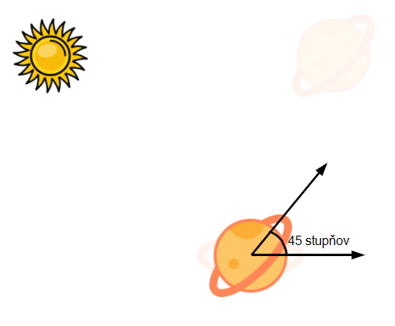

<div class="hidden">

> ## Rozcestník
> - [Späť na úvod](../../README.md)
> - Repo: [Štartér](/../../tree/main/css/css-planety), [Riešenie](/../../tree/solution/css/css-planety).

# Slnečná sústava (CSS)
</div>

## Riešenie


### Html časť
Riešenie začneme prípravou html dokumentu. Na každú z planét vytvoríme vlastný HTML element. Pre lepšiu prehľadnosť a zjednodušenie zápisu CSS pravidiel ich umiesnime do spoločného elementu s class `sustava`. Html kód bude vyzerať nasledovne:


```html
<!DOCTYPE html>
<html>
<body>
    <div class="sustava">
        <div class="slnko"></div>
        <div class="zem">
            <div class="mesiac"></div>
        </div>
        <div class="saturn"></div>
        </div>
    </div>
</body>
</html>
```

Element `sustava` obsahuje všetky prvky slnečnej sústavy. Mesiac sme umiestnili ako potomka elementu zem, pretože mesiac sa bude otáčať okolo zeme.

### Umiestnenie planét

Začneme s deklaráciou štýlu pre slnko. Pokiaľ chceme slnko umiestniť do stredu obrazovky, máme niekoľko možností. Buďto použijeme flexbox, alebo pomocou positioningu a absolútnej pozície umiestníme prvok do stredu. V našom príklade flexbox potrebovať nebudeme a vystačíme si z absolútnym poziciovaním.
```css 
.slnko {
  width: 120px;
  height: 120px;
  position: absolute;
  left: 50%;
  top: 50%;
  background-image: url("images_planety/sun.png");
  background-size: cover;
  transform: translate(-50%, -50%);
}
```

Pomocou tohto štýlu sme nastavili veľkosť, pozíciu pozadie a posunuli sme element cez transformáciu do stredu obrazovky. Môžme si všimnúť že vlastnosť `background-size` sme nastavili na `cover`, vďaka čomu sa nám obrázok prispôsobí veľkosti elementu. Pre vycentrovanie prvku na stred obrazovke sme využívali kombináciu `left` a `right` nastavených na 50% a spätného posunu do stredu pomocou `translate(-50%, -50%)`. Túto kombináciu sme používali preto, lebo len pomocou `left` a `right` sme boli schopný vycentrovať ľavý horný roh nášho prvku. A aby sme ho vyzentrovali na stred úplne, bolo potrebné použiť `translate(-50%, -50%)`, ktoré posunulo prvok o polovicu jeho šíky/výšky smerom doľava a hore.

Ďalej budeme pokračovať zo štýlmi pre jednotlivé planéty. Začneme zo zemou:
```css
.zem {
  width: 80px;
  height: 80px;
  position: absolute;
  left: 50%;
  top: 50%;
  background-image: url("images_planety/earth.png");
  background-size: cover;
  transform: translate(-50%, -50%) translateX(300px);
}
```
Pomocou tohto kódu sme nastavili zem veľmi podobným spôsobom ako slnko, jediný rozdiel v týchto deklaráciach je zmena veľkosti, obrázku a zem sme ešte navyše posunuli o 300px do prava, aby sa zobrazila ďalej od slnka.

CSS kód pre ostatné planéty by bol veľmi podobný, tak môžme skúsiť tento zápis zoptimalizovať. Určité vlastnosti môžme nastaviť rovnako pre všetky elementy v našej sústave. Využijeme preto selektor `.sustava div`. Keď ale skúsime napísať spoločné pravidlá pre všetky elementy, zistíme že to budú vlastne len 4 - `position`, `left`, `top` a `background-size`. Veľkosti a transformácie sa budú meniť.

Pomocou CSS premenných by sme si mohli ešte viac zovšeobecniť tento zápis, pretože naše prvky majú rovnakú výšku a šírku, takže konkrétny prvok slnečnej sústavy by mohol zadeklarovať len tento rozmer.

Upravený kód pomocou CSS premenných by mohol vyzerať nasledovne:
```css
.sustava div {
  width: var(--size);
  height: var(--size);
  position: absolute;
  background-size: cover;
  left: calc(50% - (var(--size) / 2));
  top: calc(50% - (var(--size) / 2));
  transform: translateX(var(--orbitRadius));
}

.slnko {
  --size: 120px;
  --orbitRadius: 0;
  background-image: url("images_planety/sun.png");
}

.zem {
  --size: 80px;
  --orbitRadius: 300px;
  background-image: url("images_planety/earth.png");
}

.saturn {
  --size: 150px;
  --orbitRadius: 450px;
  background-image: url("images_planety/saturn.png");
}
```

Pre každý element v slnečnej sústave sme zadeklarovali výšku a šírku pomocou premenne. Zápis `var(--size)` získa hodnotu premennej `--size`. Ďalšou úpravou bol spôsob centrovania elementu. V pôvodnej verzii sme využívali kombináciu `left` a `right` 50% a spätného posunu do stredu pomocou `translate(-50%, -50%)`. Využitie vlastnosti `transform` nieje ale úplne dobrý napad, pretože túto CSS vlastnosť ešte budeme potrebovať pri animáciach, čo by znamenalo, že túto transformáciu by sme museli používať aj pri animáciach. Využitie `translate(-50%, -50%)` je hlavne v tedy, keď dopredu nepoznáme šírku prvku, ktorý chceme zarovnávať. Ak poznáme šírku zarovnávaného elementu, môžme si vystačiť len s vlastnosťami `left` a `right` a funkciou `calc`, ktorá nám dynamicky spočíta umiestnenie elementu.

V našom konkrétnom príklade sme použili na prvý pohľad komplikovaný výpočet `calc(50% - (var(--size) / 2))`. Tento výpočet hovorí to, že element bude umiestnený naľavo 50% sírky stránky mínus jeho šírka deleno 2. Čím dostaneme presné umiestnenie v strede obrazovky, ak rovnaký kód použijeme aj na umiestnenie elementu od vrchu stránky.

### Otáčanie planéty
Pre animáciu otáčania už máme pripravené všeko potrebné. Poďme sa pozrieť akým spôsobom vieme našu planétu - napr. satrun otočiť okolo slnka. Začali sme s tým, že všetky planéty a slnko sú umiestnené na sted obrazovky a potom pomocou `translateX` sme ich posunuli smerom na pravo na svoju orbitu.


Pokiaľ pred posun planéty vložíme otočenie, môžme tým kontrolovať uhol, pod ktorým sa naša planéta vzdialí od slnka. Napríklad ak vložíme pred `translateX(450px)` otočenie o 45stupňov - `rotate(45deg)` tak dostaneme:


Planétka je síce otočená okolo slnka o 45 stupňov ale dostali sme ďalší provblém. Planétka sa otočila okolo svojej osy. Ak to chceme vrátiť späť tak za posun (`translateX(450px)`) doplníme rotáciu v opačnom smere, ktorá otočí planétu na aktuálnej pozícii o 45 stupňov späť.
Celkový zápis otočenia planétky presne o 45 stuňov bude nasledovný:
```css
transform: rotate(45deg) translateX(450px) rotate(-45deg);
```



#### Animácia obehu planétky

Pre animáciu pohybu nám stačí jednoducho meniť uhol planétky postupne od 0 do 360 stupňov. Napíšeme si pre to jednoduchú animáciu:

```css
@keyframes kruhovaOrbita {
  from { transform: rotate(0deg) translateX(var(--orbitRadius)) rotate(0deg); }
  to   { transform: rotate(360deg) translateX(var(--orbitRadius)) rotate(-360deg); }
}
```

Táto animácia využíva metódu popísanú v predchadzajúcej časti. Okrem toho, aby sme túto animáciu spravili univerzálne použiteľnú, na veľkosť orbity sme použili CSS premennú, ktorú sme si pomenovali `--orbitRadius`.

Finálna definícia elementu napríklad pre saturn s aplikovanou animáciou môže vyzerať nasledovne:
```css
.saturn {
  --size: 150px;
  --orbitRadius: 450px;
  background-image: url("images_planety/saturn.png");
  animation: kruhovaOrbita 8s linear infinite;
}
```

Vzhľadom na univerzálnosť celého návrhu bude pridanie mesiaca úplne rovnaké:
```css
.mesiac {
  --size: 40px;
  --orbitRadius: 80px;
  background-image: url("images_planety/moon.png");
  animation: kruhovaOrbita 2s linear infinite;
}
```

Mesiac využíva rovnaké vlastnosti ako ostatné planéty, len centrum jeho obežnej dráhy nieje stred obrazovky, ale planétka zem. Ďalším rozdielom je rýchlosť animácie, v prípade satrutnu trvá jeden obeh 8s a v prípade mesiaca 2s.

### Nerovnomerná rýchlosť obehu 
V zápise animácie môžme definovať tzv. `timing funkciu`. V uvedenom príklade bola ako timing funkcia zvolaná funkcia `linear`, ktorá sa správa tak, že planétky sa pohybujú rovnako rýchlo po celý čas obehu. Tieto timing funkcie sa definujú pomocou kubických bezierových kriviek. Našťastie si tieto krivky nemusíme počítať automaticky ale môžme využiť online nástroj - napríklad [cubic-bezier.com](https://cubic-bezier.com). Môžme napríklad vyskúšať funkciu `cubic-bezier(.61,.11,.41,.91)`, ktorá spôsobí že zo začiatku planétka pôjde veľmi pomaly, postupne bude zrýchlovať, v polovici otáčky pôjde najrýchlejšie a na konci zas spomalí. Spomenutá timing funkcia vyzerá nasledovne:


### Vykreslenie orbitálnych dráh
Pre lepšiu grafickú predstavu si môžme pridať vykreslenie orbitálnych dráh jednotlivých planét. Pre tento účel mierne upravíme HTML:

```html
<div class="sustava">
  <div class="zem orbit"></div>
  <div class="saturn orbit"></div>

  <div class="slnko"></div>
  <div class="zem">
    <div class="mesiac orbit"></div>
    <div class="mesiac"></div>
  </div>
  <div class="saturn"></div>
</div>
```

Do pôvodného kódu sme pridali nové elementy, ktoré budú použité na vykreslenie dráh.
Samotné CSS na vykreslenie dráhy bude nasledovné:

```css
.sustava .orbit {
  --size: calc(var(--orbitRadius) * 2);
  border: 1px dotted black;
  border-radius: 50%;
  animation: none;
  transform: none;
  background: none;
}
```

V tomto CSS môžme vidieť niekoľko zaujímavých vecí. Samotný orbit, keď sa pozrieme a HTML má okrem CSS triedy `orbit` aj triedu definujúcu príslušnú planétu. Takže orbit sa napoziciuje podobne ako planéta. Na rozdiel od planéty mu ale musíme zrušiť obrázok pozadia, animáciu a posunutie pretože orbit sa má zobrazovať vycentrovaný na stred (obrazovky alebo v prípade mesiaca materskej planéty).
Ďalšou zaujímavosťou je spôsob, akým nastavujeme veľkosť. Veľkosť elementu pre orbit spočítame dynamicky na základe polomeru obežnej dráhy príslušnej planéty.

