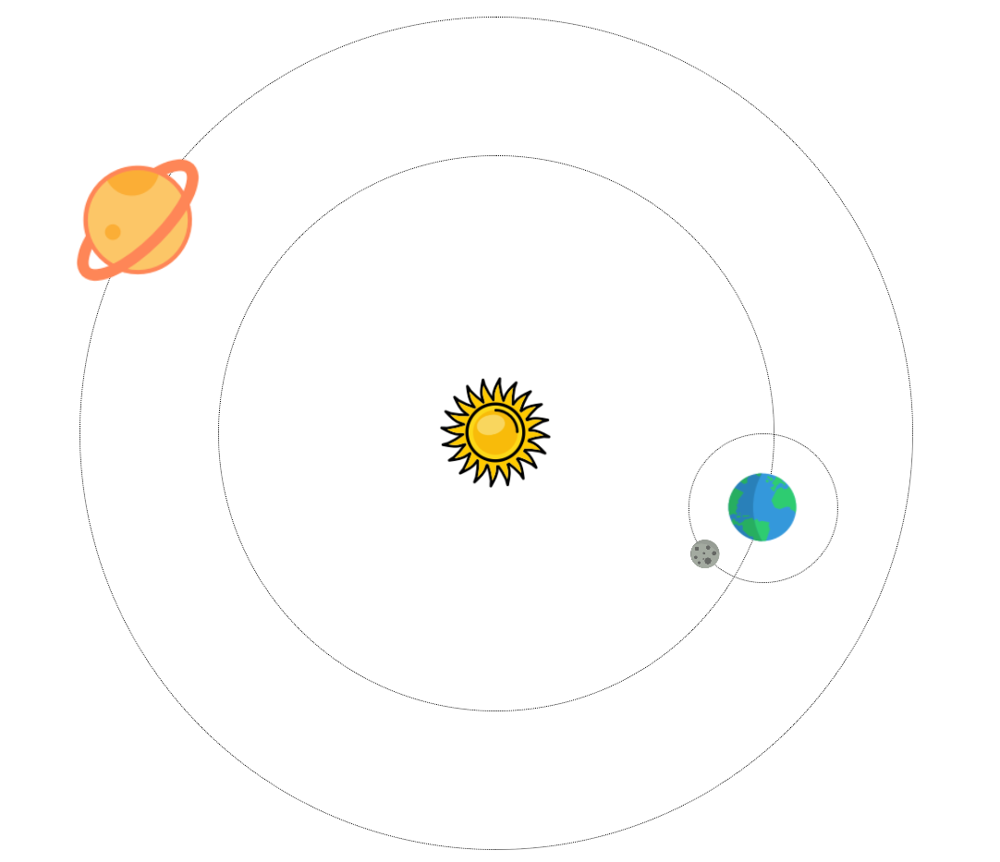

> ## Rozcestník
> - [Späť na úvod](../../README.md)
> - Repo: [Štartér](/../../tree/main/css/css-lopticka), [Riešenie](/../../tree/solution/css/css-lopticka).

# Gulečník (CSS)

## Zadanie
Vytvorte jednoduchú animáciu slnečnej sústavy. Slnko bude v strede, okolo neho budú objehať po kružnici aspoň dve planéty. Jednej planéte pridajte mesiac.

### Cieľ príkladu
Cieľom príkladu je precvičenie animácií a transformácií CSS elementov. Okrem iného je možné pri riešení použiť rôzne metódy pozicioningu a CSS premenné.

[Zobraziť riešenie](riesenie.md)

