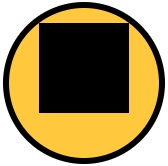
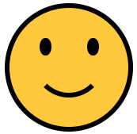
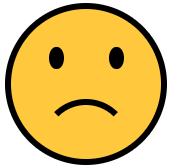
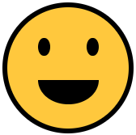
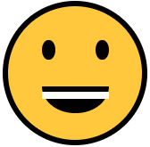

<div class="hidden">

> ## Rozcestník
> - [Späť na úvod](../../README.md)
> - Repo: [Štartér](/../../tree/main/css/css-smajliky), [Riešenie](/../../tree/solution/css/css-smajliky).

# Smajlíky (CSS)

</div>

## Riešenie

Na úvod riešenia začneme s analýzou problému. V zadaní máme štyri rôzne smajlíky. Tieto smajlíky majú tvar kruhu, ktorý vo všetkých štyroch prípadoch obsahuje dve oči a jedny ústa. Druhý a tretí smajlík obsahuje okolo základných úst navyše ďalšie grafické prvky.

### Úprava HTML kódu smajlika

V zadaní máme základnú kostru smajlíka, do ktorej si môžeme pridať ďalšie prvky. Vzhľadom na potrebu troch ďalších častí si upravíme pripravené html nasledovne:

```html

<div class="smiley">
    <span class="eye"></span>
    <span class="eye"></span>
    <span class="mouth"></span>
</div>
```

Do kostry sme pridali ďalšie tri elementy. Tieto elementy sú typu `span` a majú priradený atribút `class`. Prvé dva budú použité na zobrazenie očí a posledný bude slúžiť na zobrazenie úst. Element typu `span` je možné nahradiť aj iným elementom - napr. `div`. Z pohľadu funkčnosti samotného riešenia na konkrétnom type elementu nezáleží, nakoľko pomocou CSS je možné každý jeden element ľubovolne prispôsobiť.

Po spustení aktuálneho kódu však zatiaľ nič neuvidíme, nakoľko elementy neobsahujú žiaden textový obsah a cez CSS sme im ešte nepriradili žiadne pravidlá.

### Základne zobrazenie tela smajlíka

Na úvod začeneme s definíciou CSS pre základného smajlíka vo veľkosti `50px` x `50px`.

Pokiaľ chceme, aby element mal definovanú pevnú veľkosť bez ohľadu na obsah, musíme mu nastaviť výšku a šírku. Nastavenie výšky a šírky sa ale aplikuje len na elementy blokového typu. V našom prípade máme element `div`, ktorý patrí medzi blokové elementy, takže už nemusíme nastavovať nič navyše. Pre lepšie zobrazenie, aby viaceré smajlíky boli zobrazené v rade vedľa seba, nie pod sebou, môžeme ešte použiť špeciálny mód blokového zobrazenia:

- `display: inline-block`.

Okrem veľkosti nastavíme elementu aj farbu pozadia.

```css
.smiley {
    display: inline-block;
    width: 50px;
    height: 50px;
    background-color: #ffc83d;
}
```

Výsledkom tejto úpravy bude nasledovný štvorec o rozmeroch `50px` x `50px`.


V ďalšom kroku potrebujeme z tohto štvorčeka spraviť kruh. To vieme v ccs docieliť pomocou zaoblenia rámčekov - použitím vlastnosti `border-radius`. Okrem toho by bolo vhodné pridať aj čierne orámovanie, ktoré môžeme aplikovať pomocou vlastnosti `border`.

```css
selektor {
    border: black 2px solid;
    border-radius: 50%;
}
```

Vlastnosť `border-radius` nastavuje veľkosť zaoblenia elementu. Táto veľkosť môže byť uvedená v pixeloch alebo v relatívnych hodnotách vzhľadom na veľkosť elementu. V našom prípade nastavením tejto hodnoty na `50%` dosiahneme požadované zobrazenie elementu `div` ako kruhu.


### Zobrazenie očí

Po tom, ako sme vytvorili kruh, sa pustíme do štýlovania očí smajlíka. Pre oči máme v HTML kóde pripravené dva elementy.
Začneme tým, že ich zobrazíme.

```css
.smiley .eye {
    display: block;
    background-color: black;
    width: 10%;
    height: 15%;
    border-radius: 50%;
}
```

CSS kód pre oči je veľmi podobný ako pri celom tele smajlíka, obsahuje nastavenie farby pozadia, veľkosti a zaoblenia okrajov. Prvá odlišnosť, ktorú si môžete všimnúťa je nastavenie vlastnosti `display` na hodnotu `block`. Ako sme už v predchádzajúcej časti spomínali, šírka a výška sa aplikuje len na blokové elementy. Oko smajlíka používa HTML element `span`, ktorý je riadkovým elementom. Ak chceme, aby sa aj inline element zobrazil ako blokový, musíme mu zmeniť vlastnosť `display`.

Ďalšou odlišnosťou je nastavenie veľkosti očí. Pre nastavenie sme použili relatívne hodnoty pomocou percent. Toto nám umožní v budúcnosti jednoduchšiu zmenu veľkosti celého prvku. Veľkosť očí sme nastavili na `10%` a `15%`, vďaka čomu oči nebudú mať úplne kruhový tvar, ale budú zvislo natiahnuté.

Výsledok vyzerá nasledovne:


Ako môžeme vidieť, oči sa na obrázku zobrazili v pravom hornom rohu pod sebou. Ďalším krokom bude umiestnenie týchto očí na správne miesto. To je možné dosiahnuť rôznymi spôsobmi. Napríklad sa dá použiť vlastnosť `transform` alebo nastavením absolútnej pozície.

```css
selektor {
    position: absolute;
    left: 25%;
    top: 25%;
}
```

Opäť pri definícii použijeme relatívne jednotky. Ľavé oko bude na pozícii 25% od vrchu smajlíka a 25% od ľavej strany. Na to aby nám správne fungovala absolútna pozícia, nadradený element musí mať tiež nastavenú pozíciu - napríklad `relative`. Do selektoru `.smajlik` preto pridáme ešte jednu vlastnosť:

```css
selektor {
    position: relative;
}
```

Po aplikovaní bude náš smajlík vyzerať nasledovne:


Ako môžeme vidieť, na obrázku máme zobrazené len jedno eye. Je to z toho dôvodu, že obe oči majú rovnakú CSS triedu a sú umiestnené pomocou absolútneho poziciovania - takže sa prekrývajú. Aby sme oči zobrazili správne, musíme jedno z nich posunúť doprava. Možností máme niekoľko, buď druhému oku pridáme ďalšiu CSS triedu, alebo použijeme niektorý zo selektorov `:last-child`, `:nth-child(n)`, `:first-child`, a pod.

V našom prípade môžeme pomocou selektoru `:last-child` vybrať druhé oko a posunúť ho viac doprava. Výsledný kód bude vyzerať nasledovne:

```css
.smiley .eye:first-child {
    left: 65%;
}
```

Pomocou selektoru `.smajlik .eye:first-child` sme zvolili posledný element s triedou `eye`, ktorý sa nachádza ľubovolne zanorený v elemente s triedou `smiley`. Tento selektor len dopĺňa (prepisuje) už doteraz definované vlasnosti pre element s triedou `eye`, takže nemusíme opakovať nastavenie veľkosti farby atď. Jediná zmena, ktorú sme urobili oproti pôvodnému nastaveniu elementu `eye` bola pozícia zľava, ktorú sme v tomto prípade nastavili na 75%. Výsledný smajlík bude vyzerať nasledovne:


### Zobrazenie úst

Pre zobrazenie úst máme k dispozícii HTML element s triedou `mouth`. Začneme tým, že si tento element zobrazíme, nastavíme mu veľkosť a pozíciu:

```css
.smiley .mouth {
    background-color: black;
    width: 60%;
    height: 60%;
    display: block;
    position: absolute;
    top: 10%;
    left: 20%;
}
```

Veľkosť sme nastavili na `60%` z rozmeru smajlíka. Následne sme element umiestnili tak, aby sa zobrazil v strede. Ak vieme, že šírka elementu je `60%` tak na to, aby sa zobrazil vycentrovaný, musíme ho zobraziť `20%` od ľavej strany smajlíka. Po aplikovaní týchto pravidiel dostaneme nasledovný tvar:



Ústa na vzorovom obrázku získame tak, že z tohto elementu spravíme kruh pomocou `border-radius`, zobrazíme spodný rámček a zrušíme výplň.

```css
.smiley .mouth {
    background-color: transparent;
    border-bottom: 2px solid black;
    border-radius: 50%;
}
```


Výsledok sa už takmer podobá zadaniu, ibaže naše ústa nemajú pevné ohraničenie ale idú "dostratena". Tento efekt je spôsobený tým, ako fungujú rámčeky. Ak máme rámček len na jednej strane, tento rámček sa pri zaoblených elementoch na krajoch tzv. zlieva.

Pre lepšie pochopenie uvedieme ďalšiu ukážku. Máme nasledovný CSS kód:

```css
.demo {
    width: 50px;
    height: 50px;
    background: green;
    border-bottom: 5px solid blue;
    border-left: 5px solid red;
    border-radius: 15px;
}
```

Tento kód naštýluje zelený obdĺžnik o rozmeroch `50px` x `50px`. Tento obdĺžnik má zaoblenie `15px`. Okrem toho sme definovali rámšček o veľkosti `5px` z ľavej a spodnej strany. Ako môžeme vidieť na obrázku nižšie, prechod medzi rámčekom vľavo dole je pevný. Naopak vľavo hore, resp. vpravo dole je tento prechod plynulý.


V našom smajlíkovi potrebujeme nastaviť zvyšné rámčeky na rovnakú šírku ako má spodný, ale s tým, že tieto budú priesvitné:

```css
.smiley .mouth {
    border: 2px solid transparent;
    border-bottom: 2px solid black;
}
```

Po úprave týchto pravidiel vznikne ešte jeden problém.


Ústa sú posunuté mimo stredu napravo. Tento problém je spôsobený tým, že veľkosť nášho elementu pre ústa sa zväšila o šírku rámčekov. To znamená, že aktuálne má náš element skutočnú šírku `60%` + `5px` rámček sprava + `5px` rámček zľava. Tento problém môžeme vyriešiť viacerými spôsobmi. Môžeme napríklad tento posun kompenzovať v CSS vlastnosti `left` tak, že odrátame tých `10px`, čo máme navyše. Druhým, oveľa lepším spôsobom, je zmena vlastnosti `box-sizing`, ktorá definuje, ako sa určuje veľkosť elementu. V základe sa do veľkosti nepočíta veľkosť rámiku. Toto ale môžeme zmeniť nastavením tejto vlastnosti na hodnotu `border-box`.

Výsledné CSS hotového smajlíka bude vyzerať nasledovne:

```css
.smiley .mouth {
    box-sizing: border-box;
    background-color: transparent;
    width: 70%;
    height: 70%;
    border: 2px solid transparent;
    border-bottom: 2px solid black;
    border-radius: 50%;
    display: block;
    position: absolute;
    top: 10%;
    left: 15%;
}
```

Okrem pridania vlastnosti `box-sizing` sme upravili pozíciu tak, že ústa sme posunuli `10%` od vrchu, `15%` zľava. Zmenili sme aj celkovú veľkosť úst na `70%`, pretože teraz rozmer úst teraz zahŕňa aj rámček.



### Vytvorenie smutného smajlíka

Smutný smajlík sa od toto základného líši len v tom, že má ústa obrátené naopak. Táto zmena bude veľmi jednoduchá, pretože nám stačí namiesto spodného rámčeka úst zobraziť horné, a posunúť ústa na správne miesto.

```css
.smiley.sad .mouth {
    border: 2px solid transparent;
    border-top: 2px solid black;
    top: 60%;
}
```

Druhou možnosťou je využitie CSS transformácií, kde je potrebné element zrotovať o 180 stupňov a presunúť ho na správne miesto.

```css
.smiley.sad .mouth {
    transform: rotate(180deg) translateY(-80%);
}
```

Výsledok oboch príkladov je totožný:



HTML kód pre zobrazenie tohto smajlíka je podľa zadania nasledovný:

```html

<div class="smiley sad">
    <span class="eye"></span>
    <span class="eye"></span>
    <span class="mouth"></span>
</div>
```

Na to, aby sme upravili ústa len pri smajlíkovi, ktorý má aj triedu `sad`, sme použili selektor `.smiley.sad .mouth`. Všimnite si, že medzi `.smiley` a `.sad` nie je medzera, takže tento selektor sa aplikuje len na smajlíka, ktorý bude mať nastavené obe tieto triedy.

### Vytvorenie smajlíka s líčkami

Ďalším smajlíkom v zadaní bol smajlík s líčkami. Ako základ budeme opäť vychádzať z pôvodného smajlíka. Zmena oproti pôvodnému smajlíku spočíva v tom, že tento má ešte za úsmevom zobrazené ružové krúžky.

Jedným z riešení by bola úprava HTML štruktúry smajlíka, ale chceme dodržať rovnakú štruktúru pre všetkých, takže toto riešenie nepripadá do úvahy.

HTML kód nášho smajlíka s líčkami musí vyzerať nasledovne:

```html

<div class="smiley cheeks">
    <span class="eye"></span>
    <span class="eye"></span>
    <span class="mouth"></span>
</div>
```

Pre zobrazenie líčok môžeme využiť pseudoselektory `::before` a `::after`, ktoré nám umožňujú pridať ďalšie pseudoelementy na začiatok a koniec určitého elementu.

Líčko naľavo zobrazíme cez selektor `::before` a nastavíme mu veľkosť rovnú `30%` z veľkosti úst. Okrem toho mu nastavíme farbu, `border-radius` a pozíciu podobne, ako pri ostatných prvkoch.

```css
.smiley.cheeks .mouth::before {
    position: absolute;
    content: "";
    background-color: #f7894a;
    width: 30%;
    height: 30%;
    border-radius: 50%;
    bottom: 5%;
    left: -5%;
}
```

V CSS si môžeme všimnúť jednu zaujímavú vlastnosť. Vlastnosť `content` slúži na nastavenie textového obsahu pseudoelementu. V našom prípade tam nastavíme prázdny reťazec, pretože nič viac nepotrebujeme. Ak by sme `content` nezadefinovali, pseudoelement by sa nám nezobrazil vôbec. Výsledok si môžeme pozrieť na nasledovnom obrázku: 


Problémom tohto riešenia je to, že líčko nám prekrýva ústa, preto by sme chceli zmeniť poradie týchto elementov. Keď vytvoríme nejaký peseudoelement pomocou `::before` alebo `::after`, tak tento element je potomkom elementu, ku ktorému ho vytvárame.

```html

<div class="smiley cheeks">
    <i class="eye"></i>
    <i class="eye"></i>
    <span class="mouth">
    ::before
  </span>
</div>
```

Na zmenu poradia poradia elementov môžeme využiť CSS vrstvy - vlastnosť `z-index`. Pre správne fungovanie musíme nastaviť nášmu líčku hodnotu `z-index: -1`. Po pridaní tejto vlastnosti sa nám celé líčko stratí. Aby bolo správne zobrazené, musíme nastaviť `z-index` aj nadradenému prvku. V tomto prípade nepomôže nastavenie hodnoty `z-index` prvku `mouth`, ale musíme ju nastaviť celému smajlíku.

```css
.smiley {
    z-index: 1;
}

.smiley.cheeks .mouth::before {
    z-index: -1;
}
```

Po aplikovaní týchto pravidiel dosiahneme správne zobrazenie líčka.


Posledným krokom bude zobrazenie druhého líčka pomocou `::after`. Obe líčka majú veľa spoločných pravidiel. Výsledný kód upravíme tak, že spoločné pravidlá definujeme len raz a pozíciu nastavíme každému samostatne.

```css
.smiley.cheeks .mouth::before, .smiley.cheeks .mouth::after {
    position: absolute;
    content: "";
    background-color: #f7894a;
    width: 30%;
    height: 30%;
    border-radius: 50%;
    bottom: 5%;
    z-index: -1;
}

.smiley.cheeks .mouth::before {
    left: -5%
}

.smiley.cheeks .mouth::after {
    right: -5%
}
```

Môžeme si všimnúť, že prvý selektor obsahuje dve časti oddelené čiarkou. Tento zápis v CSS znamená, že pravidlo platí pre každý z daných selektorov.

Výsledok bude vyzerať nasledovne:


### Vytvorenie veselého smajlíka

Pri vytváraní veselého smajlíka musíme zmeniť viacero vecí. Prvou z nich je vykreslenie úst. V predchádzajúcich príkladoch sme používali na vykreslenie úst zaoblené rámčeky, ktoré zobrazili štvrť-kruh s daným polomerom. Pri veselom smajlíkovi potrebujeme celý polkruh, navyše ešte aj vyplnený. Ak chceme získať vyplnený polkruh, tak už nám nebude stačiť vykresliť vhodne ohnutý rámček, ale budeme musieť celý element transformovať na polkruh. Na túto transformáciu využijeme vlastnosti `border-bottom-left-radius` a `border-bottom-right-radius`. Tie umožnujú presnejšie špecifikovať oblúk na okrajoch elementu.

Začneme teda s CSS kódom, ktorý vyzerá nasledovne:

```css
.smiley.happy .mouth {
    background: black;
    height: 20%;
    width: 50%;
    top: 60%;
    left: 25%;
    border-bottom-left-radius: 100% 200%;
    border-bottom-right-radius: 100% 200%;
}
```

Pomocou tohto CSS nastavíme elementu čiernu farbu pozadia. Následne upravíme primerane veľkosť a pozíciu týchto úst. Posledné dve pravidlá nastavujú nové zaoblenie úst. Aj pravý aj ľavý spodný roh má nastavené zaoblenie na `100% 200%`.
Výsledok bude nasledovný:


Ako vidíme, ústa sú zaoblené aj zvrchu. Toto zaoblenie je spôsobené pravidlami pre ústa pôvodného smajlíka. Pomocou `border-radius: 0;` odstránime pôvodné zaoblenie úst. Pozor, toto pravidlo musí byť vo výslednom CSS umiestnené pred pravidlami `border-bottom-left-radius` a `border-bottom-right-radius`.



V ďalšom kroku sa pokúsime smajlíkovi pridať zuby. Na to môžeme použiť opäť pseudoelementy `::before` a `::after`.

```css
.smiley.happy .mouth::before {
    position: absolute;
    display: block;
    content: "";
    background: white;
    width: 100%;
    height: 25%;
    top: 20%;
}
```

Po aplikovaní štýlu bude náš smajlík vyzerať nasledovne:


Smajlík síce zuby má, ale tie sa vykreslujú nad ústami. Pokiaľ chceme, aby boli zuby "vo vnútri", môžeme použiť vlastnosť `overflow`, ktorú pre `.smiley.happy .mouth` nastavíme na `hidden`.


Posledným krokom je pridanie jazyka. Jazyk môžeme implementovať ako polkruh, ktorý umiestnime na spodnú stranu. Pri jazyku môžeme využiť to, že celé ústa majú nastavené `overflow` na `hidden` a nemusíme sa tak trápiť s polkruhom, ale môžeme použiť plný kruh, ktorého spodná čas bude skrytá.

```css
.smiley.happy .mouth::after {
    position: absolute;
    display: block;
    content: "";
    background: #f03a17;
    width: 50%;
    height: 50%;
    border-radius: 50%;
    left: 25%;
    bottom: -25%;
}
```


### Definícia ďalších rozmerov

Ďalšie rozmery smajlíka budeme definovať pomocou CSS tried `s-100`, `s-250` a `s-500`. Na pri vytváraní smajlíkov sme využívali relatívne rozmery, tak by mohlo stačiť jednotlivé triedy deklarovať nasledovne:

```css
.smiley.s-250 {
    width: 250px;
    height: 250px;
}
```

Výsledok vyzerá takto:


Veľkosť smajlíka je v poriadku, ale veľký smajlík má tenké rámčeky. Keď sa bližšie pozrieme na CSS pravidlá, ktoré deklarujú rámčeky, môžeme vidieť nasledovné:

```css
.smiley {
    border: black 2px solid;
}
```

Pri vlastnosti `border` sme nepoužili relatívne jednotky, ale pixely. Je to z toho dôvodu, že `border` nepodporuje percentá. Zmena veľkosti tým pádom nepôjde realizovať len zmenou rozmerov smajlíka.

Namiesto zmeny rozmerov môžeme použiť CSS transformácie. Konkrétne transformáciu `scale`.

```css
.smiley.s-100 {
    transform: scale(2);
}
```

Výsledok bude vyzerať nasledovne:


Najväčší smajlík má správnu veľkosť rámčeka, ale ako môžeme vidieť, pôvodne tri smajlíky sú aktuálne zobrazené cez seba. Môžeme ešte skúsiť nastaviť `transform-origin` na `top left` (ľavý horný roh), ale to nám tiež veľmi nepomôže.


CSS transformácie síce menia výzor elementu, ale nemenia jeho pozíciu a rozmer vzhľadom na iné elementy. To znamená, že ak aj zmeníme veľkosť druhého smajlíka dvakrát, tak z pohľadu tretieho sa javí nezmenený, a preto ho prekryje. Tento problém sa dá vyriešiť pridaním okrajov.

```css
.smiley.s-100 {
    transform: scale(2);
    margin: 25px;
}
```

V tomto prípade už nepotrebujeme nastaviť `transform-origin`, pretože jeho východzia hodnota je `center center`. Ak teda zväčšíme smajlíka `50px` x `50px` dvakrát, tak na každej strane bude potrebné pridať okraj `25px`. Výsledný obrázok vyzerá nasledovne:


### Definícia rozmeru cez CSS premenné

Riešenie viacerých rozmerov cez transformácie nie je jediným spôsobom. CSS preprocessory (SASS, LESS) používajú na podobné úkony premenné ako v bežných programovacích jazykoch. Premenné je možné používať aj v obyčajnom CSS.

Definíciu základného smajlíka môžeme upraviť nasledovne:

```css
.smiley {
    --size: 50px;
    display: inline-block;
    position: relative;
    width: var(--size);
    height: var(--size);
    background-color: #ffc83d;
    border: black calc(var(--size) / 25) solid;
    border-radius: 50%;
    z-index: 1;
}
```

Do deklarácie sme pridali CSS premennú `--size`, ktorej hodnotu sme nastavili na `50px`. Pokiaľ chceme použiť túto premennú ako hodnotu nejakej vlastnosti, musíme použiť funkciu `var`. Ďalšia zaujímavá funkcia, ktorú sme v tomto príklade použili je funkcia `calc`. Táto funkcia slúži na výpočet hodnoty. V našom prípade bude šírka rámčeka vypočítaná ako veľkosť elementu vydelená 25. Rovnakú premennú môžeme používať vo všetkých potomkoch smajlíka, takže upravíme veľkosť rámčeka aj pre ústa nasledovne:

```css
.smiley .mouth {
    border: calc(var(--size) / 25) solid transparent;
    border-bottom: calc(var(--size) / 25) solid black;
}

.smiley.sad .mouth {
    border: calc(var(--size) / 25) solid transparent;
    border-top: calc(var(--size) / 25) solid black;
}
```

Definícia jednotlivých veľkostí bude spočívať v jednoduchom prepísaní hodnoty tejto premennej.

```css
.smiley.s-100 {
    --size: 100px;
}
```

Dokonca môžeme spraviť smajlíka ľubovolnej veľkosti aj priamo v HTML kóde:

```html

<div class="smiley" style="--size: 25px">
    <i class="eye"></i>
    <i class="eye"></i>
    <span class="mouth"></span>
</div>
```