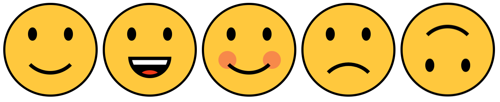

<div class="hidden">

> ## Rozcestník
> - [Späť na úvod](../../README.md)
> - Repo: [Štartér](/../../tree/main/css/css-smajliky), [Riešenie](/../../tree/solution/css/css-smajliky).
</div>

# Smajlíky (CSS)

## Zadanie

Vytvorte pomocou CSS bez použitia grafiky (obrázky, svg) nasledujúce smajlíky.



Každý smajlík bude dostupný vo veľkostiach 50px, 100px, 250px a 500px.

Prvé 4 smajlíky sú základné. Každý zo základných smajlíkov sa bude dať otočiť o 180 stupňov. Posledný smajlík na ukážke vznikol otočením prvého smajlíka.

Základna html štruktúra smajlíka bude nasledovná:

```html
<div class="smajlik">
...
</div>
```
Túto štruktúru je potrebné dodržať. Obsah divu si prispôsobte podľa potreby. Tento HTML kód vykreslí prvého smajlíka vo veľkosti 50px. Pokiaľ chceme zmeniť veľkosť smajlíka pridáme do `div` značky ďalšiu class - `s-100`, `s-250` alebo `s-500` podľa požadovanej veľkosti.

Rotácia smajlíka bude realizovaná pridaním class `obrateny` do hlavného divu.

Pokiaľ budeme požadovať smajlíka s veľkosťou 100px obráteného o 180 stupňov, deklarácia html kódu bude nasledovná:
```html
<div class="smajlik s-100 obrateny">
...
</div>
```

Iné podoby smajlíka budú realizované pridaním ďalšej class do hlavného div elementu smajlíka.
Druhý smajlík na obrázku bude mať triedu `vesely`, trietí `licka` a posledný `smutny`. 

Html kód druhého smajlíka bude vyzerať nasledovne:

```html
<div class="smajlik s-250 vesely">
...
</div>
```

Pri implementácii počítajte s tým, že smajlík môže mať len jeden tvar - normálny, veselý, smutný, líčka ale môže mať ľubovolnú velkosť a otočenie.

### Cieľ príkladu
Clieľom tohto príkladu je precvičenie CSS vlastností - veľkosť, pozícia, rámiky, transformácie, funckia `calc`, css premenné a pseudotriedy `::before` a `::after`.

<div class="hidden">

[Zobraziť riešenie](riesenie.md)
</div>