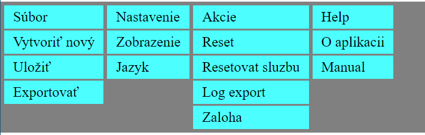
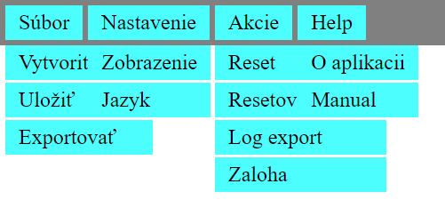
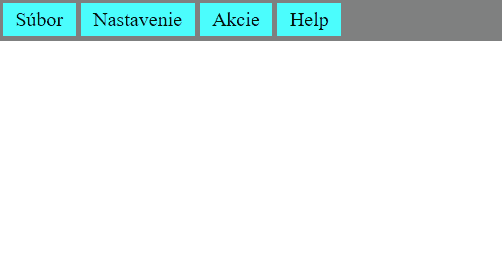
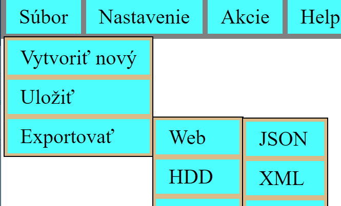
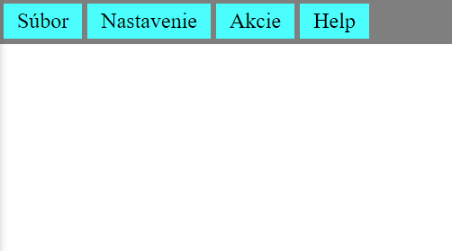
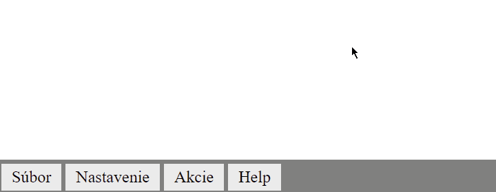

> ## Rozcestník
> - [Späť na úvod](../../README.md)
> - Repo: [Štartér](/../../tree/main/css/dropdownmenu), [Riešenie](/../../tree/solution/css/dropdownmenu).

# DropDown a DropUp menu - CSS [branch solution]

Cieľom úlohy je vytvoriť roletové menu aké obsahujú bežne desktopové aplikácie. Ako má menu fungovať demonštruje nasledovný gif:


Menu musí spĺňať nasledovné:

1. Prvá úroveň je vždy zobrazená na vrchu stránky
2. Ďalšie úrovne menu sú viditeľne iba ak ich používateľ aktivuje kurzorom (viď. gif hore)
3. Vizuálne indikujte či daná položka obsahuje sub-menu
4. Zvýraznite, aké položky menu sú aktivované (viď. gif hore – zvýraznenie na žlto) 
5. Jednotlivé sub-menu zobrazte s jemne odlišnou farbou pozadia. Napr. stmavovaním (viď. gif hore).
6. Modifikujt drop-down menu na drop-up menu.


Počiatočný `HTML` dokument obsahuje menu zadefinované pomocou štruktúry elementov a vyzerá nasledovne:

```html
 <div id="menu">
        <ul>
            <li>
                <span>Súbor</span>
                <ul>
                    <li>
                        <span>Vytvoriť nový</span>
                        <ul>
                            <li><span>PDF</span></li>
                            <li><span>PPT</span></li>
                            <li><span>TXT</span></li>
                            <li><span>HTML</span></li>
                        </ul>
                    </li>
                    <li><span>Uložiť</span></li>
                    <li>
                        <span>Exportovať</span>
                        <ul>
                            <li>
                                <span>Web</span>
    ...
```

Všimnite si však, že samotné `<ul>` a `<li>` definujú _iba_ štruktúru. Obsah položky je definované ako obsah `<span>`. Vnorenie jednotlivých `<ul>` v `<li>` definuje ktorý `<ul>` je sub-menu ktorého menu.

Pre riešenie použite výlučne iba CSS.

# Riešenie

Riešenie je rozdelené do nasledovných pod-kapitol (prekliky nemusia fungovať pre lokálny MD interpreter):

1. [Prvá úroveň menu](#prvá-úroveň-menu)
2. [Druhá úroveň](#druhá-úroveň)
3. [Ďalšie úrovne](#ďalšie-úrovne)
4. [Zobrazenia ikonky o prítomnosti sub-menu](#zobrazenia-ikonky-o-prítomnosti-sub-menu)
5. [Doplnenie zvýraznenia výberu](doplnenie-zvýraznenia-výberu)
6. [Záverečné formátovanie](#záverečné-formátovanie)
7. [Upravenie na Drop-up menu](#upravenie-na-drop-up-menu)

## Prvá úroveň menu 

Prvý krok spočíva v skrytí všetkých vnorených `<ul>`, teda okrem prvej úrovne. Selektor, ktorým skryjeme všetky vnorené `<ul>` bude `ul ul`. Celkovo CSS bude nasledovné:

```css
ul ul {
    display: none;
}
```
Teraz potrebujeme upraviť zobrazenie prvej úrovne, tak aby sa nezobrazovala ako zoznam ale ako menu, teda vedľa seba. To ako sa ktorý prvok zobrazuje definuje CSS vlastnosť `display`([viac tu](https://www.w3schools.com/cssref/pr_class_display.asp)). 

Zoznam sa dá v `HTML` definovať dvomi značkami `<ul>` (neočíslovaný zoznam) a `<ol>` (očíslovaný zoznam). V oboch prípadoch sa jedná o obaľovací komponent, ktorého potomkom môžu byť jedine element `<li>`. Značka `<li>` sa zobrazuje ako bloková (má nastavenú hodnotu pre zobrazenie na `display: list-item`) preto sa jednotlivé položky zoznamu zobrazujú pod sebou. Aby sme ich zobrazili veďľa seba, je potrebné toto zobrazenie zmeniť.

Začiatočníckou chybou je zmenenie hodnoty `display` na `display: inline-block`. Aj keď sa položky zobrazia vedľa seba, vytvára sa medzi nimi prirodzene nežiadúca medzera. Ale prečo? Je to dôsledok toho, akým spôsobom má prehliadač zobrazovať riadkové (`inline`) elementy. Vieme, že prehliadač ignoruje viacnásobné medzery a zalomenia. V tomto prípade, vzhľadom na štruktúru sú medzi jednotlivými elementmi `<li>` znaky ako zalomenia, medzery a tabulátori  interpretované ako medzery.

Aby sme to názorne predviedli, stačí si niekde do kódu stránky vložiť nasledovný `HTML` kód (alebo otvoriť [fiddle](https://jsfiddle.net/meshosk/Legh36td)):

```html
<div>
    <span>jeden</span>
    <span>dva</span>
    <span>tri</span>
    <span>styri</span>
    text
    text
    text
</div>
```
Výsledok : 
```html
jeden dva tri styri text text text
```

Výsledok tejto štruktúry bude postupnosť jednotlivých textov v riadku oddelených v medzerami. Pokiaľ chceme medzeru odstrániť musíme jednotlivé elementy dať ihneď za sebou (otvoriť [fiddle](https://jsfiddle.net/meshosk/p2atzwkd)):
```html
<div>
    <span>jeden</span><span>dva</span><span>tri</span><span>styri</span>
    text
    text
    text
</div>
```
Výsledok:
```html
jedendvatristyri text text text
```

V našom prípade chceme zachovať pôvodnú štruktúru `HTML` a nechceme dopĺňať ďalšie elementy, preto zvolíme zobrazenie pomocou [flexboxu](https://css-tricks.com/snippets/css/a-guide-to-flexbox).

_Flexbox_ potrebuje na svoje fungovanie obaľovací element, tzv. _kontainer_, (v našom prípade `<ul>`) a položky, ktoré sa v ňom majú zobraziť (u nás `<li>`). Ak chceme aplikovať flexbox na náš príklad zo `<span>`, jeho kód bude vyzerať nasledovne (otvoriť [fiddle](https://jsfiddle.net/meshosk/a7Lzsnqh)):

```html
<html>
 <head>
   <style>
     div {
         display: flex;
       }
     span {
       border: 1px solid black;
     }
   </style>
 </head>
 
  <body>
    <div>
      <span>jeden</span>
      <span>dva</span>
      <span>tri</span>
      <span>styri</span>
      text
      text
      text
    </div>
  </body>
</html>
```
Ak tento postup aplikujeme na našu úlohu musíme najprv identifikovať _kontajner_ pre _flexbox_. V našom prípade sa jedná o iba prvú úroveň nášho menu. _Kontajner_ preto budeme definovať selektorom `#menu > ul`, teda vyberieme element `<div>` s hodnotou atribútu `id` `menu`, ktorý tvorí hlavný element nášho menu. CSS bude teda vyzerať nasledovne:

```css
#menu > ul {
    display: flex;
}
ul ul {
    display: none;
}
```

Teraz musíme doplniť zobrazenie zoznamu tak, aby vizuálne pripomínalo menu, čím napovieme používateľovi aby daný komponent ako menu aj naozaj používal (_nie je nič horšie pre používateľa ako neintuitívne GUI_).

Ako prvé zmeníme farbu pozadia menu, tu ale budeme formátovať element `<div id=menu>`. 

Značky `<ul>` a `<li>` by mali definovať iba štruktúru menu. Definujeme preto farbu pozadia a odsadenie iba pre `<span>` tak aby bolo ľahké pre používateľa určiť, ktorý text predstavuje ktorú položku menu.

Jednú výnimku bude tvoriť formátovanie `<ul>` druhej a ďalšej úrovne, ktorým neskôr pridáme formátovanie v podobe rámika a pozadia. Samozrejme, problému sa dá predísť vytvorením obaľovacieho elementu pre ďalšie úrovne. V našom prípade sme ale chceli mať v príklade čo najjednoduchšiu štruktúru.

Pre odstránenie problémov s odsadeniami môžeme v našom prípade urobiť tzv. _globálny reset odsadení_ v `CSS`. Ten používa selektor `*` a ako vlastnosti mu dáme vnútorné a vonkajšie odsadenie na hodnotu `0`. Selektor `*` sa následne použije ako hodnota pre všetky štýlovania. Dôsledok je taký, že teraz musíme definovať odsadenia iba tam, kde ich skutočne chceme.

Následne ešte musíme upraviť zobrazenie `<li>`, tak aby sa nezobrazovali ako položky menu a elementy `<span>` aby sa zobrazovali ako blokové značky (inak im nebude možné zadefinovať rozmer a odsadenia). 
 
Vzhľadom na to, že výsledkom úlohy je mnu, bude dobrý nápad zamedziť automatické zalamovanie textu v `<span>`. To urobíme tak, že `<span>` doplníme `CSS` vlastnosť `white-space: nowrap;`.

CSS bude teda nasledovné:

```css
* {
    margin: 0;
    padding: 0;
}
#menu {
    background-color: gray;
    padding: 2px;
}
#menu > ul {
    display: flex;
}

span {
    background-color: aqua;
    display: block;
    padding: 4px 10px;
    margin: 2px;
    white-space: nowrap;
}

li {
    display: block;
}

ul ul {
    display: none;
}
```
Menu bude vyzerať:


## Druhá úroveň

Nasleduje vytvorenie štýlovania pre druhú úroveň. Pre lepší "debug" `CSS` si musíme najprv zobraziť prvú a druhú úroveň. To docielime tým, že upravíme obsah selektoru `ul ul` a doplníme skrytie všetkých `<ul>` úrovňe tri a viac, teda selektorom `ul ul ul`. Upravené `CSS` bude (zobrazené sú iba doplnené a zmenené CSS):
```css
li {
    position: relative;
    display: block;
}
ul ul {
    display: block;
}
ul ul ul {
     display: none;
}
```
Menu bude zobrazovať staticky prvú a druhú úroveň, nejako takto: 



Teraz potrebujeme upraviť `CSS` vlastnosť `position` pre všekz `<li>` prvej úrovne na `relative` aby sme vytvorili základnú plochu pre prípadne `<ul>` ďalších úrovní. 

Všetkým `<ul>` druhej a ďalších úrovní nastavíme vlastnosť `position` na `absolute`. Tým docielime to, že `<ul>` sa zobrazia "plávajúco" nad ostatnými elementmi (viac o [position tu](https://www.w3schools.com/css/css_positioning.asp)). Upravené CSS pravidlá sú nasledovné:

```css
li {
    position: relative;
    display: block;
}
ul ul {
    display: block;
    position: absolute; 
}
ul ul ul {
    display: none;
}
```
Zobrazenie stránky v tomto kroku bude nasledovné:



Ako prvé teraz doplňíme zobrazovanie a skrývanie druhej úrovne, pokiaľ používateľ umiestni kuzor nad danú položku `<li>`, ktorá obsahuje priamo podmenu. Zvolenie priameho potomka je v selektore dôležíté, lebo chceme aby sa zobrazil iba priamy potomok a nie všetky `<ul>` v danej vetve DOM. 
Môžeme ešte pridať formátovanie pre `<ul>` úrovňe dva a viac.

Pre zobrazenie opäť použijeme _flexbox_ a upravíme zobrazenie prvkov na vertikálne pomocou `flex-direction: column;`. Predvolene sú sub-menu skryté. CSS bude teda nasledovne:

```css
ul ul {
    position: absolute;
    display: none;
    border: 1px solid black;
    background-color: burlywood;
}
li:hover > ul {
    display: flex;
    flex-direction: column;
}
```

Ako je vidno na nasledujúcom obrázku menu bude fungovať ako má ale iba po druhú úroveň.


## Ďalšie úrovne

Aby sa nám správne zobrazili menu druhej úrovne je potrebné upraviť ich poziciovanie. Nasledujúce sub-menu sa má zobraziť výškovo zarovno položkou napravo od nej. To docielime nasledovným pravidlom:

```css
ul ul ul{
    top: 0;
    left: 100%
}
```

`top: 0` hovorí o tom, že sa ma sub-menu zobraziť vertikálne zarovno `<li>` v ktorom je a `left: 100%` umiestnuje sub-menu o _100%_ veľkosti `<li>` zľava. Výsledok pridania tohto pravidla je nasledovný:



Všimnime si však, že jednotlivé sub-menu, nie sú úplne zarovnané. To je dôsledok toho, že pri `<ul>` druhej úrovne sme pridali rámik, ktorý veľkost tohto elementu zväčšil o 1px z každej strany. 



Aby sa menu zobrazovalo korektne musíme preto veľkosť zredukovať negatívnym odsadením. Bude stačiť ak ak ho zmenšíme iba z vrchu. CSS preto upravime na:

```css
ul ul {
    position: absolute;
    display: none;
    border: 1px solid black;
    background-color: burlywood;
    margin-top: -1px;
}
```


## Zobrazenia ikonky o prítomnosti sub-menu

Pre zlepšenie UX je veľmi vhodné dať použivateľovi vodítko, ktoré hovorí, že nejaka položka menu obsahuje dodatočné podmenu. Najčastejšie sa to realizuje indikátorom, napr. znakom `»`.

Pre doplnenie tohto indikátora existuje viacero spôsobov. Napríklad:

- Doplnenie elementu, ktorý daný znak doplní
- Namiesto pridania elementu, stačí vytvoriť CSS pravidlo a následne túto triedu doplnit do atribútu `class` daného elementu
- Ak máme štruktúru pevne danú, môžeme priamo zadefinovať css selektorom doplnenie tohto znaku

V našom prípade sa pokúsime o aplikovanie poslednej možnosti. Použitím selektora `ul ul span:not(:only-child):after`, ktory môžeme popísať nasledovne:

- `ul ul span` - sa aplikuje na všetky span od druhej úrovne
- `:not(:only-child)` - je [pseudo-trieda](https://developer.mozilla.org/en-US/docs/Web/CSS/Pseudo-classes) `:not` urobí nad získanými span filter a vyberie iba tie, ktoré nie sú jedináčik. Teda, majú vedľa seba nejaké surodenecké elementy. V našom prípada sa jedná výlučne o položky menu, ktoré majú sub-menu
- `:after` - je [pseudo-element](https://developer.mozilla.org/en-US/docs/Web/CSS/Pseudo-elements), pomocou ktorého vieme definovať nejaký obsah, ktorý sa zobrzí ihned za elementmi, ktoré sú vybrané selektorom.

CSS pravidlo, ktoré nám pridá idndikátor je nasledovné:
```css
ul ul span:not(:only-child)::after
{
    color: blue;
    content: "»";
    padding: 3px 3px 3px 10px;
}
```

Výsledok funguje nasledovne:


## Doplnenie zvýraznenia výberu

Ďalšia vec, ktorá spríjemní UX je vyznačenie prvkov, ktoré boli inicalizované výberom. To realizejeme nasledovným CSS pravidlom:

```css
li:hover > span {
    color: red;
    background-color: yellow;
}
```

Zmenu aplikujem vyslovanie na `<span>`, ktorý je priamym potomkom `<li>`, nad ktorým je aktuálne kurzor. Je potrebné si pamätať, že táto indikácia vyplíva na základe DOM štruktúry a nie toho ako sú prvky reálne vykreslené v okne prehliadača.

Výsledok funguje nasledovne:


## Záverečné formátovanie

Aby sme menu zobrazili krajšie vykonáme nasledovné úpravy:

1. Odstránime farbu pozadia ponecháme iba `<span>` prvej úrovňe.
2. Nastavíme jednotnú farbu pozadia pre `<ul>` druhej a vyššej úrovne.
3. Každú úroveň jemne farebne odlíšime.

Css pre bod 1. a 2. bude vyzerať nasledovne:
```css
span {
    background-color: transparent
}
#menu > ul > li:hover > span {
    color: red;
    background-color: yellow;
}
#menu > ul > li > span {
    background-color: #ebebeb;
}
ul ul {
    background-color: #ebebeb;
}
```

A ako posledné doplnimé postupne tmavnúcu farbu pozadia `<ul>`: 

```css
ul ul {
    background-color: #ebebeb;
}
ul ul ul {
    background-color: #bdbdbd;
}
ul ul ul ul {
    background-color: #949494;
}
```

Finálny výsledok funguje nasledovne:


## Upravenie na Drop-up menu

Záverečná úprava spočíva čisto iba v úprave toho kde a ako sa majú jednotlivé elementy zobraziť. Začneme teda presunutím celého menu na spodok `viewportu`. To budeme realizovať zmenou hodnoty css vlastnosti `position` na hodnotu `fixed`. Čím docielime to, že menu sa bude umiestňovať nad všetky vykreslené prvky v priestore viewportu a ten tvori aj jeho predka pre výpočet veľkostí.

Aby bolo menu roztiahnuté na celú dĺžku viewpotu musíme mu zadefinovať parameter `width: 100%`. Upravený štýl bude zmeníme na:

```css
#menu {
    background-color: gray;
    padding: 2px;
    position: fixed;
    bottom: 0;
    width: 100%;
}
```

Následne musíme upraviť zobrazenie druhej úrovne tak, aby bola zarovnaná vlavo nad predka `<li>` a aby sa nezobrazovala pod nim ale nad ním. Docielime to pridaním vlastnosti `bottom: 100%;`, čím spodok sub-menu presunieme na vrch nadradeného `<li>`. CSS vlastnosť upravíme nasledovne:

```css
li:hover > ul {
    display: flex;
    flex-direction: column;
    bottom: 100%;
}
```
Mali by sme dostať nasledovné chovanie:


Podobne upravíme pozíciu pre menu druhej a ďalšej úrovňe. Budeme však musiet zmeniť selektor ` ul ul ul` na `ul li:hover > ul ul` aby sme predišli nutnosti použiť pravidlo `!important`.  

```css
ul li:hover > ul ul {
    bottom: 0px;
    left: 100%;
}
```
Dôležité je si uvedomiť, že rámik pridá na vonkajšej veľkosti elementu ktorý ho má zadefinovaný. Taktiež sa prvku umietňujú vzhľadom na lavý dolný roh. Aby nám menu pekne sedelo potrebujeme upraviť najprv vonkajšie odsadenie v štýle `ul ul` nasledovne:

```css
ul ul {
    position: absolute;
    display: none;
    border: 1px solid black;
    background-color: #ebebeb;
    margin: 0 0 -1px -1px;
}
```

Následne môžeme doplniť upraviť štýl `ul li:hover > ul ul` nasledovne:

```css
ul li:hover > ul ul {
    bottom: 0px;
    left: 100%;
    margin-left: 0px;
}
```

To je všetko čo sme potrebovali zmeniť aby sme dostali drop-up menu. Malo by fungovať nasledovne:


