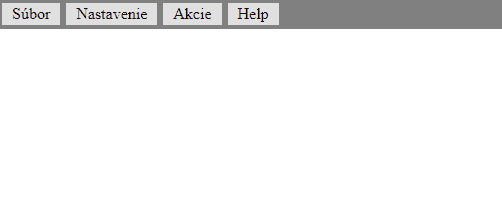

> ## Rozcestník
> - [Späť na úvod](../../README.md)
> - Repo: [Štartér](/../../tree/main/css/dropdownmenu), [Riešenie](/../../tree/solution/css/dropdownmenu).

# DropDown menu - CSS [branch solution]

Cieľom úlohy je vytvoriť roletové menu aké obsahujú bežne desktopové aplikácie. Ako má menu fungovať demonštruje nasledovný gif:



Počiatočný HTML dokument obsahuje toto menu zadefinované pomocou štruktúry `<ul>` elementov a vyzerá nasledovne:
```html
 <div id="menu">
        <ul>
            <li>
                <span>Súbor</span>
                <ul>
                    <li>
                        <span>Vytvoriť nový</span>
                        <ul>
                            <li><span>PDF</span></li>
                            <li><span>PPT</span></li>
                            <li><span>TXT</span></li>
                            <li><span>HTML</span></li>
                        </ul>
                    </li>
                    <li><span>Uložiť</span></li>
                    <li>
                        <span>Exportovať</span>
                        <ul>
                            <li>
                                <span>Web</span>
    ...
```
Všimnite si však, že samotné `<ul>` a `<li>` definujú _iba_ štruktúru a položky samotné sú definované ako `<span>`. Vnorenie jednotlivých `<ul>` v `<li>` teda definuje ktorý `<ul>` je sub-menu ktorého menu.

Pre riešenie použite výlučne iba CSS.

# Riešenie

> doplnit uvod a vatu #TODO> MM

## Prvá úroveň menu

Prvý krok spočíva v skrytí všetkých vnorených `<ul>`, teda okrem prvej úrovne. Selektor, ktorým skryjeme všetky vnorené `<ul>` bude `ul ul`. Celkovo CSS bude nasledovné:

```css
ul ul {
    display: none;
}
```
Teraz potrebujeme upraviť zobrazenie prvej úrovne, tak aby sa nezobrazovala ako zoznama ale ako menu, teda vedľa seba. To ako sa ktorý prvok zobrazuje definuje CSS vlastnosť `display`([viac tu](https://www.w3schools.com/cssref/pr_class_display.asp)). 

Zoznam sa dá v `HTML` definovať dvomi značkami `<ul>` (neočíslovaný zoznam) a `<ol>` (očíslovaný zoznam). V oboch prípadoch sa jedná o obaľovací komponent, ktorého potomkami môžu byť jedine element `<li>`. Značka `<li>` sa zobrazuje ako bloková (má nastavenú hodnotu pre zobrazenie na `display: list-item`) preto sa jednotlivé položky zoznamu zobrazujú pod sebou. Aby sme ich zobrazili veďľa seba, je potrebné toto zobrazenie zmeniť.

Začiatočníckou chybou je zmenenie hodnoty `display` na `display: inline-block`. Aj keď sa položky zobrazia vedľa seba, vytvára sa medzi nimi prirodzene nežiadúca medzera. Ale prečo? Je to dôsledok toho, akým spôsobom má prehliadač zobrazovať riadkové (`inline`) elementy. Vieme, že prehliadáč ignoruje viacnásobné medzery a zalomenia. V tomto prípade, vzhľadom na štruktúru sí medzi jednotlivými elementmi `<li>` su znaky ako zalomenia, medzery a tabulatori  interpretované ako medzery.

Aby sme to názorne predviedli, stačí si niekde do kódu stránky vložiť nasledovný `HTML` kód (otvoriť [fiddle](https://jsfiddle.net/meshosk/Legh36td)):

```html
<div>
    <span>jeden</span>
    <span>dva</span>
    <span>tri</span>
    <span>styri</span>
    text
    text
    text
</div>
```
Výsledok : 
```html
jeden dva tri styri text text text
```

Výsledok tejto štruktúry bude postupnosť jednotlivých textov v riadku oddelených v medzerami. Pokiaľ chceme medzeru odstrániť musíme jednotlivé elementy dať ihneď za sebou nasledovne (otvoriť [fiddle](https://jsfiddle.net/meshosk/p2atzwkd)):
```html
<div>
    <span>jeden</span><span>dva</span><span>tri</span><span>styri</span>
    text
    text
    text
</div>
```
Výsledok:
```html
jedendvatristyri text text text
```

V našom prípade chceme zachovať pôvodnú štruktúru `HTML` a nechceme dopĺňať daľšie elementy, preto zvolíme zobrazenie pomocou [flexboxu](https://css-tricks.com/snippets/css/a-guide-to-flexbox).

Flexbox potrebuje na svoje fungovanie obaľovací element, tzv. _kontainer_, (v našom prípade `<ul>`) a položky, ktoré sa v ňom majú zobraziť (u nás `<li>`). Ak chceme aplikovať flexbox na náš príklad zo `<span>`, jeho kód bude vyzerať nasledovne (otvoriť [fiddle](https://jsfiddle.net/meshosk/a7Lzsnqh)):

```html
<html>
 <head>
   <style>
     div {
         display: flex;
       }
     span {
       border: 1px solid black;
     }
   </style>
 </head>
 
  <body>
    <div>
      <span>jeden</span>
      <span>dva</span>
      <span>tri</span>
      <span>styri</span>
      text
      text
      text
    </div>
  </body>
</html>
```
Ak tento postup aplikujeme na našu úlohu musíme najprv identifikovať _kontajner_ pre _flexbox_. V našom prípade sa jedná o iba prvú úroveň nášho menu. _Kontajner_ preto budeme definovať selektorom `#menu > ul`, teda vyberieme `<ul>` element, ktorý je priamim potomkom elementu `<div>` s hodnotou atribútu `id` `menu`. CSS bude teda vyzerať nasledovne:

```css
#menu > ul {
    display: flex;
}
ul ul {
    display: none;
}
```

Teraz musíme doplniť zobrazenie zoznamu tak, aby vizuálne pripomínalo menu, čím napovieme používateľovi aby daný komponent ako menu aj naozaj používal (_nie je nič horšie pre používateľa ako neintuitívne GUI_).

Ako prvé zmeníme farbu pozadia menu, tu ale budeme formátovať element `<div id=menu>`. Dôvod je taký, že značky `<ul>` a `<li>` by mali definovať iba štruktúru menu. Definujeme preto aj farbu pozadia a odsadenie medzi `<li>` tak aby bolo ľahké pre používateľa určiť, ktorý text predstavuje ktorú položku menu.

Pre odstránenie problémov s odsadeniami môžeme v našom prípade urobiť tzv. _globálny reset odsadení_ v `CSS`. Ten používa selektor `*` a ako vlastnosti mu dáme vnútorné a vonkajšie odsadenie na hodnotu `0`. Selektor `*` sa následne použije ako hodnota pre všetky štýlovania. Výledok je taký, že teraz musíme definovať odsadenia iba tam, kde ich skutočne chceme.

Následne esťe musíme upraviť zobrazenie `<li>`, tak aby sa nezobrazovali ako položky menu a elementy `<span>` aby sa zobrazovali ako blokové značky (inak im nebude možné zadefinovať rozmer a odsadenia).

Vzhľadom na to, že výsledkom úlohy je mnu, bude dobrý nápad zamedziť automatické zalamovanie textu v `<span>`. To urobíme tak, že `<span>` doplníme `CSS` vlastnosť `white-space: nowrap;`. CSS bude teda nasledovné:

```css
* {
    margin: 0;
    padding: 0;
}
#menu {
    background-color: gray;
    padding: 2px;
}
#menu > ul {
    display: flex;
}

span {
    background-color: aqua;
    display: block;
    padding: 4px 10px;
    white-space: nowrap;
}

li {
    display: block;
    margin: 2px;
}

ul ul {
    display: none;
}
```
Menu by sa malo zobrazovať momentálne takto:


## Druhá úroveň

Nasleduje vytvorenie štýlovania pre druhú úroveň. Tu musíme zobraziť položky druhej úrovne pod položkou prvej, práve a iba vtedy, pokiaľ nad ňu používateľ umiestni kurzor.