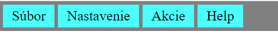
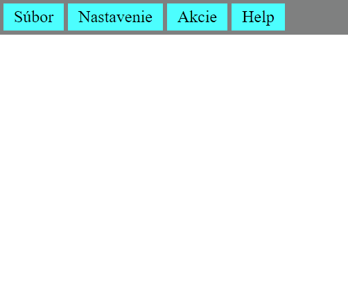
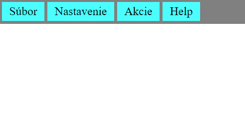
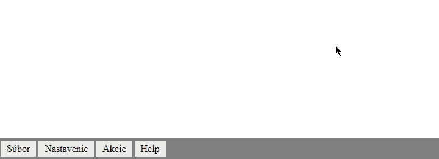

<div class="hidden">

> ## Rozcestník
> - [Späť na úvod](../../README.md)
> - Repo: [Štartér](/../../tree/main/css/dropdownmenu), [Riešenie](/../../tree/solution/css/dropdownmenu).
> - [Zobraziť riešenie](riesenie.md)

# DropDown a DropUp menu - CSS

</div>

<div class="hidden">

## Riešenie

Riešenie je rozdelené do nasledovných podkapitol

(prekliky nemusia fungovať pre lokálny MD interpreter):

1. [Prvá úroveň menu](#prvá-úroveň-menu)
2. [Druhá úroveň](#druhá-úroveň)
3. [Ďalšie úrovne](#ďalšie-úrovne)
4. [Zobrazenia ikonky o prítomnosti sub-menu](#zobrazenia-ikonky-o-prítomnosti-sub-menu)
5. [Doplnenie zvýraznenia výberu](doplnenie-zvýraznenia-výberu)
6. [Záverečné formátovanie](#záverečné-formátovanie)
7. [Upravenie na Drop-up menu](#upravenie-na-drop-up-menu)

</div>

## Prvá úroveň menu

Prvý krok spočíva v skrytí všetkých vnorených elementov `ul` okrem prvej úrovne. Na skrytie všetkých vnorených `ul` elementov použijeme následnícky selektor: `ul ul`. CSS pravidlo bude vyzerať nasledovne:

```css
ul ul {
    display: none;
}
```

Teraz potrebujeme upraviť zobrazenie prvej úrovne tak, aby sa nezobrazovala ako zoznam, ale ako menu, teda vedľa seba. To, ako sa ktorý prvok zobrazuje, definuje CSS vlastnosť [`display`](https://www.w3schools.com/cssref/pr_class_display.asp)).

Zoznam sa dá v HTML definovať dvomi značkami: `ul` (nečíslovaný zoznam) a `ol` (číslovaný zoznam). V oboch prípadoch ide o obaľovací komponent, ktorého potomkom môžu byť jedine elementy `li`. Značka `<li>` sa zobrazuje ako bloková (má nastavenú hodnotu pre zobrazenie na `display: list-item`), preto sa jednotlivé položky zoznamu zobrazujú pod sebou. Toto zobrazenie je potrebné zmeniť, aby sme ich zobrazili vedľa seba.

Začiatočníckou chybou je zmena hodnoty `display` na `display: inline-block`. Aj keď sa položky zobrazia vedľa seba, vytvára sa medzi nimi nežiadúca medzera. Ale prečo? Je to dôsledok toho, akým spôsobom prehliadač zobrazuje riadkové (*inline*) elementy. Vieme, že prehliadač ignoruje viacnásobné medzery a zalomenia. V tomto prípade, vzhľadom na štruktúru, sú medzi jednotlivými elementmi `li` znaky ako zalomenia, medzery a tabulátory interpretované ako medzery.

Aby sme to názorne predviedli, stačí si niekde do kódu stránky vložiť nasledovný HTML kód<span class="hidden"> (alebo otvoriť [fiddle](https://jsfiddle.net/meshosk/Legh36td)) </span>:

```html
<div>
    <span>jeden</span>
    <span>dva</span>
    <span>tri</span>
    <span>styri</span>
    text
    text
    text
</div>
```
<div style="page-break-after: always;"></div>
Výsledok bude:

```html
jeden dva tri styri text text text
```

Výsledkom tejto štruktúry bude postupnosť jednotlivých textov v riadku oddelených v medzerami. Pokiaľ chceme medzeru odstrániť, musíme jednotlivé elementy dať hneď za sebou<span class="hidden">( otvoriť [fiddle](https://jsfiddle.net/meshosk/p2atzwkd ))</span>:

```html
<div>
    <span>jeden</span><span>dva</span><span>tri</span><span>styri</span>
    text
    text
    text
</div>
```

Výsledok bude:

```html
jedendvatristyri text text text
```

V našom prípade chceme zachovať pôvodnú HTML štruktúru a nechceme dopĺňať ďalšie elementy, preto zvolíme zobrazenie pomocou rozloženia [*flexbox*](https://css-tricks.com/snippets/css/a-guide-to-flexbox).

*Flexbox* potrebuje na svoje fungovanie obaľovací element, tzv. *kontajner*, (v našom prípade element `ul`) a položky, ktoré sa v ňom majú zobraziť (u nás elementy `li`). Ak chceme aplikovať rozloženie *flexbox* na náš príklad s elementom `span`, jeho kód bude vyzerať nasledovne<span class="hidden">(otvoriť [fiddle](https://jsfiddle.net/meshosk/a7Lzsnqh ))</span>:

```html
<html>
<head>
    <style>
        div {
            display: flex;
        }

        span {
            border: 1px solid black;
        }
    </style>
</head>

<body>
<div>
    <span>jeden</span>
    <span>dva</span>
    <span>tri</span>
    <span>styri</span>
    text
    text
    text
</div>
</body>
</html>
```

Ak tento postup aplikujeme na našu úlohu, musíme najprv identifikovať *kontajner* pre [*flexbox*](https://css-tricks.com/snippets/css/a-guide-to-flexbox/). V našom prípade ide o iba prvú úroveň nášho menu. Kontajner preto budeme definovať selektorom `#menu > ul`, teda vyberieme element `div` s hodnotou atribútu `id="menu"`, ktorý tvorí hlavný element nášho menu. CSS bude teda vyzerať nasledovne:

```css
#menu > ul {
    display: flex;
}
```

Teraz musíme doplniť zobrazenie zoznamu tak, aby vizuálne pripomínalo menu, čím napovieme používateľovi, aby daný komponent používal ako menu (*nie je nič horšie pre používateľa ako neintuitívne používateľské rozhranie*).

Ako prvé zmeníme farbu pozadia menu, budeme formátovať element `div` s `id="menu"`.

Značky `ul` a `li` by mali definovať iba štruktúru menu. Definujeme preto farbu pozadia a odsadenie iba pre elementy `span` tak, aby bolo ľahké pre používateľa určiť, ktorý text predstavuje ktorú položku menu.

Jedinú výnimku bude tvoriť formátovanie elementu `ul` druhej a ďalšej úrovne, ktorým neskôr pridáme formátovanie v podobe rámčeka a pozadia. Samozrejme, problému sa dá predísť vytvorením obaľovacieho elementu pre ďalšie úrovne. V našom prípade sme ale chceli mať v príklade čo najjednoduchšiu štruktúru.

Pre odstránenie problémov s odsadením môžeme v našom prípade urobiť tzv. *globálny reset odsadení* v CSS. Ten používa selektor `*` a ako vlastnosti mu nastavíme vnútorné a vonkajšie odsadenie na hodnotu `0`. Selektor `*` sa následne použije ako hodnota pre všetky štýly. Teraz stačí definovať odsadenia iba tam, kde ich skutočne chceme.

Následne ešte musíme upraviť zobrazenie elementov `li` tak, aby sa nezobrazovali ako položky menu a elementy `span`, aby sa zobrazovali ako blokové značky (inak im nebude možné zadefinovať rozmer a odsadenie).

Vzhľadom na to, že výsledkom úlohy je menu, bude dobrý nápad zamedziť automatické zalamovanie textu v `span`. To urobíme tak, že `span` elementom doplníme CSS vlastnosť `white-space: nowrap;`. CSS bude teda nasledovné:

```css
* {
    margin: 0;
    padding: 0;
}
#menu {
    background-color: gray;
    padding: 2px;
}
span {
    background-color: aqua;
    display: block;
    padding: 4px 10px;
    margin: 2px;
    white-space: nowrap;
}
li {
    display: block;
}
```

Menu bude vyzerať:



## Druhá úroveň menu

Nasleduje vytvorenie štýlu pre druhú úroveň. Pre lepšie ladenie CSS si musíme najprv zobraziť prvú a druhú úroveň. To docielime tým, že upravíme obsah selektoru `ul ul` a doplníme skrytie všetkých elementov `ul` úrovne tri a viac, teda selektorom `ul ul ul`. Upravené CSS bude vyzerať (zobrazené sú iba doplnené a zmenené CSS pravidlá):

```css
li {
    position: relative;
    display: block;
}
ul ul {
    display: block;
}
ul ul ul {
    display: none;
}
```

Menu bude zobrazovať staticky prvú a druhú úroveň takto:


Teraz potrebujeme upraviť CSS vlastnosť `position` pre všetky `li` elementy prvej úrovne na `relative`, aby sme vytvorili základnú plochu pre prípadne elementy `ul` ďalších úrovní.

Všetkým elementom `ul` druhej a ďalších úrovní nastavíme vlastnosť `position` na `absolute`. Tým docielime to, že elementy `ul` sa zobrazia "plávajúco" nad ostatnými elementmi<span class="hidden">(viac o [position tu](../../common/css-position.md) )</span>. Upravené CSS pravidlá sú nasledovné:

```css
li {
    position: relative;
    display: block;
}
ul ul {
    display: block;
    position: absolute;
}
ul ul ul {
    display: none;
}
```

Zobrazenie menu v tomto kroku bude nasledovné:


Ako prvé teraz doplníme zobrazovanie a skrývanie druhej úrovne, pokiaľ používateľ umiestni kurzor nad daný element `li`, ktorý obsahuje priamo podmenu. Zvolenie priameho potomka je v selektore dôležité, lebo chceme, aby sa zobrazil iba priamy potomok a nie všetky elementy `ul` v danej vetve DOM. Môžeme ešte pridať formátovanie pre elementy `ul` úrovne dva a viac.

Pre zobrazenie opäť použijeme *flexbox* a upravíme zobrazenie prvkov na vertikálne pomocou `flex-direction: column;`. Vo východzom stave sú podmenu skryté. CSS bude teda nasledovné:

```css
ul ul {
    position: absolute;
    display: none;
    border: 1px solid black;
    background-color: burlywood;
}
li:hover > ul {
    display: flex;
    flex-direction: column;
}
```

Ako je vidieť na nasledujúcom obrázku, menu správne funguje, ale iba po druhú úroveň.



## Ďalšie úrovne menu

Aby sa nám správne zobrazili položky menu druhej úrovne, je potrebné upraviť spôsob určovania ich pozície. Nasledujúce podmenu sa má zobraziť výškovo zarovno s položkou napravo od nej. To docielime nasledovným CSS pravidlom:

```css
ul ul ul {
    top: 0;
    left: 100%
}
```

Nastavenie CSS vlastnosti `top: 0` určuje, že sa má podmenu zobraziť vertikálne zarovno s elementom `li`, v ktorom sa nachádza. Vlastnosť `left: 100%` umiestňuje podmenu o `100%` veľkosti rodičovského elementu `li` zľava. Výsledok pridania tohto pravidla je nasledovný:


Všimnime si však, že jednotlivé podmenu nie sú úplne zarovnané. To je dôsledok toho, že sme pri elemente `ul` druhej úrovne pridali rámček a ďalšie vnorené menu sa zobrazí až v tomto rámčeku.


Aby sa menu zobrazovalo korektne, musíme vnorený element posunúť o veľkosť rámčeka. V našom prípade stačí upraviť umiestnenie menu aspoň tretej úrovne tak, že ho negatívne posunieme hore o šírku rámčeka.

```css
ul ul ul {
    top: -1px;
    left: 100%
}
```

## Zobrazenie indikátora prítomnosti podmenu

Pre zlepšenie používateľského komfortu je veľmi vhodné používateľovi nejako naznačiť, že nejaká položka menu obsahuje dodatočné podmenu. Najčastejšie sa to realizuje indikátorom, napr. znakom `»`. 

Pre doplnenie tohto indikátora existuje viacero spôsobov:

- Doplnenie nového elementu do HTML, ktorý daný znak doplní. 
- Namiesto pridania elementu stačí vytvoriť CSS pravidlo a následne túto triedu doplniť do atribútu `class` daného elementu.
- Ak máme štruktúru pevne danú, môžeme doplniť tento znak CSS selektorom.

V našom prípade sa pokúsime o aplikovanie poslednej možnosti, a to použitím selektora `ul ul span:not(:only-child)::after`, ktorý môžeme popísať nasledovne:

- `ul ul span` - sa aplikuje na všetky elementy `span` od druhej úrovne.
- `:not(:only-child)` - je [**pseudotrieda**](https://developer.mozilla.org/en-US/docs/Web/CSS/Pseudo-classes) `:not` urobí nad získanými elementmi `span` filter a vyberie iba tie, ktoré nie sú jedináčik. Teda, majú vedľa seba nejaké súrodenecké elementy. V našom prípade ide výlučne o položky menu, ktoré obsahujú podmenu.
- `::after` - je [**pseudoelement**](https://developer.mozilla.org/en-US/docs/Web/CSS/Pseudo-elements), pomocou ktorého vieme definovať nejaký obsah, ktorý sa zobrazí ihneď za elementmi, ktoré sú vybrané selektorom.

CSS pravidlo, ktoré nám pridá indikátor, je nasledovné:

<div class="end">

```css
ul ul span:not(:only-child)::after {
    color: blue;
    content: "»";
    padding: 3px 3px 3px 10px;
}
```
</div>

Výsledok vyzerá takto:



## Doplnenie zvýraznenia výberu

Ďalšia vec, ktorá spríjemní prácu používateľa, je vyznačenie prvkov, ktoré boli inicializované výberom. To realizujeme nasledovným CSS pravidlom:

```css
li:hover > span {
    color: red;
    background-color: yellow;
}
```

Zmenu aplikujeme na element `span`, ktorý je priamym potomkom elementu `li`, nad ktorým je aktuálne kurzor myši. Je potrebné si pamätať, že táto indikácia vyplýva z DOM štruktúry a nie z toho, ako sú prvky reálne vykreslené v okne prehliadača.
<div style="page-break-after: always;"></div>
Výsledok funguje nasledovne:


## Záverečné formátovanie

Nasledovné úpravy ešte zlepšia dizajn celého riešenia:

1. Odstránime farbu pozadia a ponecháme iba elementy `span` prvej úrovne.
2. Nastavíme jednotnú farbu pozadia pre elementy`ul` druhej a ďalšej úrovne.
3. Každú úroveň jemne farebne odlíšime.

CSS štýly pre bod 1. a 2. budú vyzerať nasledovne:

<div class="end">

```css
span {
    background-color: transparent
}
#menu > ul > li:hover > span {
    color: red;
    background-color: yellow;
}
#menu > ul > li > span {
    background-color: #ebebeb;
}
ul ul {
    background-color: #ebebeb;
}
```
</div>

A ako posledné doplníme postupne sa stmavujúcu farbu pozadia pre vnorené elementy `ul`:

```css
ul ul {
    background-color: #ebebeb;
}
ul ul ul {
    background-color: #bdbdbd;
}
ul ul ul ul {
    background-color: #949494;
}
```

Finálny výsledok vyzerá nasledovne:


## Úprava na *drop-up* menu

Zmena voči pôvodnému menu spočíva čisto iba v úprave toho, kde a ako sa majú jednotlivé elementy zobraziť. Začneme teda presunutím celého menu na spodok okna prehliadača. To budeme realizovať zmenou hodnoty CSS vlastnosti `position` na hodnotu `fixed`. Tým docielime to, že menu sa bude umiestňovať nad všetky vykreslené prvky v priestore okna prehliadača a ten bude tvoriť aj jeho predka pre výpočet veľkostí.

<div style="page-break-after: always;"></div>

Aby bolo menu roztiahnuté na celú dĺžku okna, musíme mu zadefinovať CSS vlastnosť `width: 100%`. Upravený štýl zmeníme na:

```css
#menu {
    background-color: gray;
    padding: 2px;
    position: fixed;
    bottom: 0;
    width: 100%;
}
```

Následne musíme upraviť zobrazenie druhej úrovne tak, aby bola zarovnaná vľavo nad predka elementu `li`, a aby sa nezobrazovala pod ním, ale nad ním. Dosiahneme to pridaním vlastnosti `bottom: 100%;`, čím spodok podmenu presunieme na vrch nadradeného elementu `li`. CSS vlastnosť upravíme nasledovne:

```css
li:hover > ul {
    display: flex;
    flex-direction: column;
    bottom: 100%;
}
```

Mali by sme dostať nasledovné zobrazenie:


Podobne upravíme pozíciu pre menu druhej a ďalšej úrovne. Musíme však zmeniť selektor `ul ul ul` na `ul li:hover > ul ul`, aby sme predišli nutnosti použiť pravidlo `!important` (zvýšenie priority označenej vlastnosti).

```css
ul li:hover > ul ul {
    bottom: 0px;
    left: 100%;
}
```

Následne môžeme upraviť štýl `ul li:hover > ul ul` nasledovne:

```css
ul li:hover > ul ul {
    top: auto;
    bottom: -1px;
    left: 100%;
    margin-left: 0px;
}
```

To je všetko, čo sme potrebovali zmeniť, aby sme *drop-down* menu prerobili na *drop-up* menu. Malo by fungovať nasledovne:

