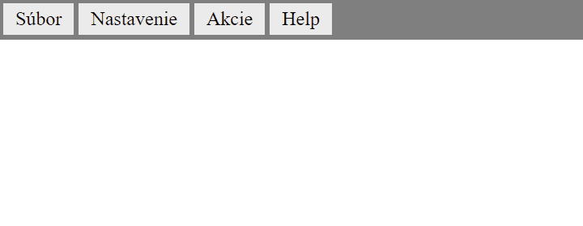

<div class="hidden">

> ## Rozcestník
> - [Späť na úvod](../../README.md)
> - Repo: [Štartér](/../../tree/main/css/dropdownmenu), [Riešenie](/../../tree/solution/css/dropdownmenu).
> - [Zobraziť riešenie](riesenie.md)
</div>

# Roletové menu
<div class="info"> 

**Hlavný jazyk príkladu**: CSS

**Ostatné použité jazyky**: HTML

**Obťažnosť**: 3/5

**Obsah príkladu**: Tvorba menu, použitie CSS *Flexbox*, CSS vlastnosti `display`, `position`, potomkové selektory, pseudotrieda `:hover`, pseudoelementy  `::before` a `::after`.
</div>

## Zadanie

Cieľom úlohy je vytvoriť roletové menu, aké bežne obsahujú desktopové aplikácie. Menu bude možné rozbaliť smerom dolu (*drop-down menu*) alebo smerom hore (*drop-up menu*). Fungovanie menu ukazuje nasledovný obrázok:



Menu musí spĺňať nasledovné podmienky:

1. Prvá úroveň menu je vždy zobrazená na vrchu stránky.
2. Ďalšie úrovne menu sú viditeľne iba, ak ich používateľ aktivuje kurzorom.
3. Vizuálne treba indikovať, či dané menu obsahuje podmenu.
4. Zvýraznite, aké položky menu sú aktivované.
5. Jednotlivé podmenu zobrazte s jemne odlišnou farbou pozadia, napr. stmavovaním.
6. Modifikujte drop-down menu na drop-up menu.

Počiatočný HTML dokument obsahuje menu zadefinované pomocou štruktúry elementov a vyzerá nasledovne:

```html

<div id="menu">
    <ul>
        <li>
            <span>Súbor</span>
            <ul>
                <li>
                    <span>Vytvoriť nový</span>
                    <ul>
                        <li><span>PDF</span></li>
                        <li><span>PPT</span></li>
                        <li><span>TXT</span></li>
                        <li><span>HTML</span></li>
                    </ul>
                </li>
                <li><span>Uložiť</span></li>
                <li>
                    <span>Exportovať</span>
                    <ul>
                        <li>
                            <span>Web</span>
                            ...
```

Všimnite si však, že samotné elementy `ul` a `li` definujú iba štruktúru menu. Obsah položky je definovaný ako obsah elementu `span`. Vnorenie jednotlivých elementov `ul` v `li` definuje hierarchiu menu.

Pre riešenie použite výlučne iba jazyk CSS.
