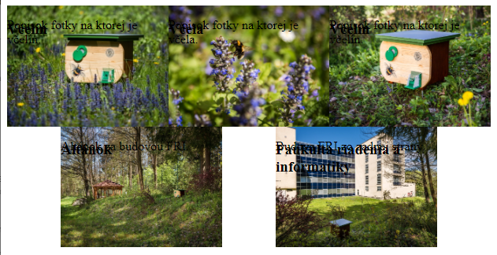
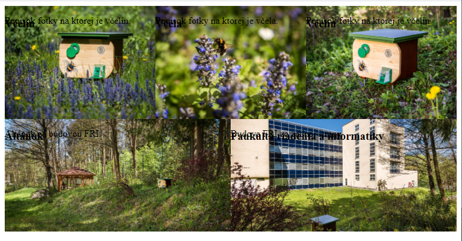
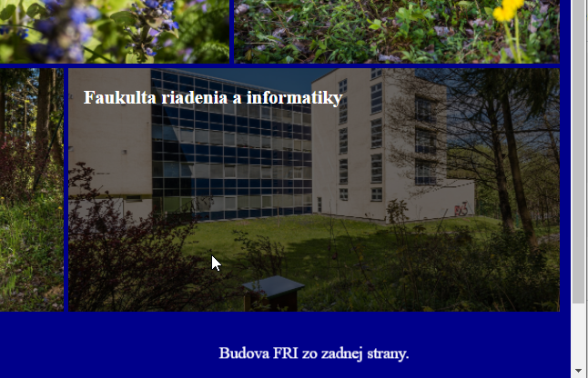
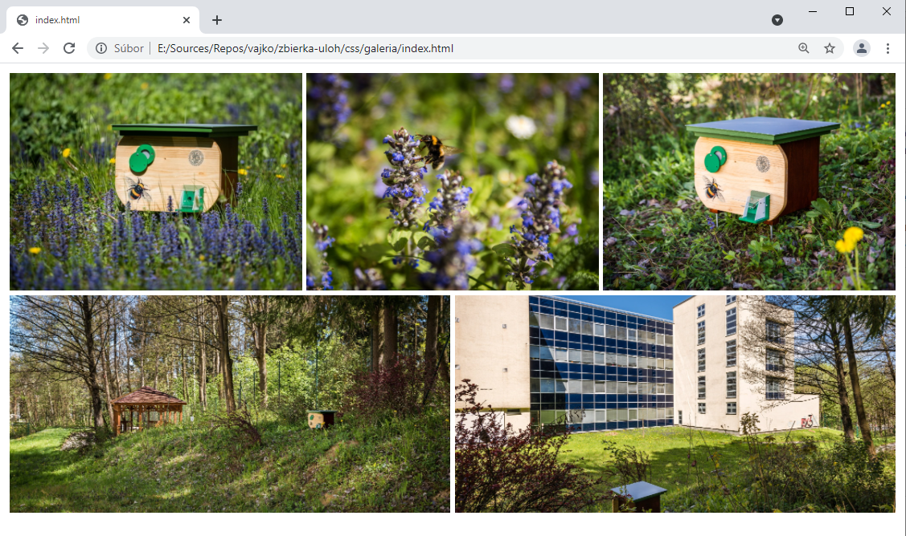

<div class="hidden">

> ## Rozcestník
> - [Späť na úvod](../../README.md)
> - Repo: [Štartér](/../../tree/main/css/galeria), [Riešenie](/../../tree/solution/css/galeria).

# Galéria (CSS)

</div>

## Riešenie

Pri riešení tohto príkladu budeme postupovať po jednotlivých krokoch:

1. Zobrazenie obrázkov v správnom pomere strán.
2. Zobrazenie obrázkov v mriežke.
3. Zobrazenie rôzneho počtu obrázkov na riadku podľa veľkosti obrazovky.
4. Zobrazenie popisu obrázku

### Správne zobrazenie obrázkov

Vo všeobecnosti môžeme predpokladať, že obrázky v galérii môžu mať ľubovolné rozmery. Niektoré môžu byť fotené na výšku,
iné na šírku. Niektoré môžu byť širokouhlé iné nie. Tento problém sa dá riešiť dvoma spôsobmi - buď na strane servera
vygenerujeme náhľady, ktoré všetky budú mať rovnaké rozmery, alebo si ich prispôsobíme pomocou CSS. V tomto príklade si
ukážeme riešenie čisto pomocou CSS.

Najskôr si ukážeme *trik*, ako môžeme určitému elementu predpísať pomer strán. Pokiaľ by sme mali elementy s pevnou
šírkou, tak toto by nemal byť problém, lebo môžeme nastaviť rozmery priamo v pixeloch. V našom prípade ale požadujeme,
aby sa obrázok roztiahol na celú obrazovku, takže bude mať nastavenú `width: 100%`. Pokiaľ by sme skúsili
nastaviť `height: 75%`, tak by sme nedostali konštantný pomer, pretože výška v percentách určuje pomer výšky elementu a
jeho rodiča. Takže pri zmene veľkosti rodičovského elementu by sa nám menila aj výška fotky. Ak chceme konštantný pomer,
môžeme nastaviť `padding-top: 75%;`. Pokiaľ by sme chceli iný pomer ako 4:3 tak je potrebné vypočítať príslušnú
percentuálnu hodnotu a zmeniť hodnotu vlastnosti `padding-top`.

```css
.fotka {
    position: relative;
    width: 100%;
    padding-top: 75%;
}

.fotka > * {
    position: absolute;
    top: 0;
    left: 0;
}

.fotka img {
    display: block;
    width: 100%;
    height: 100%;
}
```

Elementom `fotka` sme nastavili šírku na `100%` a `padding-top` na `75%`. Okrem toho sme museli nastaviť pozíciu
na `relative` aby sme mohli správne vo vnútri zobraziť obrázok.

Vo fotke sa nachádza obrázok a dva textové elementy. Tieto pre zachovanie pomeru strán musia mať nastavenú absolútnu
pozíciu. Pre výber všetkých priamych potomkov elementu `fotka` sme použili selektor `.fotka > *`.

V poslednom rade sme roztiahli obrázok na celú šírku príslušného elementu `fotka`. Po aplikovaní tohto kódu dostaneme
stránku, kde budú jednotlivé fotky roztiahnuté na celú šírku stránky a zobrazené budu vždy bez ohľadu na veľkosť okna v
pomere 4:3.

Tento kód má ale ešte jednu chybu:


Ako môžeme vidieť na obrázku, fotka sa nám zdeformovala. Pôvodný obrázok bol totižto fotený *na výšku* a keď obrázku
nastavíme rozmery na `100%`, tak sa roztiahne a zdeformuje. Túto deformáciu môžeme našťastie jednoducho vyriešiť pomocou
vlastnosti `object-fit: cover`, ktorá definuje spôsob, akým sa obrázok prispôsobí pri zmene veľkosti. Po aplikovaní
tejto vlastnosti na obrázok dostaneme:


### Zobrazenie obrázkov v gride

Aktuálne sme v stave, keď sa nám na stránke obrázky zobrazujú pod sebou. My by sme ale potrebovali, aby sme zobrazili
tri obrázky vedľa seba.

#### Riešenie cez `inline-block`

Prvým spôsobom je využitie toho, že element môžeme zobraziť ako `inline-block`, čo znamená, že sa bude v určitých
okolnostiach správať ako `inline` element (nebude za ním nový riadok) a v iných ako blokový element (môžeme mu nastaviť
rozmery).

```css
.fotka {
    display: inline-block;
    position: relative;
    width: calc(100% / 3);
    padding-top: calc(75% / 3);
}
```

Okrem pridania vlastnosti display sme zmenili aj šírku elementov - ak chceme tri tak potrebujeme 33%. Využili sme tu
funkciu `calc`, pretože 1/3 zo 100 je v skutočnosti 33.3333 periodických a `calc` nám to spočíta presne.

> Ako si môžete všimnúť, aj `padding-top` bolo potrebné zmenšiť na 1/3 pôvodnej hodnoty.

Po aplikovaní tohto štýlu ale zostaneme prekvapený:


Namiesto troch obrázkov na riadok máme len dva. Navyše oproti pôvodnému prípadu máme okolo obrázkov medzery. Po ďalšom
skúmaní zistíme, že práve tieto medzery spôsobili, že sa nezmesia tri obrázky na riadok. Pri zobrazení `inline-block` sú
tieto medzery spôsobené novým riadkom v HTML kóde medzi obrázkami.

Ak v pôvodnom HTML kóde odstránime medzery medzi fotkami, tak tento problém zmizne. Toto ale nie je správne riešenie,
nakoľko by sme sa pri deklarácii CSS pravidel nemali spoliehať na medzery medzi HTML elementami.

```html

<div class="fotka">
    ...
</div>
<div class="fotka">
    ...
</div>
```

#### Riešenie cez `float: left`

Druhým spôsobom je ponechanie blokového zobrazenia fotky. Blokovým elementom môžeme nastaviť obtekanie pomocou
vlastnosti `float`. Môžeme teda uvažovať nasledovný kód:

```css
.fotka {
    float: left;
    position: relative;
    width: calc(100% / 3 - 5px);
    padding-top: calc(75% / 3);
}
```

Výsledkom bude správne zobrazenie troch fotiek na jednom riadku:


#### Riešenie cez flexbox

Posledným spôsobom je riešenie pomocou rozloženia **flexbox**. Najskôr potrebujeme elementu `galeria` nastaviť, že má
byť tzv. *flex kontajner* a zobrazenie fotiek už následne bude automatické.

```css
.galeria {
    display: flex;
    flex-wrap: wrap;
}
```

Okrem `display: flex` musíme nastaviť aj vlastnosť `flex-wrap` na hodnotu `wrap`, aby sa *flexbox* nepokúšal o
zobrazenie všetkých elementov na jednom riadku, ako môžeme vidieť v nasledovnom obrázku:


Po nastavení `flex-wrap: wrap;` je už všetko v poriadku. Výhodou *flexboxu* oproti riešeniu s obtekaním je to, že
*flexbox* má veľké množstvo ďalších možností. Predstavte si, že nemáme presný počet obrázkov tak, aby sme vyplnili
všetky riadky. V prípade riešenia s obtekaním nám posledný obrázok zostane na ľavom okraji. Ak použijeme *flexbox*,
môžeme pomocou vlastnosti `justify-content` nastaviť, čo sa má stať v prípade, že nebude dostatok fotiek na riadku.

Ak nastavíme `justify-content` na `center`, tak sa nám fotky vycentrujú do stredu:


Môžeme ale vyskúšať aj hodnotu `space-between`, ktorá nám fotky rozhodí na kraje:


Alebo hodnotu `space-evenly`, ktorá nám ich umiestni s rovnomernými medzerami:



Týchto vlastností je veľké množstvo a stačí si vybrať podľa potreby.

Ak nám nevyhovuje prázdne miesto v spodnom riadku, môžeme nastaviť fotke vlastnosť `flex-grow`, vďaka ktorej sa obrázky
v poslednom riadku roztiahnú tak, aby vyplnili celý priestor:

```css
.fotka {
    position: relative;
    width: calc(100% / 3);
    padding-top: calc(75% / 3);
    flex-grow: 1;
}
```



#### Pridanie medzier medzi obrázky

V ďalšom kroku by sme mali nastaviť medzery medzi jednotlivými fotkami, nech nie sú nalepené na sebe.

Najjednoduchším spôsobom je pridanie okraja k fotke. Problém je, že okraj rozširuje element, takže ho musíme odpočítať
od šírky samotného elementu. S využitím funkcie `calc` to ale CSS žiaden problém:

```css
.fotka {
    position: relative;
    width: calc(100% / 3 - 5px);
    padding-top: calc(75% / 3 - 5px);
    flex-grow: 1;
    margin: 2.5px;
}
```


### Rôzne počet obrázkov na riadku na základe veľkosti zariadenia

Pokiaľ trváme na zachovaní pomeru strán musíme využiť tzv. **media queries**. Tie nám umožňujú aplikovať štýl na základe
určitej vlastnosti. V našom prípade potrebujeme kontrolovať celkovú šírku okna. Použijeme preto media query `max-width`.
V zadaní požadujeme tri spôsoby zobrazenia. Jedno z nich bude východzie a ostatné sa budu meniť na základe šírky okna.
Za východzie môžeme považovať zobrazenie troch fotiek na jednom riadku. Potrebujeme preto definovať dva body zlomu, v
ktorých sa bude meniť počet obrázkov na riadku. Prvý z nich bude `1000px` a druhý `600px`.

Nasledujúce riadky dopíšeme za definíciu pravidla `.fotka`.

```css
@media (max-width: 1000px) {
    .fotka {
        width: calc(100% / 2 - 5px);
        padding-top: calc(75% / 2 - 5px);
    }
}

@media (max-width: 600px) {
    .fotka {
        width: calc(100% - 5px);
        padding-top: calc(75% - 5px);
    }
}
```

Prvé pravidlo prepíše prednastavenú šírku fotky z cca `33%` na `50%` v prípade, že obrazovka má maximálnu širku `1000px`
. Druhé zas prepíše šírku fotky na `100%` v prípade, že šírka zariadenia bude menšia, nanajvýš rovná `600px`.

#### Automatická zmena veľkosti pomocou *flexboxu*.

V prípade, že nebudeme trvať na konštantnom pomere výšky a šírky obrázku, môžeme využiť flexboxové automatické
prispôsobovanie elementov.

Môžeme si vyskúšať nasledovné pravidlo:

```css
.fotka {
    position: relative;
    min-width: 400px;
    height: 300px;
    flex-grow: 1;
    margin: 2.5px;
}
```

V tomto príklade sme pevne určili výšku obrázka na `300px` a minimálnu šírku na `400px`. *Flexbox* následne tieto
obrázky zobrazí tak, že každý z nich bude mať výšku presne `300px` a šírka bude podľa potreby tak, aby sa ich do riadku
zmestilo čo najviac.

### Popis obrázku

V aktuálnej verzii ešte nemáme naštýlovaný popis obrázku. Popis sa momentálne prelína s obrázkom.


Začneme zo správnym umiestnením textov a nastavením správnej farby. Farbu nastavíme celému elementu `fotka`.

```css
.fotka {
    color: white;
}
```

A jednotlivé prvky správne umiestnime:

```css
.fotka h3 {
    top: 0;
    left: 15px;
}

.fotka p {
    top: auto;
    bottom: 30px;
    width: 100%;
    text-align: center;
}
```

Pri nastavovani popisu sme museli prepísať vlastnosť `top`, pretože túto sme nastavili všetkým elementom vo fotke
pomocou selektoru `.fotka > *`.


Ďalším krokom bude stmavenie celého obrázku. To sa dá urobiť viacerými spôsobmi. Najjednoduchšie bude použitie
vlastnosti `opacity`, ktorá umožní spriehľadniť ľubovolný element. Ak to navyše skombinujeme s tmavou farbou pozadia
fotky dostaneme efekt stmaveného pozadia.

```css
.fotka {
    background-color: black;
}

.fotka:hover img {
    opacity: 0.4;
}
```

Vlastnosť `opacity` sme nastavili pomocou selektoru `:hover`, takže pozadie stmavne až po prejdení myšou ponad obrázok.


Pokiaľ chceme, aby sa aj texty zobrazili až po premiestnení myši na obrázok, tak musíme upraviť ich CSS nasledovne:

```css
.fotka p, .fotka h3 {
    display: none;
}

.fotka:hover p, .fotka:hover h3 {
    display: block;
}
```

Pomocou prvého pravidla skryjeme oba elementy a pomocou druhého ich zobrazíme, keď príde myš nad element fotka.

### Animácie pri prechode myši

Aktuálne riešenie funguje, výsledný dojem nie je najlepší. Skúsime teda pridať zopár animácií. Začneme tým, aby obrázok
stmavol postupne a nie naraz. Na to by sme mohli napísať vlastnú animáciu, ktorá by menila vlastnosť `opacity`.
Jednoduchší spôsob bude využitie vlastnosti `transition`. Túto vlastnosť definujeme pre obrázok. Výhoda `transition`
oproti vlastnej animácii je v jednoduchšom zápise. Pri `transition` definujeme len vlastnosť, ktorej sa to týka a dobu
zmeny.

```css
.fotka img {
    transition: opacity 0.5s;
}
```

Táto definícia zabezpečí, že vždy, keď sa bude meniť `opacity` (napríklad po prechode myšou), tak táto zmena nebude
okamžitá, ale bude trvať 0.5 sekundy.

Druhú animáciu, ktorú pridáme je "príchod" popisu zdola. Tento prílet budeme animovať pomocou transformácie y-pozície.
Najskôr si pripravíme `keyframes`:

```css
@keyframes popis-in {
    from {
        transform: translateY(1000%);
    }
    to {
        transform: translateY(0);
    }
}
```

Táto animácie na začiatku umiestni element o `1000%` nižšie. Použili sme `1000%` preto, aby element bol skutočne mimo
obrázku. Ak by sme dali len `100%`, tak by animácia začala už z obrázku.

Pre aplikovanie animácie následne stačí použiť:

```css
.fotka:hover p {
    animation-delay: 0.5s;
    animation: popis-in 40s;
}
```

Celková animácia bude trvať 1 sekundu s tým, že sme jej začiatok posunuli o pol sekundy, aby sme dosiahli krajší efekt
príchodu popisu.

Posledným problémom, ktorý musíme vyriešiť je, že akonáhle sme posunuli popis o `1000%` v smere osi Y, tak počas
animácie sa nám môže stať, že sa na stránke objaví posuvník.


Na obrázku vyššie môžeme vidieť, ako sa v pravom dolnom obrázku postupne nasúva text a počas tejto animácie vidíme
zobrazený posuvník napravo. Po skončení animácie posuvník zmizne.

Ak nastavíme pozadie stránky na tmavú farbu, môžeme presne vidieť, čo sa deje:



Text sa zobrazuje v skutočnosti mimo elementu fotky. Tento problém môžeme vyriešiť tak, že elementu `fotka` nastavíme
hodnotu parametra `overflow` na `hidden`, čo spôsobí, že hocijaký obsah, ktorý by sa mal vykresliť mimo elementu fotka
bude skrytý.

```css
.fotka {
    overflow: hidden;
}
```

Výsledná galéria bude vyzerať nasledovne:

