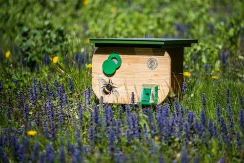
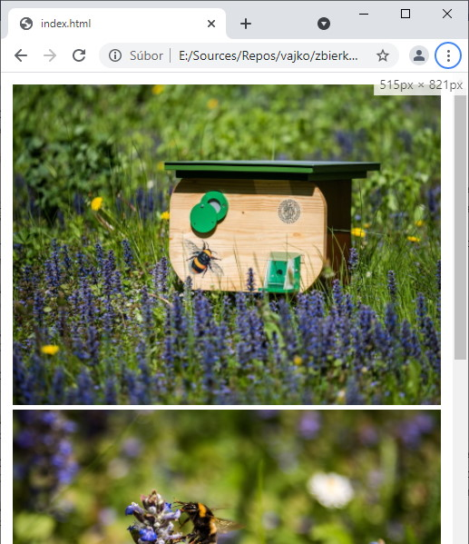
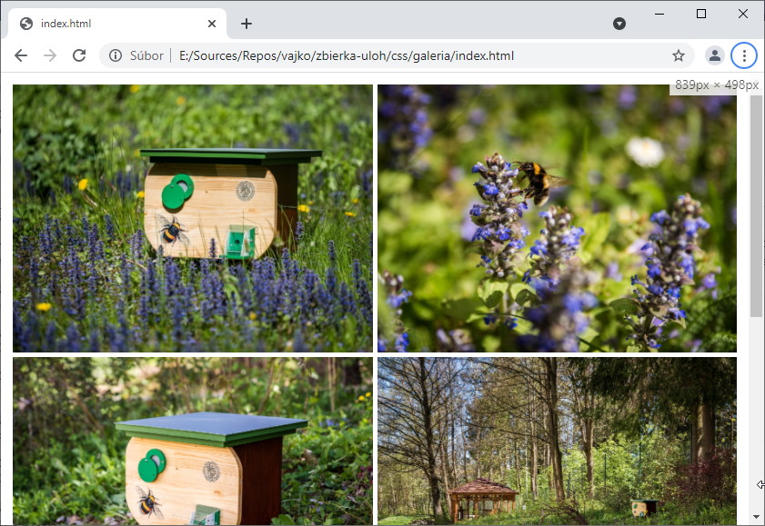

<div class="hidden">

> ## Rozcestník
> - [Späť na úvod](../../README.md)
> - Repo: [Štartér](/../../tree/main/css/gallery), [Riešenie](/../../tree/solution/css/gallery).
> - [Zobraziť riešenie](riesenie.md)
</div>

# Galéria
<div class="info"> 

**Hlavný jazyk príkladu**: CSS

**Ostatné použité jazyky**: HTML

**Obťažnosť**: 4/5

**Obsah príkladu**:  Tvorba galérie fotografií, *Flexbox* rozloženie, pokročilejšie spôsoby zobrazovania obrázkov, priehľadnosť obrázkov, CSS funkcia `calc()`, *media queries* a animácie.
</div>

## Zadanie

Máme definované HTML, ktoré vyzerá nasledovne:

```html
<div class="gallery">
    <div class="photo">
        
        <h3>Včelín</h3>
        <p>Popisok obrázku, na ktorom je včelín.</p>
    </div>

    <div class="photo">
        
        <h3>Včela</h3>
        <p>Popisok obrázku, na ktorom je včela.</p>
    </div>
    ...
</div>
```

Naštýlujte pomocou CSS túto galériu nasledovne:

1. Obrázky budú zobrazené v mriežke.
2. Mriežka sa bude prispôsobovať veľkosti obrazovky:
   - Na veľkom displeji (šírka > 1000px) zobrazte tri obrázky vedľa seba.
   - Pri strednom (šírka > 600px) zobrazte dva obrázky.
   - Na malých displejoch zobrazte len jeden obrázok.
3. Obrázky vždy vyplnia celú dostupnú šírku.
4. Obrázky budú mať pomer strán 4:3.
5. Názov a popisok obrázku sa zobrazí tak, že
   - po nastavení kurzora myši na obrázok, tento postupne stmavne,
   - nadpis sa zobrazí v ľavom hornom rohu a popisok sa postupne nasunie zo spodu obrázku.

### Zobrazenie galérií na rôzne veľkých zariadeniach

Zariadenie s malým displejom:



Zariadenie so stredne veľkým displejom:



Zariadenie s veľkým displejom:


Informácie o obrázku:

