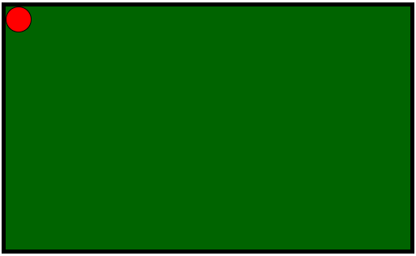

<div class="hidden">

> ## Rozcestník
> - [Späť na úvod](../../README.md)
> - Repo: [Štartér](/../../tree/main/css/pool), [Riešenie](/../../tree/solution/css/pool).
> - [Zobraziť zadanie](zadanie.md)

# Gulečník (CSS)

</div>

## Riešenie

Začneme definíciou HTML kódu pre túto úlohu v ktorom budú HTML elementy predstavujúce stôl a guľu na ňom.

```html
<div class="table">
    <div class="ball"></div>
</div>
```

Následne je potrebné tieto elementy naštýlovať, aby sa zobrazili ako biliardový stôl a guľa. Elementu predstavujúcemu stôl nastavíme pevnú veľkosť `500px` x `300px`, tmavozelené pozadie a čierny rámček. Guľa bude mať priemer `30px`, červenú farbu, tenký čierny rámik a bude okrúhla. Na zobrazenie HTML elementu ako kruh použijeme CSS vlastnosť `border-radius`.

```css
.table {
    position: relative;
    width: 500px;
    height: 300px;
    background: darkgreen;
    border: 5px solid black;
}

.ball {
    position: absolute;
    width: 30px;
    height: 30px;
    background: red;
    border: 1px solid black;
    border-radius: 50%;
}
```

Okrem farby sme elementom nastavili aj CSS vlastnosť `position`. Guľa má nastavenú hodnotu na `absolute`, aby sme ju pomocou CSS vlastností `top` a `left` mohli umiestniť na ľubovolné miesto v rámci stola. Stolu sme museli nastaviť hodnotu na `relative`, aby sme mohli guľu umiestňovať absolútne vzhľadom na stôl.

Výsledok bude vyzerať nasledovne.



Pre pohyb gule v zvislom smere pripravíme animáciu:

```css
@keyframes y-axis {
    from {
        top: 0px;
    }
    to {
        top: 270px;
    }
}
```

Táto animácia bude presúvať guľu zhora dole. Animáciu na guľu aplikujeme nasledovne:

```css
.ball {
    animation: y-axis 3.3s linear alternate infinite;
}
```

Jednotlivé hodnoty v tomto zápise majú nasledovný význam:

- `y-axis` - názov animácie, ktorú sme si zadeklarovali pomocou kľúčového slovíčka `@keyframes`.
- `3.3s` - čas trvania animácie. Počas tohto času bude guľa plynule meniť svoju pozíciu na osi `Y`.
- `linear` - takzvaná *timing* funkcia. Táto funkcia popisuje spôsob, akým sa v čase bude meniť hodnota. Funkcia `linear` bude meniť hodnotu lineárne. Pre zaujímavejšie animácie sa dajú použiť definície *timing* funkcie pomocou _kubickej beziérovej krivky_. Takúto funkciu si môžete vygenerovať napríklad na stránke [cubic-bezier.com](https://cubic-bezier.com).
- `alternate` - definuje smer animácie (`animation-direction`). Tento smer môže byť od začiatku po koniec, od konca po začiatok, alebo v našom prípade `alternate` bude animáciu prehrávať tam a späť.
- `infinite` - definuje počet opakovaní animácie. V našom prípade chceme, aby sa guľa odrážala až, kým neopustíme stránku.

Po aplikovaní animácie by sme mali vidieť, ako sa guľa najskôr hýbe dole, a potom sa odrazí a pôjde hore. Toto by sa malo opakovať donekonečna.

Aby sme ale dosiahli pohyb gule aj v osi `X`, musíme pridať ďalšiu animáciu. Táto bude vyzerať veľmi podobne ako animácia pohybu v smere osi `Y`:

```css
@keyframes x-axis {
    from {
        left: 0px;
    }
    to {
        left: 470px;
    }
}
```

Pokiaľ chceme jednému elementu pridať viacero animácií, tak ich oddeľujeme čiarkou:

```css
.ball {
    ... 
    animation: x-axis 2s linear alternate infinite, y-axis 3.3s linear alternate infinite;
}
```

Aj druhá animácia používa rovnaké parametre. Jediným rozdielom je čas. Animácia na vodorovnej osi trvá 2s a animácia na zvislej osi trvá 3.3s. Pokiaľ budeme tieto časy meniť, zmení sa nám uhol, pod ktorým sa bude guľa pohybovať.