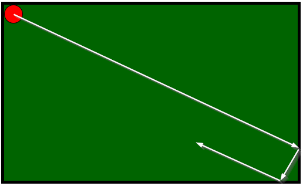

> ## Rozcestník
> - [Späť na úvod](../../README.md)
> - Repo: [Štartér](/../../tree/main/css/pool), [Riešenie](/../../tree/solution/css/pool).

# Gulečník

 

**Hlavný jazyk príkladu**: CSS

**Ostatné použité jazyky**: HTML

**Obtiažnosť**: 2/5

**Obsah príkladu**: Základy animácií v CSS, jednoduché animácie na zmenu polohy elementu, kombinácia viacerých animácií pre jeden element.

## Zadanie

Vytvorte pomocou CSS animáciu loptičky, ktorá sa pohybuje po stole a odráža sa od stien.

[Zobraziť riešenie](riesenie.md)

