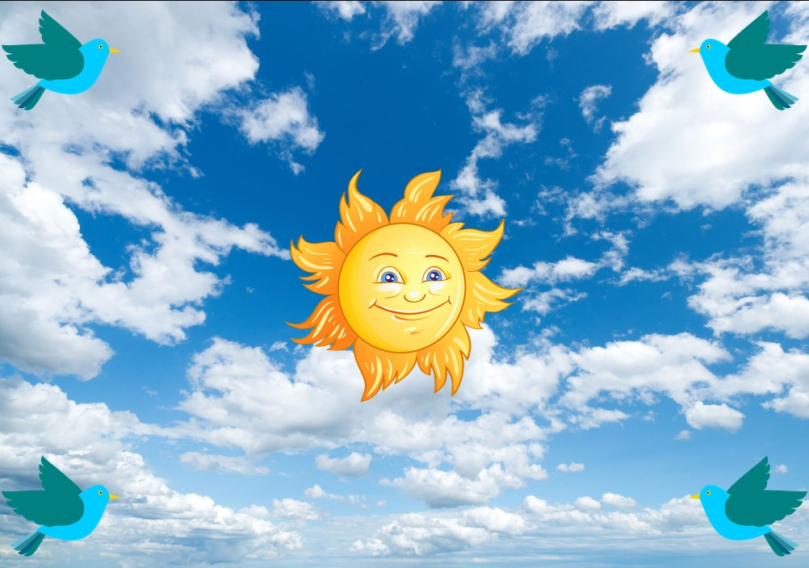

> ## Rozcestník
> - [Späť na úvod](../../README.md)
> - Repo: [Štartér](/../../tree/main/css/position), [Riešenie](/../../tree/solution/css/position).
> - [Zobraziť riešenie](riesenie.md)

# Pozícia elementov

 

**Hlavný jazyk príkladu**: CSS

**Ostatné použité jazyky**: HTML

**Obťažnosť**: 1/5

**Obsah príkladu**: Umiestňovanie elementov pomocou CSS, kombinovanie viacerých CSS tried, pozadie elementov, použitie CSS vlastností `position` a `transform `

## Zadanie

Vytvorte scenériu oblohy, ktorá bude roztiahnutá na celé pozadie okna prehliadača a uprostred nej bude obrázok slnka. V každom rohu obrazovky umiestnite obrázok vtáčika. Ak budete zmenšovať alebo zväčšovať okno prehliadača, obrázky musia zostať na svojom mieste a pri hocijakej veľkosti okna musia vždy zostať v strede (slnko) a na okrajoch (vtáčiky). Vtáčiky budú otočené smerom k slnku. Výsledný vzhľad stránky bude:

[Zobraziť riešenie](riesenie.md)

