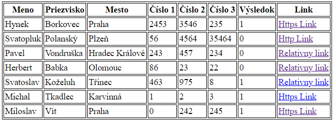

<div class="hidden">

> ## Rozcestník
> - [Späť na úvod](../../README.md)
> - Repo: [Štartér](/../../tree/main/css/selectors), [Riešenie](/../../tree/solution/css/selectors).
> - [Zobraziť zadanie](zadanie.md)
# Selektory

</div>

## Riešenie

Pri vypracovaní riešenia budeme postupovať podľa jednotlivých bodov zadania.

### Rámček okolo tabuľky (bod 1)

> Tabuľka bude mať čierny rámček medzi bunkami a okolo celej tabuľky.

Pomocou CSS môžeme definovať rámček pomocou nasledovných pravidiel:

```css
.data {
    border: 1px solid black;
}

.data tr > * {
    padding: 2px;
    border: 1px solid black;
}
```

Tabuľka v HTML kóde mala definovaný atribút `class="data"`, preto sme na naštýlovanie tabuľky použili selektor `.data`. Samotnej tabuľke sme nastavili `1px` vonkajší rámček. 

Bunky v tabuľke sú predstavované HTML elementmi dvoch typov: `th` (*table head*) a `td` (*table data*). Z tohto dôvodu použijeme pre ich výber CSS selektor `.data tr > *`. Ten vyberie každého (v selektore špecifikované pomocou `*`) priameho potomka (v selektore špecifikované pomocou `>`) elementu `tr` umiestneného v tabuľke. 

Tento selektor by sme ale mohli napísať rôznymi spôsobmi. Jeden variant by mohla byť aj `table.data > tr > *`, kde tento selector vyberie priameho potomka elementu `tr`, ktorý sa nachádza ako priamy potomok elementu `table` s atribútom `class="data"`. Tento prípad by ale nemusel byť úplne všeobecný, pretože riadky tabuľky môžu byť ešte rozdelené do sekcií:

```html
<table>
    <caption>Popisok tabuľky</caption>
    <thead>
    <tr>
        <th>Hlavička 1</th>
        <th>Hlavička 2</th>
    </tr>
    </thead>
    <tbody>
    <tr>
        <td>Telo 1</td>
        <td>Telo 2</td>
    </tr>
    </tbody>
    <tfoot>
    <tr>
        <td>Pätička 1</td>
        <td>Pätička 2</td>
    </tr>
    </tfoot>
</table>
```

Ďalšou možnosťou by bolo rozdeliť tento selektor na dva, oddelené čiarkou:

```css
.data > tr > th, 
.data > tr > td {
}
```

Po aplikovaní tohto štýlu tabuľka nebude ale vyzerať tak, ako sme požadovali.



Ako môžeme vidieť na obrázku vyššie, tabuľka má dvojité okraje, ktoré sú oddelené medzerou. Tieto medzery su definované pomocou CSS vlastnosti `border-spacing`. Mohli by sme nastaviť medzeru medzi bunkami na `0px` ale tým pádom by sme mali šírku rámčeka `2px`. Ďalšou CSS vlastnosťou, ktorú môžeme použiť je CSS vlastnosť `border-collapse`, pomocou ktorej vieme duplicitný rámček odstrániť. Pridáme preto do CSS pravidla pre tabuľku pridáme:

```css
.data {
    border-collapse: collapse;
}
```

### Formátovanie záhlavia tabuľky (bod 2)

> Záhlavie tabuľky bude mať zelenú farbu pozadia, text bude tučným písmom a bude centrovaný, prvé písmeno bude mať žltú farbu.

Začneme nastavením farieb a písma. Vzhľadom na to, že bunky hlavičky tvoria elementy `th` a bunky s dátami `td`, môžeme použiť nasledovný CSS selektor:

```css
.data th {
    background-color: #16a085;
    font-weight: bold;
    color: white;
    padding: 5px;
}
```

Centrovanie textu môžeme vykonať pomocou CSS vlastnosti `text-align: center;`, ale hlavička tabuľky (elementy `th`) má centrovanie nastavené automaticky, takže nemusíme pridávať žiadne dodatočné CSS vlastnosti.

Druhou časťou tejto úlohy je zmena farby prvého písmena v hlavičke tabuľky. Na toto naštýlovanie môžeme využiť selektor CSS [pseudoelemetu](https://developer.mozilla.org/en-US/docs/Learn/CSS/Building_blocks/Selectors/Pseudo-classes_and_pseudo-elements#what_is_a_pseudo-element) `::first-letter`, ktorý umožní aplikovanie štýlu na prvé písmeno.

```css
.data th::first-letter {
    color: #f1c40f;
}
```

### Zafarbenie nepárnych riadkov (bod 3)

> Riadky každý nepárny riadok tabuľky bude mať svetlosivé pozadie.

Pre vyriešenie tejto úlohy potrebujeme použiť selektor, ktorý vyberie len nepárne riadky. V CSS máme k dispozícii selektor CSS [pseudotriedy](https://developer.mozilla.org/en-US/docs/Learn/CSS/Building_blocks/Selectors/Pseudo-classes_and_pseudo-elements#what_is_a_pseudo-class) `:nth-child()`, pomocou ktorého môžeme vybrať n-tého potomka. 

Pokiaľ chceme vybrať napríklad presne tretí element zapíšeme pseudotriedu ako `:nth-child(3)`. Okrem presného čísla môžeme použiť aj predpis na výber každého *n-tého elementu*. Pokiaľ chceme vybrať každý druhý element zapíšeme to ako `:nth-child(2n)`. Môžeme ešte doplniť hodnotu posuvu začiatku vyberania prvkov. Ak teda chceme vybrať každý tretí prvok, ale chceme začať od piateho prvku, tak to zapíšeme ako `:nth-child(3n + 5)`. Výber párneho/nepárneho riadku je ale častým prípadom, preto v CSS je možné namiesto `2n+1` použiť výraz `odd` (z anglického *nepárne*, po prípade `even` pre *párne* riadky).

Výsledné pravidlo bude vyzerať nasledovne:

```css
.data tr:nth-child(odd) td {
    background-color: #ecf0f1;
}
```

Tento selektor vyberie každý nepárny element `td` z tabuľky s atribútom `class="data"`.

### Formátovanie stĺpca s priezviskom  (bod 4)

> Stĺpec s priezviskami bude napísaný veľkými písmenami.

Pre výber stĺpca s priezviskom môžeme opäť použiť selektor pseudotriedy `:nth-child()`, nakoľko vieme, že je vždy druhý.

```css
/* Priezvisko uppercase */
.data tr td:nth-child(2) {
    text-transform: uppercase;
}
```

### Formátovanie riadkov na základe polohy myši (bod 5)

> Pri umiestnení kurzora myši nad riadkom tabuľky

Pokiaľ chceme pomocou CSS meniť vlastnosti na základe pozície kurzora myši, použijeme pseudotriedu `:hover`, ktorá umožňuje definovať pravidlá pre elementy, nad ktorými sa nachádza kurzor myši.

#### Sivé pozadie celého riadku (bod 5.1)

Na vyriešenie tejto úlohy môžeme použiť pravidlo:

```css
.data tr:hover td {
    background-color: #bdc3c7;
}
```

Pomocou tohto pravidla nastavíme šedú farbu pozadia každej bunke v riadku, nad ktorým na nachádza kurzor myši (pseudotriedu `:hover` sme aplikovali na element `tr`).

#### Formátovanie stĺpca s menom (bod 5.2)

> Text v stĺpci `Meno` bude mať červenú farbu, ale iba pokiaľ nebude kurzor myši v bunke s menom. Ak bude  kurzor myši v bunke s menom, text bude mať štandardnú čiernu farbu.

Pre vyriešenie tohto bodu zadania potrebujeme napísať selektor, ktorý vyberie prvý stĺpec v tabuľke v prípade, že sa kurzor myši nachádza na riadku, ale nie na stĺpci s menom. Pokiaľ chceme v riadku vybrať prvý stĺpec, môžeme využiť pseudotriedu `:nth-child()` s parametrom `1`. Môžeme využiť ale aj skrátenú verziu `:first-child`, ktorá robí presne to isté ako `:nth-child(1)`.

Tento problém sa dá vyriešiť aj dvoma pravidlami. Prvé pravidlo nastaví farbu prvému stĺpcu v prípade, že bude kurzor myši nad daným riadkom. Druhé pravidlo prepíše farbu späť na čiernu, v prípade, že kurzor myši bude nad konkrétnou bunkou. Pravidlá sú nasledovné:

```css
.data tr:hover td:first-child {
    color: #e74c3c;
}
.data tr:hover td:first-child:hover {
    color: black;
}
```

Toto riešenie sa dá aj zjednodušiť. Okrem duplicity tohto riešenia je ešte aj problém s tým, že ak by sme zmenili farbu textu v tabuľke, tak ju musíme zmeniť aj na tomto mieste, čo prináša ďalšiu duplicitu.

Pre zjednodušenie môžeme využiť pseudotriedu `:not()` ktorá umožňuje negovať určitú časť selektoru. V našom prípade chceme vybrať prvú bunku v riadku, kde je kurzor myši, ak kurzor myši nie je práve na tejto bunke.

```css
.data tr:hover td:first-child:not(:hover) {
    color: #e74c3c;
}
```

Ako môžeme vidieť na tejto ukážke, jednotlivé selektory sa dajú ľubovoľne kombinovať.

#### Formátovanie číselných buniek tabuľky (bod 5.3)

> Bunky v stĺpcoch `Číslo 1` až `Číslo 3` budú mať nasledovné správanie:
> 1. Vždy budú zarovnané na stred.
> 2. Ak na nich nebude kurzor myši, tak budú mať modré pozadie.
> 3. Ak bude kurzor myši na niektorom z nich, tak daná bunka bude mať zelené pozadie a bunka (bunky) s číslami za ním budú mať pozadie žlté. Pozor, bunke s odkazom nemeníme farbu pozadia.

Pre riešenie tohto problému vieme využiť už známu pseudotriedu`:nth-child()`. Začneme zarovnaním čísel na stred.

Pre každý stĺpec môžeme použiť vlastný selektor `:nth-child(4)` až `:nth-child(6)`. Druhou možnosťou je spojiť tieto selektory do jedného. Vieme na to použiť nasledovný trik: selektor `:nth-child(n+4)` zvolí všetkých potomkov, okrem prvých 3, t.j. 4, 5, 6, ... Tým pádom vieme jednoducho vybrať všetky stĺpce okrem prvých troch. Druhým trikom, ktorý vieme použiť, je selektor `:nth-child(-n+6)`, ktorý naopak vyberie prvých 6 stĺpcov. Kombináciou týchto selektorov dostaneme pravidlo na zarovnenie textu na stred. Pri kombinácii sa vyberú len tie elementy, ktoré spĺňajú všetky podmienky, tj. spraví sa prienik, a nasledovný selektor zvolí stĺpce 4,5,6:

```css
.data tr td:nth-child(n+4):nth-child(-n+6) {
    text-align: center;
}
```

Pre ďalšie dve časti skombinujeme pravidlá, ktoré sme už definovali. Začneme modrým podfarbením čísel pri umiestnení kurzora myši nad daným riadkom:

```css
.data tr:hover td:nth-child(n+4):nth-child(-n+6) {
    background-color: #3498db;
}
```

V ďalšej časti úlohy bolo vyžadované nastavenie zelenej farby bunky, keď nad ňou bude kurzor myši. Tu môžeme využiť podobný prístup ako v bode 5.2.:

```css
.data tr td:hover:nth-child(n+4):nth-child(-n+6) {
    background-color: #2ecc71;
}
```

Posledným problémom v tejto časti je zobrazenie žltého pozadia pre bunky, ktoré sú za kurzorom myši označenou bunkou. Pre tento účel môžeme použiť selektor `~`, ktorý umožní vybrať všetky elementy, ktoré nasledujú za určitým špecifikovaným elementom. 

V našom prípade chceme nájsť všetky `td` elementy, ktoré sa nachádzajú za bunkou, nad ktorou je kurzor myši. Prvú časť môžeme použiť z predchádzajúceho prípadu a doplníme za ňu výber nasledovníkov pomocou `~`:

```css
.data tr td:hover:nth-child(n+4) ~ td:nth-child(-n+6) {
    background-color: #f1c40f;
}
```

V tomto prípade sme prvú časť zjednodušili a podmienku, že ide len o prvých 6 stĺpcov sme presunuli do časti za `~`.

### Skrytie stĺpca s výsledkom (bod 6)

> V HTML je definovaný aj stĺpec `Výsledok`, ten vo výslednej tabuľke nezobrazte.

Na túto úlohu môžeme využiť pseudotriedu `:nth-last-child`, pomocou ktorej zvolíme a skryjeme daný stĺpec. Správaním je veľmi podobné ako pseudotrieda `:nth-child`, ibaže počíta prvky od konca:

```css
.data tr > *:nth-last-child(2) {
    display: none;
}
```

V tomto príklade si môžete všimnúť, že opäť používame `*`. Je to kvôli tomu, že okrem dát uložených v elementoch `td`, potrebujeme skryť aj hlavičku uloženú v `th`.

### Formátovanie odkazov (bod 7) 

> Odkazy v stĺpci `Link` sa budú správať nasledovne:
> 1. Ak bude odkaz zabezpečený (protokol HTTPS), zobrazte ho zelenou farbou.
> 2. Ak bude odkaz nezabezpečený (protokol HTTP), zobrazte ho červenou farbou.
> 3. Ak to bude relatívny odkaz, zobrazte ho modrou farbou.
> 4. Ak to bude odkaz na súbor typu PDF (odkaz končí `.pdf`), dopíšte za text odkazu, že ide o PDF - `(PDF)`.

Pre riešenie tejto úlohy potrebujeme využiť [*atribútové selektory*](https://developer.mozilla.org/en-US/docs/Web/CSS/Attribute_selectors). Takýto selektor môže vyzerať nasledovne: `element[atribut="hodnota"]`. Začneme postupne, v prvej časti potrebujeme nájsť odkazy, ktoré smerujú na zabezpečené stránky, to znamená, že ich URL adresa začína `https:`. Použijeme preto nasledovný selektor:

```css
.data td a[href^="https:"] {
    color: green;
}
```

V tomto príklade sme použili atribút `href`, ktorého hodnota musí začínať (modifikátor `^=`) `https:`. Rovnaké pravidlo vieme definovať aj pre HTTP odkazy.

```css
.data td a[href^="http:"] {
    color: red;
}
```

Pre relatívne odkazy môžeme pre jednoduchosť použiť pravidlo, ktoré pomocou negácie `not()` vyberie všetky linky, ktoré nezačínajú `http`.

```css
.data td a:not([href^="http"]) {
    color: blue;
}
```

Poslednou časťou tejto úlohy bolo doplnenie skratky `(PDF)` k odkazom, ktoré smerujú na `.pdf` súbor. Toto môžeme dosiahnuť kombináciou podobného selektora ako v predchádzajúcom prípade a pseudoelementu `::after`. Na rozdiel od predchádzajúceho prípadu nepoužijeme `^=`, ktoré kontroluje začiatok hodnoty, ale použijeme `$=`, ktoré kontroluje koniec hodnoty atribútu.

```css
.data td a[href$=".pdf"]::after {
    content: "(PDF)";
}
```

Tento selektor pridá k odkazu, ktorý končí na `.pdf` pseudoelement, ktorý bude mať obsah `(PDF)`.

### Ukotvenie záhlavia tabuľky (bod 8)

> Zabezpečte, aby pri dlhej tabuľke zostávala hlavička vždy viditeľná.

Často sa stáva, že na stránke je veľa dát, a keď je tabuľka veľmi dlhá a je potrebné použiť posuvník, tak v strede tabuľky už nevieme identifikovať stĺpce. Pomocou CSS vieme ukotviť hlavičku tak, že použijeme CSS vlastnosť `position: sticky`:

```css
.data th {
    position: sticky;
    top: -1px;
}
```

Pre lepší vzhľad výsledku sme ešte nastavili aj pozíciu `top: -1px;`, aby hore neostával biely pásik. 
