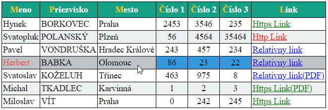
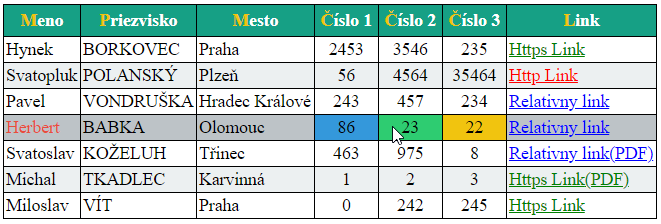

<div class="hidden">

> ## Rozcestník
> - [Späť na úvod](../../README.md)
> - Repo: [Štartér](/../../tree/main/css/selectors), [Riešenie](/../../tree/solution/css/selectors)
> - [Zobraziť riešenie](riesenie.md)
</div>

# CSS selektory
<div class="info"> 

**Hlavný jazyk príkladu**: CSS

**Ostatné použité jazyky**: HTML

**Obťažnosť**: 2/5

**Obsah príkladu**: Pokročilé CSS selektory, formátovanie tabuliek a textu, tvorba rámčekov tabuliek, farby pozadia a popredia, využitie obrázkov pozadia, rôzne pseudotriedy a pseudoelementy.  
</div>

## Zadanie

Naštýlujte pomocou CSS tabuľku podľa priloženého obrázku:



Riešenie musí spĺňať nasledovné podmienky:

1. Tabuľka bude mať čierny rámček medzi bunkami a okolo celej tabuľky.
2. Záhlavie tabuľky bude mať zelenú farbu pozadia, text bude tučným písmom a bude centrovaný, prvé písmeno bude mať žltú farbu.
3. Každý nepárny riadok tabuľky bude mať svetlosivé pozadie.
4. Stĺpec s priezviskami bude napísaný veľkými písmenami.
5. Pri umiestnení kurzora myši nad riadkom tabuľky sa stane:
    1. Celý riadok bude mať sivé pozadie.
    2. Text v stĺpci `Meno` bude mať červenú farbu, ale iba pokiaľ nebude kurzor myši v bunke s menom. Ak bude kurzor myši v bunke s menom, text bude mať štandardnú čiernu farbu.
    3. Bunky v stĺpcoch `Číslo 1` až `Číslo 3` budú mať nasledovné správanie:
        1. Vždy budú zarovnané na stred.
        2. Ak na nich nebude kurzor myši, tak budú mať modré pozadie.
        3. Ak bude kurzor myši na niektorom z nich, tak daná bunka bude mať zelené pozadie a bunka (bunky) s číslami za ním budú mať pozadie žlté. Pozor, bunke s odkazom nemeníme farbu pozadia.
           
    

6. V HTML je definovaný aj stĺpec `Výsledok`, ten vo výslednej tabuľke nezobrazujte.
7. Odkazy v stĺpci `Link` sa budú správať nasledovne:
    1. Zabezpečené odkazy (protokol HTTPS) zobrazte zelenou farbou.
    2. Nezabezpečené odkazy (protokol HTTP) zobrazte červenou farbou.
    3. Relatívne odkazy zobrazte modrou farbou.
    4. Pri odkazoch na súbor typu PDF (odkaz končí `.pdf`) dopíšte za text odkazu text `(PDF)`.
8. Zabezpečte, aby pri dlhej tabuľke zostávala hlavička vždy viditeľná.


### Štruktúra HTML kódu

Štruktúra základného HTML vyzerá nasledovne (všimnite si 7. stĺpec `Výsledok`, ktorý sa v&nbsp;zobrazenej tabuľke nachádzať nemá) :

```html
<table class="data">
    <tr>
        <th>Meno</th>
        <th>Priezvisko</th>
        <th>Mesto</th>
        <th>Číslo 1</th>
        <th>Číslo 2</th>
        <th>Číslo 3</th>
        <th>Výsledok</th>
        <th>Link</th>
    </tr>
    <tr>
        <td>Hynek</td>
        <td>Borkovec</td>
        <td>Praha</td>
        <td>2453</td>
        <td>3546</td>
        <td>235</td>
        <td>1</td>
        <td><a href="https://google.sk">Https Link</a></td>
    </tr>

    ...

</table>
```

Štruktúru dokumentu neupravujte. Pre vypracovanie použite výlučne CSS.