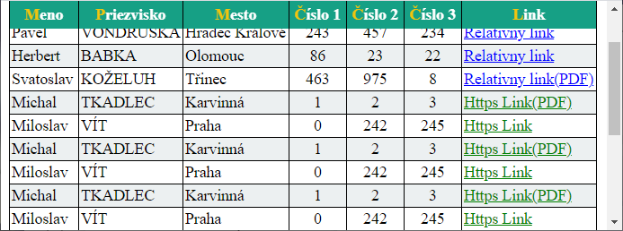

<div class="hidden">

> ## Rozcestník
> - [Späť na úvod](../../README.md)
> - Repo: [Štartér](/../../tree/main/css/selektory), [Riešenie](/../../tree/solution/css/selektory).
</div>

# Selektory (CSS)

## Zadanie
Naštýlujte pomocou CSS tabuľku podľa priloženého obrázku:


Podmienky:
1. Tabuľka bude mať 1x čierne orámovanie medzi bunkami a okolo.
2. Hlavička bude mať zelenú farbu pozadia, text bude boldom a bude centrovaný, prvé písmeno bude mať žltú farbu.
3. Riadky každý nepárny riadok tabuľky bude mať bledosivé pozadie.
4. Stĺpec s priezviskami bude napísaný veľkými písmenami.
5. Pri umiestnení myšky nad riadkom tabuľky:
   1. Celý riadok bude mať sivé pozadie
   2. Text v kolónke `Meno` bude mať červenú farbu, ale iba kým nebude myš v bunke s menom, ak bude myš v bunke s menom, text bude mať štandartnú čiernu farbu.
   3. Políčka v stĺpcoch Číslo 1 až Číslo 3 budú mať nasledovné správanie:
      1. Vždy budú zamerané na stred.
      2. Ak na nich nebude myš, tak budú mať modré pozadie.
      3. Ak bude myš na niektorom z nich, tak dané políčko bude mať zelené pozadie a políčko (políčka) s číslami za ním budú mať pozadie žlté. Pozor, políčku s odkazom nemeníme farbu pozadia.
6. V html je definovaný aj stĺpec `Výsledok`, ten vo výslednej tabuľke nezobrazte.
7. Odkazy v stĺpci `Link` sa budú správať nasledovne:
   1. Ak bude odkaz zabezpečený (protokol https) zobrazte ho zelenou farbou.
   2. Ak bude odkaz nezabezpečený (protokol http) zobrazte ho červenou farbou.
   3. Ak to bude relatívny odkaz, zobrazte ho modrou farbou.
   4. Ak to bude odkaz na súbor typu pdf (odkaz končí `.pdf`) dopíšte za text odkazu že sa jedná o PDF - `(PDF)`.
8. Zabezpečte, aby pri veľkej tabuľke ostávala hlavička vždy viditeľná.

#### Zobrazenie stĺpcov s číslami.


#### Hlavička tabuľky pri scroolovaní.



#### Štruktúra HTML kódu

Štruktúra základného HTML vyzerá nasledovne, všimnite si 7. stĺpec `Výsledok`, ktorý sa v zobrazenej tabuľke nachádzať nemá:
```html
<table class="data">
<tr>
  <th>Meno</th>
  <th>Priezvisko</th>
  <th>Mesto</th>
  <th>Číslo 1</th>
  <th>Číslo 2</th>
  <th>Číslo 3</th>
  <th>Výsledok</th>
  <th>Link</th>
</tr>
<tr>
  <td>Hynek</td>
  <td>Borkovec</td>
  <td>Praha</td>
  <td>2453</td>
  <td>3546</td>
  <td>235</td>
  <td>1</td>
  <td><a href="https://google.sk">Https Link</a></td>
</tr>

...

</table>
```

Štruktúru dokumentu neupravujte. Pre vypracovanie použite výlučne `CSS`.

### Cieľ príkladu
Cieľom príkladu je precvičenie si rôznych CSS selektorov pre výber elementov. Okrem iného si precvičíme niektoré základne CSS vlastnosti, ako napríklad tvorbu orámovania, formátovanie textu, farby pozadia.

<div class="hidden">

[Zobraziť riešenie](riesenie.md)
</div>