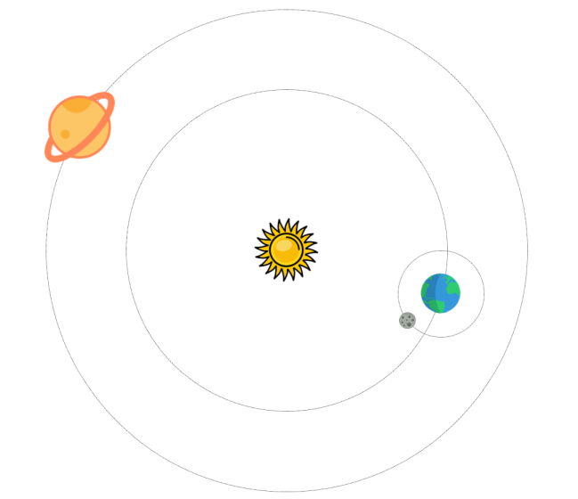

> ## Rozcestník
> - [Späť na úvod](../../README.md)
> - Repo: [Štartér](/../../tree/main/css/solar-system), [Riešenie](/../../tree/solution/css/solar-system).

# Slnečná sústava

 

**Hlavný jazyk príkladu**: CSS

**Ostatné použité jazyky**: HTML

**Obťažnosť**: 3/5

**Obsah príkladu**: Animácie a transformácie CSS elementov pomocou vlastnosti `transform`, určovanie pozície, práca s CSS premennými.

## Zadanie

Vytvorte jednoduchú animáciu slnečnej sústavy. Slnko bude v strede, okolo neho budú obiehať po kružnici aspoň dve planéty. Jednej planéte pridajte mesiac.

[Zobraziť riešenie](riesenie.md)

