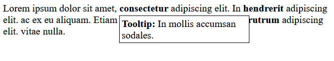

<div class="hidden">

> ## Rozcestník
> - [Späť na úvod](../../README.md)
> - Repo: [Štartér](/../../tree/main/css/tooltip), [Riešenie](/../../tree/solution/css/tooltip).
> - [Zobraziť riešenie](riesenie.md)
</div>

# Popisok (tooltip)
<div class="info"> 

**Hlavný jazyk príkladu**: CSS

**Ostatné použité jazyky**: HTML

**Obtiažnosť**: 1/5

**Obsah príkladu**: Základné CSS selektory, CSS vlastnosti `position` a `display`, CSS vrstvy.
</div>

## Zadanie

Pomocou CSS štýlov (bez použitia JavaScriptu) vytvorte možnosť pridávania popiskov (*tooltips*) do textu. Pokiaľ používateľ umiestni nad definovaný úsek textu kurzor myši, popisok sa objaví, ak kurzor myši text opustí, popisok zmizne.

Vstupný HTML súbor by mal vyzerať takto:

```html
<div>
    Lorem ipsum dolor sit amet,
    <span>consectetur</span>
    <span class="tooltip">Tooltip: In mollis accumsan sodales.</span>
    adipiscing elit. In
    <span>hendrerit</span>
    <span class="tooltip">Tooltip: Maecenas lobortis quam quis euismod maximus.</span>
    adipiscing elit. ac ex eu aliquam. Etiam lacus orci, egestas et tempor at,
    <span>rutrum</span>
    <span class="tooltip">Tooltip: Curabitur consequat ligula vel tortor consequat, quis mattis mi egestas.</span>
    adipiscing elit. vitae nulla.
</div>
```

V prípade potreby si môžete štruktúru dokumentu upraviť tak, aby sa vám lepšie pracovalo. Pri riešení úlohy použite výhradne CSS.

