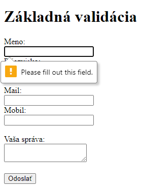
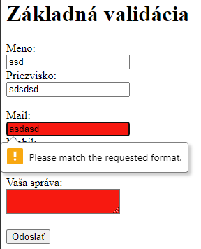

<div class="hidden">

> ## Rozcestník
> - [Späť na úvod](../../README.md)
> - Repo: [Štartér](/../../tree/main/js-a-css/form-check), [Riešenie](/../../tree/solution/js-a-css/form-check).
> - [Zobraziť zadanie](zadanie.md)

# Kontrola formulára (JS, CSS)
</div>

## Riešenie

Ako už vieme, formulár je definovaný pomocou elementu `<form>` do ktorého sa pridávajú elementy `<input>`, `<textarea>` a `<select>` umožňujúce zadať používateľovi vstup (pridať dáta do formulára pre odoslanie).

### Čisté HTML5 riešenie
Základným prvkom používateľského vstupu predstavuje element `<input>` ktorého atribút [`type`](https://www.w3schools.com/html/html_form_input_types.asp) bližšie definuje druh očakávaného vstupu a jeho vzhľad.

Ďalším jeho dôležitým atribútom je `pattern` v ktorom sa ako hodnota uvádza regulárny výraz. Ten sa následne používa pre validáciu vstupu, ktorý zadal používateľ.


Ako prvé budeme kontrolovať, či majú vstupy hodnotu v správnom tvare. V prípade __mailu__ môžeme použiť rovno typ zadefinovať vstupné pole ako typ `email`, teda:

```html
<input type="email" id="mail">
```

Ten ale nie je vždy dostačujúci, nakoľko nie každý prehliadač kontoluje zadanú hodnotu poriadne. Lepšie preto bude použiť atribút `pattern`, kde zadáme regulárny výraz, ktorý bude kontrolovať ci hodnota v tvare emailovej adresy.

To ako má výraz vyzerať vieme ľahko bud vytvoriť alebo nájsť na internete. Jeden z týchto výrazov je napr `/^\S+@\S+\.\S+$/` ([zdroj tu](https://stackoverflow.com/questions/201323/how-to-validate-an-email-address-using-a-regular-expression)). Element pre zadanie mailu teda zapíšeme:

```html
 <input type="text" id="mail" pattern="/^\S+@\S+\.\S+$/">
```

To isté bude platiť pre telefónne číslo zo slovenskou predvoľbou, pre ktorý bude platiť regulárny výraz `/^\+421([0-9]{9}|(( {0,1}[0-9]{3}){3}))$/`.  Element pre zadanie mobilného čísla bude zapísaný nasledovne:

```html
<input type="text" id="mobil" pattern="/^\+421([0-9]{9}|(( {0,1}[0-9]{3}){3}))$/">
```

Problém nastáva pri elemente `<textarea>`, ktorý nemá atribút `pattern`, tu budeme musieť logiku validácie vstupu vytvoriť pomocou javascriptu. To však budeme implementovať neskôr.

Teraz pridáme atribút `required` do `<input>` elementov pre zadávanie pre __meno__, __priezvisko__, __mail__ a __vaša správa__. Pridanie atribútu `required` bude vyzerať nejako takto:

```html
 <input type="text" id="mail" pattern="/^\S+@\S+\.\S+$/" required>
```

Teraz, keď odošleme formulár kliknutím na tlačidlo `Odoslať`, formulár sa neodošle a prehliadač zobrazí pri prvom prvku s nevyplnenou hodnotou alebo nevhodnou hodnotu chybovú hlášku: 



Bolo by však dobré aj vizuálne používateľovi zobraziť, ktoré prvky formulára obsahujú chybu. Tu môžeme použit to, že prehliadač automaticky do neplatných prvkov formulára pridá [pseudo-triedu `:invalid`](https://developer.mozilla.org/en-US/docs/Web/CSS/:invalid). Taktiež je táto `:invalid` pridaný aj do formulára, ktorý chybu obsahuje. Stačí nám preto pridať jednoduché _CSS_, ktoré zafarbí pozadie týchto prvkov na červeno:

```html
<style>
    :invalid:not(form) { 
        background-color: red;
    }
</style>
```

Selektor `:invalid:not(form)` vyberá všetky prvky, ktoré majú priradenú pseudo-triedu `:invalid` a nie sú elementy `<form>` pomocou `:not(form)`.  Formulár sa bude teraz zobrazovať nasledovne:




Týmto sme vyčerpali možnosti, ktoré máme pre validáciu použitím výlučne HTML5 bez javascriptu. Ešte by som pridal nasledovné poznámky:

- Momentálne neexistuje spôsob, ktorým vieme iba pomocou HTML zadefinovať obsah chybových hlášok.
- Nie je možné zablokovať tlačítko pre odoslanie.
- Nie je spôsob akým zobrazíme všetky chybové hlášky súčasne.


### Javascript riešenie

Aby sme mohli vytvoriť vlastnú logiku pre validáciu musíme najprv navrhnúť spôsob akým budeme overovať používateľom zadané hodnoty. Najjednoduchším spôsobom je vytvoriť funkciu do ktorej ako vstupný paramater príde aktuálne zadaná hodnota používateľom. Tá sa následne vyhodnotí podľa potreby. V prípade, že hodnota nevyhovuje vráti na výstup chybovú hlášku v _stringu_ ak sa žiadna chyba nenájde funkcia vráti `null`.

Pri všetkých elementoch `<input>` a `<textarea>` je pri zmene ich hodnoty spustená udalosť `oninput`. Objekt, ktorý nesie informáciu o udalosťi obsahuje referenciu na element na ktorom nastala v atribúte `target` a aktuálnu hodnotu elementu vieme získať z jeho atribútu `value`. Ak teda budú dáta udalosťi v premenej `event` získame aktuálnu hodnotu elementu ako `event.target.data`.

Logika získavania dát z _vstupných elementov_ `<form>` bude teda rovnaká. Z tohto dôvodu vytvoríme funkciu `validateInput()`, ktorej vstupné parametre budú:

1. `element` - Priamo `HTMLElement` na ktorý chceme zapojiť validačnú logiku
2. `validationFunction` - _validačná funkcia_, ktorá ma jeden _vstupný parameter_, a to aktuálnu hodnotu daného _vstupného elementu_ a jej návratová hodnota bude v prípade, že je vstup v poriadku `null` a ak nastane chyba tak vráti chybovú hlášku v podobe _textového reťazca_. 

Ako prvé pridáme _vstupnému elementu_ _callback_ funkciu, ktorej úlohou bude momentálne iba predať s dát udalosti `event` aktuálnu hodnotu _vstupného elementu_ do _validačnej funkcie_ v `validationFunction` a odchytiť návratovú hodnotu do lokálnej premennej `result`. Kód vyzerá nasledovne:

```javascript
function validateInput(element, validationFunction){
    element.oninput = function (event) {
        let result = validationFunction(event.target.value);
    }
}
```

Doplníme podmienku, ktorá bude zisťovať, čo validačná funkcia vrátila. Ak nastala chyba používateľ potrebuje vidieť spätnú väzbu. Vytvoríme nový element `<div>`, ktorý zaradíme priamo po daný _vstupný element_.

Validačná funkcia sa ale bude spúšťať pri každej zmene daného _vstupného elementu_. Je preto dôležíte skontorlovať:

- Ak došlo k nájdeniu chyby a _vstupný element_ nemá zobrazenú hlášku je potrebné ju vytvoriť a zobraziť.
- Ak má _vstupný element_ chybu a došlo k zmenenou hlášky, je potrebné iba upraviť jeho obsah, nie vytvoriť ďalší.
- Ak už je chyba používateľom opravená je potrebné chybovú hlášku zmazať.

Z týchto dôvodov si musíme nejako zabezpečiť ľahké a jednoznačné získanie referencie na element s hláškou. Najjednoduchšie riešene bude vygenerovať hláskam `id` v stanovenom formáte. 

Po prebehnutí _validačnej funckií_ zostavíme `id` pre element s textom chybovej hlášky ako `"er-"+element.id` a pokúsime sa zíkať z DOM element s týmto `id` pomocou `document.getElementById()`. Táto metóda vráti buď nájdený element alebo `null`. 

Doplnená logika:

```javascript
function validateInput(element, validationFunction){
    element.oninput = function (event) {
        let result = validationFunction(event.target.value);

        let erId = "er-"+element.id;
        let errorEle =  document.getElementById(erId);
    }
}
```

Teraz pridáme podmienku pre kontrolu hodnoty výstupu z validačnej funkcie uloženú v premennej `result` a budeme ju testovať na hodnotu `null`:

```javascript
function validateInput(element, validationFunction){
    element.oninput = function (event) {
        let result = validationFunction(event.target.value);

        let erId = "er-"+element.id;
        let errorEle =  document.getElementById(erId);

        if (result != null) {
            // nastala chyba
        } else {
            // ziadna chyba 
        }
    }
}
```

V prípade, že chyba nenastala, môžeme element `errorEle` vymazať z DOM `errorEle.remove()`. Musíme však skontrolovať, či vôbec existuje (táto situácia nastane ked používateľ zadá viac krát po sebe správny vstup).

Normálne by sme kontrolu, či je nejaká premenná `null` robili nasledovne:
```javascript
if (nieco == null) {
    nieco.ahoj();
}
```

Tento zápis ale vieme zjednodušit na `nieco?.ahoj()` pomocou [__optional chaining__ operátora](https://developer.mozilla.org/en-US/docs/Web/JavaScript/Reference/Operators/Optional_chaining). 

Zmazanie elementu s chybovou hláškou bude teda vyzerať následovne:

```javascript
function validateInput(element, validationFunction){
    element.oninput = function (event) {
        let result = validationFunction(event.target.value);

        let erId = "er-"+element.id;
        let errorEle =  document.getElementById(erId);

        if (result != null) {
            // nastala chyba
        } else {
            // ziadna chyba 
            errorEle?.remove();
        }
    }
}
```

V prípade ak nastala chyba vykonáme:
1. Skontolujeme či exituje element `errorEle` a ak nie, tak ho vytvoríme a pridáme mu CSS triedu `error`.
2. Doplníme do neho chybovú hlášku nachádzajúcu sa v `result` pomocou ` errorEle.innerText = result`.
3. Pridáme `errorEle` hneď za `element`. Pokiaľ element existuje, nič sa nestane, lebo už je pripojený za `element`.

Kód bude po doplnení vyzerať nasledovne:

```javascript
function validateInput(element, validationFunction){
    element.oninput = function (event) {
        let result = validationFunction(event.target.value);

        let erId = "er-"+element.id;
        let errorEle =  document.getElementById(erId);

        if (result != null) {
            // nastala chyba
            if (errorEle == null) {
                errorEle = document.createElement("div")
                errorEle.classList.add("error");
                errorEle.id = erId;
            }
            errorEle.innerText = result;
            element.after(errorEle);
        } else {
            // ziadna chyba 
            errorEle?.remove();
        }
    }
}
```
CSS pre chybovú hlašku bude nasledovné:
```css
.error {
    color: red;
    padding: 5px;
    background-color: #ffaaaa;
}
```

Terez musíme po načítaní HTML pridať validačne funkcie, ako prvú pridáme validáciu toho, či je __meno__ zadané. V nej budeme kontrolovať či je hodnota tohto vstupného elemntu `null` alebo väčšia ako 0 znakov. Tu je HTML a javascript:

```html
<label for="meno" >Meno:</label><br>
<input type="text" id="meno" ><br>
```

```javascript
  window.onload = () => {
    validateInput(document.getElementById("meno"), function (value = null) {
            if (value == null || value.length == 0) {
                return "Meno musí byť zadané";
            }
        });
    }
```

Validácia sa ale nebude chovať úplne podľa našeho zámeru, nakoľko ku kontrole dôjde až pri zmene hodnoty daného _vstupného elementu_. Fungovanie bude nasledovné:

 
 
Najjednoduchším spôsobom ako spustiť validáciu po jej pridanú je __umelo vyvolať `oninput`__ udalosť. To zrealizujeme pridaním `element.dispatchEvent(new Event('input'));` ihned po pridaní logiky zavedenej na túto udalosť. Kód funkcie `validateInput()` bude upravený na následovný:

```javascript
function validateInput(element, validationFunction){
    element.oninput = function (event) {
        let result = validationFunction(event.target.value);

        let erId = "er-"+element.id;
        let errorEle =  document.getElementById(erId);

        if (result != null) {
            // nastala chyba
            if (errorEle == null) {
                errorEle = document.createElement("div")
                errorEle.classList.add("error");
                errorEle.id = erId;
            }
            errorEle.innerText = result;
            element.after(errorEle);
        } else {
            // ziadna chyba 
            errorEle?.remove();
        }
    }
    element.dispatchEvent(new Event('input'));
}
```

Pre vytvorenie lepšie UX našej validácie doplníme vizuálne označenie, ktoré zmení farbu `<label>` a rámik `<input>` na červenú. Budeme musiet ale upraviť HTML. Každú skupinku teda `<label>` a `<input>` vložíme do `<div>` elementu. Budeme tak mať kontrolu nad tým, pre ktoré elementy chceme zobrazenie upraviť.

```html
<div>
    <label for="meno" >Meno:</label><br>
    <input type="text" id="meno" ><br>
</div>
```

Pokiaľ bude mat daný `<input>` chybu, pridáme do `<div>` elementu CSS triedu `has-error`. K tomu pridáme nasledovné CSS štýly:

```css
.has-error {
    color: red;
}
.has-error textarea,
.has-error input {
    border-color: red;
}
```

`<div>` je otec našeho `<input>` preto sa vieme k nemu dostať cez atribút `element.parentElement`. CSS triedy sa pridávajú HTMLElementu cez atribút `classList`, čo je kolekcia stringov. Pridanie realizujeme pomocou `classList.add()` a odobratie cez `lassList.remove()`. Triedu `has-error` pridáme ak `<input>` obsahuje chybu a zmažeme ak ju nemá. Upravený kód funkcie `validateInput()` bude vyzerať:

```javascript
function validateInput(element, validationFunction){
    element.oninput = function (event) {
        let result = validationFunction(event.target.value);

        let erId = "er-"+element.id;
        let errorEle =  document.getElementById(erId);

        if (result != null) {
            // nastala chyba
            if (errorEle == null) {
                errorEle = document.createElement("div")
                errorEle.classList.add("error");
                errorEle.id = erId;
            }
            errorEle.innerText = result;
            element.after(errorEle);
            element.parentElement.classList.add("has-error");
        } else {
            // ziadna chyba 
            errorEle?.remove();
            element.parentElement.classList.remove("has-error");
        }
    }
    element.dispatchEvent(new Event('input'));
}
```

Formulár sa bude správať následovne:


Aby sme mohli zablokovať tlačidlo pre odoslanie formulára pri nájdení chyby musíme najprv zistiť, či má formulár chybu. Najjednoduchším riešením bude vybrať všetky HTML elementy, ktoré majú CSS triedu `error` (vieme, že keď nastane chyba elementy s touto triedou sa pridajú do DOM).

Ako ďaľšie doplníme nad tlačidlo odoslať hlášku informujúcu používateľa o tom, že formulár obsahuje chyby a nie je možné ho odoslať. Je to veľmi dôležitý malý detail, ktorý výrazne spriemnuje a uľahčuje použivateľovi prácu s aplikáciou (zvlášt ak bz bol formulár tak veľky, že by bolo nutné scrollovať). Samozrejme, na začiatku je potrebné hlášku skryť a vizuálne ho oddeliť od okolia, preto pridáme nasledovné HTML:

```html
<div id="submit-info">
    Formulár obsahuje chyby a nie je možné ho odoslať.
</div>
<input type="submit" value="Odoslať" id="submit">
```

a CSS:

```css
#submit-info {
    display: none;
    padding: 5px;
    background-color: #ffaaaa;
    color: red;
}
```

Kontorlu stavu formulára budeme kontrolvať po každej ropoznanej zmene vstupu s validáciou, preto pre túto logiku a lepšiu prehľadnosť kódu vytvorime novú funkciu `checkFormState()`. Ta najprv skontroluje, či `<form>` obsahuje chybové hlášky a ak áno tak zablokuje tlačítko pre odoslanie a zobrazí hlášku. V opäčnom prípade tlačítko odblokuje a skryje hlášku.

Element sa dá zablokovať/odblokovať nastavením jeho atribútu `disabled` `bool` hodnotou. 

Funkcia `checkFormState()` bude obsahovať nasledovné:

```javascript
function checkFormState(){
    if (document.querySelectorAll(".error").length == 0) {
        document.getElementById("submit").disabled = false;
        document.getElementById("submit-info").style.display = "none";
    } else {
        document.getElementById("submit").disabled = true;
        document.getElementById("submit-info").style.display = "block";
    }
}
```
 
a nesmieme ju zabudnúť doplniť do funkcie `validateInput()` :

```javascript
function validateInput(element, validationFunction){
    element.oninput = function (event) {
        let result = validationFunction(event.target.value);

        let erId = "er-"+element.id;
        let errorEle =  document.getElementById(erId);

        if (result != null) {
            if (errorEle == null) {
                errorEle = document.createElement("div")
                errorEle.classList.add("error");
                errorEle.id = erId;
            }
            errorEle.innerText = result;
            element.after(errorEle);
            element.parentElement.classList.add("has-error");
        } else {
            errorEle?.remove()
            element.parentElement.classList.remove("has-error");
        }
        checkFormState(); // TU ------------- !!!
    }
    element.dispatchEvent(new Event('input'));
}
```

### Validačné pravidlá pre ostatné vstupy

Ako posledné doplníme validačné pravidlá pre všetky vstupy, ktoré náš formulár obsahuje.

#### Meno a priezvisko

Pri týchto vstupoch je žiadaná iba jedna podmienka a to, že tieto vstupy musia obsahovať hodnotu - nesmú byť prázdne. Preto stačí ich hodnotu skontrolať či nebsahuje `null` alebo jej dĺžka je väčšia ako `0`. Oba obsahujú rovnakú logiku a líšia sa iba v chybovej hláške:

```javascript
validateInput(document.getElementById("meno"), function (value = null){
    if (value == null || value.length == 0) {
        return "Meno musí byť zadané";
    }
});
validateInput(document.getElementById("priezvisko"), function (value = null){
    if (value == null || value.length == 0) {
        return "Priezvisko musí byť zadané";
    }
});
```


#### email

Email je opäť povinná položka, ktorá navyše musí obsahovať hodnotu v špecifickom formáte. Podobne ako pri použítí validáce pomocou HTML atribútu pattern použijeme regulárny výraz. Pri použítí v týchto výrazov priamov javascripte musíme tento jeho zadenie v textovom reťazci vložiť ako paramter pri vytvárani inštancie triedy  [`RegExp`](https://developer.mozilla.org/en-US/docs/Web/JavaScript/Guide/Regular_Expressions).

Následne testujeme, či sa hodnota má žiadaný tvar pomocou metódy [`RegExp.prototype.test()`](https://developer.mozilla.org/en-US/docs/Web/JavaScript/Reference/Global_Objects/RegExp/test). Tá vracia bool podľa toho, či vstup vyhovuje predpisu alebo nie. Kód validácie emailu bude teda nasledovný: 

```javascript
validateInput(document.getElementById("mail"), function (value = null){
    if (value == null || value.length == 0) {
        return "Mail musí byť zadaný";
    }
    let re = new RegExp('^\\S+@\\S+\\.\\S+$');
    if (!re.test(value)) {
        return "Zadaný email nemá platný formát."
    }
});
```

#### mobil

Mobil nie je povinna položka ale keď je zadaná, musí mať predpísaný tvar. V tomto prípade spúšťame kontorlu pomocou regulárne výrazu iba v tedy, keď vstupného elementu používateľ zadá nejakú hodnotu. Kód validácie je:

```javascript
validateInput(document.getElementById("mobil"), function (value = null){
    if (value != null && value.length > 0) {
        let re = new RegExp('^\\+421([0-9]{9}|(( {0,1}[0-9]{3}){3}))$');
        if (!re.test(value)) {
            return "Zadané telefónne číslo nie je v správnom tvare"
        }
    }
});
```

#### Správa

Správa je opäť povinná a je potrebné aby mala aspoň 6 znakov. Validačné chyby sa zobrazujú a aktualizujú ihneď počas ich zadávania, preto si môžeme dovoliť validáciu správy rozdeliť do dvoch podmienok nasledovne: 

```javascript
validateInput(document.getElementById("sprava"), function (value = null){
    if (value == null || value.length == 0) {
        return "Správa musí byť zadaná.";
    }
    if (value.length  < 6) {
        return "Správa musí byť dlšia.";
    }
});
```
Výsledok bude fungovať nasledovne:


