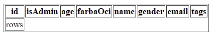
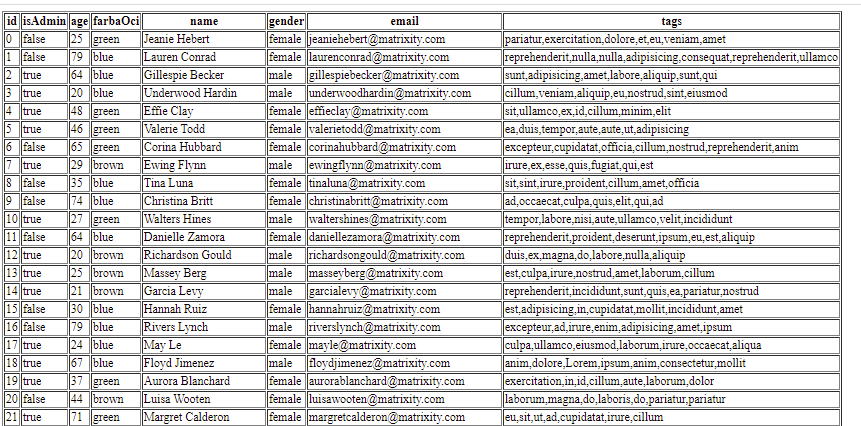

<div class="hidden">

> ## Rozcestník
> - [Späť na úvod](../../README.md)
> - Repo: [Štartér](/../../tree/main/js-a-css/jstable), [Riešenie](/../../tree/solution/js-a-css/jstable).
> - [Zobraziť zadanie](zadanie.md)

# JS Table (JS, CSS)

</div>

## Riešenie

Vzhľadom na zadanie riešenia bude najlepšie riešenie vytvoriť JS triedu `JsTable`, ktorej každá inštancia bude spravovať samostatne svoju kolekciu dát. Nutné vstupné parametre konštruktora tejto triedy budú:

1. Kolekcia dát s homogénnou štruktúrou
2. Kontajnerový element, kde sa ma tabuľka zobraziť

Návrh triedy bude vyzerať:

```javascript
class JsTable {
    constructor(dataCollection, HTMLElement) {
        this.dataCollection = dataCollection;
        this.HTMLElement = HTMLElement;
    }
}
```

Teraz implementujeme logiku, ktoré budú zhotovovať samotnú tabuľku. Do triedy `JsTable` pridáme nasledovné metódy:

1. `renderTable` - skompletizuje jednotlivé časti tabuľky
2. `renderHeader` - vytvorí hlavičku tabuľky
3. `renderRows` - vytvorí telo tabuľky

V `JS` existujú dva spôsoby akým je možné dynamicky vytvárať nové _HTML elementy_:

1. Pomocou stringu v ktorom sa priamo napíše HTML kód tak akoby sme ho písali do samotného HTML kódu stránky.
2. Pomocou metódy `document.createElement()`.

Rozdiel je samozrejme v efektívnosti. Prí spôsob je samozrejme menej efektívny nakoľko prehliadač musí string najskôr rozparsrovať a následne povytvárať jednotlivé elementy. Taktiež nedostaneme priamo referencie na jednotlivé vytvorené elementy a sme nútený ich dopytovať.

V druhom prípade toto parsovanie a získavanie referencií odpadá ale na druhú stranu nám vzniká "ukecanejší" kód, nakoľko musíme každú inštanciu elementu inicializovať (nastaviť im ručne požadované hodnoty parametrov).

Pri riešení našej úlohy však budeme používať oba. Pre telo tabuľky použijeme vytvaranie riadkov pomocou stringu a hlavičku pomocou priameho vytvárania elementov, nakoľko bude obsahovať logiku pre zoraďovanie.

Aby sme si otestovali dynamické vytváranie elementov doplníme triedu `JsTable` nasledovne:

```javascript
class JsTable {
    constructor(dataCollection, HTMLElement) {
        this.dataCollection = dataCollection;
        this.HTMLElement = HTMLElement;

        this.renderTable();
    }
    renderTable(){
        let header = this.renderHeader();
        let body = this.renderRows();
        let table = `<table border="1">${header}${body}</table>`;
        this.HTMLElement.innerHTML = table;
    }
    renderHeader(){
        return `<tr><td>header</td></tr>`
    }
    renderRows(){
        return `<tr><th>rows</th></tr>`
    }
}
```
Ako kolekciu dát použijeme pole definované v súbore `users-data.js`, ktoré sa uloží do globálnej premennej `usersData`.

Pri `<table>` je pridané nastavenie atribútu `border="1"` aby bol viditeľný okraj tabuľky. V HTML vytvoríme logiku, ktorá ked sa spustí, tak vytvorí novú inštanciu triedy `JsTable` a doplní správne parametre:

```html
<!DOCTYPE html>
<html lang="en">
<head>
    <meta charset="UTF-8">
    <title>Title</title>
    <script type="application/javascript" src="products-data.js"></script>
    <script type="application/javascript" src="users-data.js"></script>
    <script type="application/javascript" src="jstable.js"></script>
    <script>
        window.onload = function () {
            let table = new JsTable(usersData, document.getElementById("table01"));
        }
    </script>
</head>
<body>
    <div id="table01"></div>
</body>
</html>
```

Výsledok by sa mal zobraziť takto:


### Jednoduché zobrazenie

V hlavičke majú byť zobrazené názvy atribútov objektov v kolekcií. `JS` Umožňuje získať zoznam názvov atribútov ľubovoľnej inštancie zavolaním `Object.keys()` ([demonštrácia tu](https://developer.mozilla.org/en-US/docs/Web/JavaScript/Reference/Global_Objects/Object/keys)).  Nakoľko predpokladáme, že kolekcia dát obsahuje rovnaké objekty, pre získanie atribútov stačí vybrať prvý objekt:

```javascript
let firstItem = this.dataCollection[0]; 
let atributes = Object.keys(firstItem);    
```

Návratová hodnota `Object.keys()` je pole, ktoré obsahuje názvy atribútov v stringu. Tie potrebujeme dostať do poroby hlavičky tabuľky. Hľavička tabuľky je riadok `<tr>`, ktorý obsahuje jednotlivé hlavičky riadkov v elementoch `<th>`.
Pre iteráciu všetkých získaných názvov atribútov použijeme metódu pola [`Array.prototype.forEach()`](https://www.w3schools.com/jsref/jsref_foreach.asp).

Pre dynamické vytvorenie elementov hlavičky použijeme vytváranie elementov pomocou stringu. Pre definovanie stringov použijeme [template Literals](https://developer.mozilla.org/en-US/docs/Web/JavaScript/Reference/Template_literals) Metódu `JsTable.renderHeader()` upravíme následovne:

```javascript
renderHeader() { 
    let firstItem = this.dataCollection[0];
    let headerText = "";
    Object.keys(firstItem).forEach((attributeName,i) => {
        headerText += `<th>${attributeName}</th>`
    });
    return `<tr>${headerText}</tr>`
}
```
Pokiaľ teraz spustíme skript tabuľka sa zobrazí doplnená o názvy atribútov v hlavičke tabuľky. Výsledná tabuľka sa zobrazí nasledovne:



Pri generovaní obsahu v metóde `JsTable.renderRows()` iba rozšírime logiku, ktorú sme vložili do metódy `JsTable.renderHeader()`. Generovanie kódu pre jeden riadok je rovnaký ako pri hlavičke s tým rozdielom, že hodnota sa umiestni namiesto do elementu `<th>` do `<td>`.

Pre každú položku v kolekcií budeme vytvárať samostatný riadok.

Ako posledné potrebujeme získať hodnoty z každého objektu v kolekcií v takom poradí v akom sú popísané v hlavičke. V `JS` môžeme pristúpiť k hodnote atribútom objektu cez index. V nasledovnom kóde sú uvedené dve možnosti prístupu k hodnote atribútu:

```javascript
class Trieda {
    atrb = "hodnota";
}

let obj = new Trieda();

obj.atrb; // hodnota
obj["atrb"]; // hodnota
```

Postupnosť krokov môžeme zapísať nasledovne:
1. Inicializujeme si premennú `bodyText` do ktorej budeme priebežne pridávať kód jednotlivých riadkov.
2. do premennej `keys` priradíme pole s názvami atribútov objektov v kolekcií.
3. Následne budeme prechádzať kolekciu dát kde
    1. Inicializujeme premennú `rowText`
    2. Budeme prechádzať pole `keys`, kde pre každú položku:
        1. do premennej  `rowText` pridáme string s HTML pre element `<td>` s hodnotou daného atribútu
    3. do premennej `bodyText` pridáme hodnotu z `rowText`,ktorú obalíme tagom riadu `<tr>`.
4. vrátime obsah premennej `bodyText`

Výsledný kód metódy `JsTable.renderRows()` bude:

```javascript
renderRows() {
    let bodyText = "";
    let keys = Object.keys(this.dataCollection[0]);
    this.dataCollection.forEach( (item, i) => {
        let rowText = "";
        keys.forEach((attributeName,i) => {
            rowText += `<td>${item[attributeName]}</td>`
        });
        bodyText += `<tr>${rowText}</tr>`
    } )
    return bodyText;
}
```

Tabuľka teraz vypíše celú kolekciu nasledovne:



### Zoraďovania podla stĺpca

Zoraďovanie stĺpcov bude aktivované kliknutím na hlavičku. Prvým kliknutím sa riadky zoradia podla znakov hodnôt zostupne a pri opätovnom kliku vzostupne. Pre zjednodušenie budeme všetky hodnoty zoraďovať ako _string_.

Samotnú logiku budeme aplikovať budeme aplikovať priamo na HTML elementy, ktoré budeme vytvárať pomocou `document.createElement()` a nie formou vytvorenia pomocou _stringov_, to nam taktiež sprehľadní kód.

Z tohto dôvodu upravimé logiku metódy `JsTable.renderHeader()` tak, že v prvom rade vytvoríme element `<tr>` zápisom `document.createElement("tr")`, ktorý definuje riadok tabuľky a budeme do neho následne pridávať `<th>` podobne ako v logike predtým. Pre pridanie elementu do predka budeme používať metódu `appendChild()`, ktorá vloží element ako posledného potomka. Text, ktorý sa má zobraziť v hlavičke môžeme vložiť cez atribút `innerHTML` alebo `innerText`. Kód bude vyzerať nasledovne:

```javascript
renderHeader(){
    let headerRow = document.createElement("tr");
    let firstItem = this.dataCollection[0];
    Object.keys(firstItem).forEach((attributeName,i) => {
        let hr = document.createElement("th");
        hr.innerText = attributeName;
        headerRow.appendChild(hr);
    });
    return headerRow;
}
```

Teraz nám metóda `JsTable.renderHeader()` vracia namiesto stringu `HTMLElement`. Musíme preto upraviť spôsob akým sa tabuľka zostavuje v metóde `JsTable.renderTable()`. Odstránime vloženie premennej `header` do stringu v premennej `table`. Týmto sa nám tabuľka zobrazí bez hlavičky. Aby sme mohli do tabuľky vložiť jej hlavičku v `HTMLElemente` je potrebné získať jej referenciu. To je možné ale až po tom, čo je vytvorená. Referenciu je teda možné získať až po vykonaní priradenia `this.HTMLElement.innerHTML = table;`. Nakoľko sa tabuľka vloží ako potomok nášho obalovacieho elementu uloženom v `this.HTMLElement`, vieme ho prehľadávať pomocou jeho metódy `querySelector()`. Pre získanie referencie na nami vytvorenú tabuľku vieme získať zápisom `this.HTMLElement.querySelector("table")`.

Hlavičku tabuľky pridáme ako prvého potomka pomocou metódy `prepend()`. Následne ešte doplníme na začiatok zmazanie všetkého obsahu nášho obaľovacieho elementu, nakoľko po zoradení prvkov budeme tabuľku vykresľovať nanovo. Nejedná a efektívny spôsob prekresľovania, chceme však vypracovanie udržať jednoduché. Upravený kód metódy `JsTable.renderTable()` bude nasledovný:

```javascript
renderTable(){
    this.HTMLElement.innerHTML = "";
    let header = this.renderHeader();
    let body = this.renderRows();
    let table = `<table border="1">${body}</table>`;
    this.HTMLElement.innerHTML = table;
    this.HTMLElement.querySelector("table").prepend(header);
}
```
Tabuľka sa teraz zobrazí v tvare aby sme žiadnu úpravu nevykonali.

Teraz potrebujeme pridať akciu, ktorá po kliknutí na `<th>` zoradí a nanovo vykreslí tabuľku. Vytvorenému elementu `<th>` pridáme preto logiku na udalosť `onclick`, ktorá zavolá novú metódu `JsTable.sortCollection()`, ktorá bude mať jeden vstupný parameter, a to meno stĺpca na základe ktorého sa má zoradiť. Doplníme CSS pre zmenu kurzora, aby indikoval možnosť kurzora cez `cursor: pointer`. Výsledný kód metódy `JsTable.renderHeader()` bude nasledovný:

```javascript
renderHeader(){
    let headerRow = document.createElement("tr");
    let firstItem = this.dataCollection[0];
    Object.keys(firstItem).forEach((attributeName,i) => {
        let hr = document.createElement("th");
        hr.innerText = attributeName;
        hr.style.cursor = "pointer";
        hr.onclick = () => {
            this.sortCollection(attributeName);
        }
        headerRow.appendChild(hr);
    });
    return headerRow;
}
```

Zoraďovanie bude realizované zavolaním metódy `JsTable.sortCollection()`, kde jej vstupný parameter hovorí o tom, ktorý stĺpec sa použije na zoraďovanie. Zoradenie reálne zoradí priamo obsah kolekcie dát, ktorá je uložená v atribúte `JsTable.dataCollection`.

V `JS` vieme zoradiť pole pomocou [`Array.prototype.sort()`](https://developer.mozilla.org/en-US/docs/Web/JavaScript/Reference/Global_Objects/Array/sort), kde ako voliteľný parameter vložíme funkciu pre po rovnanie, ktorá musí vrátiť číselný výsledok porovnania.

Pre uľahčenie porovnávania stringov obsahuje `JS` [`String.prototype.localeCompare()`](https://developer.mozilla.org/en-US/docs/Web/JavaScript/Reference/Global_Objects/String/localeCompare), ktorá vracia presne výstup vhodný pre naše porovnanie.

Pre získanie požadovanej hodnoty atribútu opäť použijeme prístup k atribútu objektu cez index. A ako posledné zavoláme `JsTable.renderTable()` aby došlo k prekresleniu tabuľky a zobrazila sa ako zoradená.

Všimnite si však, že získané hodnoty z objektov v kolekcií sú konvertované do _stringu_ použitím konverznej globálnej funkcie [`String()`](https://www.w3schools.com/jsref/jsref_string.asp). Bez nej by toto zoraďovanie nefungovalo.

```javascript
sortCollection(filterBy){
    this.dataCollection.sort(function (a,b){
        return String(a[filterBy]).localeCompare(String(b[filterBy]));
    });
    this.renderTable();
}
```

Tabuľka sa nám ale momentálne zoradí iba jedným smerom. Doplníme preto do triedy `JsTable` atribút `lastSortedBy`, ktorý bude uchovávať informáciu o tom, podľa ktorého stĺpca bola tabuľka naposledy zoradená. Zoraďovanie by sa dalo popísať nasledovne:

1. Skontroluje či sa `lastSortedBy` rovná `null` alebo či je iné ako vstupným parameterom `filterBy`:
    1. Ak __áno__, tak zoraď stĺpce prvým spôsobom a do `lastSortedBy` vlož hodnotu `filterBy`
    2. Ak __nie__, tak zoraď stĺpce druhým spôsobom a do `lastSortedBy` vlož hodnotu `NULL`

Celá zmena sa týka iba metódy `JsTable.sortCollection()`, ktorá po popísanej úprave bude vyzerať nasledovne:

```javascript
sortCollection(filterBy){
    if (this.lastSortedBy == null && this.lastSortedBy != filterBy) {
        // prvý spôsob zoradenia
        this.dataCollection.sort(function (a,b){
            return String(a[filterBy]).localeCompare(String(b[filterBy]));
        });
        this.lastSortedBy = filterBy;
    } else {
        // druhý spôsob zoradenia
        this.dataCollection.sort(function (a,b){
            return String(b[filterBy]).localeCompare(String(a[filterBy]));
        });
        this.lastSortedBy = null;
    }
    this.renderTable();
}
```

A nesmieme doplniť predvolenú hodnotu do konštruktora:

```javascript
 constructor(dataCollection, HTMLElement) {
     this.dataCollection = dataCollection;
     this.HTMLElement = HTMLElement;
     this.lastSortedBy = null;
     this.renderTable();
}
```

Tabuľka sa bude teraz dať zoradiť oboma smermi.


### Filtrovanie tabuľky

Prvá úprava bude v zmenení toho akým spôsobom sa bude tabuľka prekresľovať. Dôvodom je pridanie elementu `<input>` pomocou ktorého bude môcť používateľ zadávať výraz pre filtrovanie hodnôt v tabuľke. Vyhľadávanie sa bude spúšťať automaticky hneď, ked sa zmení hodnota v `<input>`. Momentálne sa vymaže a nanovo vytvorí celá tabuľka, čo by spôsobilo aj znovu vytvorenie `<input>` a používateľ by tak nemohol zadať celý výraz.

V konštruktore `JsTable` preto upravíme kód tak, aby sa do `JsTable.HTMLElement` pridal nový element a až do neho budeme vykresľovať tabuľku ako predtým.

Aby sme mohli reagovať na zmenu hodnoty v `<input>` pridáme logiku pre udalosť [`oninput`](https://developer.mozilla.org/en-US/docs/Web/API/HTMLElement/input_event), ktorá je vyvolaná vždy keď používateľ zmení jeho hodnotu.

Pokiaľ táto udalosť nastane, tak dodatočné dáta budú dostupné vo vstupnom parametre `event`. Tieto dáta obsahujú aj referenciu na daný `<input>`, ktorý potrebujeme aby sme vedeli získať používateľom vyplnenú hodnotu. Tá je dostupná cez `event.data.value`;

Vstup následne vložíme do novej metódy `JsTable.filterCollection()`, ktorá bude mať za úlohu vytvoriť vyfiltrovanú kolekciu ktorá sa následne použije vo zvyšku logiky. Týmto nemusíme veľmi modifikovať už existujúci kód, zmeníme len kolekciu na zoradenie a vykreslenie. Upravený konštruktor bude:

```javascript
 constructor(dataCollection, HTMLElement) {

     this.dataCollection = dataCollection;
     this.filtedDataCollection = dataCollection;

     this.HTMLElement = HTMLElement;

     this.TableWrapperElement = document.createElement('div');
     this.HTMLElement.append(this.TableWrapperElement);

     let input = document.createElement("input");
     input.oninput = (event) => {
         this.filterCollection(event.data.value);
     }
     this.HTMLElement.prepend(input);

     this.lastSortedBy = null;
     this.renderTable();
}
```

Tým pádom musíme vymeniť zdrojovú kolekciu z `dataCollection` na `filtedDataCollection` v metódach `sortCollection()` a `renderRows()` nasledovne:

```javascript
renderRows(){
     let bodyText = "";
     let keys = Object.keys(this.dataCollection[0]);
     this.filtedDataCollection.forEach( (item, i) => {
         let rowText = "";
         keys.forEach((attributeName,i) => {
             rowText += `<td>${item[attributeName]}</td>`
         });
         bodyText += `<tr>${rowText}</tr>`
     } )
     return bodyText;
 }

sortCollection(filterBy){
   if (this.lastSortedBy == null && this.lastSortedBy != filterBy) {
      this.filtedDataCollection.sort(function (a,b){
         return String(a[filterBy]).localeCompare(String(b[filterBy]));
      });
      this.lastSortedBy = filterBy;
   } else {
      this.filtedDataCollection.sort(function (a,b){
         return String(b[filterBy]).localeCompare(String(a[filterBy]));
      });
      this.lastSortedBy = null;
   }
   this.renderTable();
}
```

V metóde `renderTable()` upravíme element z `HTMLElement` na `TableWrapperElement` nasledovne:

```javascript
 renderTable(){
     this.TableWrapperElement.innerHTML = "";
     let body = this.renderRows();
     let table = `<table border="1">${body}</table>`;
     this.TableWrapperElement.innerHTML = table;
     this.TableWrapperElement.querySelector("table").prepend(this.renderHeader());
 }
```

Teraz môžeme vytvoriť logiku pre samotné filtrovanie, doplníme novú metódu  `filterCollectio()` do našej triedy `JsTable`. Všeobecne platí, že pokiaľ vytvárame filtrovanie dát, je nutné pridať kontrolu na minimálny počet znakov potrebných pre jeho spustenie. V našom prípade budeme filtrovať ak bude vstup väčší ako jeden znak.

V `JS` môžeme pre filtrovanie pola použiť [`Array.prototype.filter()`](https://developer.mozilla.org/en-US/docs/Web/JavaScript/Reference/Global_Objects/Array/filter). Táto metóda pre každý prvok v poli vykoná filtračnú funkciu, ktorá vracia `bool`. Ak je výsledok `true` daný prvok zaradí do nového výstupného pola.

Pri samotnej kontole musíme prejsť hodnotu všetkých atribútov objektov v zdrojovej kolekcii `dataCollection`. String v stringu vieme v JS hľadať pomocou [`String.prototype.includes()`](https://developer.mozilla.org/en-US/docs/Web/JavaScript/Reference/Global_Objects/String/includes). Tu nepoužijeme [`Array.prototype.forEach()`](https://developer.mozilla.org/en-US/docs/Web/JavaScript/Reference/Global_Objects/Array/forEach), nakoľko chceme vrátiť hodnotu `true` pri prvej zhode a `forEach` používa pre iteráciu __funkciu__. Vymeníme ho preto za obyčajný `for`. Taktiež nesmieme zabudnúť na konverziu na _string_. Logika filtrácie bude vyzerať nasledovne:

```javascript
filterCollection(expression) {
     if (expression == null || expression.length < 2) {
         this.filtedDataCollection = this.dataCollection;
     } else {
         let keys =  Object.keys(this.dataCollection[0]);
         this.filtedDataCollection = this.dataCollection.filter((a) => {
             for (let i= 0;  i < keys.length; i++) {
                 if (String(a[keys[i]]).includes(expression)) {
                     return true;
                 }
             }
             return false;
         });
     }
     this.renderTable();
}
```

Výsledná logika bude fungovať nasledovne:

