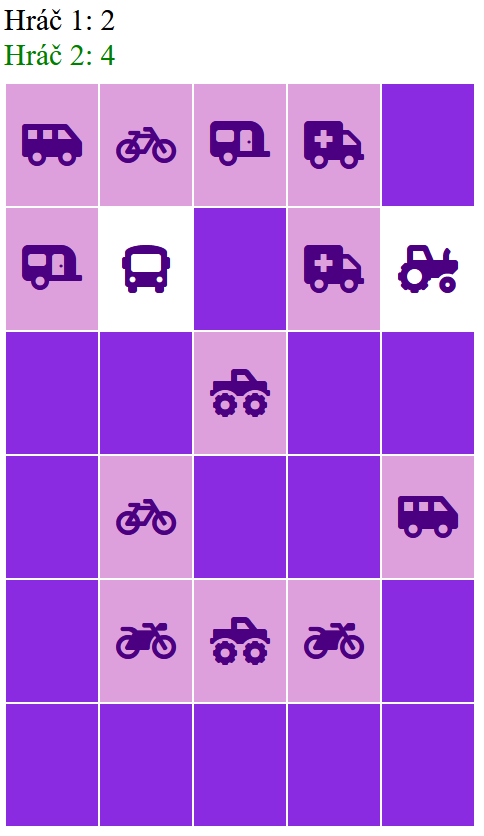

<div class="hidden">

> > ## Rozcestník
> - [Späť na úvod](../../README.md)
> - Repo: [Štartér](/../../tree/main/js-a-css/pexeso), [Riešenie](/../../tree/solution/js-a-css/pexeso).
> - [Zobraziť riešenie](riesenie.md)

# Pesexo (JS, CSS)

</div>

## Riešenie

Celé riešenie sa bude skladať z troch súborov: `index.html`, `styl.css`, `skript.js`. Logika aplikácie sa bude vykonávať v Javascripte, HTML a CSS využijeme len
na tvorbu základnej hracej plochy.

### HTML základ

Táto časť aplikácie je veľmi jednoduchá, tvorí ju súbor `index.html`, v ktorom importujeme ostatné časti aplikácie (CSS a JS) a vykresľujeme len začiatočné
nastavenie celej hry. Žiadne grafický dizajn ani logika aplikácie sa tu nenachádza, aby sme dodržali pravidlo, že každý typ súboru obsahuje len to, čo je jeho
úlohou.

`font-awesome` knižnicu pripojíme pomocou dole uvedeného riadku. Využijeme súbor dostupný na internete bez nutnosti sťahovania z webu. Ten spôsob pripojovania
využíva **Content delivery network** (CDN). Takéto riešenie má niekoľko výhod. Kód pre pripojenie `font-awesome` ikon vyzerá nasledovne:

```html

<link rel="stylesheet" href="https://cdnjs.cloudflare.com/ajax/libs/font-awesome/5.15.3/css/all.min.css">
```

Hracia ploch sa skladá pozostávajúce z dvoch popiskov a počítadla skóre pre každého hráča, tabuľky a tlačidla na rozdanie kariet. Tabuľka bude slúžiť ako herné
pole pexesa a budú v nej poukladané všetky karty. Kedže herné pole pexesa je matica, tabuľka nám dizajnovo poslúži ako základ. Samostné kary nebudeme pre
pracnosť vytvárať v HTML, ale vytvoríme ich v skripte. Úvodné prostredie hry bude vyzerať takto:

```html

<div id="skore">
    <div id="hrac1">
        Hráč 1:
        <span id="hrac1_uhadnute">0</span>
    </div>
    <div id="hrac2">
        Hráč 2:
        <span id="hrac2_uhadnute">0</span>
    </div>
</div>
<table id="plocha"></table>
<button id="start">Rozdaj karty</button>
```

Vzhľad hry pred začiatkom je na nasledovnom obrázku:


Dôležité je pridanie atribútov `id` k tým atribútom, ktoré budeme neskôr v skripte nastavovať, t.j. hodnoty skóre jednotlivých hráčov. Podobne označíme aj
tlačidlo, aby sme mu mohli neskôr priradiť činnosť, ktorá bude nasledovať po stlačení tlačidla.

### CSS štýl

Úlohou tejto časti aplikácie, nachádzajúcej sa v
súbore `styl.css je grafické nastavenie jednotlivých prvkov hry. Tu sa ukazuje výhoda, že sme si označili tabuľku atribútom `
id`, pretože môžeme použiť potomkový selektor, aby sme štýl aplikovali len na elementy, ktoré budú vo vnútri tabuľky. Ako je vidno z nastavenia štýlu, každá
karta pexesa bude mať 90 x 120 pixelov farba pozadia bude určovať aj farbu chrbta karty. Druhé nastavenie štýlu bude mať za úlohu skryť obrázok (ikonu), ktorá
sa na karte nachádza, aby ju nebolo vidieť.

```css
#plocha td {
    width: 90px;
    height: 120px;
    text-align: center;
    background-color: BlueViolet;
}

#plocha td i {
    opacity: 0;
    color: Indigo;
}
```

### Logika hry

#### Inicializácia nastavení hry

Celá logika hry sa bude odohrávať v Javascripte v súbore `skript.js`. V hre si budeme potrebovať pamätať niekoľko údajov, preto si inicializujeme premenné. Prvé
štyri premenné budú obsahovať skóre hráča. Premenné `karta1` a `karta2`
budú predstavovať aktuálne odokryté karty. Pole `karty` bude obsahovať zoznam ikon, ktoré použijeme na tvorbu kariet. Bude ich presne 15, pretože máme 30
kariet (15 dvojíc). Kvôli prehľadnosti si vytvoríme pole od indexu 1, aby sa nám s ním lepšie pracovalo. To je dôvod, prečo je prvá hodnota poľa prázdny
reťazec.

```javascript
let pocetObratenych = 0;
let pocetUhadnutychHrac1 = 0;
let pocetUhadnutychHrac2 = 0;
let karta1 = null;
let karta2 = null;
let obrazky = ['', 'tractor', 'truck-monster', 'truck', 'truck-pickup', 'truck-moving', 'ambulance', 'bicycle', 'bus',
    'car', 'caravan', 'motorcycle', 'shuttle-van', 'tram', 'plane', 'subway'];
```

#### Nastavenie obsluhy udalosti pre tlačidlo *Rozdaj karty*

Na začiatku si nastavíme ovládač udalosti kliknutia na tlačidlo *Rozdaj karty*, pričom toto priradenie sa musí uskutočniť až potom, ako sú všetky elementy
nahraté v prehliadači. Využijeme na to udalosť `onload`, ktorá nastane, keď je už kód stránky v prehliadači. Všimnite si, že priradenie udalosti sa vykoná
pripradením názvu funkcie, nie jej zavolaním (v kóde nie sú zátvorky za `initialize`). Celý kód bude vyzerať nasledovne:

```javascript
function initialize() {
    document.getElementById("start").onclick = inicializujHru;
}

window.onload = initialize;
```

#### Pomocná funkcia `gid()`

Keďže DOM metóda `document.getElementById()` má veľmi dlhý názov a bolo by otravné ju neustále celú písať, preto by bolo lepšie vytvoriť si pomocnú funkciu s
parametrom ID elementu, ktorý chceme získať. V skripte je budeme často používať.

```javascript
function gid(elementId) {
    return document.getElementById(elementId);
}
```

#### Inicializácia hry

Na začiatku novej hry je nutné zmeniť hráča na Hráča 1 (napr. hru skončí Hráč 2). Na to slúži jednoduchá funkcia `zmenHraca()`. V ďalšom kroku vynulujeme body
hráčom, aby sme mohli začať počítať body odznovu. Opäť si vytvoríme jednoduchú funkciu `zobrazBody()`, pretože ju rovnako budeme potrebovať na viacerých
miestach skriptu. V ďalšom kroku rozdáme karty. Toto budeme implementovať v ďalšom kroku.

```javascript
function inicializujHru() {
    zmenaHraca("hrac1");
    pocetUhadnutychHrac1 = 0;
    zobrazBody("hrac1", 0);
    pocetUhadnutychHrac2 = 0;
    zobrazBody("hrac2", 0);

    rozdajKarty();
}
```

Funkcia `zmenaHraca()` bude len meniť farbu textu. Ako parameter dostane informáciu, kto bude nový hráč. Ten hráč, ktorý bude zobrazený zelenou farbou, bude na
ťahu:

```javascript
function zmenaHraca(novyHrac) {
    if (novyHrac == "hrac1") {
        gid("hrac1").style.color = "green";
        gid("hrac2").style.color = "black";
    } else {
        gid("hrac1").style.color = "black";
        gid("hrac2").style.color = "green";
    }
}
```

Podobne jednoduchá je aj funkcia, ktorá zobrazí body. Parametrami tejto funkcie sú identifikácia hráča, nový počet ťahov a nový počet bodov. Jej úlohou je len
zobraziť nový stav hodnôt:

```javascript
function zobrazBody(hrac, uhadnute) {
    gid(hrac + "_uhadnute").innerHTML = uhadnute;
}
```

#### Rozdanie kariet

V HTML súbore sme si vytvorili prázdnu tabuľku a teraz si ju naplníme. Pomocou DOM vieme dynamicky vytvárať jednotlivé elementy a to využijeme aj teraz. Najskôr
vymažeme celú tabuľku `tabulka.innerHTML = "";` a potom v cykle poukladáme karty vedľa seba. Keďže kariet je 15, musíme ich uložiť 2x za sebou. Na to využijeme
ternárny operátor `?:`, a ak už sme rozdali 15 kariet, začneme znovu od prvej. Rozdávanie kariet je vlastne vytváranie buniek tabuľky postupne po riadkoch (
na to slúžia dva zanorené cykly) a pomocou DOM funkcie `document.createElement()` vytvoríme postupne riadky a stĺpce tabuľky. Obsahom bunky bude ikona
z `font-awesome`, ktorá na zobrazenie ikony využíva značku `<i class="fas fa-car"></i>`. Každej bunke nastavíme obsluhu `onclick`, kde budeme riešiť, čo sa má
stať, keď hráč klikne na nejakú kartu. Táto obsluha bude spoločná pre všetky karty. Výsledná funkcia bude vyzerať takto:

```javascript
function rozdajKarty() {
    let tabulka = gid("plocha");
    tabulka.innerHTML = "";
    let cislo = 1;
    for (let i = 1; i <= 6; i++) {
        let riadok = document.createElement("tr");
        tabulka.appendChild(riadok);
        for (let j = 1; j <= 5; j++) {
            let bunka = document.createElement("td");
            bunka.onclick = obrat;
            bunka.innerHTML = '<i class="fas fa-' + obrazky[(cislo > 15 ? cislo - 15 : cislo)] + ' fa-3x"></i>';
            riadok.appendChild(bunka);
            cislo++;
        }
    }
}
```

Ak chcete zobraziť karty na ploche, v CSS súbore je potrebné nastaviť `opacity: 1;`. Po tomto kroku budú karty usporiadané nasledovne:


Takáto hra by však bola veľmi jednoduchá, preto potrebujeme karty premiešať. Tento problém vyriešime presna tak, aby sme hrali pexeso s papierovými kartami.
Presne definovaný počet krát vymeníme pozície náhodne vybratých kariet. Tým dosiahneme, že kartu už nebudú usporiadané za sebou. Funkcia využije DOM
metódu `querySelectorAll()`, ktorá vráti pole všetkých elementov rodiča uvedeného ako parameter. Potom v cykle 100 vymeníme vnútorný obsah dvoch náhodne
vybraných elementov a tým kary zamiešame. Kód funkcie bude vyzerať nasledovne:

```javascript
function zamiesajKarty() {
    let karty = gid('plocha').querySelectorAll('td');
    for (i = 0; i < 100; i++) {
        z = Math.floor(Math.random() * 30);
        na = Math.floor(Math.random() * 30);
        [karty[z].innerHTML, karty[na].innerHTML] = [karty[na].innerHTML, karty[z].innerHTML]
    }
}
```

Zamiešané karty môžu napr. takto:


#### Hracia logika

Po zamiešaní kariet, získame hracie pole a znovu nastavíme `opacity: 0;`, aby karty skryli. Teraz musíme vytvoriť logiku hry. Akcia v hre sa vykonáva, keď
nejaký hráč klikne myšou na kartu. Pri rozdávaní kariet sme každej bunke definovali ako obluhu udalosti `onclick` funkciu `obrat()`. V tejto funkcii musíme
najsôr zistiť, či sa karta má vôbec otočiť, keď na ňu klikneme. Kartu neotočíme, ak:

- počet už otočených kariet je 2,
- hráč klik na kartu, ktorá je práve vybratá,
- hráč klikne na kartu, ktorá je už bola uhádnutá. Tieto operácie rieši táto časť funkcie:

```javascript
  if (pocetObratenych == 2) return;
if (this.style.backgroundColor == "plum" || this.style.backgroundColor == "white") return;
```

Ak nie je splnená žiadna z vyššie uvedených podmienok, zobrazíme kartu, na ktorú klikol a to tak, že jej nastavíme farbu pozadia na bielu a priehľadnosť na 1.
Ak je zatiaľ otočená len jedna karta, zvyšime si počet obrátených kariet, kartu 1 si zapamätáme a necháme hráča vybrať druhú kartu.

```javascript
  this.style.backgroundColor = "white";
this.firstChild.style.opacity = 1;
pocetObratenych++;

if (pocetObratenych == 1) {
    karta1 = this;
    return;
}
```

Ak máme dve karty, možeme začať vyhodnocovanie, či sú karty rovnaké. Karty sú rovnaké, keď obsahujú tú istú ikonu, preto nám stačí kontrolovať DOM
vlastnosť `innerHTML`.

```javascript
  if (karta1.innerHTML == karta2.innerHTML) {
```

Ak sa karty rovnajú, karty označíme ako uhádnuté zmenou pozadia, hráčovi pripočítame počet úhádnutých kariet a zobrazíme jeho skóre. Na záver vynulujeme počet
obrátených kariet:

```javascript
  karta1.style.backgroundColor = "plum";
karta2.style.backgroundColor = "plum";
if (gid("hrac1").style.color == 'green') {
    pocetUhadnutychHrac1++;
    zobrazBody("hrac1", pocetUhadnutychHrac1);
} else {
    pocetUhadnutychHrac2++;
    zobrazBody("hrac2", pocetUhadnutychHrac2);
}
pocetObratenych = 0;
```

Ak sa karty nerovnajú, na ťahu je druhý hráč a karty otočíme naspäť. Tu musíme využiť časovač, aby sme hráčovi neskryli karty hneď, ale až po jednej sekunde,
aby si stihol prezrieť aj druhú kartu. Nesmieme zabudnúť počet obrátených kariet nastaviť na 0.

```javascript
  if (gid("hrac1").style.color == 'green') {
    zmenaHraca("hrac2");
} else {
    zmenaHraca("hrac1");
}
setTimeout(function () {
    skryKarty(karta1, karta2);
    pocetObratenych = 0;
}, 1000);
```

Celá funkcia bude vyzerať nasledovne:

```javascript
function obrat() {
    if (pocetObratenych == 2) return;
    if (this.style.backgroundColor == "plum" || this.style.backgroundColor == "white") return;

    this.style.backgroundColor = "white";
    this.firstChild.style.opacity = 1;
    pocetObratenych++;

    if (pocetObratenych == 1) {
        karta1 = this;
        return;
    }
    if (pocetObratenych == 2) {
        karta2 = this;
        if (karta1.innerHTML == karta2.innerHTML) {
            karta1.style.backgroundColor = "plum";
            karta2.style.backgroundColor = "plum";
            if (gid("hrac1").style.color == 'green') {
                pocetUhadnutychHrac1++;
                zobrazBody("hrac1", pocetUhadnutychHrac1);
            } else {
                pocetUhadnutychHrac2++;
                zobrazBody("hrac2", pocetUhadnutychHrac2);
            }
            pocetObratenych = 0;
        } else {
            if (gid("hrac1").style.color == 'green') {
                zmenaHraca("hrac2");
            } else {
                zmenaHraca("hrac1");
            }
            setTimeout(function () {
                skryKarty(karta1, karta2);
                pocetObratenych = 0;
            }, 1000);
        }
    }
}
```

Poslednou funkciou je funkcia `skryKarty()`, ktorej úlohou je len skryť odkryté karty. Upozorniť by sme hlavne chceli na použitie vlastnosti `firstChild`, keďže
priehľadnosť musíme nastaviť prvku, ktorý bezprostredne nasleduje až po prvku, na ktorý sme klikli. Funkcia je jednoduchá a nastaví okrem priehľadnosti ja farbu
pozadia na farbu chrbta karty:

```javascript
function skryKarty(karta1, karta2) {
    karta1.style.backgroundColor = "blueviolet";
    karta1.firstChild.style.opacity = 0;
    karta2.style.backgroundColor = "blueviolet";
    karta2.firstChild.style.opacity = 0;
}
```

Priebeh rozohratej hry je možné vidieť na nasledovnom obrázku (hráč 2 práve odkryl 2 karty):



Tým sme implementovali celú logiku hry. Koniec hry sme neriešili, ale nebol by problém detegovať, či sú všetky karty odkryté, vyhlásiť víťaza a opýtať sa, či si
chcú hráči hru zahrať znovu. 
