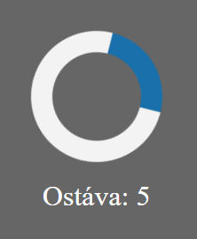

<div class="hidden">

> ## Rozcestník
> - [Späť na úvod](../../README.md)
> - Repo: [Štartér](/../../tree/main/js-a-css/univerzal-loader), [Riešenie](/../../tree/solution/js-a-css/univerzal-loader).
> - [Zobraziť zadanie](zadanie.md)

# Univerzálny loader (JS, AJAX, CSS)

</div>

## Riešenie

### Grafické zobrazenie loadera
Na začiatok si pripravíme grafickú reprezentáciu loadera. Začneme s HTML kódom:
```html
<div id="ajaxLoader">
  <div class="spinner"></div>
  <span id="requestCounter">Ostáva: 5</span>
</div>
```
Spravíme si jeden `div` element, do ktorého umiestnime spinner a placeholder na zobrazenie počtu trvajúcich requestov.

Chceli by sme docieliť aby sa element `ajaxLoader` zobrazil roztiahnutý na celú stránku, mal polopriehľadné pozadie. Pre spinner zobrazíme jednoduchú animáciu.

```css
#ajaxLoader {
  position: fixed;
  top: 0;
  left: 0;
  width: 100%;
  height: 100%;
  background-color: rgba(0, 0, 0, 0.6);
  display: flex;
  align-items: center;
  justify-content: center;
  flex-direction: column;
  color: white;
}
.spinner {
  border: 12px solid #f3f3f3;
  border-top: 12px solid #1970aa;
  border-radius: 50%;
  width: 50px;
  height: 50px;
  animation: spin 2s linear infinite;
  margin: 10px;

@keyframes spin {
  0% { transform: rotate(0deg); }
  100% { transform: rotate(360deg); }
}
```

Pozíciu `ajaxLoader` elementu sme nastavili na `fixed` a rozmery na 100% aby sme dosiahli že tento prvok bude za každých okolností zobrazený na celú stránku. Farbu pozadia sme nastavili pomocou `rgba` funkcie tak, že farba je čierna a priehľadnosť je nastavená na 60%. Pre usporiadanie prvkov v tomto elemente používame flexbox. `ajaxLoader` sme nastavili ako flexbox container ktorý obsahuje prvky zarovnané na stred, a jednotlivé prvky sa budú usporiadavať do stĺpca.

Pre zobrazanie spinnera sme využili jednoduchú CSS animáciu. Spinner je `div` element, ktorý sme pomocou `border-radius: 50%` zobrazili ako kruh. Tomuto kruhu sme nechali priehľadné pozadie a nastavili mu 12px orámovanie, čím sme dostali kružnicu. Hornému orámovaniu sme zmenili farbu na modrú a zvyšným rámikom sme nechali bielu farbu. Toto spôsobilo, že dostaneme kružnicu, kde 1/4 kruhu má inú farbu ako zvyšok.

Otáčanie kruhu sme dosiahli pomocou jednoduchej animácie, ktorá tento element rotuje o 360 stupňov. Jedna rotácia trvá 2s, je lineárna - kruh sa otáča konštantnou rýchlosťou, a opakuje sa do nekonečna.

Definícia `@keyframes` sa používa na deklaráciu animácie. Určuje stav elementu v určitých záchytných bodoch. V našom prípade máme definované že na začiatku animácie bude element otočený o 0 stupňov a na konci o 360 stupňov.

Výsledný spinner vyzerá nasledovne:



### Javascript
Keď sa pozrieme do zadania a kódu v štartéri, môžeme vidieť že AJAX dotazy sa posielajú pomocou funkcie `fetch`. Našou úlohou teda bude vytvoriť jednoduchý wrapper, ktorý nahradí funkciu `fetch`.

```javascript
async function loaderFetch(...args) {
  let loader = document.createElement("div");
  loader.id = "ajaxLoader";
  loader.innerHTML = `<div class="spinner"></div><span id="requestCounter"></span>`;
  document.getElementsByTagName("body")[0].append(loader);
  try {
    return await window.fetch(...args);
  }
  finally {
    //Remove ajax loader from DOM
    loader.remove();
  }
}
```

Funkcia `fetch` je asynchrónna preto aj náš wrapper musí byť asynchrónna funkcia. Funkcia `loaderFetch` má variabilné parametre (`...args`) pretože aj samotná funkcia `fetch` môže byť volaná s rôznymi parametrami. 

> Ak deklarujeme parameter funkcie ako `...parametre` tak v premennej `parametre` budeme mať pole jednotlivých parametrov, ktoré boli zadané pri volaní. Pri volaní originálnej funkcie `fetch` tieto parametre potom "rozbalíme" pomocou syntaxe `...args` vďaka čomu sa originálna funkcia zavolá s rovnakými parametrami ako tento náš wrapper.

Na začiatku funkcie dynamicky vytvoríme DOM element, ktorý reprezentuje html reprezentáciu loadera.
Pomocou `document.getElementsByTagName("body")[0].append(loader);` tento vytvorený element vložíme do DOM stránky.

V ďalšej časti máme blok `try / finally`, ktorý používame preto, lebo vždy po skončení asynchrónneho volania potrebujeme skryť loader bez ohľadu na to, či sa operácia podarí alebo nastane výnimka. Vo vetve `try` sa pokúsime zavolať funkciu  `fetch` a asynchrónne počkáme na skončenie requestu. Po skončení vrátime odpoveď. V prípade že sa request nepodarí a nastane výnimka, táto sa "re-throwne".
Vo vetne `finally` odstránime elemement z DOMu.

Ak chceme našu funkciu otestovať, nahradíme vo funkcii `nacitajZdroj` volanie `fetch` za `loaderFetch`.

Po spustení ukážkového príkladu si môžeme všimnúť, že po stlačení tlačidla nám cela obrazovka stmavne a zobrazí sa spinner. Problém je ale v tom, že ak náš kód načítava 2 zdroje súčastne tak sa tento ajax loading bar zobrazí 2x. Na ukážke môžeme pozorovať že po skončení prvého requestu sa obrazovka trochu zosvetlí a loader čaká na skončenie aj druhého requestu.

Túto situáciu môžeme vyriešiť pridaním počítadla bežiacich requestov a zobrazovať / skrývať budeme tento ajax loading bar len v prípade potreby. 

```javascript
let requestCounter = 0;
async function loaderFetch(...args) {
  //First ajax request
  if (++requestCounter == 1) {
      let loader = document.createElement("div");
      loader.id = "ajaxLoader";
      loader.innerHTML = `<div class="spinner"></div><span id="request_counter"></span>`;
      document.getElementsByTagName("body")[0].append(loader);
  }
  try {
      return await window.fetch(...args);
  }
  finally {
      //Remove ajax loader from DOM
      if (--requestCounter == 0) {
        document.getElementById("ajaxLoader").remove();
      }
  }
}
```
Zadeklarovali sme si premennú `requestCounter` ktorú pri každej požiadavke inkrementujeme, a po ukončení dekrementujeme. Ak začínamé prvý request, zobrazíme ajax loading bar. Pri skončení posledného requestu odstránime loading bar. Oproti pôvodnému riešeniu sme upravili aj vetvu `finally`. Tento raz sme na nájdenie elementu na odstránenie použili `document.getElementById("ajaxLoader")`. V tomto prípade totižto môže odstrániť element iný request ako ten, ktorý ho vytvoril.

Ďalšou požiadavkov v zadaní bolo vypisovanie počtu prebiehajúcich dotazov. Tento počet budeme vypisovať do predpripraveného elementu s id `requestCounter`.

Pre jednoduchosť si definujeme funkciu ``, ktorú zavoláme pred spustením requestu a po skončení requestu.

```javascript
function updateRequestCounter() {
  document.getElementById("requestCounter").innerText = "Ostáva " + requestCounter;
}
```

### Univerzálny loader pre všetky AJAX dotazy

Pokiaľ by sme chceli aby sa náš ajax loader používal pri všetkých requestoch, môžeme funkciu `load` z objektu `window` nahradiť tou našou. Na to, aby sme to spravili potrebujeme spraviť dve veci.

1. Musíme si zapamätať pôvodnú funkciu do lokálnej premennej
2. Nahradiť funkciu `load` tou našou.

Nesmieme zabuduť že potom musíme v našej funkcii používať pôvodnú funkciu, nie tu z objektu `window`.

```javascript
let originalFetch = window.fetch;
async function loaderFetch(...args) {
    ...
    return await originalFetch(...args);
    ...
}
window.fetch = loaderFetch;
```

Vďaka tomuto kódu už nemusíme používať funkciu `loaderFetch` ale môžeme používať priamo `fetch`. Ďalšou výhodou tohto prítupu je to, že aj iné knižnice, ktoré obsahujú ajaxové volania pomocou funkcie `fetch` budú používať náš univerzálny loader.

### Best practices

Aktuálny kód má jeden veľajší efekt. Do objektu `window` nám pridal nasledovné premenné / funkcie:
- `originalFetch`
- `loaderFetch`
- `requestCounter`
- `updateRequestCounter`

Ani jeden z týchto atribútov v princípe nemá čo robiť medzi globalnými premennými. Riešení tohto problému je niekoľko. môžeme napríklad použiť OOP.

V prípade takýchto menších skriptov môže byť OOP zbytočné prehnané riešenie. V javascripte sa zvykne používať koncept tzv. `Immediately Invoked Function Expression (IIFE)`. Táto IIFE slúži na vytvorenie lokálneho prostredia, v ktorom si môžeme deklarovať vlastné "globálne" premenné, ktoré ale nebudú dostupné mimo nášho kódu.

Hlavnou myšlienkou tohto prístupu je zaobalenie celého kódu do anonymnej funkcie, ktorá sa hneď vykoná.
```javascript
(function() {
  ... 
  Náš kód
  ...
})();
```

Všetky premenné definované v rámci funkcie budú k dispozícií len v danej funkcii. Tento príncíp môžete nájsť použitý vo veľkom množstve JS knižníc. Výsledný kód nášho loadera môže vyzerať nasledovne:
```javascript
(function() {
  let originalFetch = window.fetch;
  let requestCounter = 0;

  function updateRequestCounter() {
      document.getElementById("requestCounter").innerText = "Ostáva " + requestCounter;
  }

  async function loaderFetch(...args) {
      //First ajax request
      if (++requestCounter == 1) {
          let loader = document.createElement("div");
          loader.id = "ajaxLoader";
          loader.innerHTML = `
            <div class="spinner"></div>
            <span id="requestCounter"></span>`;
          document.getElementsByTagName("body")[0].append(loader);
      }
      updateRequestCounter();
      try {
          return await originalFetch(...args);
      }
      finally {
          //Remove ajax loader from DOM
          if (--requestCounter == 0) {
              document.getElementById("ajaxLoader").remove();
          }
          else {
              updateRequestCounter();
          }
      }
  };

  //Replace original fetch
  window.fetch = loaderFetch;
})();
```


