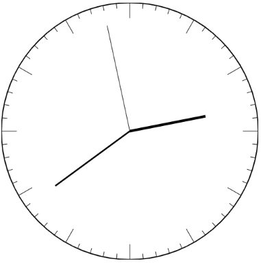
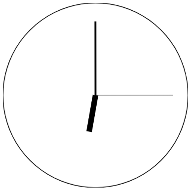
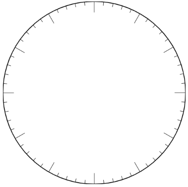

<div class="hidden">

> ## Rozcestník
> - [Späť na úvod](../../README.md)
> - Repo: [Štartér](/../../tree/main/js/analog-clock), [Riešenie](/../../tree/solution/js/analog-clock)
> - [Zobraziť zadanie](zadanie.md)

# Analógové hodinky (JS, CSS)
</div>

## Riešenie

Pri riešení tejto úlohy budeme používať iba JavaScript a vykresľovanie pomocou plátna [*canvas*](https://www.w3schools.com/html/html5_canvas.asp). Vykresľovať budeme do elementu `canvas` a nastavíme mu pevný rozmer `500px` x `500px`. HTML súbor bude vyzerať nasledovne:

```html
<!DOCTYPE html>
<html lang="en">
    <head>
        <meta charset="UTF-8">
        <title>JS Hodinky</title>
    </head>
    <body>
        <canvas width="500" height="500"></canvas>
    </body>
</html>
```

Kreslenie na plátne používa uhly v radiánoch. Pre nás bude lepšie, ak budeme môcť zadávať uhly v stupňoch.

Konverziu zo stupňov na radiány realizujeme prepočtom: *uhol v radianoch = uhol v stupňoch * PI / 180*.  Presnú hodnotu &pi; nájdeme v `Math.PI`. Môžeme si preto vytvoriť nasledovnú konverznú funkciu:

```javascript
function degToRad(degrees) {
    return degrees * (Math.PI/180);
}
```

Ako prvé nakreslíme kružnicu, ktorá bude roztiahnutá na celú plochu elementu `canvas` a bude zarovnaná na jeho stred. Na to potrebujeme získať referenciu na element `canvas` a získať jeho kontext (atribút `context`), pomocou ktorého vieme naň kresliť. To realizujeme nasledovným kódom:

```javascript
window.onload = function() {
    let canvas = document.querySelector("canvas");
    let ctx = canvas.getContext("2d");
}
```

Kreslenie kružnice realizujeme použitím metódy kontextu [`CanvasRenderingContext2D.arc()`](https://developer.mozilla.org/en-US/docs/Web/API/CanvasRenderingContext2D/arc). Táto metóda potrebuje dostať *polohu stredu*, *polomer*, *začiatočný* a *koncový uhol* kreslenia. Pred volaním metódy `arc()` je potrebné definovať začiatok postupnosti krokov pre vykreslenie pomocou metódy [`CanvasRenderingContext2D.beginPath()`](https://developer.mozilla.org/en-US/docs/Web/API/CanvasRenderingContext2D/beginPath). Následne môžeme definovať, čo chceme kresliť. 

Nakoľko sme len zostavili postupnosť krokov kreslenia, musíme pre ich vykreslenie zavolať metódu [`CanvasRenderingContext2D.stroke()`](https://developer.mozilla.org/en-US/docs/Web/API/CanvasRenderingContext2D/stroke). Až potom sa vykreslí požadovaná grafika do elementu `canvas`.

V našom prípade bude kód, ktorý nakreslí kružnicu, vyzerať nasledovne:

```javascript
window.onload = function() {
  let canvas = document.querySelector("canvas");
  let ctx = canvas.getContext("2d");

  ctx.beginPath();
  ctx.arc(250, 250, 250, 0, degToRad(360));
  ctx.stroke();
}
```
Výsledkom skriptu je takáto kružnica:



### Vykreslenie ručičiek hodiniek

Teraz si vytvoríme funkciu, ktorú budeme používať pre vykreslenie sekundovej, minútovej a hodinovej ručičky. Funkcia musí umožňovať definovať šírku a dĺžku ručičky od stredu a aj jej uhol.

Predpokladáme, že element `canvas` má pevne stanovený rozmer `500px` x `500px`. Stred a východzí bod pre kreslenie ručičiek bude bod `x=250, y=250`. Preto presunieme kresliace pero na túto pozíciu pomocou metódy [`CanvasRenderingContext2D.moveTo()`](CanvasRenderingContext2D.moveTo()). 

Následne potrebujeme nakresliť z východzieho bodu čiaru na bod, ktorý je definovaný uhlom a vzdialenosťou. Na toto použijeme goniometrické funkcie *sínus* a *kosínus* (metódy `Math.cos()` a `Math.sin()`)<span class="hidden">([viac info tu](https://stackoverflow.com/questions/23598547/draw-a-line-from-x-y-with-a-given-angle-and-length/23598710) alebo učebnica matematiky... )</span>. Čiaru do ďalšieho bodu nakreslíme pomocou metódy [`CanvasRenderingContext2D.lineTo()`](https://developer.mozilla.org/en-US/docs/Web/API/CanvasRenderingContext2D/lineTo).

Hrúbku čiary upravíme nastavením atribútu [`CanvasRenderingContext2D.lineWidth`](https://developer.mozilla.org/en-US/docs/Web/API/CanvasRenderingContext2D/lineWidth).

Zostáva ešte posunúť uhol vykreslenia ručičiek tak, aby hodnota `0` zodpovedala pozícii na 12. hodine. To realizujeme jednoducho prirátaním hodnoty `270` k pôvodne zadanému uhlu: 

```javascript
function drawWatchHand(ctx, uhol, length, width) {
    let x = 250;
    let y = 250;
    let angl = degToRad(uhol + 270);

    ctx.beginPath();
    ctx.lineWidth = width;
    ctx.moveTo(x, y);
    ctx.lineTo(x + length * Math.cos(angl), y + length * Math.sin(angl));
    ctx.stroke();
}
```

Kód vykreslenia ciferníka presunieme do funkcie `drawCircle()`:

```javascript
function drawCircle(ctx) {
    ctx.lineWidth = 2;
    ctx.beginPath();
    ctx.arc(250, 250, 250, 0, degToRad(360));
    ctx.stroke();
}
```

Teraz si skúsime vykresliť ciferník a nejaké ručičky, aby sme si otestovali správnosť vykreslenia:

```javascript
window.onload = function() {
  let canvas = document.querySelector("canvas");
  let ctx = canvas.getContext("2d");

  drawCircle(ctx);
  drawWatchHand(ctx, 0, 200, 5);
  drawWatchHand(ctx, 90, 210, 1);
  drawWatchHand(ctx, 190, 100, 15);
}
```

Výsledná kresba by mala vyzerať nasledovne:



### Vykreslenie hodinových a minútových značiek

Pre vykreslenie hodinových a minútových značiek vytvoríme novú funkciu `drawLineMarker()`. Tá bude obsahovať mierne upravený kód funkcie `drawWatchHand()`.

Rozdiel bude v tom, kde sa bude daná značka vykresľovať. Minútová alebo hodinová značka sú čiarky umiestnené okolo rámu ciferníka. Smerujú od okraju k jeho stredu. Hodinové značky sú dlhšie a je ich 12. Minútové značky sú kratšie a rozdeľujú priestor medzi dvoma hodinovými značkami na 5 častí.

Pri ich vykresľovaní teda začíname v strede ciferníka a následne sa pod daným uhlom posunieme. Následne kreslíme čiaru v danej dĺžke až po okraj ciferníka. 

Funkcia `drawLineMarker()` bude vyzerať nasledovne:

```javascript
function drawLineMarker(ctx, uhol, markerLength) {

    let angl = degToRad(uhol + 270);
    let r = 250 - markerLength;

    let sx = 250  + r * Math.cos(angl);
    let sy = 250 + r * Math.sin(angl);

    ctx.beginPath();
    ctx.lineWidth = 1;
    ctx.moveTo(sx,sy );
    ctx.lineTo(sx + markerLength * Math.cos(angl), sy + markerLength * Math.sin(angl));
    ctx.stroke();
}
```

Môžeme ju otestovať nasledovným kódom:

```javascript
window.onload = function(){
  let canvas = document.querySelector("canvas");
  let ctx = canvas.getContext("2d");

  drawCircle(ctx);
  drawLineMarker(ctx, 0, 10);
  drawLineMarker(ctx, 10, 20);
  drawLineMarker(ctx, 20, 30);
  drawLineMarker(ctx, 40, 40);
}
```
Vykreslí sa:


### Vykreslenie ciferníka

Samotné vykreslenie ciferníka budeme vytvárať v samostatnej funkcii `makeTick()`. Jej úlohou bude vykresliť aktuálny lokálny čas na ciferník.

Začneme najprv vykreslením hranice ciferníka zavolaním funkcie `drawCircle()`. Následne vytvoríme cyklus, ktorým budeme vykresľovať jednotlivé hodinové a minútové značky. Vieme, že kruh má 360 stupňov. Má *12 hodinových značiek* a každý hodinový úsek je rozdelený na *5 minútových úsekov*. Tým pádom kreslíme značku každých `360 / 12 / 5 = 6` stupňov.

Môžeme to pre prehľadnosť zapísať ako nasledujúci cyklus `for`: `for(let i = 0 ; i < (360/6) ; i++)`. 

Zostáva nám už iba oddeliť hodinové značky od minútových pomocou rôznej veľkosti. Hodinová značka má byť vykreslená každých `360 / 12 = 30` stupňov. To môžeme kontrolovať podmienkou, či je aktuálna hodnota premennej `i` deliteľná hodnotou `30` bezo zvyšku podmienkou `if (i*6 % 30 == 0)` a ak áno, nakreslíme značku dlhšiu.

Celý kód bude vyzerať nasledovne:

```javascript
function makeTick(ctx) {
   
    drawCircle(ctx);
    // cifernik
    for(let i = 0 ; i < (360 / 6) ; i++) {
        if (i * 6 % 30 == 0) {
            drawLineMarker(ctx, i*6, 30)
        } else {
            drawLineMarker(ctx, i*6, 10)
        }
    }
}
```
Ciferník bude vyzerať takto:

 

Teraz doplníme do zobrazenia ručičky a ich jednotlive uhly vyrátame týmto spôsobom:

- *Sekundová ručička* - sekúnd je v jednej minúte *60*, tým pádom nám stačí aktuálny počet sekúnd vynásobiť hodnotou `360 / 60 = 6`. Prepočet sekúnd na uhol sekundovej ručičky môžeme zapísať ako `sekundy * 6`. 
- *Minútová ručička* - hodina má *60* minút, čo tvorí uhol minúty *6* stupňov. Pozíciu musíme ešte doplniť o posun sekúnd tak, že 6 rozdelíme na 60 sekúnd t.j. `6/60 = 0.1`. Prepočet minút a sekúnd na uhol minútovej ručičky môžeme zapísať ako `minúty * 6 + sekundy * 0.1`. 
- *Hodinová ručička* - hodín je na ciferníku *12*, teda hodina má `360 / 12 = 30` stupňov. Pre upresnenie pozície ešte prirátame posun o minúty, t.j. minúty budeme násobiť `30 / 60 = 0.5`. Prepočet hodín a minút na pozíciu hodinovej ručičky 12 hodinových hodín môžeme zapísať ako `hodiny * 30 + minuty *0.5`. 

V JavaScripte získame aktuálny čas vytvorením novej inštancie triedy [`Date`](https://developer.mozilla.org/en-US/docs/Web/JavaScript/Reference/Global_Objects/Date). Tá obsahuje metódy `Date.getSeconds()`,`Date.getMinutes()` a `Date.getHours()`. 

`Date.getHours()` síce vracia hodnotu v 24 hodinovom formáte, ale keďže sa táto hodnota preratúva na uhol nebude to mať žiaden vplyv na výsledne zobrazenie. 

Funkcia `makeTick()` bude po doplnení: 

```javascript
function makeTick(ctx) {
   
    drawCircle(ctx);
    // cifernik
    for(let i = 0 ; i < (360 / 6); i++) {
        if (i * 6 % 30 == 0) {
            drawLineMarker(ctx, i * 6, 30)
        } else {
            drawLineMarker(ctx, i * 6, 10)
        }
    }
    let time = new Date();
    drawWatchHand(ctx, time.getSeconds() * 6, 210, 1);
    drawWatchHand(ctx, time.getMinutes() * 6 + time.getSeconds() * 0.1, 180, 3);
    drawWatchHand(ctx, time.getHours() * 30 + time.getMinutes() * 0.5, 150, 5);
}
```
Hodiny sa zobrazia nasledovne:


Ako posledné potrebujeme, aby sa funkcia `makeTick()` spúšťala každú sekundu a vytvoril sa tak dojem, že hodiny idú. To docielime periodickým spúšťaním pomocou metódy [`setInterval()`](https://www.w3schools.com/jsref/met_win_setinterval.asp) každú sekundu.

Náš `canvas` však musíme pred každým prekreslením vyčistiť (celý premaľovať na bielo) pomocou [`CanvasRenderingContext2D.clearRect()`](https://developer.mozilla.org/en-US/docs/Web/API/CanvasRenderingContext2D/clearRect), inak by na ňom zostávali pôvodné čiary z predchádzajúceho kreslenia.

Upravená funkcia `makeTick()`:

```javascript
function makeTick(ctx) {

    ctx.clearRect(0, 0, 500, 500);
    
    drawCircle(ctx);
    // cifernik
    for(let i = 0 ; i < (360 / 6); i++) {
        if (i * 6 % 30 == 0) {
            drawLineMarker(ctx, i * 6, 30)
        } else {
            drawLineMarker(ctx, i * 6, 10)
        }
    }
    let time = new Date();
    drawWatchHand(ctx, time.getSeconds() * 6, 210, 1);
    drawWatchHand(ctx, time.getMinutes() * 6 + time.getSeconds() * 0.1, 180, 3);
    drawWatchHand(ctx, time.getHours() * 30 + time.getMinutes() * 0.5, 150, 5);
}
```

A na záver pridáme spúšťanie v `window.onload`:

```javascript
window.onload = function(){
    let canvas = document.querySelector("canvas");
    let ctx = canvas.getContext("2d");
    
    setInterval( function() {
        makeTick(ctx);
    }, 1000);
    makeTick(ctx);
}
```

Výsledok:


