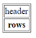
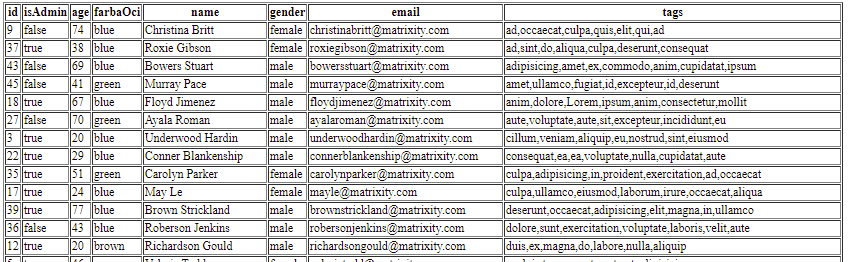

<div class="hidden">

> ## Rozcestník
> - [Späť na úvod](../../README.md)
> - Repo: [Štartér](/../../tree/main/js/data-table), [Riešenie](/../../tree/solution/js/data-table).
> - [Zobraziť zadanie](zadanie.md)

# JS Table (JS, CSS)

</div>

## Riešenie

Vzhľadom na zadanie bude najlepším riešením vytvorenie JavaScript triedy `JsTable`, ktorej každá inštancia bude spravovať samostatne svoju kolekciu dát. Vstupné parametre konštruktora tejto triedy budú:

1. kolekcia dát s homogénnou štruktúrou,
2. kontajnerový element, v ktorom sa má tabuľka zobraziť.

Návrh triedy bude vyzerať:

```javascript
class JsTable {
    constructor(dataCollection, HTMLElement) {
        this.dataCollection = dataCollection;
        this.HTMLElement = HTMLElement;
    }
}
```

Teraz navrhneme kód, ktorý budú vytvárať samotnú tabuľku. Do triedy `JsTable` pridáme nasledujúce metódy:

1. `renderTable()` - skompletizuje jednotlivé časti tabuľky.
2. `renderHeader()` - vytvorí hlavičku tabuľky.
3. `renderRows()` - vytvorí telo tabuľky.

V JavaScripte existujú dva spôsoby, akým je možné dynamicky vytvárať nové HTML elementy:

1. Pomocou reťazca, v ktorom sa priamo napíše HTML kód tak, ako by sme ho písali do samotného HTML kódu stránky.
2. Pomocou metódy `document.createElement()`.

Rozdiel je v efektívnosti. Prvý spôsob je menej efektívny, nakoľko prehliadač musí reťazec najskôr rozanalyzovať (angl. *parsing*) a následne vytvoriť jednotlivé elementy. Taktiež nedostaneme priamo referencie na jednotlivé vytvorené elementy a sme nútení ich dopytovať.

V druhom prípade táto analýza a získavanie referencií odpadá, ale na druhú stranu vzniká dlhší kód, nakoľko musíme každú inštanciu elementu inicializovať (programovo im nastaviť požadované hodnoty parametrov).

Pri riešení našej úlohy však budeme používať oba prístupy. Na tvorbu tela tabuľky použijeme vytváranie riadkov pomocou reťazca a na tvorbu hlavičky použijeme priame vytváranie elementov, nakoľko hlavička bude obsahovať kód pre zoraďovanie stĺpcov.

<div style="page-break-after: always;"></div>

Aby sme si otestovali dynamické vytváranie elementov, doplníme triedu `JsTable` nasledujúco:

```javascript
class JsTable {
    constructor(dataCollection, HTMLElement) {
        this.dataCollection = dataCollection;
        this.HTMLElement = HTMLElement;

        this.renderTable();
    }

    renderTable() {
        let header = this.renderHeader();
        let body = this.renderRows();
        let table = `<table border="1">${header}${body}</table>`;
        this.HTMLElement.innerHTML = table;
    }

    renderHeader() {
        return `<tr><th>header</th></tr>`
    }

    renderRows() {
        return `<tr><td>rows</td></tr>`
    }
}
```

Pri elemente `table` je nastavený atribút `border="1"`, aby bol viditeľný okraj tabuľky (aj keď lepšie riešenie by bolo tabuľku naštýlovať v CSS). 

Ako kolekciu dát použijeme pole definované v súbore `users-data.js`, ktoré uložíme do globálnej premennej `usersData`.

```js
var usersData = [
    {
        "id": 0,
        "isAdmin": false,
        "age": 25,
        "farbaOci": "green",
        "name": "Jeanie Hebert",
        "gender": "female",
        "email": "jeaniehebert@matrixity.com",
        "tags": [
            "pariatur",
            "exercitation",
            "dolore",
            "et",
            "eu",
            "veniam",
            "amet"
        ]
    },
   //...
];
```

V HTML kóde pridáme element, do ktorého budeme vkladať tabuľku. Následne pridáme obsluhu udalosti `onload`, ktorá keď sa spustí, tak vytvorí novú inštanciu triedy `JsTable` a doplní správne parametre:

```html
<!DOCTYPE html>
<html lang="en">
<head>
    <meta charset="UTF-8">
    <title>JS Tabuľka</title>
    <script src="users-data.js"></script>
    <script src="jstable.js"></script>
    <script>
        window.onload = function () {
            let table = new JsTable(usersData, document.getElementById("table01"));
        }
    </script>
</head>
<body>
<div id="table01"></div>
</body>
</html>
```
<div style="page-break-after: always;"></div>

Výsledok by sa mal zobraziť takto:



### Jednoduché zobrazenie dát

V hlavičke tabuľky je potrebné zobraziť názvy atribútov objektov v kolekcii. JavaScript umožňuje získať zoznam názvov atribútov ľubovoľnej inštancie volaním metódy `Object.keys()`<span class="hidden">([demonštrácia tu](https://developer.mozilla.org/en-US/docs/Web/JavaScript/Reference/Global_Objects/Object/keys ))</span>. Nakoľko predpokladáme, že kolekcia dát obsahuje rovnaké objekty, pre získanie atribútov stačí vybrať prvý objekt:

```javascript
let firstItem = this.dataCollection[0];
let atributes = Object.keys(firstItem);    
```

Návratovou hodnotou `Object.keys()` je pole, ktoré obsahuje názvy atribútov v reťazci. Tie potrebujeme dostať do hlavičky tabuľky. Hlavička je riadok tvorený elementom `tr`, ktorý obsahuje jednotlivé záhlavia riadkov v elementoch `th`. Pre iteráciu všetkých získaných názvov atribútov použijeme metódu poľa [`Array.prototype.forEach()`](https://www.w3schools.com/jsref/jsref_foreach.asp).

Na dynamickú tvorbu elementov hlavičky použijeme vytváranie elementov pomocou reťazca. Na definovanie reťazcov použijeme tzv. [*template Literals*](https://developer.mozilla.org/en-US/docs/Web/JavaScript/Reference/Template_literals). Metódu `JsTable.renderHeader()` upravíme takto:

<div class="end">

```javascript
renderHeader()
{
    let firstItem = this.dataCollection[0];
    let headerText = "";
    Object.keys(firstItem).forEach((attributeName, i) => {
        headerText += `<th>${attributeName}</th>`
    });
    return `<tr>${headerText}</tr>`
}
```
</div>

Pokiaľ teraz spustíme skript, tabuľka bude doplnená o názvy atribútov v hlavičke tabuľky. Výsledná tabuľka sa zobrazí nasledujúco:


Pri generovaní obsahu v metóde `JsTable.renderRows()` iba rozšírime kód, ktorý sme vložili do metódy `JsTable.renderHeader()`. Generovanie kódu pre riadok je rovnaké ako pri hlavičke s tým rozdielom, že hodnota sa umiestni namiesto do elementu `th` do `td`.

Pre každú položku v kolekcii budeme vytvárať samostatný riadok.

Na záver potrebujeme získať hodnoty z každého objektu v kolekcii v poradí, v akom sú obrazené v hlavičke. V JavaScripte môžeme pristúpiť k hodnote atribútov objektu cez index. V nasledujúcom kóde sú uvedené dve možnosti prístupu k hodnote atribútu:

```javascript
class Trieda {
    atrb = "hodnota";
}

let obj = new Trieda();

obj.atrb; // hodnota
obj["atrb"]; // hodnota
```

Postupnosť generovania tela tabuľky môžeme zapísať takto:

1. Inicializujeme premennú `bodyText`, do ktorej budeme priebežne pridávať kód jednotlivých riadkov.
2. Do premennej `keys` priradíme pole s názvami atribútov objektov v kolekcii.
3. Následne budeme prechádzať kolekciu dát:
    1. Inicializujeme premennú `rowText`.
    2. Prechádzame pole `keys` a pre každú položku do premennej `rowText` pridáme reťazec s HTML kódom pre element `td` s hodnotou daného atribútu.
    3. Do premennej `bodyText` pridáme hodnotu z `rowText`, ktorú obalíme elementom `tr`.
4. Vrátime obsah premennej `bodyText`.

Výsledný kód metódy `JsTable.renderRows()` bude:

```javascript
renderRows()
{
    let bodyText = "";
    let keys = Object.keys(this.dataCollection[0]);
    this.dataCollection.forEach((item, i) => {
        let rowText = "";
        keys.forEach((attributeName, i) => {
            rowText += `<td>${item[attributeName]}</td>`
        });
        bodyText += `<tr>${rowText}</tr>`
    })
    return bodyText;
}
```

Tabuľka teraz vypíše celú kolekciu:


### Zoraďovania podla stĺpca

Zoraďovanie stĺpcov bude aktivované kliknutím na hlavičku tabuľky. Prvým kliknutím sa záznamy zoradia zostupne a pri opätovnom kliknutí vzostupne. Pre zjednodušenie budeme všetky hodnoty zoraďovať alfabeticky. Pracovať budeme priamo s HTML elementmi, ktoré budeme vytvárať pomocou `document.createElement()`.

Z tohto dôvodu upravíme metódu `JsTable.renderHeader()` tak, že vytvoríme element `tr` pomocou `document.createElement("tr")`, ktorý definuje riadok tabuľky a budeme do neho následne pridávať `th` podobne ako predtým. Pre pridanie elementu do predka budeme používať metódu `appendChild()`, ktorá vloží element ako posledného potomka. Text, ktorý sa má zobraziť v hlavičke, môžeme vložiť cez atribút `innerHTML` alebo `innerText`. Kód bude vyzerať nasledujúco:

```javascript
renderHeader()
{
    let headerRow = document.createElement("tr");
    let firstItem = this.dataCollection[0];
    Object.keys(firstItem).forEach((attributeName, i) => {
        let hr = document.createElement("th");
        hr.innerText = attributeName;
        headerRow.appendChild(hr);
    });
    return headerRow;
}
```

Teraz nám metóda `JsTable.renderHeader()` vracia namiesto reťazca `HTMLElement`. Musíme preto upraviť spôsob, akým sa tabuľka zostavuje v metóde `JsTable.renderTable()`. Odstránime vloženie premennej `header` do reťazca v premennej `table`. Týmto sa nám tabuľka zobrazí bez hlavičky. Aby sme mohli do tabuľky vložiť jej hlavičku v `HTMLElemente`, je potrebné získať jej referenciu. To je možné ale až po tom, čo je vytvorená. Referenciu je teda možné získať až po vykonaní priradenia `this.HTMLElement.innerHTML = table;`. Nakoľko sa tabuľka vloží ako potomok nášho obaľovacieho elementu uloženého v `this.HTMLElement`, vieme ho prehľadávať pomocou jeho metódy `querySelector()`. Referenciu na nami vytvorenú tabuľku vieme získať pomocou `this.HTMLElement.querySelector("table")`.

Hlavičku tabuľky pridáme ako prvého potomka pomocou metódy `prepend()`. Následne ešte doplníme na začiatok zmazanie všetkého obsahu nášho obaľovacieho elementu, nakoľko po zoradení prvkov budeme tabuľku vykresľovať nanovo. Nie je to efektívny spôsob prekresľovania, chceme však riešenie udržať jednoduché. Upravený kód metódy `JsTable.renderTable()` bude nasledujúci:

```javascript
renderTable()
{
    this.HTMLElement.innerHTML = "";
    let header = this.renderHeader();
    let body = this.renderRows();
    let table = `<table border="1">${body}</table>`;
    this.HTMLElement.innerHTML = table;
    this.HTMLElement.querySelector("table").prepend(header);
}
```

Ďalej potrebujeme pridať akciu, ktorá po kliknutí na element `th` zoradí a nanovo vykreslí tabuľku. Vytvorenému elementu `th` pridáme preto obsluhu udalosti `onclick`, ktorá zavolá novú metódu `JsTable.sortCollection()`. Tá bude mať jeden vstupný parameter, a to meno stĺpca, na základe ktorého sa má zoraďovať. Doplníme CSS pre zmenu kurzora myši, aby indikoval možnosť zoraďovania pomocou `cursor: pointer`. Výsledný kód metódy `JsTable.renderHeader()` bude:

```javascript
renderHeader()
{
    let headerRow = document.createElement("tr");
    let firstItem = this.dataCollection[0];
    Object.keys(firstItem).forEach((attributeName, i) => {
        let hr = document.createElement("th");
        hr.innerText = attributeName;
        hr.style.cursor = "pointer";
        hr.onclick = () => {
            this.sortCollection(attributeName);
        }
        headerRow.appendChild(hr);
    });
    return headerRow;
}
```

Zoraďovanie bude realizované zavolaním metódy `JsTable.sortCollection()`, kde jej vstupný parameter nesie informáciu o tom, ktorý stĺpec sa použije na zoraďovanie. Zoraďovať sa bude obsah kolekcie dát, ktorá je uložená v atribúte `JsTable.dataCollection`.

V JavaScripte vieme zoradiť pole pomocou metódy [`Array.prototype.sort()`](https://developer.mozilla.org/en-US/docs/Web/JavaScript/Reference/Global_Objects/Array/sort), kde ako voliteľný parameter vložíme funkciu pre porovnanie, ktorá vracia číselný výsledok porovnania.

Na uľahčenie porovnávania reťazcov JavaScript obsahuje metódu [`String.prototype.localeCompare()`](https://developer.mozilla.org/en-US/docs/Web/JavaScript/Reference/Global_Objects/String/localeCompare), ktorá vracia presne výstup vhodný pre naše účely.

Pre získanie požadovanej hodnoty atribútu opäť použijeme prístup k atribútu objektu cez index. A ako posledné zavoláme `JsTable.renderTable()`, aby došlo k prekresleniu tabuľky a zobrazila sa zoradená.

Všimnite si však, že získané hodnoty z objektov v kolekcii sú konvertované do reťazca použitím konverznej globálnej funkcie [`String()`](https://www.w3schools.com/jsref/jsref_string.asp). Bez nej by toto zoraďovanie nefungovalo.

```javascript
sortCollection(filterBy)
{
    this.dataCollection.sort(function (a, b) {
        return String(a[filterBy]).localeCompare(String(b[filterBy]));
    });
    this.renderTable();
}
```

Tabuľka sa momentálne zoradí iba jedným smerom. Doplníme preto do triedy `JsTable` atribút `lastSortedBy`, ktorý bude uchovávať informáciu o tom, podľa ktorého stĺpca bola tabuľka naposledy zoradená. Zoraďovanie by sa dalo popísať takto:

1. Skontrolujme, či `lastSortedBy` sa rovná `null`, alebo či sa nerovná vstupnému parametru `filterBy`:
    1. Ak *áno*, tak zoradíme stĺpce prvým spôsobom a do `lastSortedBy` vložíme hodnotu `filterBy`.
    2. Ak *nie*, tak zoradíme stĺpce druhým spôsobom a do `lastSortedBy` vložíme hodnotu `NULL`.

Celá zmena sa týka iba metódy `JsTable.sortCollection()`, ktorá po spomínanej úprave bude vyzerať nasledujúco:

```javascript
sortCollection(filterBy)
{
    if (this.lastSortedBy == null && this.lastSortedBy != filterBy) {
        // prvý spôsob zoradenia
        this.dataCollection.sort(function (a, b) {
            return String(a[filterBy]).localeCompare(String(b[filterBy]));
        });
        this.lastSortedBy = filterBy;
    } else {
        // druhý spôsob zoradenia
        this.dataCollection.sort(function (a, b) {
            return String(b[filterBy]).localeCompare(String(a[filterBy]));
        });
        this.lastSortedBy = null;
    }
    this.renderTable();
}
```

A nesmieme zabudnúť doplniť predvolenú hodnotu do konštruktora:

```javascript
 constructor(dataCollection, HTMLElement)
{
    this.dataCollection = dataCollection;
    this.HTMLElement = HTMLElement;
    this.lastSortedBy = null;
    this.renderTable();
}
```

<div style="page-break-after: always;"></div>

Tabuľka sa bude teraz dať zoradiť oboma smermi.



### Filtrovanie tabuľky

Prvá úprava bude zmena toho, akým spôsobom sa bude tabuľka prekresľovať. Dôvodom je pridanie elementu `input`, pomocou ktorého bude môcť používateľ zadávať výraz pre filtrovanie hodnôt v tabuľke. Vyhľadávanie sa bude spúšťať automaticky hneď, ked sa zmení hodnota v elemente `input`. Momentálne sa pri prekreslení vymaže a nanovo vytvorí celá tabuľka, čo by spôsobilo aj znovu vytvorenie `input` elementu a používateľ by tak nemohol zadať celý hľadaný výraz.

Konštruktor `JsTable` preto upravíme tak, aby sa do `JsTable.HTMLElement` pridal nový element a až do neho budeme vykresľovať tabuľku ako predtým.

Aby sme mohli reagovať na zmenu hodnoty v elemente `input`, pridáme obsluhu udalosti [`oninput`](https://developer.mozilla.org/en-US/docs/Web/API/HTMLElement/input_event), ktorá je vyvolaná vždy, keď používateľ zmení hodnotu vstupného poľa.

Pokiaľ táto udalosť nastane, tak dodatočné dáta budú dostupné v parametri `event`. Tieto dáta obsahujú aj referenciu na daný element `input`, ktorý potrebujeme, aby sme vedeli získať používateľom vyplnenú hodnotu. Tá je dostupná cez `event.target.value`.

Vstup následne vložíme do novej metódy `JsTable.filterCollection()`, ktorá bude mať za úlohu vytvoriť vyfiltrovanú kolekciu, ktorá sa následne použije vo zvyšku kódu. Tým pádom nemusíme veľmi modifikovať už existujúci kód, zmeníme len kolekciu použitú na zoradenie a vykreslenie. Upravený konštruktor bude:

```javascript
constructor(dataCollection, HTMLElement)
{

    this.dataCollection = dataCollection;
    this.filtedDataCollection = dataCollection;

    this.HTMLElement = HTMLElement;

    this.TableWrapperElement = document.createElement('div');
    this.HTMLElement.append(this.TableWrapperElement);

    let input = document.createElement("input");
    input.oninput = (event) => {
        this.filterCollection(event.target.value);
    }
    this.HTMLElement.prepend(input);

    this.lastSortedBy = null;
    this.renderTable();
}
```

Ešte musíme vymeniť zdrojovú kolekciu z `dataCollection` na `filtedDataCollection` v metódach `sortCollection()` a `renderRows()` nasledujúco:

```javascript
renderRows()
{
    let bodyText = "";
    let keys = Object.keys(this.dataCollection[0]);
    this.filtedDataCollection.forEach((item, i) => {
        let rowText = "";
        keys.forEach((attributeName, i) => {
            rowText += `<td>${item[attributeName]}</td>`
        });
        bodyText += `<tr>${rowText}</tr>`
    })
    return bodyText;
}

sortCollection(filterBy)
{
    if (this.lastSortedBy == null && this.lastSortedBy != filterBy) {
        this.filtedDataCollection.sort(function (a, b) {
            return String(a[filterBy]).localeCompare(String(b[filterBy]));
        });
        this.lastSortedBy = filterBy;
    } else {
        this.filtedDataCollection.sort(function (a, b) {
            return String(b[filterBy]).localeCompare(String(a[filterBy]));
        });
        this.lastSortedBy = null;
    }
    this.renderTable();
}
```

V metóde `renderTable()` upravíme element z `HTMLElement` na `TableWrapperElement` takto:

```javascript
renderTable()
{
    this.TableWrapperElement.innerHTML = "";
    let body = this.renderRows();
    let table = `<table border="1">${body}</table>`;
    this.TableWrapperElement.innerHTML = table;
    this.TableWrapperElement.querySelector("table").prepend(this.renderHeader());
}
```

Teraz môžeme vytvoriť kód pre samotné filtrovanie, doplníme novú metódu `filterCollection()` do našej triedy `JsTable`. Pri filtrovaní dát je možné pridať kontrolu na minimálny počet znakov potrebných na jeho spustenie. V našom prípade však budeme filtrovať, ak bude vstup dlhší ako jeden znak.

V JavaScripte môžeme na filtrovanie poľa použiť [`Array.prototype.filter()`](https://developer.mozilla.org/en-US/docs/Web/JavaScript/Reference/Global_Objects/Array/filter). Táto metóda pre každý prvok v poli vykoná filtračnú funkciu, ktorá vracia hodnotu typu `bool`. Ak je výsledok `true`, daný prvok zaradí do nového výstupného poľa.

Pri samotnej kontrole musíme prejsť hodnotu všetkých atribútov objektov v zdrojovej kolekcii `dataCollection`. Podreťazec v reťazci vieme vyhľadať pomocou [`String.prototype.includes()`](https://developer.mozilla.org/en-US/docs/Web/JavaScript/Reference/Global_Objects/String/includes). Tu nepoužijeme [`Array.prototype.forEach()`](https://developer.mozilla.org/en-US/docs/Web/JavaScript/Reference/Global_Objects/Array/forEach), nakoľko chceme vrátiť hodnotu `true` pri prvej zhode a `forEach()` používa pre iteráciu funkciu. Vymeníme ho preto za obyčajný `for` cyklus. Taktiež nesmieme zabudnúť na konverziu na reťazec. Metóda na filtráciu bude vyzerať:

```javascript
filterCollection(expression)
{
    if (expression == null || expression.length < 2) {
        this.filtedDataCollection = this.dataCollection;
    } else {
        let keys = Object.keys(this.dataCollection[0]);
        this.filtedDataCollection = this.dataCollection.filter((a) => {
            for (let i = 0; i < keys.length; i++) {
                if (String(a[keys[i]]).includes(expression)) {
                    return true;
                }
            }
            return false;
        });
    }
    this.renderTable();
}
```

Výsledné riešenie bude vyzerať takto:


