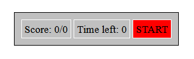
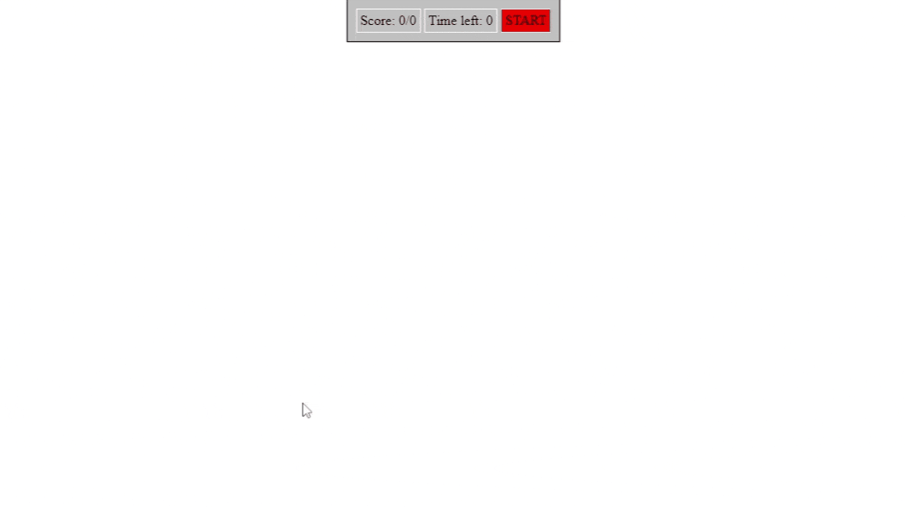

<div class="hidden">

> ## Rozcestník
> - [Späť na úvod](../../README.md)
> - Repo: [Štartér](/../../tree/main/js/fly-game), [Riešenie](/../../tree/solution/js/fly-game)
> - [Zobraziť riešenie](riesenie.md)

# Muchy (JS, CSS)

</div>

## Riešenie

Riešenie sa bude skladať z HTML, CSS a JavaScript súboru. Vytvoríme si súbor `index.html` v hlavnom adresári príkladu. Kvôli prehľadnosti súbory s obrázkami uložíme do adresára `img` a súbor so skriptom do adresára `js`.

### HTML dokument

Najprv si vytvoríme hraciu plochu. Tento súbor bude veľmi jednoduchý, nebudeme tu implementovať žiadnu aplikačnú logiku, ani dizajn. V súbore sa budú nachádzať len elementy, ktoré budú slúžiť na výpis skóre, zostávajúceho času a tlačidlo `START`. Všetky elementy, ku ktorým budeme v aplikačnej logike pristupovať, umiestníme do kontajnerov (elementy `div`) a označíme ich atribútom `id`. HTML kód bude vyzerať nasledovne:

```html
<div class="playground">
    <div id="menu">
        <div>
            Score: <span id="score">0/0</span>
        </div>
        <div>
            Time left: <span id="timer">0</span>
        </div>
        <div id="start">START</div>
    </div>
</div>
```

### CSS štýl

Najprv nastavíme vnútorné a vonkajšie odsadenie na `0`, aby hracia plocha tvorila celé klientske okno prehliadača a všetky elementy mali tieto hodnoty nastavené na `0`.

<div class="end">

```css
* {
    padding: 0;
    margin: 0;
}
```
</div>

Pomocou CSS štýlu si vytvoríme aj hraciu plochu, ktorú roztiahneme na celú šírku klientskeho okna prehliadača. Použijeme na to jednotky `vw` a `vh`, ktoré sa používajú na určenie relatívnej veľkosti elementu voči oknu prehliadača (*viewport*). 100% šírky okna je `100vw` a 100% výšky je `100vh`.

```css
.playground {
    position: fixed;
    top: 0;
    left: 0;
    width: 100vw;
    height: 100vh;
}
```

Ďalej si v súbore so štýlom naštýlujeme element, ktorý bude obsahovať obrázok s muchou. Obrázok do CSS vložíme ako obrázok pozadia pomocou CSS vlastnosti `background-image`. Formát obrázku sme zvolili typu `gif`, najmä z dôvodu, že obrázok je animovaný a vytvára dojem, že mucha sa mierne hýbe. Veľkosť obrázku nastavíme na `50px` x `50px` a roztiahneme ho na celú šírku elementu (vlastnosť `background-size`). Dôležité je nastaviť CSS vlastnosť `position` na hodnotu `fixed`, aby sme vedeli pomocou JavaScriptu muchu zobrazovať na rôznych miestach obrazovky. Pravidlo `.fly_killer` sa bude používať pri zásahu muchy a zobrazí škvrna. Štýl pre muchu a škvrnu bude vyzerať takto:

```css
.fly {
    background-image: url("../img/fly.gif");
    background-size: contain;
    width: 50px;
    height: 50px;
    position: fixed;
}
.fly_killed {
    background-image: url("../img/blood.png");
}
```

Zaujímavou vecou je zmena kurzora na náš vlastný obrázok. Chceli by sme, aby sa pri hre používal obrázok mucholapky:


Na definovanie zmeny kurzora použijeme CSS vlastnosť `cursor`:

```css
.fly_killer {
    cursor: url("../img/flykiller.png") 20 20, pointer;
}
```

Ostatné použité štýly len formátujú zobrazenie skóre a času hry. Výsledkovú tabuľu umiestníme na vrch stránky do stredu:

```css
#menu {
    background-color: silver;
    border: 1px solid black;
    padding: 10px;
    position: fixed;
    top: 0;
    left: 50%;
}
#menu div {
    display: inline-block;
    border: 1px solid white;
    padding: 4px;
}
#start {
    background-color: red;
    cursor: pointer;
}
```

<div style="page-break-after: always;"></div>

Výsledková tabuľa bude vyzerať nasledovne:



### Herná logika

Na tomto príklade si ukážeme použitie niektorých techník objektovo orientovaného programovania v jazyku JavaScript. Celú hru si rozdelíme na triedy a každá trieda bude implementovať tú časť aplikačnej logiky, pre ktorú bude určená. Zmena pozície muchy bude definovaná zmenou jej polohy pomocou vlastností `left` a `top`. Tieto CSS vlastnosti budú určovať polohu vďaka tomu, že element má nastavenú pozíciu na `fixed`.

Poloha muchy na obrazovke sa musí v pravidelných intervaloch meniť, aby mala hra zmysel. Preto použijeme časovač, ktorý v pravidelne zavolá metódu na zmenu polohy muchy.

Zmyslom hry je trafiť muchu, preto musíme nejako vyriešiť, či kliknutie myšou bolo na mieste, kde sa mucha nachádza, alebo mimo nej. Jedno riešenie by sa ponúkalo a to také, že na základe súradníc kliknutia zistíme, či sme klikli do obdĺžnika, kde sa nachádza mucha. To by si však vyžadovalo niekoľko výpočtov a porovnaní.

Jednoduchším riešením je nechať rozhodnutie, či sme klikli na muchu, na prehliadač. Stačí, aby sme definovali obsluhu udalosti `onclick` na element, kde sa mucha nachádza. Ak sme klikli na muchu, obsluha udalosti sa spustí a my môžeme hráčovi pripočítať bod a zároveň zobrazíme škvrnu. Pretože škvrna nesmie zmiznúť hneď, použijeme časovač na pozdržanie jej vymazania z obrazovky. Ak klikol mimo elementu s muchou, pripočítame mu o jeden pokus viac.

Celá hra bude limitovaná časom, preto pri začiatku hry spustíme časovač, ktorý začne odpočítavať čas hry. Na konci hry všetky muchy skryjeme a hra môže začať odznovu.

Implementáciu hry si rozložíme do troch tried: `Timer`, `Fly`, `Game`. Najprv vytvoríme triedu `Timer`, ktorá sa bude starať o časovače potrebné pri rôznych situáciách v hre. Ďalej si vytvoríme triedu `Fly`, ktorá bude mať na starosti správanie sa muchy počas hry. A celú hru bude riadiť trieda `Game`, ktorej zodpovednosťou bude spúšťanie a ukončovanie hry, ako aj rátanie bodov hráča. Všetky tieto triedy na začiatok uložíme do jedného súboru `skript.js`.


#### Trieda `Timer`

Začneme pomocnou triedou `Timer`, ktorá bude mať na starosti spúšťanie časovačov v hre. Časovač budeme potrebovať v hre na viacerých miestach. Ako už bolo spomínané, bude použitý pri presune muchy na iné miesto na obrazovke, na pozdržanie zmazania škvrny po trafenej muche, ako aj na odpočítavanie času hry. Triedu v JavaScripte vytvoríme kľúčovým slovom `class`.

```javascript
class Timer {

}
```

Najskôr si nastavíme všetky atribúty, ktoré bude trieda `Timer` využívať. Atribúty sa zapisujú do vnútra definície triedy. Pre túto triedu budeme potrebovať atribút `interval`, čo bude čas v milisekundách definujúci, ako často bude časovač spúšťať funkciu (alebo metódu triedy), ktorú mu nastavíme. Atribút `timerId` bude identifikátor časovača, ktorý budeme používať na identifikáciu časovača pri jeho rušení, keďže nám v hre bude bežať viac časovačov. Nakoniec atribút `_callback` bude obsahovať funkciu (alebo metódu triedy), ktorú bude časovač spúšťať.

Všimnite si znak `_` pre začiatkom atribútu. Keďže k atribútu budeme vytvárať *set* metódu (angl. *setter*), nemôže sa atribút volať rovnako ako metóda. Implementáciu *set* metódy si ukážeme neskôr. Všetky atribúty sa zapisujú bez kľúčového slova `let` alebo `var`. Atribúty je možné aj inicializovať, v našom prípade bude stačiť iba `null` pri atribútoch `timerId` a `_callback`.

```javascript
interval;
timerId = null;
_callback = null;
```

Všetky metódy tejto triedy (sú to bežné funkcie v JavaScripte) musíme pridať do vnútra triedy. Každá trieda by mala mať svoj **konštruktor**, čo je metóda, ktorá za zavolá pri vzniku inštancie danej triedy a vykoná nastavenie tejto inštancie. V našom prípade len nastavíme interval v milisekundách. Na zápis konštruktora v JavaScripte sa používa kľúčové slovo [`constructor`](https://developer.mozilla.org/en-US/docs/Web/JavaScript/Reference/Classes/constructor) a ako parameter mu pri volaní nastavíme hodnotu intervalu. Hodnota `1000` sa použije, ak konštruktor zavoláme bez nastavenia hodnoty.

```javascript
constructor(interval = 1000)
{
    this.interval = interval;
}
```

V tejto triede budeme potrebovať dve metódy. Jednu na spustenie časovača a druhú na jeho zastavenie. Spustenie časovača je jednoduchá operácia, ktorá zavolá metódu [`window.setInterval()`](https://developer.mozilla.org/en-US/docs/Web/API/WindowOrWorkerGlobalScope/setInterval) s parametrami `handler`, čo je buď názov metódy, alebo funkcie, ktorá sa má zavolať, ale v princípe to môže byť ľubovolný JavaScript kód a *čas v milisekundách*, v akom sa pravidelne bude tento kód spúšťať. Pred tým však ešte časovač vypneme, aby sme eliminovali viacnásobné spustenie toho istého časovača. Do atribútu `timerId` si uložíme vytvorený časovač na neskoršie použitie. Pri tomto zápise si môžeme všimnúť, že na definíciu metód v JavaScripte sa nepoužíva kľúčové slovo [`function`](https://developer.mozilla.org/en-US/docs/Web/JavaScript/Reference/Statements/function).

<div class="end">

```javascript
start()
{
    this.stop();
    this.timerId = window.setInterval(this._callback, this.interval);
}
```
</div>

Metóda `stop()` bude mať za úlohu zastavenie časovača. Obsahom metódy je len kontrola, či časovač beží (vtedy nemá atribút `timerId` nastavenú hodnotu na `null`) a ak beží, tak ho volaním metódy [`clearInterval()`](https://developer.mozilla.org/en-US/docs/Web/API/WindowOrWorkerGlobalScope/clearInterval) zastavíme a atribút `timerId` nastavíme na `null`.

```javascript
stop()
{
    if (this.timerId != null) {
        window.clearInterval(this.timerId);
    }
    this.timerId = null;
}
```

Poslednou metódou triedy `Timer` je metóda `callback()`, ktorá slúži na nastavenie metódy, ktorú bude daný časovač spúšťať. Je to `set` metóda, čo je zrejmé z použitia kľúčového slova `set`. Metóda v svojom tele len nastaví metódu (prípadne funkciu), ktorú bude časovač spúšťať. Spôsob použitia tejto metódy si ukážeme neskôr v príklade.

```javascript
set callback(callback)
{
    this._callback = callback;
}
```

#### Trieda `Fly`

Táto trieda bude predstavovať jednu muchu v hre. Na obrazovke bude súčasne zobrazených niekoľko múch a každá z nich bude jednou inštanciou triedy `Fly`. Táto trieda bude obsahovať jeden atribút, a to `element`, ktorý bude referenciou na DOM element zodpovedajúci muche v HTML dokumente.

```javascript
element = null;
```

Konštruktor v tejto triede má za úlohu vytvoriť muchu a nastaviť jej, aby v definovanom čase menila svoju pozíciu. Parameter `interval` definuje, ako často sa zmena polohy bude vykonávať. Na to potrebujeme vytvoriť novú inštanciu triedy `Timer`, vytvoriť DOM element (pozor toto nie je rovnaká metóda ako [`Document.createElement()`](https://developer.mozilla.org/en-US/docs/Web/API/Document/createElement) a nastaviť časovaču, že v pravidelne definovanom intervale má volať metódu `changePosition()` tejto inštancie triedy. Tu je vidieť použitie `set` metódy, ktoré sa líši od volania bežnej metódy v tom, že je realizovaná ako priradenie. Na priradenie metódy, ktorá sa bude volať, použijeme **arrow funkciu**, ktorá celý zápis zjednoduší a sprehľadní. Navyše vo vnútri volania sprístupní odkaz `this`, inak by sme nemali prístup k inštancii triedy `Fly`. 

[**Arrow funkcia**](https://developer.mozilla.org/en-US/docs/Web/JavaScript/Reference/Functions/Arrow_functions) je alternatívny spôsob zápisu funkčných výrazov v JavaScripte. Zápis je jednoduchší ako v prípade zápisu anonymných funkcií. Pred šípkou (*arrow*) sa nachádza zoznam parametrov funkcie, ktorý môže byť prázdny. Za šípkou je telo funkcie, ktoré môže obsahovať jeden alebo viac príkazov. Záasadným rozdielom oproti anonymným funkciám je význam kľúčového slova `this`. Na rozdiel od bežných, resp. anonymných funkcií, kde `this` predstavuje objekt, ktorý funkciu zavolal, v *arrow* funkciách toto kľúčové slovo **vždy** reprezentuje objekt, ktorý funkciu definoval.       

Výsledná implementácia konštruktora bude vyzerať nasledovne:

```javascript
constructor(interval = 1000)
{
    this.timer = new Timer(interval);
    this.createElement();
    this.timer.callback = () => this.changePosition();
}
```

Keďže budeme vytvárať viacero elementov muchy súčasne, musíme vytvoriť metódu, ktorá bude vykresľovať element muchy na obrazovku. Metóda bude volať DOM metódu [`Document.createElement()`](https://developer.mozilla.org/en-US/docs/Web/API/Document/createElement), vytvorenému elementu nastaví CSS triedu `fly` a vygeneruje mu náhodnú pozíciu na obrazovke. Túto metódu budeme volať pri vytváraní a novom spúšťaní hry, preto muchy najskôr skryjeme a zobrazíme ich, až keď sa hra začne (metóda `hideElement()`). Vytvorený element pripojíme do dokumentu DOM metódou [`document.body.appendChild()`](https://developer.mozilla.org/en-US/docs/Web/API/Node/appendChild).

```javascript
createElement()
{
    this.element = document.createElement('div');
    this.element.className = 'fly';
    this.changePosition();
    this.hideElement();
    document.body.appendChild(this.element);
}
```

Úlohou metódy `changePosition()` bude nastaviť element muchy na náhodnú pozíciu. Ako sme spomínali, mucha má nastavenú pozíciu na `fixed`, preto jej môžeme pomocou CSS vlastností `top` a `left` predpísať, kde sa má vykresliť. Na výpočet polohy použijeme vygenerovanie náhodného čísla, ktoré bude z rozsahu nula až šírka klientskeho okna prehliadača, resp. nula až jeho výška. Keďže rozmery budú v `px`, na konci ich pripojíme k vygenerovanej hodnote. Ďalej obrázok náhodne otočíme, aby nebola mucha zobrazená stále rovnakým smerom. Nakoniec ešte odstránime CSS triedu `fly_killed`, ktorá sa tam objaví, keď muchu trafíme, ale to bude predmetom inej metódy:

```javascript
changePosition()
{
    this.element.style.left = Math.random() * (window.innerWidth - this.element.offsetWidth) + "px";
    this.element.style.top = Math.random() * (window.innerHeight - this.element.offsetHeight) + "px";
    this.element.style.transform = 'rotate(' + (Math.random() * 360) + 'deg)';
    this.element.classList.remove("fly_killed");
}
```

Metódy `showElement()` a `hideElement()` majú za úlohu zobraziť resp. skryť element muchy na obrazovke. Pri zobrazení zároveň naštartujeme časovač, aby mucha začala meniť svoju pozíciu a pri skrytí muchy tento časovač zrušíme. Metóda `showElement()` ešte navyše elementu muchy vymaže CSS triedu `fly_killed`, ak náhodou mucha bola už trafená a zobrazila by sa škvrna. Riadok `this.element.classList.add("fly_killer");` rieši situáciu, keď je kurzor myši nad obrázkom a zmenil by sa na obyčajnú šípku, preto ho nastavíme opäť na našu mucholapku. Kód metód bude nasledovný:

```javascript
showElement()
{
    this.timer.start();
    this.element.classList.remove("fly_killed");
    this.element.classList.add("fly_killer");
    this.element.style.display = "block";
}

hideElement()
{
    this.timer.stop();
    this.element.classList.remove("fly_killer");
    this.element.style.display = "none";
}
```

Nakoniec nám zostalo implementovať obsluhu udalosti kliknutia na muchu. Ak hráč klikne na element muchy, skontrolujeme, či už na element nebolo kliknuté (element vtedy bude obsahovať CSS triedu `fly_killed`) a ak nie, obrázok muchy zmeníme na obrázok škrvny pridaním CSS triedy `fly_killed` a rovnako ako v predchádzajúcej metóde, nastavíme kurzor na našu mucholapku.

Potom naštartujeme časovač, aby sa začala mucha zobrazovať na inom mieste. Nakoniec zavoláme *callback*, ktorý dostaneme ako parameter. Zmysel tohto kroku si objasníme pri vysvetľovaní metód v triede `Game`. Ako je zrejmé z kódu tejto metódy, neriešime v nej počítanie bodov hráča, ale túto zodpovednosť prenecháme na triedu `Game`.

```javascript
set onClick(callback)
{
    this.element.onclick = () => {
        if (!this.element.classList.contains('fly_killed')) {
            this.element.classList.add("fly_killer");
            this.element.classList.add("fly_killed");
            this.timer.start();
            callback();
        }
    };
}
```

#### Trieda `Game`

Trieda `Game` bude zodpovedná za riadenie priebehu hry. Bude sa v nej odohrávať naštartovanie hry, ako aj jej ukončenie. Pri vzniku novej hry vytvorí všetky muchy, ktoré budeme v hre používať. Pri trafení muchy zvýši hráčovi skóre, bude mať na starosti odpočítavanie času a po skončení časového limitu skryje všetky muchy.

Na začiatku triedy `Game` si zadefinujeme všetky atribúty, ktoré budeme v hre používať: 

- Atribút `gameDuration` použijeme na nastavenie trvania hry na 30 sekúnd. Túto hodnotu je možné v prípade potreby zmeniť. 
- Atribút `gameSeconds` bude vždy obsahovať aktuálny počet sekúnd, ktorý sa na začiatku nastaví na hodnotu `gameDuration` a postupne sa bude znižovať. 
- Atribút `numOfFlies` definuje počet múch v jednej hre na obrazovke.
- Atribút `score` obsahuje aktuálny počet trafených múch hráčom. 
- Atribút `totalAttempts` obsahuje celkový počet kliknutí hráča, aby sme vedeli určiť pomer úspešných a neúspešných pokusov. 
- Atribút `flies` predstavuje pole múch, kde každý prvok poľa je jedna mucha. 
- Atribút `timer` predstavuje časovač hry, ktorý má na starosti odpočítavanie času jednej hry.

```javascript
gameDuration = 30;
gameSeconds = 0;
numOfFlies = 5;
score = 0;
totalAttempts = 0;
flies = [];

timer = new Timer();
```

Konštruktor triedy `Game` má za úlohu inicializáciu celej hry. Na začiatku inicializuje časovač hry tak, aby sa odpočítavali zostávajúce sekundy do konca hry. Viac sa o tomto časovači dozvieme v metóde `gameTick()`.

```javascript
constructor()
{
    this.timer.callback = () => this.gameTick();
}
```

Ďalším krokom v konštruktore je vytvorenie obsluhy udalostí [`DOMContentLoaded`](https://developer.mozilla.org/en-US/docs/Web/API/Window/DOMContentLoaded_event). Táto udalosť nastane vtedy, keď je v okne prehliadača už stiahnutý celý HTML kód príslušnej stránky a teda máme istotu, že všetky DOM elementy sú už na stránke k dispozícii. Je to obdoba k implementácii obsluhy udalosti `window.onload`.

V tejto chvíli môžeme zadefinovať obsluhu tlačidla `Start` slúžiaceho na spustenie hry. To opäť vykonáme s pomocou *arrow funkcie*, aby sme referenciu `this` dostali do obsluhy v tejto udalosti. 

Ďalej definujeme obsluhu udalosti kliknutia na plochu, pričom si najskôr vyhľadáme element, ktorý má nastavenú CSS triedu `playground`. Táto obsluha udalostí je implementovaná *inline* spôsobom. Funkcia je priamo definovaná pri samotnej udalosti. Je veľmi jednoduchá a slúži len na to, aby sme započítali všetky kliknutia v hre, okrem kliknutí na tlačítko `Start`. Takisto musíme brať do úvahy, ak hra už skončila. Vtedy už počet pokusov nesmie pribúdať.

```javascript
constructor()
{
    this.timer.callback = () => this.gameTick();
    document.addEventListener("DOMContentLoaded", (event) => {
        document.getElementById("start").onclick = () => this.start();

        document.querySelector('.playground').onclick = (event) => {

            if (event.target.id === 'start') return;
            if (this.gameSeconds > 0) {
                this.totalAttempts++;
                this.redrawScore();
            }
        }
    });
}
```

Poslednou časťou konštruktora je cyklus, ktorý pre definovaný počet múch v poli `flies` vytvorí inštancie triedy `Fly`. Každej muche nastaví náhodný interval zmeny polohy, aby bola hra zaujímavejšia. Okrem toho muche nastaví obsluhu udalosti [`onclick`](https://developer.mozilla.org/en-US/docs/Web/API/GlobalEventHandlers/onclick) (na volanie metódy `flyHit()`).

```javascript
constructor()
{
    this.timer.callback = () => this.gameTick();
    document.addEventListener("DOMContentLoaded", (event) => {
        document.getElementById("start").onclick = () => this.start();

        document.querySelector('.playground').onclick = (event) => {

            if (event.target.id === 'start') return;
            if (this.gameSeconds > 0) {
                this.totalAttempts++;
                this.redrawScore();
            }
        }
        for (let i = 1; i <= this.numOfFlies; i++) {
            this.flies [i] = new Fly(758 + Math.random() * 743);
            this.flies[i].onClick = () => this.flyHit();
        }
    });
}
```

Pri popise konštruktora sme spomínali metódu `redrawScore()`. Táto metóda obsahuje len jeden riadok kódu a jej úlohou je výpis aktuálneho skóre hráča, ktoré pozostáva z aktuálneho počtu trafených múch a celkového počtu pokusov:

```javascript
redrawScore()
{
    document.getElementById("score").innerText = this.score.toString() + '/' + this.totalAttempts.toString();
}
```

Na počítanie času v hre sme si vytvorili metódu `gameTick()`. Táto metóda bude odpočítavať čas zostávajúci pre hráča. Po uplynutí každej sekundy zobrazí v paneli hry zostávajúci čas. Na konci hry zastaví časovač, skryje všetky muchy a zmení kurzor na jeho bežný tvar:

```javascript
gameTick()
{
    if (this.gameSeconds > 0) {
        this.gameSeconds--;
    } else {
        this.timer.stop();
        this.flies.forEach(fly => fly.hideElement());
        document.querySelector('.playground').classList.remove('fly_killer');
    }
    document.getElementById("timer").innerText = this.gameSeconds.toString();
}
```

Na konci konštruktora je cyklus, kde vytvárame muchy. Každej muche nastavíme obsluhu udalosti [`onclick`](https://developer.mozilla.org/en-US/docs/Web/API/GlobalEventHandlers/onclick). Jednu časť tejto obsluhy delegujeme na metódu triedy `Fly` a zvyšnú časť súvisiacu skóre obslúžime v tejto triede. Táto metóda zvýši skóre hráča, pretože sme trafili muchu a okrem toho zvýši aj celkový počet pokusov. Nakoniec zavolá metódu `redrawScore()`, aby aktualizované skóre a počet pokusov vypísala:

```javascript
flyHit()
{
    this.score++;
    this.totalAttempts++;
    this.redrawScore();
}
```

Na záver sme si nechali metódu `start()`, ktorá je obsluhou udalosti kliknutia na tlačidlo `Start`. Má za úlohu inicializovať novú hru a nastaviť všetky jej parametre. Na úvod metódy nastavíme čas trvania hry, potom vynulujeme skóre a celkové pokusy, vypíšeme ich a prestavíme kurzor myši na mucholapku. 

Posledný cyklus slúži na to, aby zobrazili všetky muchy. Všimnite si, že tento cyklus nie je realizovaný niektorým z bežných cyklov, ale metódou poľa [`forEach()`](https://developer.mozilla.org/en-US/docs/Web/JavaScript/Reference/Global_Objects/Array/forEach), ktorá sa používa na postupnú iteráciu po jednotlivých prvkoch poľa:

```javascript
start()
{
    this.gameSeconds = this.gameDuration;
    this.score = this.totalAttempts = 0;
    this.redrawScore();
    this.timer.start();
    document.querySelector('.playground').classList.add('fly_killer');
    this.flies.forEach(fly => {
        fly.showElement();
    });
}
```

Spustenie celej aplikácie (pozor, nie hry) sa vykoná vytvorením inštancie triedy `Game` príkazom:

```javascript
new Game();
```

Tento príkaz dáme na koniec celého skriptu mimo triedy `Game`. Referenciu na inštanciu nepotrebujeme, preto novovytvorenú inštanciu nikam nemusíme priraďovať.

### Moduly

Jazyk JavaScript nepozná príkaz `include`, preto sme všetky tieto triedy ukladali do jedného spoločného súboru. Je zrejmé, že už pri takomto relatívne krátkom skripte jeho kód je dlhý a začína byť ťažké sa v ňom orientovať. Tento problém by sme mohli vyriešiť tak, že by sme vytvorili pre každú triedu samostatný súbor, a tento súbor pomocou značky `<script>` naimportovali do HTML súboru nasledovným spôsobom:

```javascript
<script src="js/timer.js"></script>
<script src="js/fly.js"></script>
<script src="js/game.js"></script>
```

Toto riešenie by bolo funkčné, ale opäť, ak by sme mali takých súborov viac, museli by sme každý z nich vložiť do HTML a prehľadnosť by sme vyriešili len čiastočne. Na tento problém existuje lepšie riešenie a tým je použitie modulov. 

**Moduly** používajú kľúčové slovo [`import`](https://developer.mozilla.org/en-US/docs/Web/JavaScript/Reference/Statements/import) na to, aby sprístupnili kód v inom JavaScript súbore. Úprava nášho príkladu bude veľmi jednoduchá. Keďže sme programovali objektovo, na konci každého JavaScript súboru bude stačiť vyexportovať celú triedu pomocou kľúčového slova [`export`](https://developer.mozilla.org/en-US/docs/Web/JavaScript/Reference/Statements/export). Tým sa stane prístupná pre súbory, v ktorých ju budeme potrebovať importovať. Na začiatok každého súboru naimportujeme triedy, ktoré v danom súbore budeme používať. Napríklad, v triede `Fly` budeme potrebovať metódy triedy `Timer`, preto si pred deklaráciou triedy najskôr naimportujeme triedu `Timer` a na konci súboru triedu `Fly` vyexportujeme, aby bola k dispozícii ostatným triedam:

```javascript
import {Timer} from "./timer.js";

class Fly {
...
}

export {Fly};
```

Všetky moduly presunieme do adresára `modules`. Na záver si vytvoríme súbor `main.js`. Tento súbor bude spájať celú aplikáciu a v ňom na importujeme triedu `Game`. Súbor `main.js` bude vyzerať nasledovne:

```javascript
import {Game} from "./modules/game.js";

new Game();
```

Celá štruktúra príkladu je zobrazená na tomto obrázku:


**Pozor!** Pokiaľ použijeme riešenie s modulmi, skript v HTML musíme naimportovať s atribútom `type="module"`. Inak sa skript obsahujúci moduly nenaimportuje. Na spustenie hry budeme potrebovať okrem prehliadača aj nejaký webový server. Pri použití modulov **nie je možné** JavaScript spúšťať bez použitia webového servera.

<div class="end">

```html
<script type="module" src="js/main.js"></script>
```
</div>

Hru v prehliadači spustíme kliknutím na tlačidlo `Start`. Po spustení hry uvidíme muchy na hracej ploche, kurzor sa zmení na mucholapku a môžeme začať hrať:


