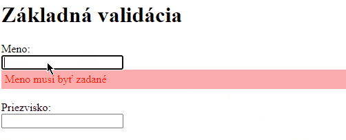
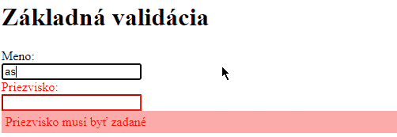
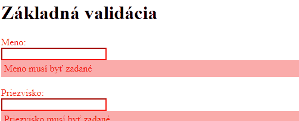
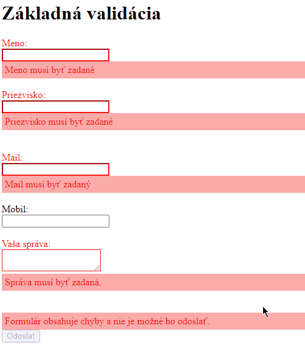

<div class="hidden">

> ## Rozcestník
> - [Späť na úvod](../../README.md)
> - Repo: [Štartér](/../../tree/main/js/form-check), [Riešenie](/../../tree/solution/js/form-check)
> - [Zobraziť zadanie](zadanie.md)

# Kontrola formulára (JS, CSS)

</div>

## Riešenie

Formulár je definovaný pomocou elementu `form`, do ktorého sa pridávajú elementy `input`, `textarea` a `select` umožňujúce zadať používateľovi vstup (pridať dáta do formulára na odoslanie).

### Validácia pomocou HTML5

Základným prvkom používateľského vstupu je element `input`, ktorého atribút [`type`](https://www.w3schools.com/html/html_form_input_types.asp) bližšie definuje druh očakávaného vstupu a jeho vzhľad.

Ďalším dôležitým atribútom je `pattern`, v ktorom sa ako hodnota uvádza regulárny výraz. Ten sa následne používa pre validáciu vstupu, ktorý zadal používateľ.

Ako prvé budeme kontrolovať, či majú vstupy hodnotu v správnom tvare. V prípade mailu môžeme vstup definovať ako vstupné pole typu `email`, teda:

```html
<input type="email" id="mail">
```

To ale nie je vždy dostačujúce, nakoľko nie každý prehliadač kontroluje zadanú hodnotu korektne. Lepšie bude preto použiť atribút `pattern`, kde zadáme regulárny výraz, ktorý bude kontrolovať, či je hodnota v tvare e-mailovej adresy.

Regulárny výraz vieme buď vytvoriť, alebo nájsť na internete. Jeden z týchto výrazov (nie je to úplne správny výraz, pretože formát e-mailovej adresy je veľmi komplikovaný) je napr. `/^\S+@\S+\.\S+$/`<span class="hidden">([ zdroj tu](https://stackoverflow.com/questions/201323/how-to-validate-an-email-address-using-a-regular-expression))</span>. Element pre zadanie mailu teda zapíšeme:

```html
<input type="text" id="mail" pattern="/^\S+@\S+\.\S+$/">
```

To isté bude platiť pre mobilné telefónne číslo so slovenskou predvoľbou, pre ktoré bude platiť regulárny výraz `/^\+421([0-9]{9}|(( {0,1}[0-9]{3}){3}))$/`. Element pre zadanie mobilného čísla bude zapísaný:

```html
<input type="text" id="mobil" pattern="/^\+421([0-9]{9}|(( {0,1}[0-9]{3}){3}))$/">
```

Problém nastáva pri elemente `textarea`, ktorý nemá atribút `pattern`, tu budeme musieť logiku validácie vstupu vytvoriť pomocou JavaScriptu. To však budeme implementovať neskôr.

Teraz pridáme atribút `required` do `input` elementov pre zadávanie pre `Meno`, `Priezvisko`, `Mail`a `Vaša správa`. 

<div style="page-break-after: always;"></div>

Pridanie atribútu `required` bude vyzerať takto:

```html
<input type="text" id="mail" pattern="/^\S+@\S+\.\S+$/" required>
```

Teraz, keď odošleme formulár kliknutím na tlačidlo `Odoslať`, formulár sa neodošle a prehliadač zobrazí pri prvom prvku s nevyplnenou hodnotou alebo nesprávnou hodnotu chybovú hlášku:



Bolo by však dobré aj vizuálne používateľovi zobraziť, ktoré prvky formulára obsahujú chybu. Tu môžeme využiť to, že prehliadač automaticky do neplatných prvkov formulára pridá pseudotriedu [`:invalid`](https://developer.mozilla.org/en-US/docs/Web/CSS/:invalid). Taktiež je táto pseudotrieda `:invalid` pridaná aj do formulára, ktorý chybu obsahuje. Stačí nám preto pridať jednoduché CSS pravidlo, ktoré zafarbí pozadie týchto prvkov na červeno. Pre jednoduchosť pridáme štýl priamo do HTML kódu:

```html
<style>
    :invalid:not(form) {
        background-color: red;
    }
</style>
```

Selektor `:invalid:not(form)` vyberá všetky prvky, ktoré majú priradenú pseudotriedu `:invalid` a nie je to element `form` pomocou `:not(form)`. 

<div style="page-break-after: always;"></div>

Formulár sa bude teraz zobrazovať nasledovne:

<div style="page-break-after: always;"></div>

Formulár sa bude teraz zobrazovať nasledujúco:




Týmto sme vyčerpali možnosti, ktoré máme pre validáciu s použitím výlučne HTML5 bez JavaScriptu. Ešte by sme chceli poznamenať:

- V súčasnosti neexistuje spôsob, ktorým vieme iba pomocou HTML definovať obsah chybových hlášok.
- Nie je možné zablokovať tlačidlo pre odoslanie.
- Neexistuje spôsob, akým zobrazíme všetky chybové hlášky súčasne.

### Validácia pomocou JavaScriptu

Aby sme mohli vytvoriť vlastnú logiku pre validáciu, musíme najprv navrhnúť spôsob, akým budeme overovať používateľom zadané hodnoty. Najjednoduchším spôsobom je vytvoriť funkciu, do ktorej ako vstupný parameter pošleme aktuálne zadanú hodnotu elementu formulára. Tú následne vyhodnotíme podľa potreby. V prípade, že hodnota nevyhovuje, vráti sa na výstup chybová hláška. Ak sa žiadna chyba nenájde, funkcia vráti `null`.

Pri všetkých elementoch `input` a `textarea` je pri zmene ich hodnoty spustená udalosť `oninput`. Objekt, ktorý nesie informáciu o udalosti, obsahuje referenciu na element, na ktorom udalosť nastala, v atribúte `target`. Aktuálnu hodnotu elementu vieme získať z&nbsp;jeho atribútu `value`. Ak teda budú dáta udalosti v premennej `event`, získame aktuálnu hodnotu elementu ako `event.target.data`.

Spôsob získavania dát z vstupných elementov `form` bude rovnaký. Z tohto dôvodu vytvoríme funkciu `validateInput()`, ktorej vstupné parametre budú:

1. `element` - priamo `HTMLElement`, na ktorý chceme zapojiť validačnú logiku
2. `validationFunction()` - validačná funkcia, ktorá má jeden vstupný parameter, a to aktuálnu hodnotu daného vstupného elementu. Jej návratová hodnota bude `null` v prípade, že je vstup v poriadku. Ak nastane chyba, vráti chybovú hlášku v&nbsp;podobe textového reťazca.

Ako prvé pridáme každému elementu `input` *callback* funkciu, ktorej úlohou bude momentálne iba predať z dát udalosti `event` aktuálnu hodnotu vstupného elementu do validačnej funkcie v `validationFunction()` a odchytiť návratovú hodnotu do lokálnej premennej `result`. Kód vyzerá nasledujúco:

```javascript
function validateInput(element, validationFunction) {
    element.oninput = function (event) {
        let result = validationFunction(event.target.value);
    }
}
```

Doplníme podmienku, ktorá bude zisťovať, čo validačná funkcia vrátila. Ak nastala chyba, používateľ potrebuje vidieť spätnú väzbu. Vytvoríme nový element `div`, ktorý zaradíme priamo pod daný vstupný element.

Validačná funkcia sa ale bude spúšťať pri každej zmene daného vstupného elementu, je preto dôležité skontrolovať:

- Ak došlo k chybe a vstupný element nemá zobrazenú hlášku, je potrebné ju vytvoriť a zobraziť.
- Ak je vo vstupnom elemente chyba a došlo k zmene hlášky, je potrebné iba upraviť obsah `div` elementu, nie vytvoriť ďalší.
- Ak už je chyba používateľom opravená, je potrebné chybovú hlášku zmazať.

Z týchto dôvodov musíme zabezpečiť ľahké a jednoznačné získanie referencie na element s hláškou. Najjednoduchším riešením bude vygenerovať hláškam `id` v stanovenom formáte.

Po vykonaní validačnej funkcie zostavíme `id` pre element s textom chybovej hlášky takto: `"er-"+element.id` a pokúsime sa získať z DOM element s týmto `id` pomocou `document.getElementById()`. Táto metóda vráti buď nájdený element, alebo `null`.

<div style="page-break-after: always;"></div>

Doplnená metóda:

```javascript
function validateInput(element, validationFunction) {
    element.oninput = function (event) {
        let result = validationFunction(event.target.value);

        let erId = "er-" + element.id;
        let errorEle = document.getElementById(erId);
    }
}
```

Teraz pridáme podmienku pre kontrolu hodnoty výstupu z validačnej funkcie uloženú v&nbsp;premennej `result` a budeme ju testovať na hodnotu `null`:

```javascript
function validateInput(element, validationFunction) {
    element.oninput = function (event) {
        let result = validationFunction(event.target.value);

        let erId = "er-" + element.id;
        let errorEle = document.getElementById(erId);

        if (result != null) {
            // nastala chyba
        } else {
            // ziadna chyba 
        }
    }
}
```

V prípade, že chyba nenastala, môžeme element `errorEle` vymazať z DOM `errorEle.remove()`. Musíme však skontrolovať, či vôbec existuje (táto situácia nastane, keď používateľ zadá viackrát po sebe správny vstup).

Zvyčajne by sme kontrolu, či je nejaká premenná `null`, robili takto:

<div class="end">

```javascript
if (nieco == null) {
    nieco.ahoj();
}
```
</div>

Tento zápis vieme zjednodušiť na `nieco?.ahoj()` pomocou [*optional chaining* operátora](https://developer.mozilla.org/en-US/docs/Web/JavaScript/Reference/Operators/Optional_chaining).

Zmazanie elementu s chybovou hláškou bude teda vyzerať nasledujúco:

```javascript
function validateInput(element, validationFunction) {
    element.oninput = function (event) {
        let result = validationFunction(event.target.value);

        let erId = "er-" + element.id;
        let errorEle = document.getElementById(erId);

        if (result != null) {
            // nastala chyba
        } else {
            // žiadna chyba 
            errorEle?.remove();
        }
    }
}
```

V prípade ak nastala chyba, vykonáme:

1. Skontrolujeme, či existuje element `errorEle` a ak nie, tak ho vytvoríme a pridáme mu CSS triedu `error`.
2. Doplníme do neho chybovú hlášku nachádzajúcu sa v premennej `result` pomocou ` errorEle.innerText = result`.
3. Pridáme `errorEle` hneď za `element`. Pokiaľ element existuje, nič sa nestane, lebo už je pripojený za `element`.

Kód bude po doplnení vyzerať:

```javascript
function validateInput(element, validationFunction) {
    element.oninput = function (event) {
        let result = validationFunction(event.target.value);

        let erId = "er-" + element.id;
        let errorEle = document.getElementById(erId);

        if (result != null) {
            // nastala chyba
            if (errorEle == null) {
                errorEle = document.createElement("div")
                errorEle.classList.add("error");
                errorEle.id = erId;
            }
            errorEle.innerText = result;
            element.after(errorEle);
        } else {
            // ziadna chyba 
            errorEle?.remove();
        }
    }
}
```

CSS pre chybovú hlášku bude takéto:

```css
.error {
    color: red;
    padding: 5px;
    background-color: #ffaaaa;
}
```

Po načítaní HTML musíme pridať validačné funkcie. Ako prvú pridáme validáciu toho, či je pole `Meno` zadané. V nej budeme kontrolovať, či je hodnota tohto vstupného elementu `null` alebo dĺžka väčšia ako `0` znakov. Tu je HTML a JavaScript kód:

<div class="end">

```html
<label for="meno">Meno:</label>
<br>
<input type="text" id="meno">
<br>
```

```javascript
  window.onload = () => {
    validateInput(document.getElementById("meno"), function (value = null) {
        if (value == null || value.length == 0) {
            return "Meno musí byť zadané";
        }
    });
}
```
</div>

Validácia sa nebude chovať úplne podľa nášho zámeru, nakoľko ku kontrole dôjde až pri zmene hodnoty daného vstupného elementu. 

Fungovať to bude nasledujúco:


Najjednoduchším spôsobom ako spustiť validáciu po jej pridaní, je umelo vyvolať `oninput` udalosť. To zrealizujeme volaním `element.dispatchEvent(new Event('input'));`. Kód funkcie `validateInput()` bude upravený takto:

<div class="end">

```javascript
function validateInput(element, validationFunction) {
    element.oninput = function (event) {
        let result = validationFunction(event.target.value);
        let erId = "er-" + element.id;
        let errorEle = document.getElementById(erId);

        if (result != null) {
            // nastala chyba
            if (errorEle == null) {
                errorEle = document.createElement("div")
                errorEle.classList.add("error");
                errorEle.id = erId;
            }
            errorEle.innerText = result;
            element.after(errorEle);
        } else {
            // ziadna chyba 
            errorEle?.remove();
        }
    }
    element.dispatchEvent(new Event('input'));
}
```
</div>

Pre vytvorenie lepšieho používateľského komfortu našej validácie doplníme vizuálne označenie, ktoré zmení farbu elementu `label` a rámčeka `input` na červenú farbu. Budeme musieť ale upraviť aj HTML kód. Každú dvojicu `label` a `input` vložíme do `div` elementu. Budeme tak mať kontrolu nad tým, pre ktoré elementy chceme zobrazenie upraviť:

```html
<div>
    <label for="meno">Meno:</label><br>
    <input type="text" id="meno"><br>
</div>
```

Pokiaľ bude daný `input` element obsahovať chybu, pridáme do `div` elementu CSS triedu `has-error`. K tomu pridáme nasledujúce CSS štýly:

```css
.has-error {
    color: red;
}
.has-error textarea,
.has-error input {
    border-color: red;
}
```

Element `div` je rodič nášho `input` elementu, preto sa k nemu vieme dostať cez atribút `element.parentElement`. CSS triedy sa pridávajú HTML elementu cez atribút `classList`, čo je kolekcia reťazcov. Pridanie realizujeme pomocou `classList.add()` a odobratie cez `classList.remove()`. Triedu `has-error` pridáme, ak `input` obsahuje chybu a zmažeme, ak ju nemá. Upravený kód funkcie `validateInput()` bude vyzerať:

```javascript
function validateInput(element, validationFunction) {
    element.oninput = function (event) {
        let result = validationFunction(event.target.value);

        let erId = "er-" + element.id;
        let errorEle = document.getElementById(erId);

        if (result != null) {
            // nastala chyba
            if (errorEle == null) {
                errorEle = document.createElement("div")
                errorEle.classList.add("error");
                errorEle.id = erId;
            }
            errorEle.innerText = result;
            element.after(errorEle);
            element.parentElement.classList.add("has-error");
        } else {
            // ziadna chyba 
            errorEle?.remove();
            element.parentElement.classList.remove("has-error");
        }
    }
    element.dispatchEvent(new Event('input'));
}
```

Formulár sa bude správať nasledujúco:



Aby sme mohli zablokovať tlačidlo na odoslanie formulára pri nájdení chyby, musíme najprv zistiť, či formulár obsahuje chybu. Najjednoduchším riešením bude vybrať všetky HTML elementy, ktoré majú CSS triedu `error` (vieme, že keď nastane chyba, elementy s&nbsp;touto triedou sa pridajú do DOM).

Ako ďalšie doplníme nad tlačidlo `Odoslať` hlášku informujúcu používateľa o tom, že formulár obsahuje chyby a nie je možné ho odoslať. Je to veľmi dôležitý detail, ktorý výrazne spríjemňuje a uľahčuje používateľovi prácu s aplikáciou (zvlášť, ak by bol formulár taký dlhý, že by bolo nutné použiť posuvník). Samozrejme, na začiatku je potrebné hlášku skryť a vizuálne ju oddeliť od okolia, preto pridáme nasledujúci HTML kód:

```html
<div id="submit-info">
    Formulár obsahuje chyby a nie je možné ho odoslať.
</div>
<input type="submit" value="Odoslať" id="submit">
```

a CSS kód:

```css
#submit-info {
    display: none;
    padding: 5px;
    background-color: #ffaaaa;
    color: red;
}
```

Kontrolu stavu formulára budeme vykonávať po každej zmene vstupu s validáciou, preto vytvoríme novú funkciu `checkFormState()`. Najprv skontrolujeme, či `form` obsahuje chybové hlášky a ak áno, tak zablokujeme tlačidlo pre odoslanie a zobrazíme hlášku. V&nbsp;opačnom prípade tlačidlo odblokujeme a hlášku skryjeme.

Element sa dá zablokovať, resp. odblokovať nastavením jeho atribútu `disabled=true`, resp. `disabled=false`.

Funkcia `checkFormState()` bude obsahovať nasledujúci kód:

```javascript
function checkFormState() {
    if (document.querySelectorAll(".error").length == 0) {
        document.getElementById("submit").disabled = false;
        document.getElementById("submit-info").style.display = "none";
    } else {
        document.getElementById("submit").disabled = true;
        document.getElementById("submit-info").style.display = "block";
    }
}
```

<div style="page-break-after: always;"></div>

A nesmieme ju zabudnúť doplniť do funkcie `validateInput()`:

```javascript
function validateInput(element, validationFunction) {
    element.oninput = function (event) {
        let result = validationFunction(event.target.value);

        let erId = "er-" + element.id;
        let errorEle = document.getElementById(erId);

        if (result != null) {
            if (errorEle == null) {
                errorEle = document.createElement("div")
                errorEle.classList.add("error");
                errorEle.id = erId;
            }
            errorEle.innerText = result;
            element.after(errorEle);
            element.parentElement.classList.add("has-error");
        } else {
            errorEle?.remove()
            element.parentElement.classList.remove("has-error");
        }
        checkFormState();
    }
    element.dispatchEvent(new Event('input'));
}
```

Ako posledné doplníme validačné pravidlá pre všetky vstupy, ktoré náš formulár obsahuje.

#### Validácia mena a priezviska

Pri týchto vstupoch je požadovaná iba jedna podmienka: tieto vstupy musia obsahovať hodnotu - nesmú byť prázdne. Preto stačí ich hodnotu skontrolovať, či neobsahuje `null` alebo jej dĺžka je väčšia ako `0`. Oba obsahujú rovnaký kód a líšia sa iba v chybovej hláške:

```javascript
validateInput(document.getElementById("meno"), function (value = null) {
    if (value == null || value.length == 0) {
        return "Meno musí byť zadané";
    }
});
validateInput(document.getElementById("priezvisko"), function (value = null) {
    if (value == null || value.length == 0) {
        return "Priezvisko musí byť zadané";
    }
});
```

#### Validácia mailu

Mail je opäť povinná položka, ktorá navyše musí obsahovať hodnotu v špecifickom formáte. Podobne, ako pri použití validácie pomocou HTML atribútu, v atribúte `pattern` použijeme regulárny výraz. Pri použití týchto výrazov priamo kóde JavaScripte ho musíme v textovom reťazci vložiť ako parameter pri vytváraní inštancie triedy [`RegExp`](https://developer.mozilla.org/en-US/docs/Web/JavaScript/Guide/Regular_Expressions).

Následne otestujeme, či hodnota má požadovaný tvar pomocou metódy [`RegExp.prototype.test()`](https://developer.mozilla.org/en-US/docs/Web/JavaScript/Reference/Global_Objects/RegExp/test). Tá vracia logickú hodnotu podľa toho, či vstup vyhovuje predpisu alebo nie. Kód validácie mailu bude teda nasledujúci:

```javascript
validateInput(document.getElementById("mail"), function (value = null) {
    if (value == null || value.length == 0) {
        return "Mail musí byť zadaný";
    }
    let re = new RegExp('^\\S+@\\S+\\.\\S+$');
    if (!re.test(value)) {
        return "Zadaný email nemá platný formát."
    }
});
```

#### Validácia telefónneho čísla

Telefónne číslo nie je povinná položka, ale ak je zadaná, musí mať predpísaný tvar. V&nbsp;tomto prípade spúšťame kontrolu pomocou regulárneho výrazu iba vtedy, keď do vstupného elementu používateľ zadá nejakú hodnotu. 

<div style="page-break-after: always;"></div>

Kód validácie bude:

```javascript
validateInput(document.getElementById("mobil"), function (value = null) {
    if (value != null && value.length > 0) {
        let re = new RegExp('^\\+421([0-9]{9}|(( {0,1}[0-9]{3}){3}))$');
        if (!re.test(value)) {
            return "Zadané telefónne číslo nie je v správnom tvare"
        }
    }
});
```

#### Validácia správy

Správa je opäť povinné pole a je potrebné, aby mala aspoň 6 znakov. Validačné chyby sa zobrazujú a aktualizujú ihneď počas ich zadávania, preto si môžeme dovoliť validáciu správy rozdeliť do dvoch podmienok takto:

```javascript
validateInput(document.getElementById("sprava"), function (value = null) {
    if (value == null || value.length == 0) {
        return "Správa musí byť zadaná.";
    }
    if (value.length < 6) {
        return "Správa musí byť dlšia.";
    }
});
```

<div style="page-break-after: always;"></div>

Výsledok bude vyzerať nasledujúco:

