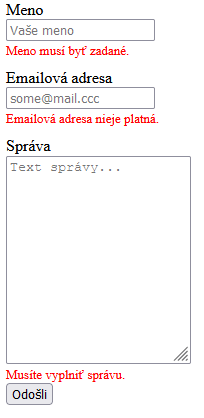
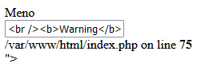

<div class="hidden">

> ## Rozcestník
> - [Späť na úvod](../../README.md)
> - Repo: [Štartér](/../../tree/main/php/contact-form), [Riešenie](/../../tree/solution/php/contact-form).
> - [Zobraziť zadanie](zadanie.md)

# Kontaktný formulár (PHP)
</div>

## Riešenie

<div class="hidden">

> Toto riešenie obsahuje všetky potrebné služby v `docker-compose.yml`. Po ich spustení sa vytvorí:
> - webový server, ktorý do __document root__ namapuje adresár tejto úlohy a nastaví php mail funkciu tak, aby odosielala maily do pripraveného MailHog servera. Port __80__ bude dostupný na adrese [http://localhost/](http://localhost/). Server má pridaný modul pre ladenie [__Xdebug 3__](https://xdebug.org/) nastavený na port __9000__.
> - MailHog server, ktorý sa automaticky prepojí s PHP na porte __8025__ a bude dostupný na adrese [http://localhost:8025/](http://localhost:8025/)
> - V prípade potreby priamého prístupu na SMTP server je tento dostupný na adrese __mailhog:1025__

</div>

Samotné riešenie je rozdelené do niekoľkých častí.

### Vytvorenie kontaktného formulára

Kontaktný formulár si pripravíme v HTML. Bude obsahovať položky pre meno, email a pole pre napísanie správy.
```html
<div class="contact-form">
  <form method="POST">
    <label for="name">Meno</label>
    <input type="text" id="name" name="name" placeholder="Vaše meno">

    <label for="email">Emailová adresa</label>
    <input type="email" id="email" name="email" placeholder="some@mail.sk">

    <label for="content">Správa</label>
    <textarea id="content" name="content" placeholder="Text správy..."></textarea>

    <input type="submit" value="Odošli">
  </form>
</div>
```

Meno je textové pole. Email je tiež textové pole, ktorému sme nastavili typ na `email`. Na text správy sme použili prvok `textarea`, ktorý umožní napísať viacero riadkov textu. Ďalšou časťou je definícia základného CSS, ktoré umožní zobraziť formulár tak, ako bol definovaný v zadaní. Samotný formulár má nastavenú `method="POST"` čo znamená že dáta budú odosielané HTTP metódou POST. Okrem toho sme nikde nešpecifikovali atribút `action`, takže tento formulár sa odošle na rovnakú url adresu, na ktorej sa aktuálne nachádza formulár.

```css
.contact-form input, .contact-form label, .contact-form textarea {
  display: block;
}

.contact-form label {
  margin-top: 10px;
}

.contact-form textarea {
  height: 200px;
}
```

Každému prvku tohto nášho formulára sme nastavili `display: block` preto, aby sme mali jednotlivé elementy zobrazeme pekne pod sebou. Okrem toho sme pridali ďalšie štýlovanie, nastavili sme pomocou `margin-top` rozostup medzi prvkami a pomocou `height` sme nastavili defaultnú výšku poľa na text správy.

### Validácia formulára na strane PHP
Pri nesprávnych hodnotách je potrebné preskočiť posielanie emailu a vrátiť poúživateľovi formulár späť, aj s informáciou o chybách. Keďže formulár odosielame na rovnakú adresu, kde sa aktuálne nachádza, môžme pridať validáciu na začiatok tohto skritu.

> Pre jednoduchosť príkladu budeme uvažovať, že nasledovný kód je v súbore `index.php`, v ktorom sa aktuálne nachádza aj HTML kód formuláru. Pri zložitejšej aplikácii je vhodné určité spoločné funkcionality oddeliť do samostaných súborov, a tieto vkladať do našej stránky pomocou príkazov `include` alebo `require`. 

Validácia v našom prípade môže vyzerať nasledovne:

```php
$errors = [];
$isPost = $_SERVER['REQUEST_METHOD'] == "POST";
if ($isPost) {
  $name = trim($_POST['name']);
  if (empty($name)) {
    $errors['name'] = "Meno musí byť zadané.";
  }
  $email = filter_var($_POST['email'], FILTER_VALIDATE_EMAIL);
  if (!$email) {
    $errors['email'] = "Emailová adresa nieje platná.";
  }
  $content = trim($_POST['content']);
  if (empty($content)) {
    $errors['content'] = "Musíte vyplniť správu.";
  }
}
```

Samotná validácia pozostáva z nasledovných krokov. Na načiatku si deklarujeme premennú, do ktorej bude ukladať validačné chyby. Túto premennú sme si deklarovali ako pole. V ďalšom kroku overíme, či sa jedná o `POST` request. Na overenie môžme použiť viacero možností. V závislosti od použitého servera a konfigurácie nemusia všetky fungovať. Superglobálna premenná `$_SERVER` obsahuje pod kľúčom `REQUEST_METHOD` typ http požiadavky. Tento spôsob bude fungovať vždy. V našom prípade overíme, či `$_SERVER['REQUEST_METHOD']` obsahuje hodnotu `POST`.

Ďalej nasleduje validácia hodnôt jednitlivých časti formulára. Pri všetých validáciach poúživame rovnaký pattern. Najskôr si zo superglobalného poľa `$_POST` načítame hodnotu nášho parametra a vyfiltrujeme ju. Pri mene a obsahu používame funkciu [`trim`](https://www.php.net/manual/en/function.trim.php), ktorá odstráni začiatočné a koncové prázdne znaky. Následne overíme či meno, alebo správa niesu prázdne pomocou funkcie [`empty`](https://www.php.net/manual/en/function.empty.php). Ak takáto je prázdne, tak do poľa chýb `$errors` uložíme pod kľúčom danej premennej textový popis chyby.

```php
$name = trim($_POST['name']);
if (empty($name)) {
  $errors['name'] = "Meno musí byť zadané.";
}
```

Takýmto spôsobom môžme postupne validovať aj ďalšie požiadavky. Ak by sme napíklad chceli, aby meno začínalo veľkým písmenom, môžme dopísať ďalšiu podmienku ktorá pomocou funkcie [`ctype-upper`](https://www.php.net/manual/en/function.ctype-upper.php) skontroluje prvý znak mena, a ak to nieje veľké písmeno, tak priradí chybovú hlášku.

Validácia emailovej adresy je trochu komplikovanejšia. V tomto prípade sme potrebovali overiť, či sa jedná o skutočný email. Možností je niekoľko. Môžme využiť napríklad regulárne výrazy. V php existuje funkcia [`preg_match`](https://www.php.net/manual/en/function.preg-match.php), pomocou ktorej vieme skontrolovať, či náš reťazec spĺňa regulárny výraz. Samotný regulárny výraz na kontrolu emailovej adresy by mohol vyzerať nasledovne:  
```
/^([a-z0-9_\.-]+)@([\da-z\.-]+)\.([a-z\.]{2,6})$/`
```
Tento regulárny výraz ani z ďaleka nepokrýva všetky možné prípady emailovej adresy podľa [RFC2822](https://www.ietf.org/rfc/rfc2822.txt). Preto sa validácia emailovej adresy pomocou tohto prístupu vo všeobecnosti neodporúča.

V PHP existuje funkcia [`filter_var`](https://www.php.net/manual/en/function.filter-var), ktorá umožní pohodlnú kontrolu aj emailovej adresy. V našom prípade sme použili zápis `filter_var($_POST['email'], FILTER_VALIDATE_EMAIL);`, ktorý zoberie hodnotu emailovej adresy z `$_POST` a zvaliduje ju ako emailovú adresu. Funkcia `filter_var` vráti hodnotu, ktorú jej zadáme ako parameter, v prípade ak táto spĺňa všetky filtračné pravidlá. Ak nespĺňa, tak funkcia vráti `false`.

Samotnú kontrolu by sme mali hotovú. V prípade nesprávne vyplného formulára potrebujeme tento formulár zobraziť znovu, a pod každý input field, ktorý obsahuje chybu, by sme chceli dopísať chybovú správu. Znovuzobrazenie formulára neprestavuje žiaden problém, nakoľko sa formulár odosiela na tú istú url adresu, takže sa zobrazí aj v prípade `POST` requestu. Pre zjednodušenie výpisu chybovej hlášky si deklarujeme pomocnú funkciu `printErrorMessage`, ktorá dostane ako parameter pole s chybami a názov inputu, a v prípade že obsahuje toto pole s chybami chybovú správu pre náš input vráti HTML kód chybovej správy.

```php
function printErrorMessage($errors, $key) : string {
  if (isset($errors[$key])) {
    return "<span class='form-error'>{$errors[$key]}</span>";
  }
  return "";
}
```

Následné použitie tejto funkcie na výpis chybových hlásení bude nasledovné:

```html
<label for="name">Meno</label>
<input type="text" id="name" name="name" placeholder="Vaše meno">
<?=printErrorMessage($errors, "name")?>
```

Pre úplnosť uvedieme ešte CSS pravidlo pre naštýlovanie tejto chybovej hlášky:
```css
.form-error {
  color: red;
  font-size: small;
}
```

Toto riešenie nám zobrazí chyby v nasledovnom formáte:


Veľkým problémom tohto riešenia je to, že po odoslaní formuláru sa nám stratia vyplnené údaje, to znamená že ak náhodou zle vyplním emailovu adresu tak prídem nie len o tú, ale aj o celú správu. Takéto správanie aplikácie je neprípustné. Tento problém sa ale dá celkom jednoducho vyriešiť. Html `input` element má atribút `value` pomocou korého môžme nastaviť hodnotu tomuto inputu. Základný pseudokód by tým pádom mohol vyzerať nasledovne:

```html
<input type="text" id="name" name="name" placeholder="Vaše meno" value="<?=$_POST['name']?>">
```

Pokiaľ teraz znovunačítame formulár, tak sa nám zobrazí chybne:



Celý input pre meno je aktuálne rozbitý. Ak chceme vedieť prečo, pozrieme sa do vygenerovaného HTML:

```html
<input type="text" id="name" name="name" placeholder="Vaše meno" value="<br />
<b>Warning</b>:  Undefined array key "name" in <b>/var/www/html/index.php</b> on line <b>75</b><br />
">
```

Ako môžme vidieť, do atribútu `value` sa nám vygenerovala php chybová hláška
```
Warning: Undefined array key "name" in /var/www/html/index.php on line 74
```

Táto chyba nám ukazuje dva problémy tohto prístupu. Prvým je nesprávne použitie superglobálnej premennej `$_POST`, ktorá obsahuje hodnoty len v prípade POST requestu. Druhý problém je problém s escapovavím - ak naša hodnota obsahuje HTML kód tak nám tento kód môže rozbiť celý formulár.

Na ošetrenie tohto problému si pripravíme pomocnú funkciu `getParam`.
```php
function getParam($name) : string|null {
  if (isset($_POST[$name])) {
    return htmlspecialchars(trim($_POST[$name]), ENT_QUOTES);
  }
  else {
    return null;
  }
}
```

Táto funkcia rieši oba spomenuté problémy. Kontrolujeme v nej pomocou funkcie [`isset`](https://www.php.net/manual/en/function.isset) či danú hodnotu máme k dispozícii. Ak máme, tak pomocou funkcie [`htmlspecialchars`](https://www.php.net/manual/en/function.htmlspecialchars) escapujeme všetky html značky. Môžme si všimnúť že sme funkciu použili s parametrom `ENT_QUOTES`, ktorý podľa dokumentácie okrem HTML escapuje aj uvodzovky, čo je v prípade HTML atribútov potrebné.

Následné použitie už bude veľmi jednoduché:
```html
<input type="text" id="name" name="name" placeholder="Vaše meno" value="<?=getParam('name')?>">
```

V prípade poľa na písanie správy, ktoré využíva element `textarea` bude syntax mierne odlišná:

```html
<textarea id="content" name="content" placeholder="Text správy..."><?=getParam('content')?></textarea>
```

### Odosielanie E-Mailu

