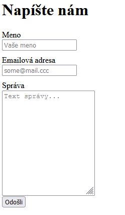

> ## Rozcestník
> - [Späť na úvod](../../README.md)
> - Repo: [Štartér](/../../tree/main/php/contact-form), [Riešenie](/../../tree/solution/php/contact-form)
> - [Zobraziť riešenie](riesenie.md)

# Kontaktný formulár

 

**Hlavný jazyk príkladu**: PHP

**Ostatné použité jazyky**: HTML, CSS

**Obťažnosť**: 2/5

**Obsah príkladu**: Tvorba, spracovanie a validácia formulárov, odosielanie emailov v jazyku PHP.

## Zadanie

Vytvorte kontaktný formulár, ktorý po vyplnení odošle správu na email. Kontaktný formulár umožní zadať meno a emailovú adresu používateľa. Okrem toho bude obsahovať pole, do ktorého je možné napísať text správy ako viacriadkový text. Formulár bude mať implementované základné validačné pravidlá na strane servera:

- Meno a správa nemôžu byť prázdne
- Emailová adresa musí obsahovať platnú emailovú adresu

Formulár by mohol vyzerať nasledovne:

[Zobraziť riešenie](riesenie.md).

