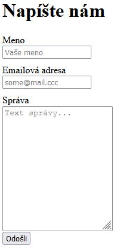

> ## Rozcestník
> - [Späť na úvod](../../README.md)
> - Repo: [Štartér](/../../tree/main/php/contact-form), [Riešenie](/../../tree/solution/php/contact-form)
> - [Zobraziť riešenie](riesenie.md)

# Kontaktný formulár

 

**Hlavný jazyk príkladu**: PHP

**Ostatné použité jazyky**: HTML, CSS

**Obťažnosť**: 2/5

**Obsah príkladu**: Tvorba, spracovanie a validácia formulárov, vkladanie PHP súborov, testovanie a odosielanie emailov v jazyku PHP.

## Zadanie

Vytvorte aplikáciu s kontaktným formulárom, ktorá po správnom vyplnení formulára odošle správu na vopred určenú emailovú adresu. Kontaktný formulár bude umožňovať zadať meno a emailovú adresu používateľa a okrem toho bude obsahovať pole, do ktorého je možné napísať text správy ako viacriadkový text. 

Formulár bude mať implementované základné validačné pravidlá, ktoré budú implementované na strane servera:

- Polia `Meno` a `Správa` nemôžu byť prázdne
- Pole `Emailová adresa` musí obsahovať platnú emailovú adresu

Formulár by mohol vyzerať nasledovne: 

> Všetky potrebné služby sú v `docker-compose.yml`. Po ich spustení sa vytvorí:
> - webový server, ktorý do __document root__ namapuje adresár tejto úlohy a nastaví php mail funkciu tak, aby odosielala maily do pripraveného MailHog servera. Port __80__ bude dostupný na adrese [http://localhost/](http://localhost/). Server má pridaný modul pre ladenie [__Xdebug 3__](https://xdebug.org/) nastavený na port __9000__.
> - MailHog server, ktorý sa automaticky prepojí s PHP na porte __8025__ a bude dostupný na adrese [http://localhost:8025/](http://localhost:8025/)
> - V prípade potreby priamého prístupu na SMTP server je tento dostupný na adrese __mailhog:1025__

[Zobraziť riešenie](riesenie.md).

