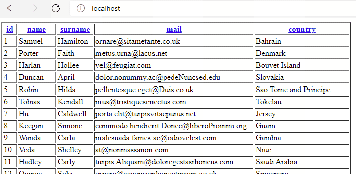
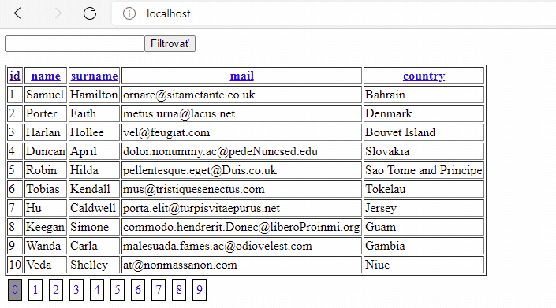
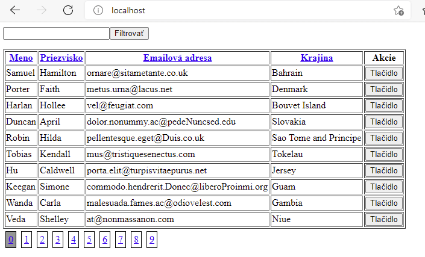

<div class="hidden">

> ## Rozcestník
> - [Späť na úvod](../../README.md)
> - Repo: [Štartér](/../../tree/main/php/data-table), [Riešenie](/../../tree/solution/php/data-table).
> - [Zobraziť zadanie](zadanie.md)

# Dátová tabuľka (PHP)

</div>

## Riešenie

<div class="hidden">

Predpokladáme, že databázový server je spustený a obsahuje tabuľku s dátami, ktoré sú v súbore `data.sql`.

> Toto riešenie obsahuje všetky potrebné služby v `docker-compose.yml`. Po ich spustení sa vytvorí:
> - webový server, ktory do __document root__ namapuje adresár tejto úlohy s modulom __PDO__. Port __80__ a bude dostupný na adrese [http://localhost/](http://localhost/). Server má pridaný modul pre ladenie [__Xdebug 3__](https://xdebug.org/) nastavený na port __9000__.
> - databázový server s vytvorenou _databázov_ a tabuľkou `users` s dátami na porte __3306__ a bude dostupný na `localhost:3306`. Prihlasovacie údaje sú:
>   - MYSQL_ROOT_PASSWORD: heslo
>   - MYSQL_DATABASE: dbtable
>   - MYSQL_USER: db_user
>   - MYSQL_PASSWORD: db_user_pass
> - phpmyadmin server, ktorý sa automatický nastevený na databázový server na porte __8080__ a bude dostupný na adrese [http://localhost:8080/](http://localhost:8080/)

</div>

Samotné riešenie je rozdelené do niekoľkých častí.

### Pripojenie k databáze

Úlohou tohto príkladu je zobrazovanie dát z databázy. Pre pripojenie k databáze využijeme modul PDO. Vytvoríme si triedu `Db`, ktorá bude sprostredkovať pripojenie na databázu. Táto trieda bude mať statickú metódu, ktorá nám vráti inštanciu `PDO`. Účelom tejto triedy je iba vždy sprostredkovať tú istú inštanciu `PDO` pre komunikáciu s databázou, nič iné. Trieda bude vyzerať nasledovne:

```php
class Db {
    private const DB_HOST = "db:3306";
    private const DB_NAME = "dbtable";
    private const DB_USER = "db_user";
    private const DB_PASS = "db_user_pass";

    private static ?PDO $connection = null;

    public static function conn(): PDO
    {
        if (Db::$connection == null) {
            self::connect();
        }
        return Db::$connection;
    }

    private static function connect() {
        try {
            Db::$connection = new PDO("mysql:host=".self::DB_HOST.";dbname=".self::DB_NAME, self::DB_USER, self::DB_PASS);
            Db::$connection->setAttribute(PDO::ATTR_ERRMODE, PDO::ERRMODE_EXCEPTION);
        } catch (PDOException $e) {
            die("Databáza nedostupná: " . $e->getMessage());
        }
    }
}
```

V ďalšom kroku si skúsime vytvoriť jednoduchú entitu, ktorú budeme ukladať do databázy:

```php
class User
{
    public int $id;
    public string $name;
    public string $surname;
    public string $mail;
    public string $country;
}
```

V našom prípade sa jedná o triedu `User`, ktorá reprezentuje osobu. Pre túto entitu si v DB vytvoríme tabuľku nasledovne:

```sql
CREATE TABLE `users`
(
    `id`      mediumint(8) unsigned NOT NULL auto_increment,
    `name`    varchar(255) default NULL,
    `surname` varchar(255) default NULL,
    `mail`    varchar(255) default NULL,
    `country` varchar(100) default NULL,
    PRIMARY KEY (`id`)
);
```

Dáta do našej DB tabuľky si môžeme pripraviť ručne, alebo môžeme využiť niektorý z on-line generátorov. Napríklad generátor [*filldb.info*](http://filldb.info/) umožňuje po vložení schémy automaticky vygenerovať dáta pre našu tabuľku `users`.

Pre prístup k dátam v databáze si vytvoríme triedu `UserStorage`, ktorá bude obsahovať metódu `getAll()`, ktorej úlohou bude vybrať všetky záznamy z tabuľky `users` a vrátiť ich v poli, kde každý riadok bude predstavovať jednu inštanciu triedy `User`.

```php
class UserStorage {
    /**
     * @return User[]
     */
    public function getAll(): array
    {
        try {
            return Db::conn()
                ->query("SELECT * FROM users")
                ->fetchAll(PDO::FETCH_CLASS, User::class);
        }  catch (\PDOException $e) {
            die($e->getMessage());
        }
    }
}
```

### Jednoduchý výpis dát

V ďalšom kroku upravíme súbor `index.php`. Ako prvé potrebujeme vložiť skripty `User.php`, `Db.php` a `UserStorage.php`, ktoré obsahujú definície našich novovytvorených tried. Následne si od  triedy `UserStorage` vypýtame pole všetkých používateľov a vypíšeme ich pomocou cyklu. Kód v `index.php` bude nasledovný:

```php
<?php

require "Db.php";
require "User.php";
require "UserStorage.php";

$storage = new UserStorage();
$users = $storage->getAll();

if ($users) {
    echo "<ul>";
    foreach ($users as $user) {
        echo "<li>{$user->name}</li>";
    }
    echo "</ul>";
}
```

### Výpis do tabuľky

Aby sme dodržali rozdelenie logiky po logických celkoch vytvoríme novú triedu `Table`, ktorej úlohou bude vykreslenie dát DB tabuľky z databázy do HTML tabuľky a doplnenie podpornej logiku pre zoraďovanie, stránkovanie a správu jednotlivých záznamov.

Ako prvé vytvoríme zobrazenie všetkých dát vo forme HTML tabuľky. Na to budeme potrebovať získať názvy stĺpcov tabuľky v databáze. My však pre mapovanie dát používame triedu `User`, stačí nám preto získať zoznam atribútov tejto triedy.

PHP má funkciu [`get_object_vars()`](https://www.php.net/manual/en/function.get-object-vars.php), ktorá vie získať tieto údaje vo forme poľa. Index výsledku je názov verejných inicializovaných atribútov a hodnota je hodnota daného atribútu aktuálnej inštancie. Musíme preto upraviť triedu `User` a doplniť predvolené hodnoty nasledovne:

```php
class User
{
    public int $id = 0;
    public string $name = "";
    public string $surname = "";
    public string $mail = "";
    public string $country = "";
}
```

Do triedy `Table` pridáme privátnu metódu `renderHead()` ktorej účelom bude vytvoriť čisto iba hlavičku HTML tabuľky. Ako prvé získame pole atribútov z inštancie triedy `User`. Následne vytvoríme a inicializujeme premennú `$header`, ktorá slúži ako "zberač" generovaného výstupu.

Následne v cykle `foreach` prechádzame pole atribútov a index vkladáme ako obsah `th` elementu. Výsledok pred vrátením zabalíme do elementu `tr` . Kód metódy `renderHead()` bude nasledovný:

```php
class Table
{
    private function renderHead() : string {
        
        $attribs = get_object_vars(new User());

        $header = "";

        foreach ($attribs as $attribName => $value) {
            $header .= "<th>{$attribName}</th>";
        }

        return "<tr>{$header}</tr>";
    }
}
```

Pridáme ďaľšiu verejnú metódu `render()`, ktorá ma zostaviť celkovú konštrukciu HTML tabuľky vo forme textového reťazca. Aktuálne iba zabalí výsledok metódy `renderHead()` do elementov `table`. Kód bude vyzerať:

```php
class Table
{
    public function render() : string
    {
        return "<table border=\"1\">{$this->renderHead()}</table>";
    }

    private function renderHead() : string {
        // ... 
    }
}
```

Teraz upravíme skript `index.php`, pridáme načítanie skriptu `Table.php` a upravíme kód nasledovne:

```php
<?php

require "Db.php";
require "User.php";
require "UserStorage.php";
require "Table.php";

$usersTable = new Table();

echo $usersTable->render();
```

Výsledkom skriptu je HTML tabuľka zatiaľ iba s hlavičkou. Do triedy `Table` pridáme privátnu metódu  `renderBody()`, ktorá bude generovať samotné riadky s dátami, opäť vo forme reťazca pre jej výstup.

Ako prvé opäť potrebujeme získať zoznam atribútov. Nakoľko tento kód budeme používať na dvoch miestach extrahujeme ju a umiestnime ju do samostatnej metódy `getColumnAttributes()`. Túto metódu budeme volať veľmi často a jej výstup bude vždy rovnaký. Preto si pri jej prvom zavolaní uložíme výsledok do privátneho atribútu `$columnAttribs` a ak bude mať hodnotu, budeme vracať tú. Kód bude vyzerať:

```php
class Table 
{
 
     // ...
 
    private ?array $columnAttribs = null;
    private function getColumnAttributes() :  array
    {
        if ($this->columnAttribs == null) {
            $this->columnAttribs = get_object_vars(new User());
        }
        return $this->columnAttribs;
    }
    
    // ...
}
```

Teraz musíme upraviť metódu `renderHead()` tak aby používala novo vytvorenú metódu `getColumnAttributes()` nasledovne:

```php
class Table 
{
    // ...
    
    private function renderHead() : string {
        $header = "";
        foreach ($this->getColumnAttributes() as $attribName => $value) {
            $header .= "<th>{$attribName}</th>";
        }
        return "<tr>{$header}</tr>";
    }

    // ...
}
```

V metóde `renderBody()` najprv inicializujeme lokálnu premennú `$body` do ktorej budeme postupne zberať jednotlivé riadky tabuľky. V ďaľšom kroku vyberieme všetky dáta z tabuľky `users` vo forme poľa do premennej `$users`, ktoré budeme prechádzať v cykle.

Na začiatku každej iterácie priradíme do premennej `$tr`, do ktorej budeme postupne pridávať hodnoty jednotlivých riadkov. Následne budeme prechádzať pole s atribútmi z `$this->getColumnAttributes()`.

V nasledovnom cykle sa ukladá pri iterácii do premennej `$attribName` hodnota indexu, ktorý predstavuje názov parametra. V PHP je možné použiť hodnotu v premennej pri odkazovaní sa na atribút objektu. Jednoduchá ukážka:

```php
class Test { 
    public int $hodnota = 5;
}

$o = new Test();
$a = "hodnota";
echo $o->$a; // 5
```

Tento princíp použijeme pri vypisovaní dát z objektov, ktoré dostaneme z databázy. Po prechode všetkými atribútmi umiestnime obsah premennej `$tr` do `$body`. Po spracovaní všetkých dát z databázy vrátime obsah `$body` ako výsledok metódy.

```php
class Table
{
    // ...
    private function renderBody() : string
    {
        $userStorage = new UserStorage();
        $body = "";
        $users = $userStorage->getAll();
        foreach ($users as $user) {
            $tr = "";
            foreach ($this->getColumnAttributes() as $attribName => $value) {
                $tr .= "<td>{$user->$attribName}</td>";
            }
            $body .= "<tr>$tr</tr>";
        }
        return $body;
    }
    // ...
}
```

Následne pridáme do metódy `render()` metódu `renderBody()`:

```php
class Table
{
    // ...
    public function render() : string
    {
        return "<table border=\"1\">{$this->renderHead()}{$this->renderBody()}</table>";
    }
    // ...
}
```

### Pridanie zoraďovania

Aby sme mohli tabuľku zoraďovať, musíme vedieť, podľa ktorého stĺpca to máme urobiť. Túto informáciu najčastejšie obsahujú elementy `a`, tieto parametre sa volajú **GET parametre** a pridávajú sa na koniec samotnej URL a oddelujú sa znakom `?`.

Ak máme napríklad URL adresu `http://localhost/?order=country`, tak tá obsahuje parameter `order` s hodnotou `country`. V prípade viacerých parametrov ich oddeľujeme znakom `&` napríklad `http://localhost/?order=country&direction=desc`.

Na prenos informácie o tom, podľa ktorého stĺpca budeme zaradovať, budeme používať GET parameter `order`. Musíme preto upraviť metódu `renderHead()`, kde upravíme zostavovanie jednotlivých elementov `th` tak, že samotný názov hlavičky umiestnime do elementu `a`. Tomu do atribútu `href` pridáme GET parameter `order`, ktorého hodnota bude jeho názov. Upravený kód je:

```php
class Table
{
    // ...
    private function renderHead() : string {
        $header = "";
        foreach ($this->getColumnAttributes() as $attribName => $value) {
            $header .= "<th><a href=\"?order={$attribName}\">{$attribName}</a></th>";
        }
        return "<tr>{$header}</tr>";
    }
    // ...
}
```

Teraz sa nám tabuľka zobrazí s "klikateľnými" názvami stĺpcov v hlavičke. Teraz musíme doplniť logiku na strane servera o samotné zoraďovanie. Predtým ale potrebujeme získať odoslané parametre. Odchytávanie umiestnime do triedy `Table`, nakoľko sa parametre týkajú výlučne tabuľky samotnej a tá preto potrebné dáta musí získať sama. Na úroveň databázy ich potom budeme predávať pomocou parametrov metód. Umiestnením do konštruktora docielime nastavenie parametrov ešte pred spustením získavania dát.

Informácia o tom, ako sa má tabuľka zoradiť, bude uložená v privatnom atribúte `$orderBy`, ktorý inicializujeme hodnotou prázdneho reťazca. Táto hodnota bude znamenať, že tabuľka nie je nijako zoradená.

Parametre GET jazyk PHP automaticky ukladá do _super globálnej premennej_ [$_GET](https://www.php.net/manual/en/reserved.variables.get.php). Tú tvorí asociatívne pole, kde index je názov parametru a jeho hodnota je hodnota prvku. My očakávame, že v tomto poli bude prítomný index `order`, ktorý tam ale byť nemusí. Z tohto dôvodu použijeme operátor typu [_Null coalescing operator_](https://www.php.net/manual/en/migration70.new-features.php), ktorý vracia prvý parameter, ak porovnávaná hodnota existuje a druhý, ak nie.

Úprava triedy `Table` bude nasledovná:

```php
class Table
{
    private string $orderBy = "";
    public function __construct()
    {
        $this->orderBy = ($_GET['order'] ?? "");
    }
    
    // ...
}
```

Teraz musíme upraviť metódu `UserStorage::getAll()` a doplniť do nej vstupný parameter `$sortedBy`, ktorý bude mať prevolenú hodnotu opäť nastavenú ako prázdny reťazec. Vyberáme všetky dáta pomocou SQL príkazu `SELECT * FROM users`, a ak chceme pridať zoradenie, musíme pridať zápis `ORDER BY` s názvom stĺpca a smerom, akým chceme dáta zoradiť.

Názov stĺpca budeme mať vo vstupnej premennej `$sortedBy` a zoradovať budeme zatiaľ iba jedným smerom `ASC`. Zoradenie sa pridáva na koniec pôvodného SQL a musíme overiť, či sa zoraďovať vôbec má. Preto najprv skontrolujeme, či vstupná premenná `$sortedBy` obsahuje hodnotu, a zoradenie do SQL pridáme iba v tom prípade. Upravený kód bude nasledovný:

```php
class UserStorage
{
    /**
     * @return User[]
     */
    public function getAll($sortedBy = ""): array
    {
        $sql = "SELECT * FROM users";

        if ($sortedBy) {
            $sql = $sql . " ORDER BY {$sortedBy} ASC" ;
        }

        try {
            return Db::conn()
                ->query($sql)
                ->fetchAll(PDO::FETCH_CLASS, User::class);
        }  catch (\PDOException $e) {
            die($e->getMessage());
        }
    }
}
```

Touto úpravou však vnášame zraniteľnosť tým, že do SQL dopytu vkladáme priamo hodnotu s _GET parametra_ `order`. Naša aplikácia je náchylná na útoky typu [_SQL injection_](https://www.w3schools.com/sql/sql_injection.asp).

Pokiaľ vkladáme hodnoty, vieme hodnoty zabezpečiť proti tomuto útoku pomocou metód [*PDO preprare statement*](https://code.tutsplus.com/tutorials/why-you-should-be-using-phps-pdo-for-database-access--net-12059). To sa však týka iba hodnôt a nie je možné ich použiť na pridávanie názvov tabuliek alebo názvov stĺpcov. To si budeme musieť ošetriť sami.

Najjednoduchším spôsobom bude preto overiť, či hodnota z GET parametra `order` zodpovedá jednému z názvov stĺpcov, ktoré nám vie vrátiť metóda `Table::getColumnAttributes()`. Pridáme preto do triedy `Table` novú privátnu metódu `isColumnNameValid()`, ktorá bude overovať správnosť hodnoty. Jej kód bude nasledovný:

```php
class Table
{
    // ...

    private function isColumnNameValid($name) : bool {
        return array_key_exists($name, $this->getColumnAttributes());
    }
    
    // ...
}
````

Potom pridáme overenie do konštruktora triedy `Table` tak, že v prípade nesprávnej hodnoty sa pre zoradenie použije prázdny textový reťazec:

```php
class Table
{
    public function __construct()
    {
        $this->orderBy = ($this->isColumnNameValid(@$_GET['order']) ? $_GET['order'] : "");
    }
    // ...
}
````

Teraz potrebujeme upraviť metódu `Table::renderBody()`, tak aby sa pri volaní metódy `UserStorage::getAll()` do nej vkladal parameter `$this->orderBy`. Po úprave bude jej kód nasledovný:

```php
class Table
{
    // ...
    
    private function renderBody() : string
    {
        $body = "";
        $userStorage = new UserStorage();
        $users = $userStorage->getAll($this->orderBy);

        foreach ($users as $user) {
            $tr = "";
            foreach ($this->getColumnAttributes() as $attribName => $value) {
                $tr .= "<td>{$user->$attribName}</td>";
            }
            $body .= "<tr>$tr</tr>";
        }
        return $body;
    }
}
```

Zoraďovanie tabuľky by malo fungovať takto:



### Obojstranné zoraďovanie

Objstranné zoraďovanie bude fungovať tak, že prvým kliknutím na hlavičku stĺpca sa najprv zoradí jedným smerom a následne, keď naň klikneme opäť zoradí sa v opačnom poradí. Budeme musieť preto pridať nový GET parameter `direction`, ktorý:

1. V prípade, že nebude prítomný alebo bude obsahovať inú hodnotu ako `DESC`, zoradí tabuľku podľa daného stĺpca vzostupne.
2. Ak bude prítomný a bude obsahovať hodnotu `DESC`, zoradí danú tabuľku zostupne.

Do triedy `Table` pridáme nový privátny atribút `$direction` a v konštruktore budeme zisťovať jeho prítomnosť v `$_GET` :

```php
class Table
{
     private string $orderBy = "";
     private string $direction = "";

    public function __construct()
    {
        $this->orderBy = ($this->isColumnNameValid(@$_GET['order']) ? $_GET['order'] : "");
        $this->direction = $_GET['direction'] ?? "";
    }
   
    // ... 
}
```

Teraz pridáme do metódy `UserStorage::getAll()` nový vstupný parameter `$sortDirection` a nastavíme mu predvolenú hodnotu vstupu na prázdny textový reťazec. Následne doplníme kontrolu, či vstupný parameter `$sortDirection` obsahuje hodnotu `DESC` a až vtedy do lokálnej premennej `$direc` pridáme hodnotu `DESC` a opačnom prípade do nej priradíme `ASC` (zabránime tak možnému zneužitiu hodnoty GET parametra `direction`). Upravený kód tejto metódy bude vyzerať nasledovne:

```php
class UserStorage
{
    /**
     * @return User[]
     */
    public function getAll($sortedBy = "", $sortDirection = ""): array
    {
        $sql = "SELECT * FROM users";

        if ($sortedBy) {
            $direc = $sortDirection == "DESC" ? "DESC" : "ASC";
            $sql = $sql . " ORDER BY {$sortedBy} {$direc}" ;
        }

        try {
            return Db::conn()
                ->query($sql)
                ->fetchAll(PDO::FETCH_CLASS, User::class);
        }  catch (\PDOException $e) {
            die($e->getMessage());
        }
    }
}
```

Do metódy `Table::renderBody()` doplníme parameter pre zoraďovanie:

```php
class Table
{
    // ...
    private function renderBody() : string
    {
        $body = "";
        $userStorage = new UserStorage();
        $users = $userStorage->getAll($this->orderBy, $this->direction);

        foreach ($users as $user) {
            $tr = "";
            foreach ($this->getColumnAttributes() as $attribName => $value) {
                $tr .= "<td>{$user->$attribName}</td>";
            }
            $body .= "<tr>$tr</tr>";
        }
        return $body;
    }
   
    // ... 
}
```

Posledná úpravu vykonáme v metóde  `Table::renderHead()`, kde musíme nastaviť hodnotu GET parametra `direciton` na `DESC` iba v prípade, ak bol daný stĺpec už zoradený, inak nastavíme hodnotu tohto parametra na prázdny textový reťazec. Úprava bude nasledovná:

```php
class Table
{
    // ...
    private function renderHead() : string {
        $header = "";
        foreach ($this->getColumnAttributes() as $attribName => $value) {
            $direction = $this->orderBy == $attribName && $this->direction == "DESC" ? "" : "DESC";
            $header .= "<th><a href=\"?order={$attribName}&direction={$direction}\">{$attribName}</a></th>";
        }
        return "<tr>{$header}</tr>";
    }
  
    // ... 
}
```

Tabuľka sa bude zoradovať nasledovne:


### Stránkovanie výsledkov

Stránkovanie môžeme implementovať jednoducho pomocou klauzuly [_SQL limit_](https://www.w3schools.com/php/php_mysql_select_limit.asp). Pre zostavenie potrebujeme vedieťi:

1. Koľko záznamov sa má zobraziť na jednej stránke.
2. Ktorá stránka sa aktuálne zobrazuje.

Budeme preto používať ďalší GET parameter `page`, ktorého hodnota bude predstavovať `offset` hodnotu pre `limit` v SQL dopyte. Vzhľadom na zväčšujúci sa počet parametrov, bude najlepšie vytvoriť metódu v triede `Table`, ktorá nám uľahčí generovanie URL pre `a` elementy.

Vytvorime si preto v triede `Table` novú privátnu metódu `prepareUrl()`. Táto metóda bude mať vstupný parameter, ktorý bude pole. Index tohto poľa bude predstavovať názov GET parametra a jeho hodnota hodnotu parametra. Toto pole bude predstavovať parametre, ktorých hodnota sa má upraviť alebo pridať, ak nebudú existovať.

V prvom kroku si vytvoríme kópiu superglobálnej premennej `$_GET` do lokálnej premennej `$temp`, nakoľko toto pole budeme pravdepodobne modifikovať. Následne prechádzame vstupnú premennú `$params`, kde v cykle `foreach` používame ako index tak a hodnotu. Ak má táto premenná nejaké hodnoty priradíme ich do lokálnej premennej `$a`.

Samotný reťazec _GET parametrov_ zostavíme zavolaním funkcie [http_build_query()](https://www.php.net/manual/en/function.http-build-query.php) a doplníme ešte oddelenie _GET parametrov_ v _URL_ pomocou zanaku `?`. Kód metódy je nasledovný:

```php
class Table
{
    // ...

    private function prepareUrl($params = []): string
    {
        $temp = $_GET;
        if ($params){
            foreach ($params as $paramName => $paramValue){
                $temp[$paramName] = $paramValue;
            }
        }
        return "?".http_build_query($temp);
    }
  
    // ... 
}
```

Teraz upravíme generovanie hlavičky v metóde `Table::renderHead()`. V cykle najprv inicializujeme pole s a doplníme do neho parameter `order` aj s hodnotou. Potom budeme kontrolovať, či je už tabuľka zoradená podľa aktuálneho stĺpca. Ak áno, pridáme do poľa index `direction` s hodnotou `DESC`, inak mu nastavíme prázdny textový reťazec.

Upravíme ešte generovanie `href` parametra pre element `a`, tak aby používal metódu `Table::prepareUrl()`. Úprava bude nasledovná:

```php
class Table
{
    // ...

    private function renderHead() : string {
        $header = "";
        foreach ($this->getColumnAttributes() as $attribName => $value) {

            $hrefParams = ['order' => $attribName];

            if ($this->orderBy == $attribName && $this->direction == ""){
                $hrefParams['direction'] = "DESC";
            } else {
                $hrefParams['direction'] = "";
            }

            $header .= "<th><a href=\"{$this->prepareUrl($hrefParams)}\">{$attribName}</a></th>";
        }
        return "<tr>{$header}</tr>";
    }
  
    // ... 
}
```

Môžeme pokračovať pridaním stránkovania. Do triedy `Table` pridáme privátne atribúty a to:

1. `$pageSize` - definuje, koľko záznamov sa bude zobrazovať na jednej stránke.
2. `$page` - určuje, na ktorej stránke sa aktuálne nachádzame, predvolená hodnota bude 0 - na prvej.
3. `$itemsCount` - obsahuje počet záznamov tabuľky
4. `$totalPages` - je celkový počet stránok vzhľadom na počet záznamov

Ako prvé získame dáta z GET parametru `page`. Pre získanie hodnoty vytvoríme novú privátnu metódu `getPageNumber()`, v ktorej budeme hodnotu tohto parametra aj validovať. Kontrolovať budeme tieto podmienky:

1. Je hodnota typu `int`? Ak nie, vrátime hodnotu `0`.
2. Je hodnota menšia ako `0`? Ak áno, vrátime hodnotu `0`.
3. Je hodnota väčšia ako *maximálny počet stránok*? Ak áno, vrátime hodnotu `0`.

Pred získaním a overovaním stránkovania musíme doplniť do triedy `UserStorage` metódu `getCount()`, ktorá vráti celkový počet záznamov v databázovej tabuľke `users`. To zrealizujeme dopytom `SELECT count(*) FROM users` nasledovne:

```php
class UserStorage
{
    // ...
    public function getCount() : int
    {
        return DB::conn()->query("SELECT count(*) FROM users")->fetchColumn();
    }
    // ... 
}
```

Nasleduje získanie aktuálnej stránky:

```php
class Table
{
    // ...

    private int $pageSize = 10;
    private int $page = 0;
    private int $itemsCount = 0;
    private int $totalPages = 0;
    // ...
    
    public function __construct()
    {
        $this->orderBy = ($this->isColumnNameValid(@$_GET['order']) ? $_GET['order'] : "");
        $this->direction = $_GET['direction'] ?? "";

        $this->page = $this->getPageNumber();
    }
    
    private function getPageNumber(): int
    {
        $userStorage = new UserStorage();
        $this->itemsCount = $userStorage->getCount();
        $page =  intval($_GET['page'] ?? 0);
        $this->totalPages = ceil($this->itemsCount / $this->pageSize);
        if (($page < 0) || $page > $this->totalPages){
            return 0;
        }
        return $page;
    }
  
    // ... 
}
```

Ďalším krokom je vytvorenie metódy, ktorá generuje HTML kód s odkazmi pre zmenu zobrazenej stránky. V triede `Table` vytvoríme novú privátnu metódu `renderPaginator()`. V nej vytvoríme pre každú stránku pomocou cyklu element `a` s patričnou hodnotou GET parametru `page`:

```php
class Table
{
    // ...
    private function renderPaginator() : string {
        $r = "";
        for ($i = 0; $i < $this->totalPages; $i++){
            $href = $this->prepareUrl(['page' => $i]);
            $r .= "<a href=\"{$href}\">{$i}</a>";
        }

        return "<div>$r</div>";
    }
    // ... 
}
```

Zobrazíme stránkovanie na spodku tabuľky:
```php
class Table
{
    // ...
    public function render() : string
    {
        return "<table border=\"1\">{$this->renderHead()}{$this->renderBody()}</table>". $this->renderPaginator();
    }
    // ... 
}
```

Teraz upravíme metódu `UserStorage::getAll()` tak, aby bolo do nej možné vložiť parametre definujúce, z ktorej stránky sa majú záznamy zobraziť. Pridáme dva vstupné parametre `$page` a `$pageSize` s predvolenými hodnotami `0` a `10`. Následne rozšírime SQL dopyt o časť [`LIMIT` a `OFFSET`](https://www.sqltutorial.org/sql-limit/).  *Offest* definuje, koľko záznamov sa má preskočiť a ich počet získame vynásobením `$page` a `$pageSize`. Upravený kód bude:

```php
class UserStorage
{
    // ...
    /**
     * @return User[]
     */
    public function getAll($sortedBy = "", $sortDirection = "", $page = 0, $pageSize = 10): array
    {
        $sql = "SELECT * FROM users";

        if ($sortedBy) {
            $direc = $sortDirection == "DESC" ? "DESC" : "ASC";
            $sql = $sql . " ORDER BY {$sortedBy} {$direc}" ;
        }

        $page *= $pageSize;
        $sql .= " LIMIT {$pageSize} OFFSET {$page}";

        try {
            return DB::conn()
                ->query($sql)
                ->fetchAll(PDO::FETCH_CLASS, User::class);
        }  catch (\PDOException $e) {
            die($e->getMessage());
        }
    }
}
```

Teraz môžeme doplniť predanie parametrov o stránke pre zobrazenie do `Table::renderBody()` nasledovne:

```php
class Table
{
    // ...
    private function renderBody() : string
    {
        $body = "";
        $userStorage = new UserStorage();
        $users = $userStorage->getAll($this->orderBy, $this->direction, $this->page, $this->pageSize);

        foreach ($users as $user) {
            $tr = "";
            foreach ($this->getColumnAttributes() as $attribName => $value) {
                $tr .= "<td>{$user->$attribName}</td>";
            }
            $body .= "<tr>$tr</tr>";
        }
        return $body;
    }
    // ... 
}
```

Pri zmene zoradenia je dobré nastaviť zobrazenú stránku na prvú. To urobíme jednoducho, tým že v metóde `Table::renderHead()` pridáme do lokálnej premennej `$hrefParams` index `page` s hodnotou `0`:

```php
class Table
{
    // ...

    private function renderHead() : string {
        $header = "";
        foreach ($this->getColumnAttributes() as $attribName => $value) {

            $hrefParams = [
                'order' => $attribName,
                'page' => 0
            ];

            if ($this->orderBy == $attribName && $this->direction == ""){
                $hrefParams['direction'] = "DESC";
            } else {
                $hrefParams['direction'] = "";
            }

            $header .= "<th><a href=\"{$this->prepareUrl($hrefParams)}\">{$attribName}</a></th>";
        }
        return "<tr>{$header}</tr>";
    }
    // ... 
}
```

Ako posledné pridáme štýlovanie k tlačidlám stránkovača, aby sme vedeli používateľovi zobraziť, ktorú stránku ma aktuálne zobrazenú. Upravíme preto metódu `Table::renderPaginator()` tak, aby elementu `a` aktuálne zobrazenej stránky pridal do atribútu `class` triedu `active`:

```php
class Table
{
    // ...
    private function renderPaginator() : string {

        $r = "";
        for ($i = 0; $i < $this->totalPages; $i++){
            $href = $this->prepareUrl(['page' => $i]);
            $active = $this->page == $i ? "active" : "";
            $r .= "<a href=\"{$href}\" class=\"{$active}\">{$i}</a>";
        }

        return "<div>$r</div>";
    }
}
```

Upravime ešte súbor `index.php` tak aby sme modli doplniť CSS pre stránkovač:

```php
<?php
$usersTable = new Table();
?><html>
<head>
    <style>
        div a {
            display: inline-block;
            margin: 4px;
            padding: 4px;
            border: 1px solid black;
        }
        a.active {
            background-color: #949494;
        }
    </style>
</head>
    <body>
        <?php echo $usersTable->render(); ?>
    </body>
</html>
```

Tabuľka sa nám bude zobrazovať nasledovne:


### Filtrovanie

Ako prvé budeme možnosť filtrovania pridávať do triedy `UserStorage`. Filtrovanie do SQL príkazu pridáva podmienky operátorom `LIKE` do kluzuly `WHERE`. Tu musíme špecifikovať, čo chceme vyhľadávať a v ktorom stĺpci. Taktiež rovnakú filtráciu musíme pridať pri získavaní celkového počtu záznamov, aby sa nám zobrazoval adekvátny počet strán v stránkovači.

Z tohto dôvodu ako prvé vytvoríme v triede `UserStorage` novú privátnu metódu `getFilter()`, ktorej úlohou bude vytvorenie podmienky pre filtrovanie a tú následne pridáme ako do získania celkového počtu záznamov v metóde `UserStorage::getCount()`, tak aj do získavania samotných dát v metóde `UserStorage::getAll()`.

Metóda `getFilter()` bude obsahovať jeden vstupný parameter, a to hodnotu, podľa ktorej chceme výsledky filtrovať. Samotnú podmienku na filtrovanie metóda zostaví iba, ak nebude táto vstupná premenná prázdna.

Nakoľko musíme pre každý stĺpec, v ktorom chceme vyhľadávať, uviesť samostatnú podmienku, môžeme si vytvoriť pole, v ktorom budú názvy stĺpcov pre vyhľadávanie a následne v cykle postupne podmienku zostavovať.

Zoznam stĺpcov je umiestnený v premennej `$searchableColumns` a jednotlivé podmienky budeme ukladať ako pole reťazcov do premennej `$search`. To pospájame do jedného textového reťazca pomocou funkcie [`implode()`](https://www.php.net/manual/en/function.implode.php). Doplníme kľúčové slovo `WHERE` a s každej strany doplníme medzeru, aby sme sa vyhli syntaktickej chybe vo výslednom SQL dopyte.

SQL dopyt umožňuje za znakom `%` definovať ľubovolnú postupnosť znakov medzi pevne stanovenými znakmi v hľadanom výraze. Používatelia sú ale zvyknutý skôr použiť znak `*`. Z tohto dôvodu môžeme v premennej `$filter` vymeniť všetky znaky `*` za znak `%` pomocou PHP funkcie [`str_replace()`](https://www.php.net/manual/en/function.str-replace.php).

Kód metódy bude nasledovný:

```php
class UserStorage
{
    // ...
    private function getFilter($filter = ""){

        if ($filter){
             $filter = str_replace("*","%", $filter);
            $searchableColumns = ["name", "surname", "mail"];
            $search = [];
            foreach ($searchableColumns as $columnName) {
                $search[] = " {$columnName} LIKE '%{$filter}%' ";
            }
            return " WHERE ". implode(" OR ", $search). " ";
        }
        return "";
    }
    // ...
}
```

Najprv filtráciu doplníme do metódy `UserStorage::getCount()` a doplníme vstupnú premennú pre filtrovanie:

```php
class UserStorage
{
    // ...
    public function getCount($filter = "") : int
    {
        return Db::conn()
            ->query("SELECT count(*) FROM users" . $this->getFilter($filter))
            ->fetchColumn();
    }
    // ...
}
```

Teraz modifikujeme metódu `UserStorage::getAll()` a doplníme ju na správne miesto tak, ako to určuje predpis pre zostavenie SQL dopytu:

```php
class UserStorage
{
    /**
     * @return User[]
     */
    public function getAll($sortedBy = "", $sortDirection = "", $page = 0, $pageSize = 10, $filter = ""): array
    {
        $sql = "SELECT * FROM users";

        $sql .= $this->getFilter($filter);

        if ($sortedBy) {
            $direc = $sortDirection == "DESC" ? "DESC" : "ASC";
            $sql = $sql . " ORDER BY {$sortedBy} {$direc}" ;
        }

        $page *= $pageSize;
        $sql .= " LIMIT {$pageSize} OFFSET {$page}";

        try {
            return DB::conn()
                ->query($sql)
                ->fetchAll(PDO::FETCH_CLASS, User::class);
        }  catch (\PDOException $e) {
            die($e->getMessage());
        }
    }
}
```

Ešte potrebujeme upraviť triedu `Table` tak, že jej pridáme nový privátny atribút `$filter` a do jej konštruktora pridáme získanie hodnoty GET parametra `filter`.

Aby sme predišli možnému útoku typu SQL injection bude stačiť, ak v hodnote GET parametra `filter` vymažeme všetky znaky `'`, nakoľko hľadaný výraz je zadávaný ako reťazec medzi znakmi `'` v SQL dopyte. Upravený konštruktor bude:

```php
class Table
{
    // ...
    private string $filter = "";
    
    public function __construct()
    {
        $this->orderBy = ($this->isColumnNameValid(@$_GET['order']) ? $_GET['order'] : "");
        $this->direction = $_GET['direction'] ?? "";
        $this->filter =  str_replace( "'", "",$_GET['filter'] ?? "");

        $this->page = $this->getPageNumber();

    }
    //..
}
```

Ako prvú upravíme metódu `Table::getPageNumber()`. Jediné, čo v nej vykonáme je pridanie parametra, podľa ktorého budeme filtrovať, do volania metódy `UserStorage::getCount()`:

```php
class Table
{
    // ...
    private function getPageNumber(): int
    {
        $userStorage = new UserStorage();
        $this->itemsCount = $userStorage->getCount($this->filter);
        $page =  intval($_GET['page'] ?? 0);
        $this->totalPages = ceil($this->itemsCount / $this->pageSize);
        if (($page < 0) || $page > $this->totalPages){
            return 0;
        }
        return $page;
    }
    //..
}
```

To istú úpravu vykonáme v metóde `Table::renderBody()`:

```php
class Table
{
    // ...
    private function renderBody() : string
    {
        $body = "";
        $userStorage = new UserStorage();
        $users = $userStorage->getAll($this->orderBy, $this->direction, $this->page, $this->pageSize, $this->filter);

        foreach ($users as $user) {
            $tr = "";
            foreach ($this->getColumnAttributes() as $attribName => $value) {
                $tr .= "<td>{$user->$attribName}</td>";
            }
            $body .= "<tr>$tr</tr>";
        }
        return $body;
    }
    //..
}
```

Tým pádom máme pripravený kód pre filtrovanie. Teraz vytvoríme novú privátnu metódu `Table->renderFilter()`, ktorá vráti HTML formulár pre zadanie filtrovaného výrazu.

Do formuláru nedopĺňame žiadne extra atribúty ani nastavenia GET parametrov, nakoľko chceme, aby sa tabuľka po odoslaní filtrovaného výrazu zobrazila na prvej stránke a nebola nezoradená. Jediné, čo je potrebné doplniť, je hodnota atribútu `value` elementu `input`, aby používateľ vedel, podla čoho sa filtrujú výsledky. Metóda bude vyzerať:

```php
class Table
{
    //..
    private function renderFilter() : string{
        return '<form>
        <input name="filter" type="text" value="'.$this->filter.'">
        <button type="submit">Filtrovať</button>
        </form>';
    }
 
}
```

Formulár sa má zobraziť nad tabuľkou, preto ho doplníme do metódy `Table->render()`:

```php
class Table
{
    //...
    public function render() : string
    {
        return $this->renderFilter()
        ."<table border=\"1\">{$this->renderHead()}{$this->renderBody()}</table>"
        . $this->renderPaginator();
    }
    //...
}
```

Dáta v tabuľke sa budú dať filtrovať:



### Vlastné stĺpce

Aktuálna verzia tabuľky automaticky vygeneruje zoznam stĺpcov na základe triedy `User`. V reálnych aplikáciach je ale bežné, že v tabuľke nechceme zobraziť všetky stĺpce (napr. stĺpec `id` sa nezvykne zobrazovať) alebo chceme pomenovať stĺpce inak, ako sa volajú v databáze. Ďalšou bežnou požiadavkou je zobrazenie stĺpca, ktorý bude obsahovať tlačidlá / odkazy na modifikáciu záznamov. Pre tento účel si upravíme tabuľku tak, aby bolo možné programovo definovať stĺpce, ktoré chceme zobrazovať.

Na reprezentáziu stĺpca si pridáme triedu `Column`, ktorá bude obsahovať titulok (to, čo sa má zobraziť v hlavičke tabuľky), názov atribútu a funkciu, ktorá vykreslí obsah konkrétnej bunky v danom stĺpci.

```php
class Column
{
    private string $field;
    private string $title;
    private ?Closure $renderer;
    
    public function __construct(string $field, string $title, Closure $renderer)
    {
        $this->field = $field;
        $this->title = $title;
        $this->renderer = $renderer;
    }

    public function getField(): string
    {
        return $this->field;
    }

    public function getTitle(): string
    {
        return $this->title;
    }

    public function render($row): string
    {
        $renderer = $this->renderer;
        return $renderer($row);
    }
}
```

Trieda obsahuje *get* metódy na názov stĺpca a názov atribútu. Okrem toho obsahuje metódu `render()`, ktorá má ako parameter celý záznam (riadok tabuľky) a má za úlohu vykresliť daný stĺpec pomocou definovanej metódy `render()`. Ako si môžeme všimnúť, v metóde `render()` sme si renderovaciu funkciu, ktorá je uložená v atribúte museli najskôr uložiť do lokálnej premennej a až potom zavolať. Je to z toho dôvodu, že zápis `$this->renderer($row)` by nevykonal funkciu, uloženú v atribúte `$renderer`, ale snažil by sa nájsť metódu `renderer()` v triede `Column`.

Keď máme pripravenú triedu, reprezentujúcu stĺpec tabuľky, pristúpime k jej implementácii do triedy `Table`. V prvom rade si pripravíme atribút `$columns`, ktorý bude obsahovať definíciu stĺpcov tabuľky. Ďalej si pridáme metódu, pomocou ktorej budeme môcť definovať jednotlivé stĺpce tabuľky.

```php
class Table
{
    //...
    /** @var Column[] */
    private array $columns = [];
    
    //...
    public function addColumn(string $field, string $title, ?Closure $renderer = null): self {
        if ($renderer == null) {
            $renderer = fn($row) => htmlentities($row->$field);
        }
        $this->columns[] = new Column($field, $title, $renderer);
        return $this;
    }
    //...
}
```

Metóda obsahuje rovnaké vstupné parametre ako trieda `Column`. Táto metóda v princípe len vytvorí novú inštanciu triedy `Column` a zaradí ho do zoznamu. Aby sme nemuseli vždy špecifikovať spôsob vykreslenia každej hodnoty, tak sme spravili parameter `$renderer` ako volitelný. Ak ho nevyplníme, tak impelementujeme východzie vykreslovanie tak, že vypíšeme len hodnotu daného atribútu a ošetríme ju pomocou PHP funkcie `htmlentities()`.

V tomto príklade sme na vytvorenie objektu typu `Closure` využili *lambda* funkciu, ktorá sa v PHP definuje pomocou kľúčového slova `fn`.

Táto metóda má návratovú hodnotu typu `self` a vráti `$this`. Tento prístup sa často používa pri metódach, ktoré slúžia na nastavenie určitých vlastností objektu. Vďaka tomu ich môžeme volať zreťazene:

```php
$table->addColumn(...)
    ->addColumn(...)
    ->addColumn(...);
```

Ďalej musíme upraviť metódy na generovanie hlavičky a tela tabuľky tak, aby využívali takto definované stĺpce. Metóda `renderHead()` bude vyzerať takto:

```php
class Table
{
    //...
    private function renderHead() : string 
    {
        $header = "";
        foreach ($this->columns as $column) {
            if (empty($column->getField())) {
                $header .= "<th>{$column->getTitle()}</th>";
            }
            else {
                $hrefParams = [
                    'order' => $column->getField(),
                    'page' => 0
                ];
    
                if ($this->orderBy == $column->getField() && $this->direction == "") {
                    $hrefParams['direction'] = "DESC";
                } else {
                    $hrefParams['direction'] = "";
                }
    
                $header .= "<th><a href=\"{$this->prepareUrl($hrefParams)}\">{$column->getTitle()}</a></th>";
            }
        }
        return "<tr>{$header}</tr>";
    }
    //...
}
```

Namiesto `retColumnAttributes()` teraz prechádzame zoznamom stĺpcov definovaných v atribúte `$columns`. Okrem toho si na tomto kóde môžeme všimnúť ešte jednu zmenu. Pridali sme na začiatok podmienku `empty($column->getField())`. Touto podmienkou zabezpečíme, že stĺpce, ktoré nemajú ekvivalent v databáze, sa nebudú dať triediť.

Ďalšou metódou, ktorú musíme upraviť je metóda `renderBody()`:

```php
class Table
{
    //...
    private function renderBody() : string
    {
        $body = "";
        $userStorage = new UserStorage();
        $users = $userStorage->getAll($this->orderBy, $this->direction, $this->page, $this->pageSize, $this->filter);
    
        foreach ($users as $user) {
            $tr = "";
            foreach ($this->columns as $column) {
                $tr .= "<td>{$column->render($user)}</td>";
            }
            $body .= "<tr>$tr</tr>";
        }
        return $body;
    }
    //...
}
```

Tu je podobne, ako v predchádzajúcom prípade, zmena len v tom, že namieto `$this->getColumnAttributes()` iterujeme cez `$columns` a výstup generujeme cez `$column->render($user)`. Metóda `getColumnAttributes()` bola ešte používaná pri validácii parametru pri zoraďovaní stĺpcov. Upravíme pre to ešte metódu `isColumnNameValid()`:

```php
class Table
{
    //...
    private function isColumnNameValid($name) : bool {
        return !empty($name) && in_array($name, array_map(fn(Column $c) => $c->getField(), $this->columns));
    }
    //...
}
```

Tento raz kontrolujeme, či názov stĺpca, podľa ktorého zoraďujeme, nie je prázdny (pretože reálne stĺpce tabuľky môžu obsahovať napríklad pole s akciami, tj. neodkazujú sa na DB atribút a zoraďovanie podľa tohto poľa nie je dovolené). Okrem toho sme pomocou funkcie `array_map()` transformovali pole objektov typu `Column` na pole reťazcov, v ktorom následne vyhľadávame. V tomto momente môžeme odstrániť metódu `getColumnAttributes()` a atribút `$columnAttribs`.

Poslednou úpravou, ktorú musíme spraviť, je presunutie kontroly atribútu `$order` z konštruktora do metódy `renderBody()`, pretože v konštruktore ešte nemáme k dispozícii zoznam definovaných stĺpcov.

V konštruktore upravíme:

```php
$this->orderBy = $_GET['order'] ?? "";
```

Na začiatok metódy `renderBody()` pridáme:

```php
class Table
{
    //...
    private function renderBody() : string
    {
        $this->orderBy = $this->isColumnNameValid($this->orderBy) ? $this->orderBy : "";
        //...
    }
    //...
}
```

Pre zobrazenie pôvodnej tabuľky upravíme `index.php`:

```php
$usersTable = new Table();
$usersTable->addColumn("id", "ID")
    ->addColumn("name", "Meno")
    ->addColumn("surname", "Priezvisko")
    ->addColumn("mail", "Emailová adresa")
    ->addColumn("country", "Krajina");
```

Pokiaľ by sme chceli pridať pole s tlačidlami do každého riadku, môžeme tak urobiť nasledovne:

```php
$usersTable->addColumn("", "Akcie", function (User $user) {
    return '<button onclick="alert(' . $user->id . ')">Tlačidlo</button>';
});
```

V tomto príklade uvádzame prázdny názov atribútu, na ktorý sa daný stĺpec viaže - nebude sa podľa tohto stĺpca dať zoraďovať. Ako tretí parameter definujeme anonymnú funkciu, ktorá ako parameter dostane entitu používateľa a vykreslí jednoduché tlačidlo, ktoré po stlačení vypíše ID daného používateľa.



### Univerzálny zdroj dát

Naša tabuľka aktuálne zobrazuje dáta len z tabuľky `users`. Pre zovšeobecnenie nášho návrhu si pridáme interface `ITableSource`, ktorý bude definovať metódy na získanie dát.

```php
interface ITableSource
{
    public function getCount(?string $filter = null): int;

    public function getAll(?string $sortedBy = "", ?string $sortDirection = "", int $page = 0, int $pageSize = 10, ?string $filter = ""): array;
}
```

Rovnaké metódy už implementuje naša trieda `UserStorage`, takže aby ju bolo možné použiť ako zdroj dát pre triedu `Table` musíme pridať do hlavičky triedy kľúčové slovo `implements`.

```php
class UserStorage implements ITableSource
{
    //...
}
```

Triedu `Table` upravíme tak, že ako parameter konštruktora získa inštanciu typu `ITableSource`, ktorú si uloží do atribútu `$dataSource`:

```php
class Table
{
    //...
    private ITableSource $dataSource;
   
    public function __construct(ITableSource $dataSource)
    {
        $this->dataSource = $dataSource;
        //...
    }
    //...
}
```

Následne upravíme metódy `renderBody()` a `getPageNumber()` tak, aby si nevyrábali vždy nový `UserStorage` ale využívali atribút `$dataSource`.

```php
class Table
{
    //...
    private function getPageNumber(): int
    {
        $this->itemsCount = $this->dataSource->getCount($this->filter);
        $page =  intval($_GET['page'] ?? 0);
        $this->totalPages = ceil($this->itemsCount / $this->pageSize);
        if (($page < 0) || $page > $this->totalPages){
            return 0;
        }
        return $page;
    }
    
    private function renderBody() : string
    {
        $body = "";
        $this->orderBy = $this->isColumnNameValid($this->orderBy) ? $this->orderBy : "";
        $rows = $this->dataSource->getAll($this->orderBy, $this->direction, $this->page, $this->pageSize, $this->filter);

        foreach ($rows as $row) {
            $tr = "";
            foreach ($this->columns as $column) {
                $tr .= "<td>{$column->render($row)}</td>";
            }
            $body .= "<tr>$tr</tr>";
        }
        return $body;
    }
}
```

V súbore `index.php` upravíme deklaráciu tabuľky tak, že v konštruktore jej nastavíme inštanciu `UserStorage`:

```php
$userStorage = new UserStorage();
$usersTable = new Table($userStorage);
$usersTable->addColumn("name", "Meno")
    ->addColumn("surname", "Priezvisko")
    ->addColumn("mail", "Emailová adresa")
    ->addColumn("country", "Krajina")
    ->addColumn("", "Akcie", function (User $user) {
        return '<button onclick="alert(' . $user->id . ')">Tlačidlo</button>';
    });
```

V prípade, že by sme chceli v tabuľke zobraziť inú dátovú entitu, stačí implementovať príslušný `Storage` a nastaviť požadované stĺpce.
