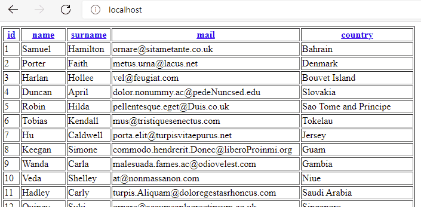

<div class="hidden">

> ## Rozcestník
> - [Späť na úvod](../../README.md)
> - Repo: [Štartér](/../../tree/main/php/dbtable), [Riešenie](/../../tree/solution/php/dbtable).
> - [Zobraziť zadanie](zadanie.md)

# Dátová tabuľka (PHP)
</div>

## Riešenie

Predpokladáme, že databázový server je spustený a obsahuje tabuľku s dátami, ktoré sú v súbore `data.sql`.

<div class="hidden">

> Toto riešenie obsahuje všetky potrebné služby v `docker-compose.yml`. Po ich spustení sa vytvorí:
> - webový server, ktory do __document root__ namapuje adresár tejto úlohy s modulom __PDO__. Port __80__ a bude dostupný na adrese [http://localhost/](http://localhost/). Server má pridaný modul pre ladenie [__Xdebug 3__](https://xdebug.org/) nastavený na port __9000__.
> - databázový server s vytvorenou _databázov_ a tabuľkou `users` s dátami na porte __3306__ a bude dostupný na `localhost:3306`. Prihlasovacie údaje sú:
    >   - MYSQL_ROOT_PASSWORD: heslo
>   - MYSQL_DATABASE: dbtable
>   - MYSQL_USER: db_user
>   - MYSQL_PASSWORD: db_user_pass
> - phpmyadmin server, ktorý sa automatický nastevený na databázový server na porte __8080__ a bude dostupný na adrese [http://localhost:8080/](http://localhost:8080/)

</div>

Samotné riešenie je rozdelené do niekoľkých častí.

### Jednoduché pripojenie a čítanie dát z databázy

Ako prvé je potrebné mať v __PHP__ zapnutý modul [__PDO__](https://www.php.net/manual/en/pdo.installation.php). Ten doĺňa do _PHP_ funkcionalitu pre prácu s _relačnou databázou_. Pokiaľ chceme komunikovať s _databázou_ musíme najprv vytvoriť inštanciu triedy `PDO`, ktorá bude následne predstavovať jej prístupový bod.

Pre jej vytvorenie potrebujeme zadať nutné parametre jej [konštrukora](https://www.php.net/manual/en/pdo.construct.php), ktoré sú:

1. __connection string__ - textový reťazec, ktorý obsahuje informácie o tom, kde sa nachádza databázový server
2. __meno__ - textový reťazec obsahujúci názov používateľského konta pre databázu
3. __heslo__ - textový reťazec obsahujúci heslo používateľského konta pre databázu

Pripojenie v našom prípade bude vytvorenie inštancie `PDO` vyzerať nasledovne:

```php
try {
    $pdo = new PDO('mysql:host=db:3306;dbname=dbtable', "db_user", "db_user_pass");
} catch (PDOException $e) {
    die("Error!: " . $e->getMessage());
}
```

Funkcia  [`die()`](https://www.php.net/manual/en/function.die.php) ukončí okamžite beh skriptu a ako výstup vráti vloženú hodnotu. Jej ekvivalentom a správnejším pre použite je [`exit()`](https://www.php.net/manual/en/function.exit.php). Jediným rozdielom je strata "poetickosti" kódu pri použití `exit()`.

Použitie [`try-catch`](https://www.php.net/manual/en/language.exceptions.php) bloku je potrebné pre prípadne odchytenie chyby, ktorá môže nastať pri vytváraní pripojenia na _databázu_. V prípade ak nastane, tak sa výnimka odchytí a používateľovi sa vypíše chybová hláška.

Naša databáza obsahuje tabuľku `users` v ktorej je pridaných _100_ záznamov. Najjednoduchším spôsobom ako ich získať pre použitie v našom _PHP_ skripte bude použiť metódu [`PDO::query()`](https://www.php.net/manual/en/pdo.query.php), ktorá vyžaduje vstupný parameter ktorý predstavuje __SQL dotaz__ v podobe textového reťazca. V našom prípade chceme získať naraz všetky dáta tabuľky `users`. Naš _SQL dotaz_ bude preto veľmi jednoduchý: `SELECT * FROM users`.

Metóda `PDO::query()` vracia výsledok operácie z _databázy_ v podobe inštancie triedy [`PDOStatement`](https://www.php.net/manual/en/class.pdostatement.php) ak databáza nájde výsledok alebo `false` ak nenájde nič. Taktiež je potrebné použiť `try-catch` blok v prípade, že by nastala nejaká chybová situácia.

Ak chceme získať dáta v iterovaťelnej podobe, musíme zavolať metodu [`PDOStatement::fetchAll()`](https://www.php.net/manual/en/pdostatement.fetchall.php). Tá má vstupný parameter, ktorý upresňuje spôsob akým su jednotlivé riadky tabuľky transformované na dáta použiteľné v _PHP_. Na začiatok použijeme hodnotu `PDO::FETCH_ASSOC`, ktorá vráti riadky v podobe asociatívnych polí.

Následne stačí iba overiť či nám `PDOStatement::fetchAll()` nevrátila hodnotu `false`. A nie, výsledkom je pole polí z celým obsahom tabuľky `users`, ktoré vieme v _PHP_ prechádzať pomocou cyklu [`foreach`](https://www.php.net/manual/en/control-structures.foreach.php). Jednotlivé riadky sú predstavané polom, kde index v danom poli má prestne taký istý názov ako v _databáze_. Ukažka obsahu jedného riadku:

```
Array
(
    [id] => 1
    [name] => Samuel
    [surname] => Hamilton
    [mail] => ornare@sitametante.co.uk
    [country] => Bahrain
)
```

Kód pre jednoduché vypísanie obsahu bude vyzerať nasledovne:

```php
try {
    $pdo = new PDO('mysql:host=db:3306;dbname=dbtable', "db_user", "db_user_pass");
} catch (PDOException $e) {
    die("Error!: " . $e->getMessage());
}

try {
    $sql = 'SELECT * FROM users';
    $result = $pdo->query($sql);

    $users = $result->fetchAll(PDO::FETCH_ASSOC);

    if ($users) {
        echo "<ul>";
        foreach ($users as $user) {
            echo "<li>{$user['name']}</li>";
        }
        echo "</ul>";
    }
} catch (\PDOException $e) {
    die($e->getMessage());
}
```

### Pokročilejšia implementácia

Skúsme teraz navrhnúť lepšiu štruktúru riešenia. Vytvoríme preto ako prvé objekt, ktorý bude predstavovať prístupový bod čisto pre komunikáciu s databázou. Preto v samostatnom súbor vytvoríme triedu `Db`. K tejto triede budeme chcieť pristupovať z rôznych častí kódu a budeme chcieť aby bola pre celu našu aplikáciu vytvorená a používaná jedna jediná jej inštancia.

Implementujeme do nej návrhový vzor __signleton__. Nakoľko nepoužívame dômyselnejší framework alebo knižnice, implementujeme __singleton__ pomocou statických metód. To z dôvodu, že _PHP_ nepodporuje statický konštruktor.

Naša trieda `Db` bude obsahovať _privátny statický atribút_ `$db`, ktorý nie je možné inicializovat pri jeho definícií. Musíme preto vytvoriť statickú metódu, ktorá bude slúžiť ako jeho  _getter_.  Pred vrátením hodnoty statického atribútu `Db::$db` métoda najpr overí či existuje a ak nie tak vytvorí novú inštanciu a priradí ju doň.

Je ale potrebné všetky ešte statický atribút inicializovať priradením hodnoty `null` a označit jeho typ ako [`nullable`](https://www.php.net/manual/en/migration71.new-features.php).

Implementácia _singleton_ bude v _PHP_ vyzerať nasledovne:

```php
class Db {
    private static ?Db $db = null;
    public static function i()
    {
        if (Db::$db == null) {
            Db::$db = new Db();
        }
        return Db::$db;
    }
}
```

Teraz vytvoríme konštruktor triedy pridaním metódy `__construct()` do triedy `Db`. V konštruktore budeme vytvárať novú inštanciu triedy `PDO`, ktorú priradíme do privátneho atribútu `$pdo`. Taktiež z _connection stringu_ vyberieme dáta pre pripojenie do databázy a umiestnime ich, tiež, do privátnych atribútov.

Úprava triedy `Db`  bude vyzerať nasledovne:

```php
class Db {
    
    // ... 
    
    private PDO $pdo;

    private string $dbHost = "db:3306";
    private string $dbName = "dbtable";
    private string $dbUser = "db_user";
    private string $dbPass = "db_user_pass";

    public function __construct()
    {
        try {
            $this->pdo = new PDO("mysql:host={$this->dbHost};dbname={$this->dbName}", $this->dbUser, $this->dbPass);
        } catch (PDOException $e) {
            die("Error!: " . $e->getMessage());
        }
    }
}
```

Teraz vytvoríme triedu `User` (v samostatnom súbore), ktorá bude reprezentovať jednotlivé dátové riadky a následne ju budeme používať pri práci s databázou. Táto trieda bude obsahovať iba verejne atribúty pomenované rovnako ako sú stĺpce tabuľky `users` v databáze. Trieda bude nasledovná:

```php
class User
{
    public int $id;
    public string $name;
    public string $surname;
    public string $mail;
    public string $country;
}
```

Do triedy `Db` teraz pridáme metódu `Db->getAllUsers()`, ktorej úlohou bude vybrať všetky záznamy z tabuľky `users` a vrátiť ich v poli, kde každý riadok bude predstavovať jedna inštancia triedy `User`.

To docielime tým, že metódu `PDOStatement::fetchAll()`, zavoláme s dvoma parametrami a to s prvou hodnotou `PDO::FETCH_CLASS` a následne s názvom triedy, na ktorú sa budú mapovať dáta jednotlivých riadkov (preto sa musia atribúty triedy volať rovnako ako stĺpce riadkov).

Tu doporučujeme vkladať názov pomocou atribútu [`::class`](https://www.php.net/manual/en/language.oop5.basic.php), ktorý sa bude meniť podla toho ako budeme presúvať trie bu v mennom priestore alebo ju premenujeme. Kód metódy môžeme zapísať nasledovne:

```php
class Db {
    
    // ... 
    
    /**
     * @return User[]
     */
    public function getAllUsers(): array
    {
        try {
            return $this->pdo
                ->query("SELECT * FROM users")
                ->fetchAll(PDO::FETCH_CLASS, User::class);
        }  catch (\PDOException $e) {
            die($e->getMessage());
        }
    }
}
```

Problém pri _PHP_ a iných dynamicko-typovaných jazykoch sa skrýva v komplikovanom získavaní toho, čo nam čo vracia a čo za typ parametrov funkcie alebo metódy potrebujú. PHP postupne túto medzeru vypĺňa ale nie úplne dobre. Naša metóda `getAllUsers()` síce hovorí, že jej výstup je pole ale nemôžeme už zadefinovať čo konkrétne je v poli (aj keď v php podporuje nehomogénne polia...).

Na pomoc nám tu prichádza [_PHPDoc_](https://www.phpdoc.org/), ktorý sa definuje v komentáre metódy a ten hovorí, že metóda vracia pole inštancií typu `User`. Aj keď je tento zápis zdĺhavejší, poskytuje ohromnú výhodu v tom, že vaše _IDE_ vie následné použiť tiet informácie pri automatickom dopĺňaní atribútom a hlavne bude poriadne fungovať _refaktoring_ a to za tu trošku námahy rozhodne stojí.


Následne potrebujeme upraviť náš `index.php`. Ako prvé potrebujeme pridať skrtipty `user.php` a `db.php`, ktoré obsahujú definície našich novo vytvorených tried. Následne si od našej triedy `Db` vypítame pole všetkých používateľov a vypíšeme ich tak ako predtým, akurať už k jednotlivým záznamom budeme pristupivať ako k objektom typu `User`. Kód v `index.php` bude nasledovný:

```php
<?php

require "User.php";
require "Db.php";

$users = Db::i()->getAllUsers();

if ($users) {
    echo "<ul>";
    foreach ($users as $user) {
        echo "<li>{$user->name}</li>";
    }
    echo "</ul>";
}
```

### Výpis do tabuľky

Aby sme dodržali rozdelenie logiky po logických celkoch vytvoríme novú triedu `Table` ktorej zmyslom bude vykreslenie dát tabuľky z databázy do HTML tabuľky a dopĺňať podpornú logiku pre zoraďovanie, stránkovanie a správu jednotlivých záznamov.

Ako prvé vytvoríme zobrazenie všetkých dát vo forme HTML tabuľky. Na to budeme potrebovať získať názvy stĺpcov tabuľky v databáze.  My však pre mapovanie dát používame triedu `User`, stačí nám preto zístak zoznam atribútov tejto triedy.

PHP má funkciu [`get_object_vars()`](https://www.php.net/manual/en/function.get-object-vars.php), ktorá vie získať tieto údaje vo forme pola. Index výsledku je názov verejných inicializovaných atribútov a hodnota je hodnota daného atribútu aktuálnej inštancie. Musíme preto upraviť triedu `User` a doplniť predvolené hodnoty nasledovne:

```php
class User
{
    public int $id = 0;
    public string $name = "";
    public string $surname = "";
    public string $mail = "";
    public string $country = "";
}
```

Do triedy `Table` pridáme privátnu metódu `RenderHead()` ktorej účelom bude vytvoriť čisto iba hlavičku HTML tabuľky. Ako prvé získame pole atribútov z inštancie triedy `User`. Následne vytvoríme a inicializujeme premennú `$header`, ktorá slúži ako "zberač" generovaného výstupu.

Následne v cykle `foreach` prechádzame pole atribútov a index vkladamé ako obsah `<th>` elementu. Výsledok pred vrátením zabalíme do `<tr>` elementu. Kód metódy `RenderHead()` bude nasledovný:

```php
class Table
{
    private function RenderHead() : string {
        
        $attribs = get_object_vars(new User());

        $header = "";

        foreach ($attribs as $attribName => $value) {
            $header .= "<th>{$attribName}</th>";
        }

        return "<tr>{$header}</tr>";
    }
}
```

Pridáme ďaľšiu verejnú metódu `Render()`, ktorá ma zostaviť celkovú konštrukciu HTML tabuľky vo forme textového reťazca. Aktuálne iba zabalí výsledok metódy `RenderHead()` do elementov `<table>`. Kód bude vyzerať:

```php
class Table
{
    public function Render() : string
    {
        return "<table border=\"1\">{$this->RenderHead()}</table>";
    }

    private function RenderHead() : string {
        // ... 
    }
}
```

Teraz upravíme náš skript `index.php`, pridáme načítanie skriptu `Table.php` a upravíme kód nasledovne:

```php
<?php

require "User.php";
require "Db.php";
require "Table.php";

$usersTable = new Table();

echo $usersTable->Render();
```

Výsledkom skriptu je HTML tabuľky momentálne iba s hlavičkou. Do triedy `Table` pridáme privátnu metódu  `RenderBody()`, ktorá bude generovať samotné riadky s dátami, opäť vo forme stringu pre jej výstup.

Ako prvé opäť potrebujeme získať zoznam atribútov. Nakoľko túto logiku budeme používať na dvoch miestach extrahujeme ju a umiestnime ju do samostatnej metódy `GetColumnAttributes()`. Túto metódu budeme volať veľmi často a jej výstup bude vždy rovnaký. Preto si pri jej prvom zavolaní uložíme výsledok do privátneho atribútu `$columnAttribs` a ak bude mať hodnotu, budeme vracať tú. Kód bude vyzerať:

```php
class Table {
 
     // ...
 
    private ?array $columnAttribs = null;
    private function GetColumnAttributes() :  array
    {
        if ($this->columnAttribs == null) {
            $this->columnAttribs = get_object_vars(new User());
        }
        return $this->columnAttribs;
    }
    
    // ...
}
```

Teraz musíme upraviť metódu `RenderHead()` tak aby používala novo vytvorenú metódu `GetColumnAttributes()` následovne:

```php
class Table {
    // ...
    
    private function RenderHead() : string {
        $header = "";
        foreach ($this->GetColumnAttributes() as $attribName => $value) {
            $header .= "<th>{$attribName}</th>";
        }
        return "<tr>{$header}</tr>";
    }

    // ...
}
```

V metóde `RenderBody()` si najprv inicializujeme lokálnu premennú `$body` do ktorej budeme postupne zberať jednotlivé riadky tabuľky. V ďaľšom kroku vyberieme všetky dáta z tabuľky `users` vo forme pola do premennej `$users`, ktoré budeme prechádzať v cykle.

Na začiatku každej iterácie priradíme do premennej `$tr` do ktorej budeme postupne pridávať hodnoty jednotlivých riadkov. Následne budeme prechádzať pole s atribútmi z `$this->GetColumnAttributes()`.

V nasledovnom cykle sa ukladá pri iterácií do premennej `$attribName` hodnote indexu, ktorý predstavuje názov parametra. V php je možné použiť hodnotu v premennej pri odkazovaní sa na atríbút objektu. Jednoduchá ukážka:

```php
class Test { 
    public int $hodnota = 5;
}

$o = new Test();
$a = "hodnota";
echo $o->$a; // 5
```

Tento princíp použijeme pri vypisovaní dát z objektov, ktoré dostaneme z databázy. Po prejdení všetkých atribútov umiestnime obsah premennej `$tr` do `$body`. Pro prejdení všetkých dát z databázy vrátime obsah `$body` ako výsledok metódy.

```php
class Table
{
    // ...
    private function RenderBody() : string
    {
        $body = "";
        $users = DB::i()->getAllUsers();
        foreach ($users as $user) {
            $tr = "";
            foreach ($this->GetColumnAttributes() as $attribName => $value) {
                $tr .= "<td>{$user->$attribName}</td>";
            }
            $body .= "<tr>$tr</tr>";
        }
        return $body;
    }
    // ...
}
```

Následne pridáme do metódy `Render()` metódu `RenderBody()` následovne:

```php
class Table
{
    // ...
    public function Render() : string
    {
        return "<table border=\"1\">{$this->RenderHead()}{$this->RenderBody()}</table>";
    }
    // ...
}
```

### Pridanie zoraďovania

Aby sme mohli tabuľku zoraďovať, musíme vedieť podľa ktorého tak máme urobiť. Túto informáciu najčastejšie prostredkuvávajú "klikacie odkazy" - elementy `<a>`, tieto parametre sa volajú __GET parametre__ a pridávajú sa na koniec samotnej URL a oddelujú sa znakom `?`.

Ak máme napríklad URL `http://localhost/?order=country`, tak tá obsahuje parameter `order` s hodnotou `country`. V pripade viacerých parametrov ich oddeľujeme znakom `&` napríklad `http://localhost/?order=country&color=red`.

Pre prenos informácie o tom, podľa ktorého stĺpca budeme zaradovať, budeme používať GET parameter `order`. Musíme preto upraviť metódu `RenderHead()`, kde upravíme zostavovanie jednolistových elementov `<th>` tak, že samotný názov hlavičky umiestnime do  elementu `<a>`. Tomu do parametra `href` pridáme _GET parameter_ `order` ktorého hodnota bude jeho názov. Upravený kód je:

```php
class Table
{
    // ...
    private function RenderHead() : string {
        $header = "";
        foreach ($this->GetColumnAttributes() as $attribName => $value) {
            $header .= "<th><a href=\"?order={$attribName}\">{$attribName}</a></th>";
        }
        return "<tr>{$header}</tr>";
    }
    // ...
}
```

Teraz sa nám tabuľka zobrazí s "klikateľnymi" názvami stĺpcov v hlavičke. Teraz musíme doplniť logiku na strane servera o samotné zoraďovanie. Predtým ale potrebujeme získať odoslané parametre. Odchytávanie umiestnime do triedy `Table`, nakoľko sa parametre týkajú výlučne tabuľky samotnej a tá preto potrebné dáta musí získať sama. Na úroveň databázy ich potom budeme predávať pomocou parametrov metód. Umiestnením do konštruktora docielime nastavenie parametrov ešte pred spustením samotnej logiky.

Informácia o tom ako sa má tabuľka zoradiť bude uložená v privatnom atribúte `$orderBy`, ktorý inicializujeme hodnotou prázdneho stringu, táto hodnota bude znamenať, že tabuľka nie je nijako zoradená.

_Parametre GET_ _PHP_ automaticky ukladá do _super globálnej premennej_ [$_GET](https://www.php.net/manual/en/reserved.variables.get.php). Tú tvorí asociatívne pole, kde index je názov parametru a jeho hodnota je jeho hodnota. My očakávame, že v tomto poli bude prítomný index `order`, ktorý tam ale byť nemusí. Z tohto dôvodu použijeme [_Null coalescing operator_](https://www.php.net/manual/en/migration70.new-features.php), ktorý vracia prvý parameter ak existuje a druhý ak nie.

Úprava triedy `Table` bude nasledovná:

```php
class Table
{
    private string $orderBy = "";
    public function __construct()
    {
        $this->orderBy = ($_GET['order'] ?? "");
    }
    
    // ...
}
```

Teraz musíme upraviť metódu `Table->getAllUsers()` a doplniť do nej vstupný parameter `$sortedBy`, ktorý bude mať prevolenú hodnotu opäť nastavenú ako prázdny string. Momentálne vyberáme všetky dáta pomocou SQL `SELECT * FROM users` a ak chceme pridať zoradenie musíme pridať zápis `ORDER BY` s názvom stĺpca a smerom akým chceme dáta zoradiť.

Názov stĺpca budeme mať vo vstupnej premennej `$sortedBy` a zaradovať budeme zatiaľ iba jedným smerom `ASC`. Zoradenie sa pridáva na koniec pôvodného SQL a musíme overiť, či sa zoraďovať vôbec má. Preto najprv skontrolujeme či vstupná premenná `$sortedBy` obsahuje hodnotu a zoradenie do SQL pridáme iba ak áno. Upravený kód bude nasledovný:

```php
class Db
{
    // ...
   /**
     * @return User[]
     */
    public function getAllUsers($sortedBy = ""): array
    {
        $sql = "SELECT * FROM users";

        if ($sortedBy) {
            $sql = $sql . " ORDER BY {$sortedBy} ASC" ;
        }

        try {
            return $this->pdo
                ->query($sql)
                ->fetchAll(PDO::FETCH_CLASS, User::class);
        }  catch (\PDOException $e) {
            die($e->getMessage());
        }
    }
    
    // ...
}
```

Touto úpravou však zanášame bezpečnostnú zneužiteľnosť tým, že do _SQL dopytu_ vkladáme priamo hodnotu s _GET parametra_ `order`. Naša aplikácia je momentálne napadnuteľná útokom [_SQL injection_](https://www.w3schools.com/sql/sql_injection.asp).

Pokiaľ vkladáme hodnoty, vieme zabezpečiť hodnoty pomocou [_PDO preprare statement_](https://code.tutsplus.com/tutorials/why-you-should-be-using-phps-pdo-for-database-access--net-12059). To sa však týka iba hodnôt a nie je možné ich použiť na pridávanie názvov tabuliek alebo názvov stĺpcov. To si budeme musieť ošetriť sami.

Najjednoduchším spôsobom bude preto overiť, či hodnota z _GET parametra_ `order` zodpovedá jednému z názvov stĺpcov, ktoré nám vie vrátiť metóda `Table->GetColumnAttributes()`. Pridáme preto do triedy `Table` novú privátnu metódu `IsColumnNameValid()`, ktorá bude overovať správnosť hodnoty. Jej kód bude nasledovný:

```php
class Table
{
    // ...

    private function IsColumnNameValid($name) : bool {
        return array_key_exists($name, $this->GetColumnAttributes());
    }
    
    // ...
}
````

Následne pridáme overenie do konštruktora triedy `Table` tak, že v prípade nesprávnej hodnoty sa pre zoradenie použije prázdny textový reťazec:

```php
class Table
{
    public function __construct()
    {
        $this->orderBy = ($this->IsColumnNameValid(@$_GET['order']) ? $_GET['order'] : "");
    }
    // ...
}
````

Teraz potrebujeme upraviť metódu `Table->RenderBody()`, tak aby sa pri volaní metódy `Db->getAllUsers()` do nej vkladal parameter `$this->orderBy`. Po úprave bude jej kód nasledovný:

```php
class Table
{
    // ...
    
    private function RenderBody() : string
    {
        $body = "";
        $users = DB::i()->getAllUsers($this->orderBy);

        foreach ($users as $user) {
            $tr = "";
            foreach ($this->GetColumnAttributes() as $attribName => $value) {
                $tr .= "<td>{$user->$attribName}</td>";
            }
            $body .= "<tr>$tr</tr>";
        }
        return $body;
    }
}
```
Zoraďovanie tabuľky by malo fungovať nasledovne:



### Obojstranné zoraďovanie

Objstranné zoradovanie bude fungovať tak, že prvým kliknutím na hlavičku stĺpca sa najprv zoradí jedným smerom a následne keď naň klikneme opäť zoradí sa v opačnom poradí. Budeme musieť preto pridať nový _GET parameter_ `direction`, ktorý:

1. V prípade, že nebude prítomný alebo bude obsahovať inú hodnotu ako `DESC` zoradí tabuľku podľa daného stĺpca vzostupne.
2. Ak bude prítomný a bude obsahovať hodnotu `DESC` zoradí danú tabuľku zostupne.

Do triedy `Table` pridáme nový privátny atribút `direction` a v konštruktore budeme zisťovať jeho prítomnosť v `$_GET` :

```php
class Table
{
     private string $orderBy = "";
     private string $direction = "";

    public function __construct()
    {
        $this->orderBy = ($this->IsColumnNameValid(@$_GET['order']) ? $_GET['order'] : "");
        $this->direction = $_GET['direction'] ?? "";
    }
   
    // ... 
}
```

Teraz pridáme do metódy `Db->getAllUsers()` nový vstupný parameter `$sortDirection` a nastavíme mu predvolenú hodnotu vstupu na prázdny textový reťazec. Následne doplníme kontrolu či vstupný  parameter `$sortDirection` obsahuje hodnotu `DESC` a až vtedy do lokálnej premennej `$direc` pridáme hodnotu `DESC` a opačnom prípade do nej priradíme `ASC` (zabránime tak možnému zneužitiu hodnoty _GET parametre_ `direction`). Upravený kód tejto metódy bude vyzerať nasledovne:

```php
class Db
{
    // ... 
    /**
     * @return User[]
     */
    public function getAllUsers($sortedBy = "", $sortDirection = ""): array
    {
        $sql = "SELECT * FROM users";

        if ($sortedBy) {
            $direc = $sortDirection == "DESC" ? "DESC" : "ASC";
            $sql = $sql . " ORDER BY {$sortedBy} {$direc}" ;
        }

        try {
            return $this->pdo
                ->query($sql)
                ->fetchAll(PDO::FETCH_CLASS, User::class);
        }  catch (\PDOException $e) {
            die($e->getMessage());
        }
    }
   
    // ... 
}
```

Do metódy `Table->RenderBody()` doplníme parameter pre zoradovanie:

```php
class Table
{
    // ...
    private function RenderBody() : string
    {
        $body = "";
        $users = DB::i()->getAllUsers($this->orderBy, $this->direction);

        foreach ($users as $user) {
            $tr = "";
            foreach ($this->GetColumnAttributes() as $attribName => $value) {
                $tr .= "<td>{$user->$attribName}</td>";
            }
            $body .= "<tr>$tr</tr>";
        }
        return $body;
    }
   
    // ... 
}
```

Posledná úpravu vykonáme v metóde  `Table->RenderHead()`, kde musíme nastaviť hodnotu _GET parametre_ `direciton` na `DESC` iba v prípade ak bol daný stĺpec už zoradení, ináč nastavíme hodnotu tohto parametra na prázdny textový reťazec. Úprava bude nasledovná: 

```php
class Table
{
    // ...
    private function RenderHead() : string {
        $header = "";
        foreach ($this->GetColumnAttributes() as $attribName => $value) {
            $direction = $this->orderBy == $attribName && $this->direction == "DESC" ? "" : "DESC";
            $header .= "<th><a href=\"?order={$attribName}&direction={$direction}\">{$attribName}</a></th>";
        }
        return "<tr>{$header}</tr>";
    }
  
    // ... 
}
```
Tabuľa sa bude zoradovať nasledovne:


### Stránkovanie výsledkov

Stránkovanie môžeme implementovať jednoducho pomocou [_SQL limit_](https://www.w3schools.com/php/php_mysql_select_limit.asp). Pre zostavenie potrebujeme vedieť dve veci:

1. Koľko záznamov sa má zobraziť na jednej stránke
2. Ktorá stránka sa aktuálne zobrazuje.

Budeme preto používať ďalší _GET parametre_ `page`, ktorého hodnota bude predstavovať `offet` hodnotu pre `limit` v SQL dopyte. Vzhľadom na zväčšujúci sa počet parametrov, bude najlepšie vytvoriť metódu v triede `Table`, ktorá nám uľahčí generovanie URL pre `<a>` elementy.

Vytvorime si preto v triede `Table` novú privátnu metódu `GEtHREF()`. Táto metóda bude mať vstupný parameter, ktorý bude pole. Index tohto pola bude predstavovať názov _GET parametra_ a jeho hodnota jeho hodnotu. Toto pole bude predstavovať parametre ktorých hodnota sa má upraviť alebo pridať ak nebudú existovať.

V prvom kroku si vytvoríme kópiu super-globálnej premennej `$_GET` do lokálnej premennej `$a`, nakoľko toto pole budeme pravdepodobne modifikovať. Následne prechádzame vstupnú premennú `$params`, kde v cykle `foreach` používame ako index tak a hodnotu. Ak má táto premenná nejaké hodnoty priradíme ich do lokálnej premennej `$a`.

Samotný reťazec _GET parametrov_ zostavíme zavolaním funkcie [http_build_query()](https://www.php.net/manual/en/function.http-build-query.php) a doplníme ešte oddelenie _GET parametrov_ v _URL_ pomocou zanaku `?`. Kód metódy je nasledovný:


```php
class Table
{
    // ...

    private function GetHREF($params = []): string
    {
        $a = $_GET;
        if ($params){
            foreach ($params as $paramName => $paramValue){
                $a[$paramName] = $paramValue;
            }
        }
        return "?".http_build_query($a);
    }
  
    // ... 
}
```

Teraz upravíme generovanie hlavičky v metóde `Table->RenderHead()`. Tu v cykle najprv inicializujeme pole s a doplnime do neho parameter `order` aj s hodnotou. Ako druhé budeme kontrolovať, či je už tabuľka zoradená podľa aktuálne stĺpca ak áno pridáme do pola index `direction` s hodnotou `DESC` ináč mu pridáme prázdny textový reťazec.

Upravíme ešte generovanie `href` parametra pre element `<a>`, tak aby používal metódu `Table->GetHREF()`. Úprava bude nasledovná:

```php
class Table
{
    // ...

    private function RenderHead() : string {
        $header = "";
        foreach ($this->GetColumnAttributes() as $attribName => $value) {

            $hrefParams = ['order' => $attribName];

            if ($this->orderBy == $attribName && $this->direction == ""){
                $hrefParams['direction'] = "DESC";
            } else {
                $hrefParams['direction'] = "";
            }

            $header .= "<th><a href=\"{$this->GetHREF($hrefParams)}\">{$attribName}</a></th>";
        }
        return "<tr>{$header}</tr>";
    }
  
    // ... 
}
```

Môžeme pokračovať v pridávaní stránkovania. Do triedy `Table` pridáme privátne atribúty a to:

1. `$pageSize` - hovorí o tom koľko záznamov sa bude zobrazovať na jednej stránke
2. `$page` - na ktorej stránke sa aktuálne nachádzame, predvolená hodnota bude 0 - na prvej.
3. `$itemsCount` - koľko záznamov dokopy obsahuje tabuľka
4. `$totalPages` - koľko strán obsahuje tabuľka

Teraz vytvoríme 

