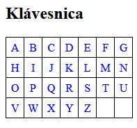

<div class="hidden">

> ## Rozcestník
> - [Späť na úvod](../../README.md)
> - Repo: [Štartér](/../../tree/main/php/hangman-game), [Riešenie](/../../tree/solution/php/hangman-game)
> - [Zobraziť zadanie](zadanie.md)

# Hra Obesenec (PHP)

</div>

## Riešenie

Riešenie úlohy si rozdelíme do niekoľkých častí. Riešenie budeme implementovať pomocou princípov OOP.

### HTML súbor

Ak vytvárame celú hru od úplného začiatku, vytvoríme si adresár `img` a nakopírujeme si do neho obrázky `0.png` až `10.png`. 

V súbore HTML vykreslíme len najnutnejšie časti hry a budeme sa snažiť všetku logiku hry umiestniť do PHP súborov. Aj keď prevažná časť súboru bude v HTML jazyku, niektoré časti budú používať PHP kód, preto musí mať súbor koncovku `php`. PHP kód do súboru doplníme neskôr. 

Súčasťou hry bude aj klávesnica zobrazená na obrazovke hry a hráč pomocou nej bude môcť zadávať jednotlivé písmená. Klávesnicu môžeme vytvoriť manuálne pomocou HTML, ale ukážeme si spôsob, ako sa dá HTMl generovať pomocou PHP. 

Prečo sme na odkaz `Začať znovu` realizovali pomocou odkazu `?` (otáznik). Koniec hry budeme riešiť tak, že ak nepošleme žiadny znak, hra začne odznovu. A keďže parametre posielame metódou `GET`, všetky parametre sa zoraďujú za znak `?` a v tomto prípade žiadny parameter nepošleme. Prostredie hry je jednoduché:

```html
<!DOCTYPE html>
<html lang="sk">
<head>
    <meta charset="UTF-8">
    <title>Hra Obesenec</title>
    <link rel="stylesheet" href="css/style.css">
</head>
<body>
    <h1>Hra Obesenec</h1>
    <h2>Hracie pole</h2>
    <div class="play_ground">
    </div>
    <div class="attempts">
        Počet neúspešných pokusov:
    </div>
    <div class="hangman_picture">
    </div>
    <div class="results">
    </div>
    <h2>Klávesnica</h2>
    <div class="keyboard_container">
    </div>
    <div>
        <br><a href="?">Začať znovu</a>
    </div>
</body>
</html>
```

#### CSS štýl

CSS kód tejto aplikácie je veľmi jednoduchý a definuje len pár štýlov pre text. Použité štýly uzatvárajú hracie pole do rámčeka, nastavujú vzhľad klávesnice, ako aj skrývajú rozdiel, ak sme už klikli na niektorý zo znakov. Súbor `style.css` umiestnime do vytvoreného adresára `css` a bude vyzerať takto:

```css
.play_ground {
    border: 1px solid black;
    display: inline-block;
    font-size: 150%;
    padding: 10px;
    margin-bottom: 10px;
    letter-spacing: 0.5em;
}
.attempts, .results {
    font-size: 120%;
}
.hangman_picture {
    padding: 10px;
}
.keyboard {
    border-collapse: collapse;
}
.keyboard tr td {
    text-align: center;
    border: 1px solid black;
    padding: 5px;
    width: 15px;
}
.keyboard a:active {
    border: 1px solid blue;
    background-color: deepskyblue;
}
.keyboard a:visited {
    color: blue;
}
.keyboard tr td a {
    text-decoration: none;
}
```

### Herná logika

Hru budeme navrhovať a implementovať pomocou objektovo-orientovaného prístupu. Bude sa skladať z troch tried: `Game`,`Hangman` a `Keyboard`. Úlohou objektu `Game` bude riadiť celú hru, herný *engine* sa bude nachádzať v triede `Hangman` a trieda `Keyboard` bude mať za úlohu výpis klávesnice na obrazovku.


### Trieda `Keyboard`

Triedy budeme umiestňovať do súboru s rovnakým názvom, ako je názov triedy. Trieda `Keyboard` bude umiestnená v súbore `Keyboard.php`. Na deklaráciu triedy sa v jazyku PHP používa kľúčové slovo `class`:

```php
<?php
class Keyboard
{

}
```

Najskôr zadeklarujeme všetky atribúty, ktoré bude trieda potrebovať. Privátny atribút `$cols` predstavuje počet stĺpcov, na ktorých bude klávesnica zobrazená. Odkaz na triedu `Hangman` budeme potrebovať, keď budeme vypisovať jednotlivé písmená klávesnice a budeme potrebovať informáciu, ktoré písmená už boli hádané. Odkaz dostaneme v konštruktore. Konštanta `KEYS_NUMBER` obsahuje počet znakov z abecedy, ktoré budeme používať na tvorbu klávesnice. Pre jednoduchosť, nebudeme uvažovať slovenské znaky s diakritikou, ale použijeme len znaky od `A` po `Z`, čo je presne 26 znakov.

```php
class Keyboard
{
    private int $cols;
    const KEYS_NUMBER = 26;
}
```

 Pre vytvorenie konštruktora sa v jazyku PHP sa používa kľúčové slovo `__construct`. Viditeľnosť metódy nastavíme na `public` a pridáme mu vstupný parameter `$cols` počet stĺpcov. Pri jeho definícii využijeme možnosť použitia `default` parametra. Ak konštruktoru nepošleme žiadny parameter, použije sa prednastavená hodnota `6`. Konštruktor bude vyzerať:

```php
class Keyboard
{
    // ...
    public function __construct(int $cols = 6)
    {
        $this->cols = $cols;
    }
}
```

Kľúčové slovo `$this` budeme používať na priradenie hodnoty do atribútu objektu. Hlavnou metódou triedy `Keyboard` je metóda, ktorá vráti HTML kód klávesnice, aby sme ho mohli vložiť do hry. 

Metóda najskôr vypočíta, koľko riadkov bude klávesnica zaberať. Ak chceme pristupovať k nejakej konštante definovanej v triede, používame kľúčové slovo `self`, pretože konštanta nie je závislá na konkrétnej inštancii triedy, ale platí pre celú triedu. Potom klávesnicu vypíšeme ako HTML tabuľku pomocou dvoch vnorených `for` cyklov, pričom do každej bunky tabuľky vložíme práve jeden znak.

Na prevod znaku z jeho ACSII hodnoty na znak použijeme funkciu `chr()`. Pre každé písmeno tak vytvoríme element `a`, ktorému nastavíme GET parameter `char` a ako hodnotu mu priradíme dané písmeno. Kód elementu `a` pre písmeno `A` bude teda: `<a href="?char=A">A</a>`.

Ak sa nám už znaky minuli, do políčka tabuľky vypíšeme nedeliteľnú medzeru `&nbsp;`. Rovnako medzeru miesto znaku vypíšeme, keď by sa mal vypísať znak, ktorý už hráč hádal (to budeme implementovať neskôr). Nakoniec vygenerovanú tabuľku vrátime ako reťazec, ktorý bude predstavovať kompletný HTML kód tabuľky.

```php
class Keyboard
{
    // ...
    public function getKeyboardLayout(): string
    {
        $rows = ceil(self::KEYS_NUMBER / $this->cols);
        $counter = 0;
        $result = '<table class="keyboard">' . PHP_EOL;
        for ($i = 1; $i <= $rows; $i++) {
            $result .= '<tr>' . PHP_EOL;
            for ($j = 1; $j <= $this->cols; $j++) {
                $char = chr(65 + $counter++);
                if ($counter > self::KEYS_NUMBER) {
                    $result .= '<td>&nbsp;</td>';
                } else {
                    $result .= '<td><a href="?char=' . $char . '">' . $char . '</a></td>';
                }
            }
            $result .= PHP_EOL . '</tr>' . PHP_EOL;
        }
        $result .= '</table>' . PHP_EOL;
        return $result;
    }
}
 ```

### Trieda `Game`

Trieda `Game` bude riadiť celú hru a bolo by dobré, keby súbor `index.php` na komunikáciu s PHP súbormi využíval len ju a žiadnu inú. Preto, aj keby sme mohli v tomto súbore priamo vytvárať klávesnicu pomocou triedy `Keyboard`, radšej túto činnosť prenecháme triede `Game` a vytvoríme si obaľovaciu metódu, ktorá klávesnicu vytvorí a posunie ju do súboru `index.php`. Na začiatok súboru `Game.php` umiestnime príkaz:

```php
<?php
require 'Keyboard.php';
```

Tým sprístupníme triedu `Keyboard` triede `Game`. Triedu zatiaľ nebudeme uvádzať celú, uvedieme len metódu, ktorá vráti klávesnicu:

```php
class Game
{
    public function getKeyboard(int $cols): Keyboard
    {
        return new Keyboard($cols);
    }
}
```

Keď máme takto sprístupnenú klávesnicu, môžeme na začiatok súboru `index.php` (pred deklaráciu `<!DOCTYPE html>`) pridať:

```php
<?php
require 'Game.php';
$game = new Game();
?>
```

A v elemente `div` s `class="keyboard_container"` si vyžiadame zobrazenie klávesnice:

```php

<div class="keyboard_container">
    <?= $game->getKeyboard("7")->getKeyboardLayout(); ?>
</div>
```

Všimnite si použitie `<?= ?>`, čo je len skratka pre `<?php echo ... ?>`. Po spustení súboru `index.php` v prehliadači vidíme vytvorenú klávesnicu:



Po kliknutí na ktorékoľvek písmeno v riadku sa odošle GET požiadavka s parameterom `char` rovnajúcim sa znaku, na ktorý sme klikli. Túto vlastnosť neskôr využijeme v hre.

### Trieda `Hangman`

Klávesnicu máme funkčnú, môže pokračovať v implementácii herného `engine`. Najskôr si v triede `Hangman` vytvoríme atribúty, ktoré budeme v hre potrebovať. V prvom rade budeme potrebovať nejaké slová, ktoré budeme hádať. Vyberieme také, ktoré neobsahujú žiadnu diakritiku. Slová nemusia byť rovnako dlhé. 

Atribút `$wantedWord` bude obsahovať vybrané slovo, ktoré budeme hádať. Atribút `$playedWord` bude obsahovať aktuálny stav hry, teda uhádnuté písmená z hádaného slova. Okrem toho si budeme potrebovať pamätať, koľko neúspešných pokusov sme už mali, aby sme vedeli určiť, aký obrázok hráčovi ukázať a určiť, kedy hra skončila. Na to slúži atribút `$failedAttempts`. Nakoniec si *engine* potrebuje uchovať, ktoré písmená už hráč hádal, aby ich pri zobrazovaní klávesnice mohol vynechať.

```php
<?php
class Hangman
{
    private array $words = ['MAMA', 'OTEC', 'KEFA', 'VEDA', 'LAVICA', 'JABLKO', 'UDICA', 'DOLINA'];
    private string $wantedWord;
    private string $playedWord;
    private int $failedAttempts;
    private array $usedChars = [];
}
```

Atribúty `$playedWord`, `$failedAttempts`, `$usedChars` sú privátne, preto k nim nemôžeme pristupovať priamo mimo triedy `Hangman`. My ich však budeme potrebovať v iných triedach. Na sprístupnenie mimo triedy si vytvoríme `public` metódy typu `get` (angl. *getters*), ktorých jedinou úlohou bude vrátiť hodnotu príslušného atribútu. Metódy typu `set` (angl. *setters*) pre tieto atribúty nebudeme potrebovať, preto ich nebudeme vytvárať.

```php
class Hangman
{
    //...
    public function getPlayedWord(): string
    {
        return $this->playedWord;
    }    
    public function getFailedAttempts(): int
    {
        return $this->failedAttempts;
    }  
    public function getUsedChars(): array
    {
        return $this->usedChars;
    }
}
```

### *Session*

Teraz v triede `Hangman` vytvoríme konštruktor. Ten bude mať vstupný paramater `$initialized`, ktorý môže nadobúdať hodnoty `true` alebo `false`. Ak konštruktor zavoláme s hodnotou parametra `true`, vykoná sa inicializácia celej hry a bude sa hrať odznovu. Táto situácia nastane len vtedy, ak hráč klikne na odkaz `Začať znovu`. 

Z princípu fungovania PHP technológie vyplýva, že skript sa po vykonaní odstráni z pamäte vrátane jeho premenných. A pri každom volaní (poslanie jedného znaku) sa skript opäť nahrá do pamäte a spustí. My však v hre musíme uchovávať stav našej aplikácie, čo predstavujú hodnoty atribútov v triede `Hangman`. 

> Mechanizmus, ktorý zabezpečí, že tieto premenné aj po opätovnom spustení skriptu budeme schopní nastaviť na hodnoty z predchádzajúceho stavu, sa volá **session**. Na to, aby nám *session* premenné správne fungovali, musíme nastaviť, že náš skript používa *session* pomocou volania funkcie `session_start();`. 

Toto volanie stačí umiestniť je jedného súboru v projekte (v našom prípade `Game.php`), pretože ostatné súbory celého projektu sú pospájané cez príkaz `require`.  Začiatok súboru `Game.php` bude po tomto zásahu vyzerať takto:

```php
<?php
session_start();

require 'Keyboard.php';
```

Ak máme `session` spustené, všetky hodnoty, ktoré si počas behu skriptu uložíme do asociatívneho poľa `$_SESSION` pod nejakým kľúčom, v nanovo spustenom skripte budú pod týmto kľúčom dostupné. Ak teda hru nezačíname odznovu (paramater `$initialized` je nastavený na `false`), stav hry získame z poľa `$_SESSION`. 

Ak začíname hru znovu, vyberieme si nové slovo, vynulujeme počet pokusov volaním metódy `selectWord()` a inicializujeme slovo hráča na toľko pomlčiek (funkciou `str_repeat()`), koľko má hľadané slovo písmen (napr. slovo `V E D A` bude mať tvar `- - - -`). Nakoniec si ešte budeme potrebovať pamätať zoznam znakov, ktoré už hráč hádal (pole `$usedChars`). Zároveň si tieto atribúty uložíme do *session*. Konštruktor pridáme do triedy `Hangman`.

```php
class Hangman
{
    //...
    public function __construct(bool $initialized)
    {
        if ($initialized) {
            $this->wantedWord = $_SESSION['wantedWord'];
            $this->playedWord = $_SESSION['playedWord'];
            $this->failedAttempts = $_SESSION['attempts'];
            $this->usedChars = $_SESSION['usedChars'];
        } else {
            $this->failedAttempts = $_SESSION['attempts'] = 0;
            $this->wantedWord = $_SESSION['wantedWord'] = $this->selectWord();
            $this->playedWord = $_SESSION['playedWord'] = str_repeat('-', strlen($_SESSION['wantedWord']));
            $this->usedChars = $_SESSION['usedChars'] = [];
        }
    }
}
```

Spomínaná metóda `selectWord()` bude vracať náhodne vybrané slovo zo zoznamu slov, pričom náhodne vygenerujeme index z poľa `$words` (rozsah 0 až počet prvkov poľa - 1). Metóda vracia návratovú hodnotu typu `string`, preto ju v hlavičke metódy budeme aj vyžadovať:

```php
class Hangman
{
    //...
    public function selectWord(): string
    {
        return $this->words[rand(0, count($this->words) - 1)];
    } 
}
```

Jadrom celej hry je zisťovanie, či písmeno poslané od hráča sa nachádza v hľadanom slove, alebo nie. Tento test má zmysel robiť len, keď hra prebieha. Ak sa poslané písmeno nachádza v hľadanom slove, písmeno je potrebné uložiť na správne miesto v slove. Ak by sa písmeno v slovo nachádzalo viackrát, je potrebné ho vložiť na každé miesto. Vložené písmeno nahradí v slove hráča pomlčku na danom mieste. 

Metóda `testChar()` prejde všetky písmená v hľadanom slove pomocou cyklu `for`, ak sa nájde zhoda, písmeno zaznačí do slova hráča (atribúr `$playedWord`). Ak nebol pokus úspešný a hra ešte stále prebieha, inkrementujeme počet chybných pokusov, aby sme mohli zobraziť príslušný obrázok. Nesmieme zabudnúť tieto hodnoty vložiť do *session*, aby boli k dispozícii po opätovnom spustení skriptu.

```php
class Hangman
{
    //...
    public function testChar(string $testedChar): void
    {
        if ($this->gameStatus() == 'in progress') {
            $found = false;
            for ($i = 0; $i < strlen($this->wantedWord); $i++) {
                if ($testedChar == $this->wantedWord[$i]) {
                    $this->playedWord[$i] = $testedChar;
                    $found = true;
                }
            }
            $_SESSION['playedWord'] = $this->playedWord;
            $_SESSION['attempts'] = $found ? $this->failedAttempts : ++$this->failedAttempts;
            array_push($_SESSION['usedChars'], $testedChar);
            $this->usedChars = $_SESSION['usedChars'];
        }
    }
}
```

Ďalším krokom bude implementácia metódy `gameStatus()`, ktoré na základe stavu hry vráti, či hráč vyhral, prehral, alebo hra stále prebieha. Pokiaľ v slove už nebude žiadna pomlčka, všetky písmená budú uhádnuté, atribúty `$wantedWord` a `$playedWord` sa budú rovnať. Vtedy vieme, že hráč uhádol slovo a hru vyhral. Ak hráč už má 10 a viac neúspešných pokusov, prehral. V inom prípade hra stále prebieha:

```php
class Hangman
{
    //...
    public function gameStatus(): string
    {
        if ($this->playedWord == $this->wantedWord) {
            return 'won';
        } else if ($this->failedAttempts >= 10 ) {
            return 'lost';
        } else {
            return 'in progress';
        }
    }
}
```

Teraz, keď si v inštancii triedy `Hangman` budeme pamätať, ktoré klávesy už hráč použil, doplníme do konštuktora triedy `Keyboard` parameter odkazujúci na inštanciu triedy `Hangman` a pridáme aj privátny atribút `$hangman`. Zmena bude vyzerať:

```php
class Keyboard
{
    // ...
    private Hangman $hangman;
    public function __construct(int $cols, Hangman $hangman)
    {
        $this->cols = $cols;
        $this->hangman = $hangman;
    }
    // ...
}
```

Metódu `getKeyboardLayout()` upravíme tak, aby nevypisovala tie klávesy, ktoré už hráč stlačil (získame ich z metódy `getUsedChars()` triedy `Hangman`). To dosiahneme úpravou podmienky na tvar `if ($counter > self::KEYS_NUMBER or in_array($char, $this->hangman->getUsedChars()))`. Pre úplnosť uvádzame celý kód metódy: 

```php
class Keyboard
{
    // ...
    public function getKeyboardLayout(): string
    {
        $rows = ceil(self::KEYS_NUMBER / $this->cols);
        $counter = 0;
        $result = '<table class="keyboard">' . PHP_EOL;
        for ($i = 1; $i <= $rows; $i++) {
            $result .= '<tr>' . PHP_EOL;
            for ($j = 1; $j <= $this->cols; $j++) {
                $char = chr(65 + $counter++);
                if ($counter > self::KEYS_NUMBER || in_array($char, $this->hangman->getUsedChars())) {
                    $result .= '<td>&nbsp;</td>';
                } else {
                    $result .= '<td><a href="?char=' . $char . '">' . $char . '</a></td>';
                }
            }
            $result .= PHP_EOL . '</tr>' . PHP_EOL;
        }
        $result .= '</table>' . PHP_EOL;
        return $result;
    }
    // ...
}
```

Nakoniec upravíme volanie konštruktora v metóde `getKeyboard()` v triede `Game` tak, aby pri vzniku inštancie triedy `Keyboard` táto mala aj odkaz na inštanciu triedy `Hangman` (neskôr si atribút `$hangman` pridáme do triedy `Game`):

```php
class Game
{
    // ...
    public function getKeyboard(int $cols): Keyboard
    {
        return new Keyboard($cols, $this->hangman);
    }
    // ...
}
```

Tým máme ukončenú implementáciu herného `engine`.

### Doplnenie triedy `Game`

Na začiatok súboru `Game.php` pridáme príkaz na prepojenie so súborom `Hangman.php`:

```php
    require 'Hangman.php';
```

Do triedy pridáme privátny atribút `$hangman` a konštruktor, ktorý vytvorí inštanciu herného *engine*. Ako parameter mu pošleme informáciu, či bolo poslané písmeno, alebo nie. Ak nebolo, hra sa zresetuje a vytvorí nanovo. Ak áno, vieme, že hra stále prebieha. V tejto chvíli však nebudeme písmeno ešte testovať.

```php
class Game
{
    private Hangman $hangman;

    public function __construct()
    {
        $this->hangman = new Hangman(isset($_GET['char']));
    }
}
```

Do tejto triedy ešte potrebujeme doplniť metódy, ktoré budú dostupné zo súboru `index.php`, pretože trieda `Game` bude jediná trieda, s ktorou budeme v súbore `index.php` pracovať. Prvou metódou bude metóda `play()`, ktorá bude predstavovať jedno kolo hry. Jedno kolo je hádanie (kliknutie) na jedno písmeno na našej virtuálnej klávesnici. Po každom kliknutí overíme, či bolo písmeno nájdené, alebo nie. Návratovou hodnotou tejto metódy bude stav hry, teda slovo hráča.

```php
class Game
{
    // ...
    public function play(): string
    {
        if (isset($_GET['char'])) {
            $this->hangman->testChar($_GET['char']);
        }
        return $this->hangman->getPlayedWord();
    }
}
```

Nasledujúcou metódou bude metóda `getFailedAttempts()`, ktorá bude iba zaobaľovať volanie rovnakej metódy z triedy `Hangman` a bude vracať počet neúspešných pokusov:

```php
class Game
{
    // ...
    public function getFailedAttempts(): int
    {
        return $this->hangman->getFailedAttempts();
    }
}
```

Poslednou metódou je metóda, ktorá na požiadanie vráti stav hry. Je to znovu len obalenie volania metódy z herného *engine* doplnená o formátovanie odpovede, tak by sme ju mohli zobraziť hráčovi:

```php
class Game
{
    // ...
    public function getGameResult(): string
    {
        switch ($this->hangman->gameStatus()) {
            case 'won':
                return 'Vyhral si! Gratulujem!';
                break;
            case 'lost':
                return 'Prehral si!';
                break;
            case 'in progress':
            default:
                return '';
                break;
        }
    }    
}
```

Tým sme dokončili hru, zostáva nám len doplniť na správne miesta na hracej ploche potrebné informácie. Do kontajnera `<div class="play_ground">` doplníme upravené slovo hráča. 

Zmenu obrázku vyriešime jednoducho tak, že všetky obrázky máme očíslované od 0 po 10 (`0.png` až `10.png`) a podľa počtu neúspešných pokusov necháme zobraziť príslušný obrázok. Obrázok `0.png` je prázdny biely obrázok a to, aby sme sa pri pokusoch nedostali nad hranicu 10 neúspešných pokusov, zabezpečíme v hernom *engine*. 

Podmienka `if ($game->getGameResult() == '')` zabezpečí, že klávesnica bude zobrazená len vtedy, keď hra bude prebiehať. Inak ju nezobrazíme. Výsledný HTML súbor bude vyzerať takto:

```html
<?php
    require 'Game.php';
    $game = new Game();
?>
<!DOCTYPE html>
<html lang="sk">
<head>
    <meta charset="UTF-8">
    <title>Hra Obesenec</title>
    <link rel="stylesheet" href="css/style.css">
</head>
<body>
<h1>Hra Obesenec</h1>
<h2>Hracie pole</h2>
<div class="play_ground">
    <?= $game->play(); ?>
</div>
<div class="attempts">
    Počet neúspešných pokusov: <?= $game->getFailedAttempts() ?>
</div>
<div class="hangman_picture">
    getFailedAttempts() ?>.png" alt="Obesenec">
</div>
<div class="results">
    <?= $game->getGameResult() ?>
</div>
<?php
    if ($game->getGameResult() == '') {
?>
    <h2>Klávesnica</h2>
    <div class="keyboard_container">
        <?= $game->getKeyboard("7")->getKeyboardLayout(); ?>
    </div>
<?php
    }
?>
<div>
    <br><a href="?">Začať znovu</a>
</div>
</body>
</html>
```

Tým je celá hra hotová a na nasledujúcom obrázku si môžeme pozrieť ukážku rozohranej hry. 


