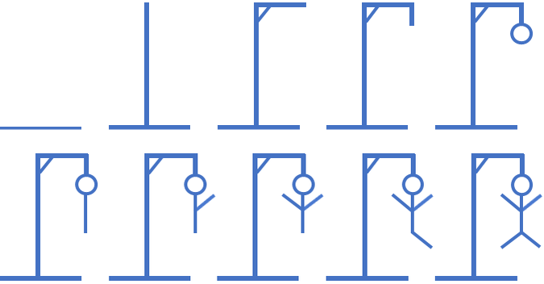

> ## Rozcestník
> - [Späť na úvod](../../README.md)
> - Repo: [Štartér](/../../tree/main/php/hangman-game), [Riešenie](/../../tree/solution/php/hangman-game)
> - [Zobraziť riešenie](riesenie.md)

# Hra Obesenec

 

**Hlavný jazyk príkladu**: PHP

**Ostatné použité jazyky**: HTML, CSS

**Obťažnosť**: 3/5

**Obsah príkladu**: Objektové programovanie v PHP, generovanie HTML kódu pomocou PHP, vkladanie PHP súborov pomocou `include` a `require`, *session*, polia, práca s&nbsp;reťazcami. 

> Všetky potrebné služby sú v `docker-compose.yml`. Po ich spustení sa vytvorí:
> - webový server, ktorý do __document root__ namapuje adresár tejto úlohy s modulom __PDO__. Port __80__ a bude dostupný na adrese [http://localhost/](http://localhost/). Server má pridaný modul pre ladenie [__Xdebug 3__](https://xdebug.org/) nastavený na port __9000__.

## Zadanie

Vytvorte jednoduchú hru v jazyku PHP, ktorá bude umožňovať hádať písmená v slove. Ak hráč uhádne, písmeno sa zobrazí na správnom mieste, ak neuhádne, započíta sa mu pokus a písmeno zmizne z klávesnice. Klávesnica bude zobrazená na hracej ploche a písmená, ktoré budú uhádnuté sa na nej viac nebudú zobrazovať. Hra končí, keď hráč uhádne celé slovo, alebo keď minie 10 pokusov. Po každom pokuse sa postupne zobrazí obrázok obesenca:

