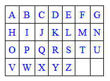

<div class="hidden">

> ## Rozcestník
> - [Späť na úvod](../../README.md)
> - Repo: [Štartér](/../../tree/main/php/hangman), [Riešenie](/../../tree/solution/php/hangman).

# Hra Obesenec (PHP)

</div>

## Riešenie

Riešenie úlohy si rozdelíme do niekoľkých častí. Riešenie budeme implementovať pomocou princípov OOP.

#### HTML súbor

V súbore HTML vykreslíme len najnutnejšie časti hry a budeme sa snažiť všetku logiku hry umiestniť do PHP súborov. Aj
keď prevažná časť súboru bude v HTML jazyku, niektoré časti budú používať PHP kód, preto musí mať súbor koncovku
`.php`. PHP kód do súboru doplníme neskôr. Súčasťou hry bude aj klávesnica zobrazená na obrazovke hry a hráč pomocou nej
bude môcť zadávať jednotlivé písmená. Klávesnicu môžeme vytvoriť manuálne pomocou HTML, ale ukážeme si spôsob, ako sa dá
HTMl generovať pomocou PHP. Potrebné je vysvetliť, prečo sme na odkaz `Začať znovu` realizovaný pomocou odkazu ? (
otáznik). Koniec hry budeme riešiť tak, že ak nepošleme žiadny znak, hra začne odznovu. A keďže parametre posielame
metódou `GET`, všetky parametre sa zoraďujú za znak ? a v tomto prípade žiadny parameter nepošleme. Prostredie hry je
jednoduché:

```html
<h1>Hra Obesenec</h1>
<h2>Hracie pole</h2>
<div class="play_ground">
</div>
<div class="attempts">
    Počet neúspešných pokusov:
</div>
<div class="hangman_picture">
</div>
<div class="results">
</div>
<h2>Klávesnica</h2>
<div class="keyboard_container">
</div>
<div>
    <br><a href="?">Začať znovu</a>
</div>
```

#### CSS štýl

Štýl tejto aplikácie je veľmi jednoduchý a definuje len pár nastavení textu. Použité štýly uzatvárajú hracie pole do
rámčeka, nastavuje vzhľad klávesnice, ako aj skrývajú rozdiel, ak ste už klikli na niektorý zo znakov. CSS štýl vyzerá
nasledovne:

```css
.play_ground {
    border: 1px solid black;
    display: inline-block;
    font-size: 150%;
    padding: 10px;
    margin-bottom: 10px;
    letter-spacing: 0.5em;
}

.attempts, .results {
    font-size: 120%;
}

.hangman_picture {
    padding: 10px;
}

.keyboard {
    border-collapse: collapse;
}

.keyboard tr td {
    text-align: center;
    border: 1px solid black;
    padding: 5px;
    width: 15px;
}

.keyboard a:active {
    border: 1px solid blue;
    background-color: deepskyblue;
}

.keyboard a:visited {
    color: blue;
}

.keyboard tr td a {
    text-decoration: none;
}
```

### Logika hry

Hru budeme navrhovať a implementovať pomocou objektovo-orientovaného prístupu. Bude sa skladať z troch tried: `Game`,
`Hangman` a `Keyboard`. Úlohou objektu `Game` bude riadiť celú hru, herný *engine* sa bude nachádzať v triede
`Hangman` a trieda `Keyboard` bude mať za úlohu vykreslenie klávesnice na obrazovku.


#### Trieda `Keyboard`

Triedy budeme umiestňovať do súboru s rovnakým názvom ako je názov triedy. Trieda `Keyboard` bude umiestnená v
súbore `Keyboard.php`. Na deklaráciu triedy sa v jazyku PHP používa kľúčové slovo `class`:

```php
class Keyboard
{

}
```

Najskôr zadeklarujeme všetky atribúty, ktoré bude trieda potrebovať. Privátny atribút `$cols` predstavuje počet stĺpcov,
na ktorých bude klávesnica zobrazená. Odkaz na triedu `Hangman` budeme potrebovať, keď budeme vykreslovať jednotlivé
písmená klávesnice a budeme potrebovať informáciu, ktoré písmená už boli hádané. Odkaz dostaneme v konštruktore.
Konštanta `KEYS_NUMBER` je počet znakov z abecedy, ktoré budeme používať na tvorbu klávesnice. Pre jednoduchosť,
nebudeme uvažovať slovenské znaky s diakritikou, ale použijeme len znaky od `A` po `Z`, čo je presne 26 znakov.

```php
    private $cols;
    private $hangman;
    const KEYS_NUMBER = 26;
```

Konštruktor tejto triedy bude mať parameter počet stĺpcov. V jazyku PHP sa používa kľúčové slovo `__construct`.
Viditeľnoť metódy nastavíme na `public`. Pri jeho definícii využijeme možnosť použitia `default` parametra. Ak
konštruktoru nepošleme žiadny parameter, použije sa prednastavená hodnota 6. Konštruktor bude vyzerať:

```php
    public function __construct(int $cols = 6, Hangman $hangman)
    {
        $this->cols = $cols;
        $this->hangman = $hangman;        
    }
```

Všimneme si použitie kľúčové slova `$this`, ktoré budeme používať na priradenie hodnoty do atribútu objektu. Hlavnou
metódou triedy `Keyboard` je metóda, ktorá vráti HTML kód klávesnice, aby sme ho mohli vložiť do hry. Metóda najskôr
vypočíta, koľko riadkov bude klávesnica zaberať. Ak chceme pristupovať k nejakej konštante definovanej v triede,
používame kľúčové slovo `self`, pretože konštanta nie je závislá na konkrétnej inštancii triedy, ale platí pre celú
triedu. Potom klávesnicu vykreslíme ako HTML tabuľku pomocou dvoch vnorených `for` cyklov, pričom do každej bunky
tabuľky vloží práve jeden znak. Na prevod znanku z jeho ACSII hodnoty na znak použijeme funkciu `chr()`. Znak obalí do
značky `<a>`, napr. po kliknutí na znak `A` sa vytvorí odkaz `<a href="?char=A">A</a>`, takže po kliknutí sa odošli v
premennej `char` znak `A`. Ak sa nám už znaky minuli, do políčka tabuľky vypíše nedeliteľnú medzeru `&nbsp;`. Rovnako
medzeru miesto znaku vypíše, keď by sa mal vypísať znak, ktorý už hráč hádal. Nakoniec vygenerovanú tabuľku vráti ako
reťazec, ktorý bude predstavovať kompletný HTML kód tabuľky.

```php
    public function getKeyboardLayout(): string
    {
        $rows = ceil(self::KEYS_NUMBER / $this->cols);
        $counter = 0;
        $result = '<table class="keyboard">' . PHP_EOL;
        for ($i = 1; $i <= $rows; $i++) {
            $result .= '<tr>' . PHP_EOL;
            for ($j = 1; $j <= $this->cols; $j++) {
                $char = chr(65 + $counter++);
                if ($counter > self::KEYS_NUMBER or in_array($char, $this->hangman->getUsedChars())) {
                    $result .= '<td>&nbsp;</td>';
                } else {
                    $result .= '<td><a href="?char=' . $char . '">' . $char . '</a></td>';
                }
            }
            $result .= PHP_EOL . '</tr>' . PHP_EOL;
        }
        $result .= '</table>' . PHP_EOL;
        return $result;
    }
 ```

#### Trieda `Game`

Trieda Game bude riadiť celú hru a bolo by dobré, keby súbor `index.php` na komunikáciu s PHP súbormi využíval len ju a
žiadnu inú. Preto, aj keby sme mohli v tomto súbore priamo vytvárať klávesnicu pomocou triedy `Keyboard`, radšej túto
činnosť prenecháme triede `Game` a vytvoríme si obaľovú metódu, ktorá klávesnicu vytvorí a posunie ju do
súboru `index.php`. Na začiatok súboru `Game.php` umiestnime príkaz:

```php
require 'Keyboard.php';
```

A tým sprístupníme triedu `Keyboard` triede `Game`. Triedu zatiaľ nebudeme uvádzať celú, uvedieme len metódu, ktorá
vráti klávesnicu:

```php
class Game
{
    function getKeyboard(int $cols): Keyboard
    {
        return new Keyboard($cols, $this->hangman);
    }
}
```

Keď máme takto sprístupnenú klávesnicu, môžeme na začiatok súboru `index.php` pridať:

```php
<?php
    require 'Game.php';
    $game = new Game();
?>
```

A v elemente `<div class="keyboard_container">` si vyžiadame zobrazenie klávesnice:

```html

<div class="keyboard_container">
    <?= $game->getKeyboard("7")->getKeyboardLayout(); ?>
</div>
```

Všimnite si použitie `<?= ?>`, čo je len skratka pre `<?php echo ... ?>`. Po spustení súboru `index.php` v prehliadači
vidíme vytvorenú klávesnicu:



Po kliknutí na ktorékoľvek písmeno sa v riadku adresa vygeneruje odkaz s parameterom char rovnajúcim sa znaku, na ktorý
sme klikli. Túto vlastnosť neskôr využijeme v hre.

#### Trieda `Hangman`

Klávesnicu máme funkčnú, môže pokračovať k implementácii herného `engine`. Najskôr si v triede `Hangman` vytvoríme
atribúty, ktoré budeme v hre potrebovať. V prvom rade budeme potrebovať nejaké slová, ktoré budeme hádať. Vyberieme
také, ktoré neobsahujú žiadnu diakritiku. Slová nemusia byť rovnakp dlhé. Atribút `$wantedWord` bude obsahovať vybrané
slovo, ktoré budeme hádať. Atribút `$playedWord` bude obsahovať aktuálny stav hry, teda uhádnuté písmená z hádaného
slova. Okrem toho si budeme potrebovať pamätať, koľko neúspešných pokusov sme už mali, aby sme vedeli určiť, aký obrázok
hráčovi ukázať a určiť, kedy hra skončila. Na to slúži atribút `$failedAttempts`. Nakoniec si engine potrebuje uchovať,
ktoré písmená už hráč hádal, aby ich pri zobrazovaní klávesnice mohol vynechať.

```php
class Hangman
{
    private $words = ['MAMA', 'OTEC', 'KEFA', 'VEDA', 'LAVICA', 'JABLKO', 'UDICA', 'DOLINA'];
    private $wantedWord;
    private $playedWord;
    private $failedAttempts;
    private $usedChars = [];
}
```

Atribúty `$playedWord`, `$failedAttempts`, `$usedChars` sú privátne, preto k nim nemôžeme pristupovať priamo mimo triedy
`Hangman`. My ich však budeme potrebovať v iných triedach. Na sprístupnenie mimo triedy si vytvoríme `public` metódy
typu `get` (angl. *getters*), ktorých jedinou úlohou bude vrátiť hodnotu príslušného atribútu. Metódy typu `set`
(angl. *setters*) pre tieto atribúty nebudeme potrebovať, preto ich nebudeme vytvárať.

```php
    public function getPlayedWord(): string
    {
        return $this->playedWord;
    }

    public function getFailedAttempts(): int
    {
        return $this->failedAttempts;
    }

    public function getUsedChars(): array
    {
        return $this->usedChars;
    }
```

#### Mechanizmus Session

Najskôr v triede uvedieme konštruktor. Ten bude mať paramater `$initialized`, ktorý môže nadobúdať hodnoty `true`
alebo `false`. Ak konštruktor zavoláme s hodnotou parametra `true`, vykoná sa inicializácia celej kry a bude sa hať
odznovu. Táto situácia nastale len vtedy, ak hráč klikne na odkaz `Začať znovu`. Z princípu fungovania PHP technológie
vyplýva, že skript sa po vykonaní odstráni z pamäte. A pri každom volaní (poslanie jedného znaku) sa skript opäť nahrá
do pamäte a spustí. My však v hre musíme uchovávať stav našej aplikácie, čo predstavujú hodnoty atribútov v tejto
triede. Mechanizmus, ktorý zabezpečí, že tieto premenné aj po znovu spustení skriptu budeme schopní nastaviť na hodnoty
z predchádzajúceho stavu, sa volá **session**. Na to, aby nám `session` správne fungovali, musí nastaviť, že náš skript
používa `session` pomocou volania funkcie `session_start();`. Toto volanie stačí umiestniť je jedného súboru v
projekte (v našom prípade `Game.php`), pretože ostatné súbory celého projektu sú pospájané cez príazk `require`. Ak
máme `session` spustené, všetko, čo si počas behu skriptu uložíme do asociatívneho poľa `$_SESSION` pod nejakým kľúčom,
v nanovo spustenom skripte pod týmto kľúče bude dostupné. Ak teda hra nezačína znovu ( paramater `$initialized` je
nastavený na `false`), stav hry získame z poľa  `$_SESSION`. Ak začímene hru znovu, vyberieme si nové slovo, vynulujeme
počet pokusov volaním metódy `selectWord()` a inicializujeme slovo hráča na toľko pomlčiek (funkciou `str_repeat()`),
koľko má hľadané slovo písmen (napr. slovo `V E D A` bude mať tvar `- - - -`). Nakoniec si ešte budeme potrebovať
pamätať zoznam znakov, ktoré už hráč hádal (pole `$usedChars`). Zároveň si tieto atribúty uložíme do `session`.

```php
    public function __construct(bool $initialized)
    {
        if ($initialized) {
            $this->wantedWord = $_SESSION['wantedWord'];
            $this->playedWord = $_SESSION['playedWord'];
            $this->failedAttempts = $_SESSION['attempts'];
            $this->usedChars = $_SESSION['usedChars'];
        } else {
            $this->failedAttempts = $_SESSION['attempts'] = 0;
            $this->wantedWord = $_SESSION['wantedWord'] = $this->selectWord();
            $this->playedWord = $_SESSION['playedWord'] = str_repeat('-', strlen($_SESSION['wantedWord']));
            $this->usedChars = $_SESSION['usedChars'] = [];
        }
    }
```

Spomínaná metóda `selectWord()` bude vracať náhodne vybrané slovo zo zoznamu slov, pričom náhodne vygenerujeme index z
poľa `$words` (rozsah 0 až počet prvkov poľa - 1). Metóda vracia návratovú hodnotu `string`, preto ju v hlavičke metódy
budeme aj vyžadovať:

```php
    public function selectWord(): string
    {
        return $this->words[rand(0, count($this->words) - 1)];
    } 
```

Jadrom celej hry je zisťovanie, či písmeno poslané od hráča sa nachádza v hľadanom slovo, alebo nie. Tento test má
zmysel robiť len, keď hra prebieha. Ak sa poslané písmeno nachádza v hľadanom slove, písmeno je potrebné uložiť na
správne miesto v slove. Ak by sa písmeno v slovo nachádzalo viackrát, je potrebné ho vložiť na každé miesto. Vložené
písmeno nahradí v slove hráča pomlčku na danom mieste. Metóda `testChar()` prejde všetky písmená v hľadanom slove
pomocou cyklu `for`, ak sa nájde nejaká zhoda, písmeno zaznačí do slova hráča. Ak nebol pokus úspešný a hra ešte stále
prebieha, inkrementujeme počet chybných pokusov, aby sme mohli zobraziť príslušný obrázok. Nesmieme zabudnúť tieto
hodnoty vložiť do session, aby boli k dispozícii po opätovnom spustení skriptu.

```php
    public function testChar(string $testedChar): void
    {
        if ($this->gameStatus() == 'in progress') {
            $found = false;
            for ($i = 0; $i < strlen($this->wantedWord); $i++) {
                if ($testedChar == $this->wantedWord[$i]) {
                    $this->playedWord[$i] = $testedChar;
                    $found = true;
                }
            }
            $_SESSION['playedWord'] = $this->playedWord;
            $_SESSION['attempts'] = $found ? $this->failedAttempts : ++$this->failedAttempts;
            array_push($_SESSION['usedChars'], $testedChar);
            $this->usedChars = $_SESSION['usedChars'];
        }
    }
```

Ďalším krokom bude implementácia metódy `gameStatus()`, ktoré na základe stavu hry vráti, či hráč vyhral, prehral, alebo
hra stále prebieha. Pokiaľ v slove už nebude žiadna pomlčka, všetky písmená budú uhádnuté, atribúty `$wantedWord` a
`$playedWord` sa budú rovnať. Vtedy vieme, že hráč uhádol slovo a hru vyhral. Ak hráč už má 10 a viac neúspešných
pokusov, prehral, v inom prípade hra stále prebieha:

```php
    public function gameStatus(): string
    {
        if ($this->playedWord == $this->wantedWord) {
            return 'won';
        } else if ($this->failedAttempts >= 10 ) {
            return 'lost';
        } else {
            return 'in progress';
        }
    }
```

Tým máme ukončenú implementáciu herného `engine`.

#### Doplnenie triedy `Game`

Na začiatok súboru `Game.php` pridáme príkaz na prepojenie so súborom 'Hangman.php':

```php
    require 'Hangman.php';
```

Do triedy pridáme privátny atribút `$hangman` konštruktor, ktorý vytvorí inštanciu herného *engine*. Ako parameter mu
pošleme informáciu, či bolo poslané písmeno, alebo nie. Ak nebolo, hra sa zresetuje a vytvorí nanovo. Ak áno, vieme, že
hra stále prebieha. V tejto chvíli však nebudeme písmeno ešte testovať.

```php
class Game
{
    private $hangman = null;

    public function __construct()
    {
        $this->hangman = new Hangman(isset($_GET['char']));
    }
}
```

Tejto triedy ešte potrebujeme doplniť metódy, ktoré budú dostupné zo súboru `index.php`, pretože trieda `Game` bude
jediná trieda, ktorá bude dostupné. Prvou metódou bude metóda `play()`, ktorá bude predstavovať jedno kolo hry. Jedno
kolo je hádanie (kliknutie) na jedno písmeno na našej virtuálnej klávesnici. Po každom kliknutí overíme, či bolo písmeno
nájdené, alebo nie. Návratovou hodnotou tejto metódy bude stav hry, teda slovo hráča.

```php
    public function play(): string
    {
        if (isset($_GET['char'])) {
            $this->hangman->testChar($_GET['char']);
        }
        return $this->hangman->getPlayedWord();
    }
```

Nasledujúcou metódou bude metóda `getFailedAttempts()`, ktorá bude iba zaobaľovať volanie rovnakej metódy z triedy
`Hangman` a bude vracať počet neúspešných pokusov:

```php
    public function getFailedAttempts(): int
    {
        return $this->hangman->getFailedAttempts();
    }
```

Poslednou metódou je metóda, ktorá na požiadanie vráti stav hry. Je to znovu len obalenie volania metódy z herného
engine doplnena o formatovanie odpovede, tak by sme ju mohli zobraziť hráčovi:

```php
    public function getGameResult(): string
    {
        switch ($this->hangman->gameStatus()) {
            case 'won':
                return 'Vyhral si! Gratulujem!';
                break;
            case 'lost':
                return 'Prehral si!';
                break;
            case 'in progress':
            default:
                return '';
                break;
        }
    }
```

Tým sme dokončili hru, zostáva nám len doplniť na správne miesta na hracej ploche potrebné informácie. Do
kontajnera `<div class="play_ground">` doplníme upravené slovo hráča. Zmenu obrázku vyriešime jednoducho tak, že všetky
obrázky máme očíslované od 0 po 10 (`0.png` až `10.png`) a podľa počtu neúspešných pokusov necháme zobraziť príslušný
obrázok. Obrázok `0.png` je prázdny biely obrázok a to, aby sme sa pri pokusoch nedostali nad hranicu 10 neúspešných
pokusov, zabezpečíme v hernom *engine*. Podmienka `if ($game->getGameResult() == '')` zabezpečí, že klávesnica 
bude zobrazená len vtedy, keď hra bude prebiehať. Inak ju nezobrazíme. Výsledný HTML súbor bude vyzerať takto:

```html
<h1>Hra Obesenec</h1>
<h2>Hracie pole</h2>
<div class="play_ground">
    <?= $game->play(); ?>
</div>
<div class="attempts">
    Počet neúspešných pokusov: <?= $game->getFailedAttempts() ?>
</div>
<div class="hangman_picture">
    getFailedAttempts() ?>.png" alt="Obesenec">
</div>
<div class="results">
    <?= $game->getGameResult() ?>
</div>
<?php
    if ($game->getGameResult() == '') {
?>
    <h2>Klávesnica</h2>
    <div class="keyboard_container">
        <?= $game->getKeyboard("7")->getKeyboardLayout(); ?>
    </div>
<?php
    }
?>
<div>
    <br><a href="?">Začať znovu</a>
</div>
```

Tým je celá hra hotová a na nasledujúcom obrázku vidíme ukážku rozohratej hry. 


