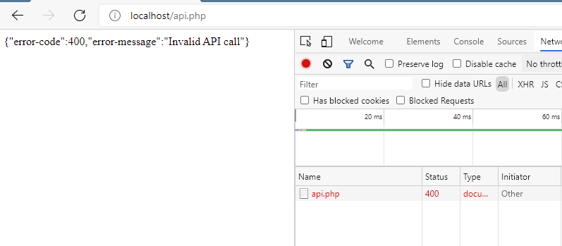

<div class="hidden">

> ## Rozcestník
> - [Späť na úvod](../../README.md)
> - Repo: [Štartér](/../../tree/main/php/simple-chat), [Riešenie](/../../tree/solution/php/simple-chat).
> - [Zobraziť zadanie](zadanie.md)

# Jednoduchý chat  (DB, PHP, JS, AJAX, CSS)

</div>

## Riešenie


<div class="hidden">

> Toto riešenie obsahuje všetky potrebné služby v `docker-compose.yml`. Po ich spustení sa vytvorí:
> - webový server, ktory do __document root__ namapuje adresár tejto úlohy s modulom __PDO__. Port __80__ a bude dostupný na adrese [http://localhost/](http://localhost/). Server má pridaný modul pre ladenie [__Xdebug 3__](https://xdebug.org/) nastavený na port __9000__ v "auto-štart móde" (`xdebug.start_with_request=yes`).
> - databázový server s vytvorenou _databázou_ a tabuľkou `users` s dátami na porte __3306__ a bude dostupný na `localhost:3306`. Prihlasovacie údaje sú: 
>   - MYSQL_ROOT_PASSWORD: db_user_pass
>   - MYSQL_DATABASE: dbchat
>   - MYSQL_USER: db_user
>   - MYSQL_PASSWORD: db_user_pass
> - phpmyadmin server, ktorý sa automatický nastevený na databázový server na porte __8080__ a bude dostupný na adrese [http://localhost:8080/](http://localhost:8080/)

</div>

Na začiatok si ujasníme návrh a architektúru celého riešenia. Aplikáciu rozdelíme na dve samostatné časti. Serverová časť bude reprezentovaná dvomi súbormi: 

1. `index.html` - statická stránka s klientom
2. `api.php` - predstavuje vstupný bod, ktorý bude slúžiť čisto ako _webové API_

Klient našej aplikácie bude úplne samostatná časť, napísaná vo __vanilla javascripte__. Všetky dáta pre chod chatu bude získavať klient z _webové API_. Klient bude zo serverom komunikovať pomocou dát v _JSON_ formáte.


### Vytvorenie anonymného chatu

V prvom kroku vytvoríme verziu "anonymného" chatu, kde môže pridať príspevok hocikto. Perzistentné úložisku dát bude predstavovať databáza, preto si v nej vytvoríme tabuľku pre správy s menom `messages`. _DDL_ pre jej vytvorenie bude:

```sql
create table messages
(
    id      int auto_increment,
    message text     not null,
    created datetime not null,
    constraint messages_pk
        primary key (id)
);
```
Súčasťou odpovede servera je [_HTTP kód_](https://developer.mozilla.org/en-US/docs/Web/HTTP/Status) ten je súčasť hlavičky odosielanej serverom v _HTTP odpovedi_. V jej tele by sme mali posielať, ako kód, tak aj chybovú hlášku, ktorú spracuje naša aplikácia.

Každá natívna _PHP výnimka_ má svoje číslo a popis, tie však nemusia a nebudú sa zhodovať z definovanými _HTTP kódmi_. Preto v niektorých častiach budeme musieť natívne výnimky odchytávať a transformovať aby ich bolo možné použiť s _HTTP_. 

Prečo to implementovať? Aby komunikácia klienta používala štandard a vedel tak reagovať na prípadné problémy. Pri posielaní asynchrónnych dopytov tak vie klient následne správne vyhodnotiť a vykonať adekvátnu reakciu bez nutnosti odpovede ručne kontrolovať. Framewroky a knižnice tretích strán vedia niektoré statusy ošetriť auztomaticky.

Vytvoríme si _PHP súbor_ `api.php`. Celá logika bude  obalená do jedného `try-catch` bloku, ktorý bude vyhodené výnimky transformovať na _HTTP odpoveď_ a do jej tela vo formáte JSON.

To, ktorá metóda _API_ sa zavolá budeme rozhodovať na základe _HTTP GET_ parametra `method`. Vetvenie budeme realizovať pomocou bloku `switch`, kde čast `default` bude odchytávať nehodné alebo nepoužité hodnoty _HTTP GET_ parametra `method`. Teda všetko, čo padne do `default` budeme považovať za chybný _HTTP dopyt_. V prípade, že sa tak stane budeme chcieť na klienta poslať _HTTP kód_ [`400 Bad Request`](https://developer.mozilla.org/en-US/docs/Web/HTTP/Status/400), vyhodíme preto nasledovnú výnimku:

```php
throw new Exception("Invalid API call", 400);
```

Pri odchytení výnimky upravíme hlavičku _HTTP odpovede_ pomocou _PHP_ funkcie [`header()`](https://www.php.net/manual/en/function.header.php). Pripájame do nej
ako _HTTP kód_ kód z výnimky tak aj jej text. Následne pridávame do tela odpovede kód aj text chyby v podobe pola, ktoré serializujeme do formátu [_
JSON_](https://developer.mozilla.org/en-US/docs/Learn/JavaScript/Objects/JSON) pomocou _PHP
funkcie_ [`json_encode()`](https://www.php.net/manual/en/function.json-encode.php).

Kód v súbore `api.php` bude vyzerať nasledovne:

```php
try {
    switch (@$_GET['method']) {

        default:  
            throw new Exception("Invalid API call", 400);
                        
    }
} catch (Exception $exception) {
    header($_SERVER["SERVER_PROTOCOL"] . " {$exception->getCode()} {$exception->getMessage()}");
    echo json_encode([
        "error-code" => $exception->getCode(),
        "error-message" => $exception->getMessage()
    ]);
}
```

Ako ďalšie si vytvoríme tri _PHP triedy_. Prvá bude predstavovať dátový objekt reprezentujúci jeden riadok v databáze. Nazveme ju `Message` a bude vyzerať
nasledovne:

```php
class Message
{
    public int $id;
    public string $message;
    public string $created;
}
```

Druhá trieda, ktorá bude sprostredkovať pripojenie na databázu sa bude volať `Db`, bude implementovať _singleton_ a v jej konštruktore inicializujeme spojenie s databázou pomocou `PDO`.

Vzhľadom na to, že chybové výnimky musí odchytávať súbor `api.php` upravíme chovanie `PDO` tak, aby pri nastaví chyby s databázou bola vyhodená výnimka. Čo
urobíme ihneď po vytvorení jej inštancie nastavením `  $this->pdo->setAttribute(PDO::ATTR_ERRMODE, PDO::ERRMODE_EXCEPTION);` (toto [nastavenie je predvolené](https://www.php.net/manual/en/pdo.error-handling.php#:~:text=PDO%3A%3AERRMODE_EXCEPTION&text=0%2C%20this%20is%20the%20default,error%20code%20and%20error%20information.)
až od verzie PHP 8.0).

Následne si ešte musíme transformovať chybový kód, tak aby zodpovedal _HTTP kódom_. Preto po dochytení výnimky vytvoríme novú výnimku, nastavíme jej rovnakú správu a
upravíme jej kód na [`500 Internal Server Error`](https://developer.mozilla.org/en-US/docs/Web/HTTP/Status/500).

Účelom tejto triedy je iba vždy sprostredkovať tú istú inštanciu `PDO` pre komunikáciu s databázou, nič iné. Trieda bude vyzerať nasledovne:

```php
class Db {

    private static ?Db $db = null;
    public static function i()
    {
        if (Db::$db == null) {
            Db::$db = new Db();
        }
        return Db::$db;
    }

    private PDO $pdo;

    private string $dbHost = "db:3306";
    private string $dbName = "dbchat";
    private string $dbUser = "db_user";
    private string $dbPass = "db_user_pass";

    public function __construct()
    {
        try {
            $this->pdo = new PDO("mysql:host={$this->dbHost};dbname={$this->dbName}", $this->dbUser, $this->dbPass);
            $this->pdo->setAttribute(PDO::ATTR_ERRMODE, PDO::ERRMODE_EXCEPTION);
        } catch (PDOException $e) {
           throw new Exception($e->getMessage(), 500);
        }
    }
    
    public function getPDO(): PDO
    {
        return $this->pdo;
    }
}
```
Posledná trieda `MessageStorage` bude obsahovať logiku výlučne pokrývajúcu logiku týkajúcu sa _PHP triedy_ `Message`. Aj ked sa to sprvu nezdá, umiestniť túto logiku do triedy `Db` by nebolo vhodné nakoľko by sa nám v nej zmiešavali viaceré logické celky.

Nakoľko si trieda `MessageStorage` nepotrebuje pamätať svoj stav a všetky potrebné dáta budú predávané ako vstupné parametra, nemusíme vytvárať jej inštanciu a budeme môcť všetky jej metódy definovať ako _statické_.

Jej prvá verejná statická metóda bude `getMessages()`, ktorej výstup bude posledných 50 záznamov z databázovej tabuľky `messages` v podobe pola inštancií triedy `Message`.

```php
class MessageStorage
{
    /**
     * @return Message[]
     * @throws Exception
     */
    public static function getMessages(): array
    {
        try {
            return DB::i()->getPDO()
                ->query("SELECT * FROM messages ORDER by created ASC LIMIT 50")
                ->fetchAll(PDO::FETCH_CLASS, Message::class);
        }  catch (\PDOException $e) {
            throw new Exception($e->getMessage(), 500);
        }
    }
}
```

Ak bude chcieť klient získať kolekciu posledných 50 správ, bude musieť na server odoslať _HTTP dopyt_ s _HTTP GET parametrom_, ktorého hodnota bude musieť byť presne `get-messages`. V súbore `api.php` do bloku `switch` prídáme reakciu na hodnotu `get-messages` _HTTP parametra_ `method`. V nej získame pole správ zavolaním `UserStorage::getMessages()` a následne ho serializujeme do formátu _JSON_ a vypíšeme do tela odpovede. Nesmieme zabudnúť doplniť pomocou `require` naše definície tried `Message`, `Db` a `MessageStorage`. Pridanie logiky bude vyzerať následovne:

```php
require "php/Message.php";
require "php/Db.php";
require "php/MessageStorage.php";

try {
    switch (@$_GET['method']) {

        case 'get-messages':
            $messages = MessageStorage::getMessages();
            echo json_encode($messages);
            break;
            
       // ...     
    }
} catch (Exception $exception) {
    // ...    
}
```

Ak teraz navštívime naše _API_ a nezadáme žiadne _HTTP parametre_, dostaneme chybovú spolu aj rozpoznaním _HTTP kódu_.



Ak však pridáme _GET parameter_  `method=get-messages` dostaneme normálnu odpoveď aj keď momentálne v podobe prázdneho pola, nakoľko v databáze nemáme žiadne
záznamy.


Základom klienta je súbor _index.html_ obsahujúci statickú webovú stránku. Ten bude načítavať súbor _main.js_, ako _javascript modul_, a bude obsahovať inicializačnú logiku. 

Do elementu `<body>` vložíme element `<div>`, ktorému pridáme atribút `id` s hodnotou `messages` a bude slúžiť pre zobrazovanie získaných správ. Súbor `index.html` bude obsahovať:

```html
<!DOCTYPE html>
<html lang="en">
<head>
    <meta charset="UTF-8">
    <title>Jednoduchý chat</title>
    <script type="module" src="js/main.js"></script>
</head>
<body>
   <div id="messages">
   </div>
</body>
</html>
```

Odosielanie a spracovanie asynchrónnych dopytov budeme realizovať pomocou [`fetch()`](https://developer.mozilla.org/en-US/docs/Web/API/Fetch_API). `Fetch API`
používa pre spracovanie asynchrónnych volaní [`Promise`](https://developer.mozilla.org/en-US/docs/Web/JavaScript/Reference/Global_Objects/Promise/then). My
namiesto vytvárania reťazenia pomocou callbackov použijeme [`async/await`](https://developer.mozilla.org/en-US/docs/Learn/JavaScript/Asynchronous/Async_await).
To značne zjednoduší a sprehľadní kód.

Teraz vytvoríme súbor `chat.js` v ktorom vytvoríme triedu `Chat`. Tejto triede pridáme metódu `getMessages()`, ktorá pomocou `fetch()` získa pole posledných 50 správ zo servera. Nakoľko budeme používať `async/await` musíme tú metódu označiť `async`. `fetch()` však vyhadzuje výnimky, ktoré nastanú iba v prípade problémov pri komunikácií so serverom, teda v prípade sieťovej chyby. 

Pokiaľ teda klient obdrží odpoveď s ľubovolným _HTTP kódom_ žiadna výnimka nebude vyhodená. Samotné vyhodnotenie kódu odpovede budeme musieť implementovať manuálne. Z tohto dôvodu bude celá logika metódy `getMessages()` umiestnená do `try-catch` bloku.

V prvom rade zavoláme `fetch()`, kde ako parameter doplníme _url_ `api.php?method=get-messages` a výsledok umiestnime do lokálnej premennej `response`. Nakoľko
sa jedná o asynchrónne spustenú logiku vložíme pred `fetch()` slovo `await`.

Následne overíme, či má odpoveď _HTTP kód_ `200`. Pokiaľ nie, vytvoríme a vyhodíme chybu. Správy budeme postupne vypisovať do elementu `<<div id="messages">`.Jednotlivé elementy správ budeme zostavovať pomocou textového reťazca.

Každá správa bude samostatne zabalená do elementu `<div class="message">` a dátum vytvorenia s textom bude v samostatnom `<span>` elemente. Každému `<span>`
elementu pridáme vlastnú _CSS triedu_ aby ich bolo možné neskôr naštýlovať.

_HTML_ kód každej správy sa pridáva do lokálnej premennej `messagesHTML`, ktorú po prejdení všetkých správ priamo pridáme do `innerHTML` elementu. Zobrazené
správy sa tak zakaždým prekreslia.

Kód v bloku `catch()` vloží do elementu `<div class="message">` text o chybe s jej detailom. Výsledná metóda bude obsahovať nasledovný kód:

```javascript
class Chat {

    async getMessages() {
        try {

            let response = await fetch("api.php?method=get-messages");

            if (response.status != 200) {
                throw new Error("ERROR:" + response.status + " " + response.statusText);
            }

            let messages = await response.json();
            let messagesHTML = "";
            messages.forEach(message => {
                messagesHTML += `
                        <div class="message">
                            <span class="date">${message.created}</span>                            
                            <span>${message.message}</span>
                        </div>`;
            })
            document.getElementById("messages").innerHTML = messagesHTML;
        } catch (e) {
            document.getElementById("messages").innerHTML = `<h2>Nastala chyba na strane servera.</h2><p>${e.message}</p>`;
        }
    }
}

export default Chat;
```

Súbor `main.js` vytvorí po plnej inicializácií stránky v prehliadači inštanciu triedy `Chat` a pridá ju do `window.chat`. Klient má každú sekundu získavať
správy, čo implementujeme vytvorením periodického časovača
pomocou [`setInterval()`](https://developer.mozilla.org/en-US/docs/Web/API/WindowOrWorkerGlobalScope/setInterval) ktoré bude volať metódu `Chat.getMessages()`.
Časovač sa však prvý krát nespustí ihneď ale až po uplynutí 1 sekundy. Aby používateľ nečakal na spustenie zavoláme po nastavení intervalu
metódu `getMessages()`. Asynchrónnu logiku nemôžeme umiestniť do konštruktora, nakoľko konštruktor vracia novú inštanciu danej triedy a nie `promise`. Preto
vytvoríme novú asynchrónnu metódu `Chat.run()`, ktorá bude obsahovať:

```javascript
class Chat {

    async run() {
        setInterval(this.getMessages, 1000);
        await this.getMessages()
    }

    // ...
}

export default Chat;
```

Logika v skripte `main.js`, teda najprv vytvorí inštanciu triedy `Chat` a následne zavolá jej metódu `Chat.init()`:

```javascript
import Chat from "./chat.js";

window.onload = async function () {
    window.chat = new Chat();
    await window.chat.init();
}
```

V tomto momente bude _chat_ zobrazovať iba dáta, ktoré sú v databáze. Aby sme dáta mohli na server odosielať musíme upraviť `index.html`. Najprv pridáme pod
element `<div id=messages>` nový element `<div>` do ktorého umiestníme element `<input id="message">`, ktorý zobrazí textové pole a element `<button id="send-button">` pre odoslanie napísanej správy. Súbor `index.html` bude po úprave vyzerať nasledovne:

```html
<!DOCTYPE html>
<html lang="en">
<head>
    <meta charset="UTF-8">
    <title>Jednoduchý chat</title>
    <script type="module" src="js/main.js"></script>
</head>
<body>
   <div id="messages">
   </div>
   <div>
       <input type="text" id="message">
       <button id="send-button">Odoslať</button>
   </div>
</body>
</html>
```

Teraz do _javascript triedy_ `Chat` pridáme metódu `postMessage()` ktorej zavolaním odošleme dáta novej správy na server. Zasielanie parametrov pomocou _HTTP
POST_ je trošičku komplikovanejšie ako pomocou _HTTP GET_, nakoľko je potrebné pridať zopár doplňujúcich informácií. Tie pridáme metóde `fetch()` ako druhý
parameter:

1. Aby `fetch()` poslal dopyt ako _HTTP POST_ musíme doplniť nastavenie `method: "POST"`.
2. Doplníme hlavičku, kde povieme, že telo _HTTP požiadavky_ bude obsahovať dáta pomocou `'Content-Type': 'application/x-www-form-urlencoded'`.
3. Nakoniec do tela pridáme _POST parameter_ `body` a naplníme ho hodnotou z nášho `<input>` elementu.

Teraz skontrolujeme, _HTTP kód_ odpovede. Nakoľko server nepotrebuje odoslať po uložení na klienta zaide dáta budeme očakávať návratový  _HTTP kód_ [`204 No Content`](https://developer.mozilla.org/en-US/docs/Web/HTTP/Status/204).

Ako posledný krok nastavíme obsah elementu `<input id="message>` ako prázdny. Takto bude používateľ môcť ihneď po
odoslaní správy začať písať novú. Metóda `postMessage()` bude obsahovať nasledujúcu logiku:

```javascript
class Chat {
    // ...
    async postMessage() {
        try {
            let response = await fetch(
                "api.php?method=post-message",
                {
                    headers: {
                        'Content-Type': 'application/x-www-form-urlencoded'
                    },
                    method: "POST",
                    body: "message=" + document.getElementById("message").value
                });

            if (response.status != 204) {
                throw new Error("ERROR:" + response.status + " " + response.statusText);
            }

            document.getElementById("message").value = "";
        } catch (err) {
            console.log('Request Failed', err);
        }
    }

    // ...
}

export default Chat;
```

Používateľ bude môcť odoslať správu dvoma spôsobmi:

1. kliknutím na `<button>` element. Zavoláme metódu `Chat.postMessage()` v udalosti `onclick`.
2. stlačením klávesy `enter`. V udalosti `<input>` elementu `onkeyup` najprv skontrolujeme, či bola stlačená klávesa enter pomocou `event.code === "Enter"` a ak
   áno spúšťame opäť metódu `Chat.postMessage()`.

Nastavenie reagovania na popísane udalosti elementov nastavíme nasledovne v konštruktore triedy `Chat` nasledovne:

```javascript
class Chat {

    constructor() {

        document.getElementById("send-button").onclick = () => this.postMessage();

        document.getElementById("message").onkeyup = async (event) => {
            if (event.code === "Enter") {
                await this.postMessage();
            }
        }
    }

    // ...
}

export default Chat;
```

Odoslaná správa sa nám ešte neuloží do databázy. Do triedy `MessageStorage` pridáme novú statickú metódu `storeMessage()`, ktorej jediný vstupný parameter bude ištancia triedy `Message`. V nej si vytovíme _SQL INSERT_ s použitím [`PDO statement`](https://www.php.net/manual/en/class.pdostatement.php), náslende vložíme potrebné hodnoty pre vytvorenie záznamu v databáze a _SQL dopyt_ spustíme. Pridaná metóda bude nasledovná:

```php

class MessageStorage
{
    
    // ...
    
    public static function storeMessage(Message $message){
        try {
            $sql = "INSERT INTO messages (message, created) VALUES (?, ?)";
            Db::i()->getPDO()->prepare($sql)->execute([$message->message, $message->created]);
        }  catch (\PDOException $e) {
            throw new Exception($e->getMessage(), 500);
        }
    }
}
```

V súbore `api.php` do `switch` bloku pridáme reakciu na hodnotu `post-message`. Samotný text správy bude prenášaný v tele _HTTP POST_ požiadavky v _POST parametre_ s názvom `message`. Preto vyhodíme výnimku ak tento parameter nebude existovať alebo bude obsahovať prázdnu hodnotu. Následne si vytvoríme novú inštanciu triedy `Message` a jej jednotlive atribúty naplníme hodnotami. Následne túto inštanciu uložíme pomocou `MessageStorage::storeMessage()`.

Po úspešnom vykonaní uloženia vrátime stavový kód vrátime _HTTP kód_ `204` pomocou vyhodenia výnimky. Kód bude nasledovný: 

```php
// ..
switch (@$_GET['method']) {

    // ...
    case 'post-message':

      if (!empty($_POST['message'])) {
          $m = new Message();          
          $m->message = $_POST['message'];          
          $m->created = date('Y-m-d H:i:s');
          MessageStorage::storeMessage($m);
          throw new Exception("Invalid API call", 204);
      } else {
          throw new Exception("Invalid API call", 400);
      }
      break;
    // ...

}
```

### Ajax progress

Pri odoslaní správy na server, naša aplikácia používateľovi nijako neoznamuje, že sa na pozadí vykonáva nejaká logika. Bude preto dobré pridať toto oznámenie do
kódu našej aplikácie. Ako prvé vytvoríme _CSS_ štýlovanie, ktoré vyobrazovať [_spinner_](https://projects.lukehaas.me/css-loaders/). Jedná sa vizuálny animovaný
prvok, ktorý používateľovi hovorí, že ním spustená akcia sa vykonáva na pozadí.

Pridáme preto do našej aplikácie nasledovné _CSS_ ([zdroj](https://www.w3schools.com/howto/howto_css_loader.asp)):

```css
.loader {
    border: 4px solid #f3f3f3; /* Light grey */
    border-top: 4px solid #3498db; /* Blue */
    border-radius: 50%;
    width: 12px;
    height: 12px;
    animation: spin 2s linear infinite;
    display: inline-block;
}

@keyframes spin {
    0% {
        transform: rotate(0deg);
    }
    100% {
        transform: rotate(360deg);
    }
}
```

Toto _CSS_ vytvorí kruhový šedý rámik, kde jedna jeho štvrtina je modrá. Je k nemu pridaná animácia, ktorá ho za dve sekundy otočí okolo svojej osi o 360
stupňov.

Informáciu o prebiehajúcom procese na pozadí momentálne zobrazíme pri odoslaní správy. Aktivizovaním metódy `Chat.postMessage()` musíme zablokovať
prvok `<input id="message>` a ` <button id="send-button">`. Tým pádom nebude možné túto metódu spustiť znovu iba ak už spustená logika skončí. Taktiež zmeníme text
elementu ` <button id="send-button">` z `Odoslať` na `Posielam...`.

Na začiatku metódy `Chat.postMessage()` preto umiestnime zmenu jeho vnútorného _HTML_ elementu `<button id="send-button">` a následne nastavíme elementom `<input id="message">` a `<button id="send-button">` atribút `disabled` na hodnotu `true`. Znemožníme tak používateľovi zmeniť správu a kliknúť na `<button id="send-button">`. Do `try-catch` pridáme blok `finally`, ktorého logika
sa spustí keď _ajaxové_ volanie skončí. V ňom opäť zmeníme _HTML_ obsah elementu `<button  id="send-button">` a následne nastavíme elementom `<input id="message">` a `<button  id="send-button">` atribút `disabled` na hodnotu `false`.

Po vymazaní dát z `<input id="message">` môžeme presunúť _focus_ na tento element pomocou jeho
metódy [`HTMLElement.focus()`](https://developer.mozilla.org/en-US/docs/Web/API/HTMLOrForeignElement/focus), čím umožníme používateľo rovno prisovať ďaľsiu
správu. Ináč by naň používateľ musel opätovne kliknúť.

Kód metódy `Chat.postMessage()` bude po úprave nasledovný:

```javascript
class Chat {
    async postMessage() {
        document.getElementById("send-button").innerHTML = `<span class="loader"></span> Posielam...`;
        document.getElementById("send-button").disabled = true;
        document.getElementById("message").disabled = true;

        try {
            let response = await fetch(
                "api.php?method=post-message",
                {
                    headers: {
                        'Content-Type': 'application/x-www-form-urlencoded'
                    },
                    method: "POST",
                    body: "message=" + document.getElementById("message").value
                });

            if (response.status != 204) {
                throw new Error("ERROR:" + response.status + " " + response.statusText);
            }

            document.getElementById("message").value = "";

        } catch (err) {
            console.log('Request Failed', err);
        } finally {
            document.getElementById("send-button").innerHTML = `Odoslať`;
            document.getElementById("send-button").disabled = false;
            document.getElementById("message").disabled = false;
            document.getElementById("message").focus();
        }
    }

    // ...
}

export default Chat;
```

### Podmienenie chatovania prihlásením

Teraz upravíme posielanie správ tak, aby sa používateľ musel "prihlásiť" pre ich odosielanie, ináč ich bude môcť iba čítať. Prihlasovanie bude spočívať v tom,
že používateľ bude musieť zadať meno pod ktorým bude v chate vystupovať.

Ďalej nebude možné aby chatovali súčasne dvaja používatelia s rovnakým menom. Z tohto dôvodu vytvoríme v databáze novú tabuľku `users`, ktorá bude obsahovať iba meno
aktuálne prihlásených používateľov. _DDL_ pre tabuľu je nasledovné:

```sql
create table users
(
    id   int auto_increment
        primary key,
    name varchar(100) not null
);
```

Do existujúcej tabuľky `messages` pridáme stĺpec `user`, ktorý bude obsahovať meno
používateľa, ktorý správu odoslal. Nepoužijeme tu _FK_, a to z dôvodu zachovania jednoduchosti riešenia. _DDL_ upravenej tabuľky `messages` je nasledovné:

```sql
create table messages
(
    id      int auto_increment
        primary key,
    message text                                 not null,
    created datetime default current_timestamp() null,
    user    varchar(100)                         null
);
```

Do _PHP_ triedy `Message` doplníme atribút `$user`, tak aby reflektovala upravenie databázovej tabuľky `messages` nasledovne:

```php
class Message
{
    public int $id;
    public string $message;
    public string $created;
    public string $user;
}
```

Vytvoríme novú _PHP_ triedu `User` a doplníme do nej atribúty, tak aby zodpovedala jej databázovej verzií:

```php
class User
{
    public int $id;
    public string $name;
}
```
Podobne ako sme vytvorili triedu `MessageStorage`, obsahujúcu logiku obsluhujúcu ukladanie správ, vytvoríme triedu `UserStorage`. Tá bude obsahovať tri verejné a statické metódy: získanie všetkých používateľov (pre overenie, či sa meno používa) a pridanie(používateľ sa úspešne prihlásil) a vymazanie používateľa (používateľ sa odhlásil).

Metóda pre prihlásenie bude vyzerať nasledovne:

```php
class UserStorage
{
    /**
     * @return User[]
     * @throws Exception
     */
    public static function getUsers() : array
    {
        try {
            return Db::i()->getPDO()
                ->query("SELECT * FROM users")
                ->fetchAll(PDO::FETCH_CLASS, User::class);
        }  catch (\PDOException $e) {
            throw new Exception($e->getMessage(), 500);
        }
    }
}
```

Pridávanie používateľa ma tak isto rovnakú logiku ako pridávanie správy a vyzerá nasledovne:

```php
class UserStorage {

    // ...
    public static function addUser($name)
    {
        try {
            $sql = "INSERT INTO users (name) VALUES (?)";
            Db::i()->getPDO()->prepare($sql)->execute([$name]);
        } catch (\PDOException $e) {
            throw new Exception($e->getMessage(), 500);
        }
    }
}
```

A ako poslednú, pridáme metódu, ktorou budeme na základe mena mazať používateľov:

```php
class UserStorage {

    // ...
    public static function removeUser($name)
    {
        try {
            $sql = "DELETE FROM users WHERE name = ?";
            Db::i()->getPDO()->prepare($sql)->execute([$name]);
        }  catch (\PDOException $e) {
            throw new Exception($e->getMessage(), 500);
        }
    }
}
```

Teraz rozšírime skript `api.php`, tak aby umožňoval prihlásenie používateľa. Aby server vedel, ktoré meno používatelia je platné pre aktuálne sedenie, budeme toto meno ukladať do [`session`](https://www.php.net/manual/en/book.session.php). Dáta pre dané sedenie _PHP_ umožňuje uložiť do špeciálnej super-globálnej
premennej [`$_SESSION`](https://www.php.net/manual/en/reserved.variables.session.php). Aby sme ho mohli použiť potrebujeme _PHP_ povedať, že túto súčasť naša aplikácia bude používať. Preto ako prvý riadok v skripte `api.php` bude volanie funkcie [`session_start()`](https://www.php.net/manual/en/function.session-start.php).

`$_SESSION` je pole, kde si pod index `user` budeme ukladať informáciu o mene aktuálne "prihláseného" používateľa pre dané sedenie. Pokiaľ tento index nebude
existovať alebo bude obsahovať prázdnu hodnotu (`null` alebo prázdny textový reťazec) bude logika vedieť, že používateľ sa "neprihlásil". 

Za proces prihlásenia, budeme v tom príklade, považovať keď používateľ odošle na server meno, ktoré nikto z prihlásených používateľov nepoužíva (implementáciu chceme udržať čo najjednoduchšiu, preto nevytvoríme prihlasovanie menom a heslom).

Samotné prihlásenie bude prebiehať tak, že pošleme _HTTP POST_ požiadavku na adresu `api.php?method=login`, kde meno používateľa pošleme v tele ako _POST parameter_. Nesmieme zabudnúť, že pokiaľ už je používateľ prihlásený (exituje hodnota v `$_SESSION['user']`), nesmieme v procese prihlasovania pokračovať.

Následne skontrolujeme, či tabuľka `users` neobsahuje rovnaké meno. Ak ho bude obsahovať server vráti odpoveď s chybou, že používateľ s rovnakým menom už chatuje. Pre zjednodšenie logiky na strane klienta v tomto špecifickom prípade vrátime _HTTP kód_ s vlastnou hodnotou `455`. V tomto prípade si používateľ bude musieť zvoliť iné meno. Ak nie, tak sa meno používateľa uloží do databázy a v `$_SESSION` vytvoríme index `user` kde túto hodnotu uložíme tiež. Následne v odpovedi s _HTTP kódom_ `200` vrátime túto hodnotu.

V príklade sa nebudeme zaoberať, čo s používateľmi, ktorý sa neodhlásia pokým majú platnú _session_. V tomto prípade je potrebné si viesť záznam o tom, kedy používateľ naposledy odoslal správu a po vypršaní platnosti jeho _session_ je nutné jeho meno z tabuľky `users` odstrániť (ináč jeho menu už nebude možné v chate použiť).

Do súboru `api.php` v bloku `switch` pridáme nový `case` pre hodnotu `login`, ktorého kód bude nasledovný:

```php
// ...
switch (@$_GET['method']) {

        // ...

        case 'login':

            if (!empty($_POST['name'])){

                if (!empty($_SESSION['user'])) {
                    throw new Exception("User already logged", 400);
                }

                $users = DB::i()->getUsers();
                $foundUser = array_filter($users, function (User $user){
                    return $user->name == $_POST['name'];
                });

                if (!empty($foundUser)) {
                    throw new Exception("User already exists", 455);
                };

                DB::i()->addUser($_POST['name']);

                $_SESSION['user'] = $_POST['name'];

                echo json_encode($_SESSION['user']);

            } else {
                throw new Exception("Invalid API call", 400);
            }
            break;
        // ...
}
```

Kontrolu v súbore `api.php`, či je používateľ prihlásený, pridáme aj do časti, ktorá je zodpovedná za pridávanie správ. Čím podmienime uloženie správy prihlásením. Taktiež doplníme informáciu o tom, kto správu vytvoril, tým že do atribútu `$user->user` pridáme hodnotu z ` $_SESSION['user']`:

```php
// ...
switch (@$_GET['method']) {

        // ...
   case 'post-message':

        if (empty($_SESSION['user'])){
                throw new Exception("Must be logged to post messages.", 400);
         }
       
        if (!empty($_POST['message'])) {
            $m = new Message();
            $m->user = $_SESSION['user'];
            $m->message = $_POST['message'];
            $m->created = date('Y-m-d H:i:s');
            MessageStorage::storeMessage($m);           
            throw new Exception("No Content", 204);
        } else {
            throw new Exception("Invalid API call", 400);
        }
        break;        

    // ...
}
```

Nesmieme zabudnúť pridanie mena používatela pri ukladaní novej správy v `MessageStorage::storeMessage()`:

```php
class MessageStorage {
    // ...
    public static function storeMessage(Message $message){
        try {
            $sql = "INSERT INTO messages (message, created, user) VALUES (?, ?, ?)";
             Db::i()->getPDO()->prepare($sql)
            ->execute([$message->message, $message->created, $message->user]);
        }  catch (\PDOException $e) {
            throw new Exception($e->getMessage(), 500);
        }
    }
    // ...
}
```

Teraz pridáme logiku pre odhlásenie, ktorá sa bude spúšťať pomocou `api.php?method=logout`. Pri spustení odhlasovania musíme najskôr overiť, či je používateľprihlásený. Pokiaľ je najprv ho vymažeme z databázy a následne vymažeme dáta v _PHP session_ pomocouspustenia [`session_destroy()`](https://www.php.net/manual/en/function.session-destroy.php) a vyhadzujeme výnimku s _HTTP kódom_ `204`.

```php
// ...
switch (@$_GET['method']) {

        // ...
     case 'logout' :
           if (!empty($_SESSION['user'])){
               UserStorage::removeUser($_SESSION['user']);
               session_destroy();
               throw new Exception("No Content", 204);
           } else {
               throw new Exception("Invalid API call", 400);
           }
       break;

    // ...
}
```

Klient bude dodatočne overovať, či je používateľ prihlásený. A to v prípade prihlásenie a odhlásenie (či prebehlo ako malo) a hneď pri inicializácii triedy `Chat` (používateľ zatvorí stránku a následne ju navštívi opätovne ešte predtým než jeho sedenie vyprší).

Preto pridáme do servera ďalšiu metódu, ktorá vráti hodnotu `false` ak nie je používateľ prihlásený a jeho meno ak prihlásený je. Táto metóda bude dostupná na url `?method=is-logged` a bude iba kontrolovať či je v `$_SESSION` index `user` a ak áno, či obsahuje nejakú hodnotu. Kód bude vyzerať nasledovne:

```php
// ...
switch (@$_GET['method']) {

    // ...
    case 'is-logged' :
        echo json_encode(empty($_SESSION['user']) ? false : $_SESSION['user']);
        break;

    // ...
}
```

Do klienta, do súbora `index.html`, vložíme prvky, ktoré budú predstavovať jednoduché menu. Toto menu bude obsahovať buď _formulár na prihlásenie_ alebo _čast zobrazujúca meno aktuálne prihlasného používateľa s tlačítkom pre odhlásenie_.

Vytvoríme preto element `<div id="status-bar">`. Ten bude slúžiť ako obaľovací prvok, ktorý zobrazí vnútorne komponenty pomocou `possition: fixed` na vrchu _viewportu_. Ak nebude používateľ prihlásený, zobrazí sa element `<div id="login-form">` obsahujúci prvky formulára pre prihlásenie. V opačnom prípade po úspešnom prihlásení, bude zobrazený prvok `<div id="logout-form">` zobrazujúci informáciu o mene aktuálneho používateľa a tlačítko pre odhlásenie. HTML bude doplnené následovne:

```html
<!DOCTYPE html>
// ...
<body>
<div id="status-bar">
    <div id="logout-form" class="hidden">
        <span>Prihlásený ako: </span><span id="user-name"></span>
        <button id="logout-button">Odhlásiť</button>
    </div>
    <div id="login-form">
        <input type="text" id="login">
        <button id="login-button">Prihlásiť</button>
    </div>
</div>
<div id="messages">
</div>
<div id="chat-bar">
    <input type="text" id="message">
    <button id="send-button">Odoslať</button>
</div>
</body>
</html>
```

Doplníme ešte CSS pre doplnené elementy. V ďalšom JS kóde budeme používať CSS triedu `.hidden` pre skrývanie elementov, ktoré nechceme používateľovi zobraziť. Pridáme nasledovné CSS:

```css
body {
   padding-top: 20px;
}
#status-bar {
    top: 0;
    left: 0;
    position: fixed;
    width: 100%;
    background-color: black;
    margin: 0;
    text-align: right;
    color: white;
}

.user {
    font-weight: bold;
}

.hidden {
    display: none;
}
```

Prvá a najjednoduchšia úprava bude v metóde `getMessages()` triedy `Chat` pre výpis správ získaných od servera. Pridali sme do dát informáciu o používateľovi, ktorý správu napísal, preto ju doplníme do výpisu:

```javascript
class Chat {
    //...
    async getMessages() {
        try {

            let response = await fetch("api.php?method=get-messages");

            if (response.status != 200) {
                throw new Error("ERROR:" + response.status + " " + response.statusText);
            }
            let messages = await response.json();
            let messagesHTML = "";
            messages.forEach(message => {
                messagesHTML += `
                        <div class="message">
                            <span class="date">${message.created}</span>
                            <span class="user">${message.user} &gt; </span>
                            <span>${message.message}</span>
                        </div>`;
            })
            document.getElementById("messages").innerHTML = messagesHTML;
        } catch (e) {
            document.getElementById("messages").innerHTML = `<h2>Nastala chyba na strane servera.</h2><p>${e.message}</p>`;
        }
    }

    //...
}
```

Nakoľko chceme aby naš javascript bol, čo najprehľadnejší vytvoríme novú triedu `UIHelper`, ktorá bude obsahovať čisto logiku zahŕňajúcu operácie modifikácie HTML. Ako prvú tu presunieme logiku, ktorou povolíme alebo zablokujeme odoslanie správy. Vzhľadom na to, že nechceme neprihlásenému používateľovi umožniť odosielať správy a prihlásenému používateľovi chceme zobraziť pri odosielaní správi _spinner_, "spinner" doplníme do metódy pre zablokovanie formulára správy parameter pre zobrazenie _spinnera_. Trieda `UIHelper` bude mať nasledovný obsah:

```javascript
class UIHelper {
    enableMessageSubmit() {
        document.getElementById("send-button").innerHTML = `Odoslať`;
        document.getElementById("send-button").disabled = false;
        document.getElementById("message").disabled = false;
    }

    disableMessageSubmit(showLoading = true) {
        let sendB = document.getElementById("send-button");
        if (showLoading) {
            sendB.innerHTML = `<span class="loader"></span> Posielam...`;
        }
        sendB.disabled = true;
        document.getElementById("message").disabled = true;
    }
}

export default UIHelper;
```

Inštanciu triedy `UIHelper` vložíme do triedy `Chat` ako atribút `UI` následovne:

```javascript
import UIHelper from "./UIHelper.js";

class Chat {

    /**
     *
     * @type {UIHelper}
     */
    UI = new UIHelper();
    // ...
}
```

Upravíme logiku metódy `Chat.postMessage()`, tak aby zmena v _HTML_ bola vykonaná logikou triedy `UIHelper` nasledovne:

```javascript
import UIHelper from "./UIHelper.js";

class Chat {
    // ...
    async postMessage() {
        this.UI.disableMessageSubmit();
        try {
            let response = await fetch(
                "api.php?method=post-message",
                {
                    headers: {
                        'Content-Type': 'application/x-www-form-urlencoded'
                    },
                    method: "POST",
                    body: "message=" + document.getElementById("message").value
                });

            if (response.status != 200) {
                throw new Error("ERROR:" + response.status + " " + response.statusText);
            }

            document.getElementById("message").value = "";

        } catch (err) {
            console.log('Request Failed', err);
        } finally {
            this.UI.enableMessageSubmit();
            document.getElementById("message").focus();
        }
    }

    // ...
}
```

Následne si pred-pripravíme v triede `UIHelper` metódy pre zobrazovanie _formulára pre prihlásenie_ a _čast pre odhlásenie_. Metóda pre zobrazenie _odhlásenia_ má parameter, ktorým zobrazíme aktuálne prihlásenému používateľovi meno pod ktorým píše správy. Taktiež pri zobrazení prihlasovacieho formulára zmažeme obsah `<input id="message">` elementu pre vpisovanie textu správy, aby sa jej text zmazal, pokiaľ používateľ má správu rozpísanú a rozhodne sa odhlásiť. Metódy budú nasledovne:

```javascript
class UIHelper {
    // ...
    showLoginForm() {
        document.getElementById("logout-form").classList.add("hidden");
        document.getElementById("login-form").classList.remove("hidden");
        document.getElementById("message").value = "";
    }

    showLogoutForm(userName) {
        document.getElementById("logout-form").classList.remove("hidden");
        document.getElementById("login-form").classList.add("hidden");
        document.getElementById("user-name").innerText = userName;
    }
}
```

Do triedy `Chat` pridáme ako prvú metódu `checkLoggedState()` pre overenie toho, či je po v aktuálnom sedení používateľ prihlásený. Tá sa bude dopytovať na URL `api.php?method=is-logged` a pokiaľ bude mať odpoveď _HTTP kod_ `200` a bude obsahovať hodnotu inú ako bool `false` povolí sa odosielania správ a zobrazí sa časť pre odhlásenie. V opačnom prípade sa vyhodí výnimka.

Pokiaľ pri behu metódy `checkLoggedState()` nastane výnimka v jej dochytení sa zablokuje odosielanie správ a zobrazí sa formulár pre prihlásenie. Teba aplikácia sa bude chovať ako by bol používateľ neprihlásený. Nesmieme zabudnúť volať `this.UI.disableMessageSubmit(false)` s hodnotou false, nakoľko nechcem zobraziť _spinner_. Kód metódy `checkLoggedState()` bude nasledovný:

```javascript
class Chat {
    // ...
    async checkLoggedState() {

        try {
            let response = await fetch("api.php?method=is-logged");

            if (response.status != 200) {
                throw new Error("ERROR:" + response.status + " " + response.statusText);
            }
            let isLogged = await response.json();

            if (!isLogged) {
                throw new Error("User not logged.")
            } else {
                this.UI.enableMessageSubmit();
                this.UI.showLogoutForm(isLogged);
            }
        } catch (er) {
            this.UI.disableMessageSubmit(false);
            this.UI.showLoginForm();
        }
    }

    // ...
}

export default Chat;
```

Metódu `checkLoggedState()` pridáme do spúšťacej metódy logiky chatu `run()`, tak aby bola spustená ako prvá:

```javascript
class Chat {
    // ...
    async run() {
        await this.checkLoggedState();
        setInterval(this.getMessages, 1000);
        await this.getMessages()
    }

    // ...
}

export default Chat;
```

Do triedy `Chat` pridáme novú metódu `makeLogin()`, ktorou budeme odosielať potrebné dáta pre prihlásenie. Informácia o mene sa bude odosielať v _POST parametre_ `name` a jeho hodnotu získame z `<input id="login">`.

Pokiaľ server vráti _HTTP kód_ `200` vieme, že login prebehol úspešne a spustíme overenie prihlásenia pomocou metódy `checkLoggedState()` (tá sa postará aj o správe upravenie GUI klienta). V prípade _HTTP kódu_ `455` (klient s rovnakým menom už exituje a chatuje) zobrazíme používateľovi dialóg o tom, že musí zvoliť
iné meno pomocou [`Window.alert()`](https://developer.mozilla.org/en-US/docs/Web/API/Window/alert).

Kód prihlasovacej metódy `makeLogin()` bude nasledovný:

```javascript
class Chat {
    // ...
    async makeLogin() {
        try {
            let response = await fetch(
                "api.php?method=login",
                {
                    headers: {
                        'Content-Type': 'application/x-www-form-urlencoded'
                    },
                    method: "POST",
                    body: "name=" + document.getElementById("login").value
                });

            if (response.status != 200) {
                if (response.status == 455) {
                    alert(
                        "Meno '"
                        + document.getElementById("login").value
                        + "' už používa iný používateľ. Zadajte iné meno."
                    )
                }
                throw new Error("ERROR:" + response.status + " " + response.statusText);
            }
            await this.checkLoggedState();
        } catch (e) {
            console.log('Request Failed', e);
        }
    }

    // ...
}

export default Chat;
```

Po prihlásení pridáme odhlásenie. V triede `Chat` vytvoríme metódu `makeLogout()`, ktorej logika iba pošle ajax dopyt na URL `api.php?method=logout` a následne zavolá metódu `checkLoggedState()`, ktorá overí stav prihlásenia a upraví GUI na klientovi:

```javascript
class Chat {
    // ...
    async makeLogout() {
        try {
            let result = await fetch("api.php?method=logout");
        } catch (err) {
            console.log('Request Failed', err);
        } finally {
            await this.checkLoggedState();
        }
    }

    // ...
}

export default Chat;
```

Následne do konštruktora triedy `Chat` pridáme oživenie tlačítok pre prihlásenie a odhlásenie nasledovne:

```javascript

class Chat {

    // ...

    constructor() {

        document.getElementById("login-button").onclick = () => this.makeLogin();
        document.getElementById("logout-button").onclick = () => this.makeLogout();

        document.getElementById("send-button").onclick = () => this.postMessage();

        document.getElementById("message").onkeyup = async (event) => {
            if (event.code === "Enter") {
                await this.postMessage();
            }
        }
    }
}
```

Teraz pridáme indikáciu vykonávania logiky na pozadí pridaním _spinnera_ pri prihlasovaní a odhlasovaní na klientovi. Do triedy `UIHelper` pridáme metódu `showStatusBarLoading()`. Jej úlohou bude skryť ako _prihlasovací formulár_ tak aj _čast pre odhlásenie_ a zobraziť načitávajúcu animáciu. Element s animáciou budeme musieť vytvoriť ako nový element a pridať ho do elementu `<input id="status-bar">`. Tento vytvorený element zobrazujúci _loader_ budeme musieť následne pri _zobrazení prihlásenia_ alebo _odhlásenia_ vymazať. Jeho zmazanie prevedieme príkazom `document.querySelector("#status-bar > .loader")?.remove();`. Nakoľko element so _spinnerom_ nemusí byť vytvorený metódu `remove()` uvedieme za anotáciu s `?`:

```javascript
class UIHelper {
    // ...
    showStatusBarLoading() {
        let loader = document.createElement("div");
        loader.classList.add("loader");
        document.getElementById("logout-form").classList.add("hidden");
        document.getElementById("login-form").classList.add("hidden");
        document.getElementById("status-bar").append(loader);
    }

    showLoginForm() {
        document.getElementById("logout-form").classList.add("hidden");
        document.getElementById("login-form").classList.remove("hidden");
        document.getElementById("message").value = "";
        document.querySelector("#status-bar > .loader")?.remove();
    }

    showLogoutForm(userName) {
        document.getElementById("logout-form").classList.remove("hidden");
        document.getElementById("login-form").classList.add("hidden");
        document.getElementById("user-name").innerText = userName;
        document.querySelector("#status-bar > .loader")?.remove();
    }
}
```

Teraz metódu `showStatusBarLoading()`. Doplníme na začiatok metód `makeLogin()` a `makeLogout()` nasledovne:

```javascript
class UIHelper {
    // ...
    async makeLogin() {
        try {
            this.UI.showStatusBarLoading();
            // ...
        } catch (e) {
            console.log('Request Failed', e);
        }
    }

    async makeLogout() {
        try {
            this.UI.showStatusBarLoading();
            let result = await fetch("api.php?method=logout");
        } catch (err) {
            console.log('Request Failed', err);
        } finally {
            await this.checkLoggedState();
        }
    }

    // ...
}
```

### Privátne správy

Posledná časť, ktorú do nášho chatu pridáme bude posielanie privátnych správ. Ako prvé upravíme tabuľku `Users` a pridáme do nej stĺpec `private_for`, ktorý bude hovoriť pre koho je daná správa určena. _DDL_ pre tabuľku `Users` bude po pridaní nasledovné:

```sql
create table messages
(
    id          int auto_increment
        primary key,
    message     text                                 not null,
    created     datetime default current_timestamp() null,
    user        varchar(100)                         null,
    private_for varchar(100)                         null
);
```

Nesmieme zabudnúť doplniť _PHP_ triedu `User`:

```php
class Message
{
    public int $id;
    public string $message;
    public string $created;
    public ?string $user;
    public ?string $private_for;
}
```

V prvom rade musíme doplniť a upraviť štruktúru `index.html`, tak že existujúce elementy chatu `<div id="messages">` a `<div id="chat-bar">` vložíme do nového elementu `<div id="chat-content">`. Ten následne umiestnime ako potomka do nového elementu `<div id="frame">`. Do neho pridáme ako prvého potomka ďaľší element `<div id="users-list">`. _HTML_ bude po úprav vyzerať nasledovne:

```html
<!DOCTYPE html>
<html lang="en">
<head>
    // ...
</head>
<body>
<div id="status-bar">
    // ...
</div>
<div id="frame">
    <div id="users-list">
    </div>
    <div id="chat-content">
        <div id="messages">
        </div>
        <div id="chat-bar">
            // ...
        </div>
    </div>
</div>
</body>
</html>
```

Ďalej doplníme elementy, ktoré budú používateľovi zobrazovať informáciu o tom, že píše súkromnú správu a taktiež tlačítko, ktorým bude možné písanie súkromnej správy zrušiť.

```html
<!DOCTYPE html>
<html lang="en">
<head>
    // ...
</head>
<body>
// ...
<div id="frame">
    // ...
    <div id="chat-content">
        // ...
        <div id="chat-bar">
               <span id="private-area" class="hidden">
                    <button id="cancel-private">x</button>
                    Skromná pre <span id="private"></span>
                </span>
            // ...
        </div>
    </div>
</div>
</body>
</html>
```

Zoznam používateľov a chat zobrazíme vedľa seba pomocou `css flexbox` a doplníme nasledovne CSS:

```css
#frame {    
    display: flex;
    flex-direction: row;
    width: 100%;
}

#chat-content {
    flex-grow: 1;
}

#users-list {
    width: 200px;
}
```

Následne do servera v súbore `api.php` pridáme do bloku `switch` časť `users`. V nej si na začiatku vytvoríme lokálnu premennú do ktorej priradím prázdne pole. V prípade ak je používateľ prihlásený pridáme do tejto premennej pole aktívnych používateľov. Zoznam používateľov prefiltrujeme pomocou [`array_filter`](https://www.php.net/manual/en/function.array-filter.php). Výstup tejto funkcie ale neupraví čísla indexov, preto pre ich reset použijeme [`array_values()`](https://www.php.net/manual/en/function.array-values.php). Následne ho posielame na výstup v JSON formáte. V prípade ak použiviateľ nie je prihlásený obdrží klient prázdne pole. Doplnený kód bude nasledovný:

```php
// ...
switch (@$_GET['method']) {
    // ...
    case 'users' :
         $out = [];
         if (!empty($_SESSION['user'])) {
             $out = array_filter(UserStorage::getUsers(), function (User $user) {
                 return $user->name != $_SESSION['user'];
             });
         }
         echo json_encode(array_values($out));
        break;
        //...
}
// ...
```

Do `JS` triedy `UIHelper` doplníme metódy, ktoré budú zobrazovať a skrývať element `<span id="private-area">` obsahujúci informáciu o písaní súkromnej správy. Samotnú hodnotu `innerText` elementu `<span id="private">` budeme používať na získanie mena používateľa, ktorému je správa určená. Z tohto dôvodu ho musíme ako správne naplniť tak aj vymazať. Pridaný kód je:

```javascript

class UIHelper {

    // ...
    addPrivate(name) {
        document.getElementById("private-area").classList.remove("hidden");
        document.getElementById("private").innerText = name;
    }

    removePrivate() {
        document.getElementById("private-area").classList.add("hidden");
        document.getElementById("private").innerText = "";
    }
}
```

Teraz v `JS` triede `Chat` doplníme metódu `getUsers()`, ktorej úlohou bude získať zo servera zoznam používateľov a zobraziť ho ak je používateľ prihlásený. Pokiaľ nastane chyba v zozname používateľov sa nezobrazí nič. Ak všetko prejde tak budeme získaný zoznam aktívnych používateľov iterovať a každému vytvoríme tlačítko.

Nakoľko budeme získavanie používateľov dopytovať pravidelne, podobne ako správy, nastáva problem s referenciou na `this` nakoľko `setInterval()` sa spúšťa v inom kontexte a bude obsahovať hodnotu `window`, čím na úrovni iterácie `users.forEach` bude referencia `this` nedefinovaná. Z tohto dôvodu máme v `main.js` priradenie vytvorenej inštancie nášho chatu do `window.chat`, ktorú teraz použijeme. Kód bude nasledovný:

```javascript
class Chat {

    // ...
    async getUsers() {
        try {

            let response = await fetch("api.php?method=users");

            if (response.status != 200) {
                throw new Error("ERROR:" + response.status + " " + response.statusText);
            }

            let users = await response.json();

            let userList = document.getElementById("users-list");
            userList.innerHTML = "";
            users.forEach(user => {
                let btn = document.createElement("button");
                btn.innerText = user.name;
                btn.onclick = () => window.chat.UI.addPrivate(user.name);
                userList.append(btn);
            })

        } catch (e) {
            document.getElementById("users-list").innerHTML = "";
        }
    }
}
```

Upravíme metódu `postMessage()`, tak aby v prípade písania súkromnej správu poslala dáta o tom komu je správa určená. Túto informáciu získame z elementu `<span id="private">`. Pokiaľ tento element bude obsahovať hodnotu v atribúte `innerText` dáme ju _POST parametru_ `private`. Úprava tejto metódy bude nasledovná:

```javascript
class Chat {

    // ...
    async postMessage() {

        this.UI.disableMessageSubmit();
        try {

            let pEle = document.getElementById("private");
            let priv = (pEle.innerText == "" ? "" : '&private=' + pEle.innerText);

            let response = await fetch(
                "api.php?method=post-message",
                {
                    headers: {
                        'Content-Type': 'application/x-www-form-urlencoded'
                    },
                    method: "POST",
                    body: "message=" + document.getElementById("message").value + priv
                });

            if (response.status != 200) {
                throw new Error("ERROR:" + response.status + " " + response.statusText);
            }

            document.getElementById("message").value = "";
        } catch (err) {
            console.log('Request Failed', err);
        } finally {
            this.UI.enableMessageSubmit();
            document.getElementById("message").focus();
        }
    }

    // ...
}
```

V skripte `api.php` upravíme časť pre `post-message`, tak aby sa vložila hodnota z _POST parametra_ `private` do `Message->private_for`. Ak neexistuje priradi sa prázdna hodnota:

```php
// ...
switch (@$_GET['method']) {
    // ...
    case 'post-message':

            if (empty($_SESSION['user'])){
                throw new Exception("Must be logged to post messages.", 400);
            }

            if (!empty($_POST['message'])) {
                $m = new Message();
                $m->user = $_SESSION['user'];
                $m->message = $_POST['message'];
                $m->private_for = @$_POST['private'];
                $m->created = date('Y-m-d H:i:s');
                Db::i()->storeMessage($m);
            } else {
                throw new Exception("Invalid API call", 400);
            }
            break;
    // ...
}
// ...
```

Následne upravíme ukladanie novej správy v _PHP_ triede `MessageStorage` v jej statickej metóde `storeMessage()`. Tu bude najjednoduchšie overiť, či `$message->private_for` obsahuje hodnotu, ak áno vytvoríme špecifické _SQL_. Ak nie použijeme už existujúce:

```php
class MessageStorage {
    // ...
    public static function storeMessage(Message $message){
        try {
            if (empty($message->private_for)) {
                $sql = "INSERT INTO messages (message, created, user) VALUES (?, ?, ?)";
                DB::i()->getPDO()->prepare($sql)
                    ->execute([$message->message, $message->created, $message->user]);
            } else {
                $sql = "INSERT INTO messages (message, created, user, private_for) VALUES (?, ?, ?, ?)";
                DB::i()->getPDO()->prepare($sql)
                    ->execute([$message->message, $message->created, $message->user, $message->private_for]);
            }
        }  catch (\PDOException $e) {
            throw new Exception($e->getMessage(), 500);
        }
    }
    // ...
}
```

Podobne upravíme metódu, ktorá vracia zoznam správ. Každému používateľovi musíme zobraziť správy, ktoré nemajú definovaného príjemcu, teda kde `private_for = null` a tiež správy ktoré boli adresované nemu alebo ich napísal. To ktorého použivatela privátne správy môžeme vybrať bude určovať vstupný parameter `$userName`. Upravený ked bude následovný:

```php
class MessageStorage {
    // ...
    /**
     * @return Message[]
     * @throws Exception
     */
    public static function getMessages($userName = ""): array
    {
        try {
            if (empty($userName)){
                return Db::i()->getPDO()
                    ->query("SELECT * FROM messages WHERE private_for IS null ORDER by created ASC LIMIT 50")
                    ->fetchAll(PDO::FETCH_CLASS, Message::class);
            } else {
                $stat = Db::i()->getPDO()
                    ->prepare("SELECT * FROM messages  WHERE private_for IS null OR private_for LIKE ? OR user LIKE ? ORDER by created ASC LIMIT 50");
                $stat->execute([$userName,$userName ]);
                return $stat->fetchAll(PDO::FETCH_CLASS, Message::class);
            }
        }  catch (\PDOException $e) {
            throw new Exception($e->getMessage(), 500);
        }
    }

    // ...
}
```

Následne v súbore `api.php` upravíme logiku pre získavanie správ a doplníme do získavania hodnotu z `$_SESSION['user']` nasledovne:

```php
// ...
switch (@$_GET['method']) {
    // ...
        case 'get-messages':
            $messages = Db::i()->getMessages(@$_SESSION['user']);
            echo json_encode($messages);
            break;
    // ...
}
// ...
```

Na klienstkej strane musíme upraviť logiku `Chat.getMessages()`, tak aby privátnym správam pridala triedu `private` a doplnila informáciu o tom, kto správu komu poslal. Jej upravený kód bude nasledovný:

```javascript
class Chat {

    // ...
    async getMessages() {
        try {

            let response = await fetch("api.php?method=get-messages");

            if (response.status != 200) {
                throw new Error("ERROR:" + response.status + " " + response.statusText);
            }
            let messages = await response.json();
            let messagesHTML = "";
            messages.forEach(message => {
                let p = message.private_for != null ? "private" : "";
                let userNames = message.private_for != null ? `${message.user} > ${message.private_for}` : message.user;
                messagesHTML += `
                        <div class="message ${p}">
                            <span class="date">${message.created}</span>
                            <span class="user">${userNames} : </span>
                            <span>${message.message}</span>
                        </div>`;
            })
            document.getElementById("messages").innerHTML = messagesHTML;
        } catch (e) {
            document.getElementById("messages").innerHTML = `<h2>Nastala chyba na strane servera.</h2><p>${e.message}</p>`;
        }
    }

    // ...
}
```

Nakoniec doplníme do _CSS_ triedu `.private`, ktorá iba zmení pozadie privátnej správy aby bola lepšie viditeľná:

```css
.private {
    background-color: #ffc83d;
}
```
V metóde `run()` ju nastavíme do časovača `setInterval()` podobne ako metódu `getMessages()`: 

```javascript
// ...
class Chat {
    // ...
   async run() {
      await this.checkLoggedState();
      setInterval(this.getMessages, 1000);
      setInterval(this.getUsers, 1000);
      await this.getMessages()
   }
   // ...
}
// ...
```