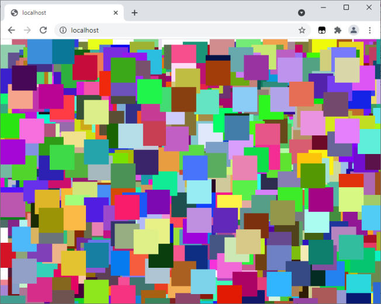

> ## Rozcestník
> - [Späť na úvod](../../README.md)
> - Repo: [Štartér](/../../tree/main/php/squares), [Riešenie](/../../tree/solution/php/squares)
> - [Zobraziť riešenie](riesenie.md)

# Generovanie štvorčekov

 

**Hlavný jazyk príkladu**: PHP

**Ostatné použité jazyky**: HTML, CSS

**Obťažnosť**: 1/5

**Obsah príkladu**: Generovanie HTML a CSS kódu pomocou PHP, vytváranie a volanie funkcií, cyklus `for`, náhodné čísla, polia v PHP. 

## Zadanie
Vytvorte skript v jazyku PHP, ktorý v kombinácii s CSS vyplní celú stránku štvorčekami o veľkosti `50px` x `50px`. Každý štvorček bude mať náhodnú pozíciu a farbu. Štvorčekov na jednej stránke zobrazte 2000. 

