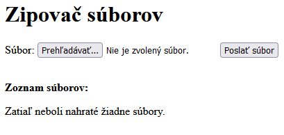

<div class="hidden">

> ## Rozcestník
> - [Späť na úvod](../../README.md)
> - Repo: [Štartér](/../../tree/main/php/zipper), [Riešenie](/../../tree/solution/php/zipper).
> - [Zobraziť riešenie](riesenie.md)

# Online zipovač (PHP)

</div>

## Riešenie

Riešenie si rozdelíme do dvoch častí. prvá časť ktorá bude vstupným Bodom do aplikácie bude obsahovať html formulár cez
ktorý je možné poslať súbor. keď bude súbor odoslaný, činnosť prevezme trieda Uploader, ktorá sa postará o to, aby sa
súbor dostal do správneho adresára a bol pripravený na neskoršiu komprimáciu.

### HTML formulár

Formulár bude obsahovať dva vstupné prvky: prvý tipu `file` a a druhý typu `submit`. Keďže je formulár bude použitý na
odosielanie súborov musí používať metódu `POST` na odosielanie súborov a je nutné, aby mal nastavený atribút
`enctype="multipart/form-data"`, inak prehliadač súbor neodošle. Atribút `action` nenastavíme, preto bude formulár
odoslaný tomu istému skriptu, v ktorom sa nachádza.

```html

<form method="post" enctype="multipart/form-data">
    <input type="hidden" name="MAX_FILE_SIZE" value="1000000">
    Súbor: <input type="file" name="userfile">
    <input type="submit" value="Poslať súbor">
</form>
```

### Spracovanie formulára

Keď sa formulár odošle na server, je potrebné dáta nejakým spôsobom spracovať. Ak sa odošle súbor, v jazyku PHP sa
nastavá prvok poľa `$_FILE` tak, aby sme boli schopný identifikovať, aký súbor používateľ poslal. Táto premennná je
dvojrozmerné pole, kde prvý rozmer je názov poľa uvedený vo formulári a daľší rozmer sú parametre súboru.

$_FILES['userfile']['name']

    Pôvodné meno súboru, ako bolo na lokálnom počítači používateľa.

$_FILES['userfile']['type']

    Mime typ súboru vo formáte typ/podtyp, napr. application/zip. Tátro informácia je závislá na prehliadači, preto 
    nie je možné sa spoliahať na jej správnosť.

$_FILES['userfile']['size']

    Veľkosť súboru v bajtoch 

$_FILES['userfile']['tmp_name']

    Dočasné meno súboru, ktoré dostane po nahratí na server a uložení do temp adresára

$_FILES['userfile']['error']

    Číselná hodnota chybového k=odu. Ak upload prebehol v poriadku, bude tam 0 (konštanta UPLOAD_ERR_OK), inak tam 

bude nejaký chybový kód

#### Limitovanie veľkosti nahrávaného súboru

Ak necheme, aby na server bol poslaný dlhší súbor ako je stanovený limit, možeme veľkosť súboru obmedziť už na strane
klienta (hoci súbor aj tak prehliadač odošle) pomocou nastavenia skrytého formulárového poľa:

```html
    <input type="hidden" name="MAX_FILE_SIZE" value="1000000">
```

Ak je veľkosť súboru väčšia ako táto hodnota, bude vrátená chyba `UPLOAD_ERR_FORM_SIZE` umiestnená v `$_FILES
['userfile']['error']` Toto riešenie nie je spoľahlivé, pretože používateľ može podvrhnúť túto hodnotu. Preto
spoľahlivejším riešením je definovanie veľkosti súborov pomocou direktív `upload_max_filesize` a `post_max_size` v
php.ini. Direktíva upload_max_filesize priamo určite, akú maximálnu veľkosť môže mať nahrávaný súbor a
direktíva `post_max_size` stanovuje veľkosť celej `POST` požiadavky. Logicky táto hodnota musí byť väčšia ako
`upload_max_filesize`. Okrem toho je ešte možné limitovať počet súborov, ktoré sa na server pošlú v jednej požiadavke
direktívou `max_file_uploads`. Tieto hodnoty sú nastavované na strane servera a preto nemôžu byť podvrhnuté. V prípade,
že veľkosť súboru presahuje nastavenú hodnotu, nahrávaný súbor bude odmietnutý a bude vrátená chyba
`UPLOAD_ERR_INI_SIZE` umiestnená v `$_FILES['userfile']['error']`.

### Trieda Uploader

Keď vieme, ako spracovať súbor na strane servera, možeme pristúpiť k implementácii triedy `Uploader`. Súbory budeme
zhromažďovať v nejakom adresári až do chvíle, keď ich skomprimujeme a pošleme používateľovi. Preto budeme potrebovať
privátny atribút `$uploadsDir`, ktorý triede pošleme pri jej vytváraní. Ak tento adresár neexistuje, vytvoríme si ho. Ak
náhodou existuje súbor s týmto menom, vymažeme ho. Ak adresár existuje, použijeme ho. Pri práci so súbormi budeme
potrebovať vždy aktuálny zoznam súborov, preto si vytvoríme metódu, ktorá náme bude vracať vždy aktuálny zoznam súborov.
Tieto súbory si budeme pamätať v privátnom atribúte `$filesList` typu pole.

```php
class Uploader
{
    const UPLOAD_DIR = "uploads";
    /**
     * @var String
     */
    private $uploadsDir;
    private $filesList = [];
 
    public function __construct(string $uploadsDir)
    {
        $this->uploadsDir = $uploadsDir;
        if (is_file($this->uploadsDir)) {
            unlink($this->uploadsDir);
        }
        if (!is_dir($this->uploadsDir)) {
            mkdir($this->uploadsDir, 0700);
        }
    }
}
```

### Nahratie súboru na server

Keď máme triedu vytvorenú, môžeme vytvoriť metódu `saveUploadedFile()`, ktorá skontroluje nahratý súbor a presunie ho z
dočasného adresára do adresára k ostatným súborom. Najprv skontrolujeme, či sa nahratie súboru podarilo a či nie je
prvku `$_FILES['userfile']['error']` nejaká chyba. Ak by bola, spracovanie prerušíme výnimkou, ktorú vrátime, aby sme o
nej informovali používateľa. Na samotné kopírovanie použijeme funkciu `move_uploaded_file() `, ktorá na rozdiel od
bežného kopírovania súborov najskôr vykoná kontrolu, či bol súbor naozaj súbor nahratý cez POST požiadavku od
používateľaa potom ho presunie na jeho finálne miesto. Parametrami tejto funkcie sú zdrojový a cieľový súbor, pričom
cieľový súbor zbavíme cesty, ak by ju obsahoval volaním funkcie `basename()`. Ak používateľ nahrá súbor s rovnakým
menom, nebudeme to nijako riešiť a súbor prepíšeme (Pridaním jednoduchej podmienky kontrolujúcej, či v cieľom adresári
daný súbor existuje by sme vedeli ošetriť aj tento problém a zmeniť mu meno).

```php
    function saveUploadedFile(): string
    {
        try {
            switch ($_FILES['userfile']['error']) {
                case UPLOAD_ERR_OK:
                    if (!move_uploaded_file($_FILES['userfile']['tmp_name'], 
                            $this->getFullFileNameWithDir(basename($_FILES['userfile']['name'])))) {
                        throw new RuntimeException('Súbor nebol poslaný správnym spôsobom.');
                    }
                    break;
                case UPLOAD_ERR_NO_FILE:
                    throw new RuntimeException('Žiadny súbor nebol poslaný.');
                case UPLOAD_ERR_INI_SIZE:
                case UPLOAD_ERR_FORM_SIZE:
                    throw new RuntimeException('Veľkosť súboru presahuje povolený limit.');
                default:
                    throw new RuntimeException('Neznáma chyba.');
            }
            return '';
        } catch (RuntimeException $e) {
            return $e->getMessage();
        }
    }
```

V tejto metóde sme použili `getFullFileNameWithDir()`, ktorá zostaví plnú cestu k súboru aj s názvom. Použili sme
konštantu `DIRECTORY_SEPARATOR`, pretože Linux a MS Windows používajú rozdielne znaky na oddelovanie jednotlivých
adresarov. Ako parameter met´da dostane názov súboru, ktorý má spracovať. Metoda bude privatna, lebo ju mimo triedy
nebudeme potrebovať.

```php
    private function getFullFileNameWithDir($fileName) : string {
        return $this->uploadsDir . DIRECTORY_SEPARATOR . $fileName;
    }
```

Prvá zo spomínaných metód je funkcia `getFilesList()`, ktorá vždy obnoví zoznam nahratých súborov a vráti obsah
privátneho atribútu $filesList. Je dôležité, aby sme pri prístupe k tomu to atribúty vždy používali túto get metódu,
pretože, zoznam súborov sa môže zmeniť, ak by medzi časom iný používateľ nahral svoje súbory. Na implementáciu
metódy `updateFilesList()`, využijeme PHP funkciu `scandir()`, ktorá vráti zoznam všetkých súborov a adresári, ktorý
dostane ako svoj paramater. Vráti aj špeciálne súbory `.` a `..`, ktorý zo zoznamu musíme odstrániť, preto použijeme
funkciu `array_diff()` vracajúcu rozdiel medzi dvomi poľami a týým dostaneme pole "očistené" o tieto neželané prvky:

```php
    function getFilesList(): array
    {
        $this->updateFilesList();
        return $this->$filesList;
    }

    public function updateFilesList(): void
    {
        $this->filesList = array_diff(scandir($this->uploadsDir), ['..', '.']);
        //$this->filesList = array_filter($this->filesList, fn($item) => substr($item, 0,40) == $this->getUniqueId());
        //$this->filesList = array_map(fn($item) => substr($item, 41), $this->filesList);
    }
```

### Komprimácia súborov a stiahnutie .zip súboru

Na komprimáciu použijeme hotovú triedu `ZipArchive`, ktorá je súčasťou rozšírenia `php_zip`. Toto rozšírenie je ako
jedno z mála PHP rozšírení objektové čo využijeme aj v našom príklade. Vytvoríme metódu `zipAndDownload()`, ktorá
skomprimuje súbory, vytvorí archív a posunieho na poslanie. Samotné poslanie si oddelíme do inej metódy. Na prácu s
triedou `ZipArchive` neudeme potrebovať žiadny import (je nainštalovaná ako PHP rozšírenie). Volaním `new ZipArchive
()` si vytvoríme inštanciu tejto triedy. Potom súbor otvoríme metódou `open()`. Tá, ako prvý parameter potrebuje názov
súboru, kde bude nový archív (využijeme PHP funkcie `sys_get_temp_dir()` a `tmpfile()` na prácu s dočasnými súbormi).
Dočasný súbor tak vznikne v systémovom `tmp` adresári. Bohužiaľ trieda neumožňuje vytvorenie komprimovaného súboru v
pamäti a musíme vytvoriť archív na disku. Ďalej v cykle prejdeme aktuálny zoznam súborov a postupne ich do archívu
pridáme, pričom si pomôžeme už známou metódou `getFullFileNameWithDir()`. Najskôr skontrolujeme, či súbor existuje a
metódou `add()` triedy `ZipArchive` ho pridáme do archívu. Druhý parameter tejto metódy použijeme, aby súbor v archíve
mal pôvodné meno. Nakoniec archív uzatvoríme a posunieme spracovanie na odoslanie archívu do metódy `sendZipFile`.

```php
    function zipAndDownload() : void
    {
        $zip = new ZipArchive();
        $zip->open(sys_get_temp_dir() . DIRECTORY_SEPARATOR . tmpfile(), ZipArchive::CREATE);
        foreach ($this->getFilesList() as $fileName) {
            if (file_exists($this->getFullFileNameWithDir($fileName))) {
                $zip->addFile($this->getFullFileNameWithDir($fileName), $fileName);
            }
        }
        $zip->close();
        $this->sendZipFile($tmpFile);
    }
```

V tejto metóde vymažeme nahraté súbory a nastavíme odpoveď servera tak, aby prehliadač ponúkol používateľovi dialógové
okno na uloženie alebo otvorenie komprinovaného archívu. Toto dosiahne nastavením HTTP hlavičiek tak, že  
súbor posielaný zo servera bude MIME typu `application/zip`. Hlavička `Content-Disposition` prehliadaču pošle názov
súboru. V ďalšom kroku vvytvorený arvhív vypíšeme príakazom `echo`, čím zabezpečíme, že sa dostane tok dát cez webový
server na prehliadač. Nakoniec vymažeme aj dočasný súbor s archívom.

```php
     function sendZipFile($tmpFile)  : string
     {
        foreach ($this->getFilesList() as $fileName) {
            unlink($this->getFullFileNameWithDir($fileName));
        }

        header('Content-type: application/zip');
        header('Content-Disposition: attachment; filename="download.zip"');
        echo file_get_contents($tmpFile);
        unlink($tmpFile);
    }
```

### Úprava aplikácie pre viacerých používateľov

Tým máme implementované základné správanie triedy `Uploader`, aj keď jedným obmedzením. Keby nám súbory na túto stránku
nahrávalo viacero používateľov, súbory by všetci videli a archív by sa vytvoril zo všetkých súborov a stiahol ho prvý z
používateľov, ktorý by sa o tom pokúsil. Potom by sa súbory ako aj archív vymazali. Potrebujeme nejako zabezpečiť, aby
sa súbory medzi používateľmi nemiešali. Jedným z riešením by bolo vytvorenie prihlasovania a každý používateľ by mal
vlastný adresár so súbormi. Riešenie by si vyžadovalo pridanie celkom rozsiahleho kódu, najmä ak by sme chceli užívateľa
aj overovať (jeho meno a heslo).

#### Cookies

Existuje však jednoduchšie riešenie. Základným problémom webových aplikácií je, že HTTP protokol je bezstavový. To v
praxi znamená, že všetky žiadosti sú navzájom nezávioslé a server nevie o tom, že dve žiadosti z toho istého prehliadača
sú od toho istého používateľa. To by v našom konkrétnom prípade znamenalo, že by sme nevedeli určiť, ktorý súbory patria
tomu istému používateľovi. Riešením je násť spôsob, ako označiť žiadosť z prehlidača tak, aby serveru bolo jasné, že
žiadosť súvisí z inou žiadosťou z toho istého prehliadača. Tento spôsom však netreba nanovo vymýšlať, lretože už
existuje a nazáva sa **cookies**. Cookies sú HTTP hlavičky, ktoré vieme zo servera poslať na prehliadač, ten si ich
zapamätá a s každou požiadavkou nám ich pošle späť na server, kde ich vieme spracovať. Ak si do takéhoto cookie napr.
vložíme jednoznačný identifikátor používateľa, na serveri vždy budeme vedieť, od koho súbory pochádzajú.

#### Podpora viacerých používateľov

V prvom rade si musíme vytvoriť jednoznačný indetifikátor používateľa pri prvej komunikácii s ním. Ak už takýto
identifikátor existuje, nebudeme ho vytvárať, ale použíjeme existujúci. Tento identifikátor uložíme v
atribúte `$uniqueId` v triede `Uploader`. Vytvorené metódy budú typické `get` a `set` metódy. Na vytvorenie náhodného
identifikátora využijeme funkciu `random_bytes()`, ktorá vráti počet náhodných znakov zadaný v parametri. Znaky
premeníme na hexadecimálneho hodnoty (funkcia `bin2hex()`) pre lepšiu čitateľosť. Vytvorený identifikátor nastavíme
pomocou `setcookies()`, čím zabezpečíme, že sa dostane na klienta (do prehliadača) a pri každej požiadavke ho prehlidač
k žiadosti pripojí. Platnosť tejto HTTP hlavičky je možné stanoviť v extra paramatroch, ale my sa uspokojíme s tým, že
bude platiť až kým nezatvoríme prehliadač (všetky okná). Či cookie existuje zistíme z poľa `$_COOKIE`. Ak prvom s daným
kľúčom existuje, bude existovať aj daný cookie. Set metóda bude veľmi jednoduchá a bude vracať aktuálne unikátne id.
Nakoniec pridáme volanie `$this->setUniqueId()` na koniec konštruktora.

```php
    public function getUniqueId(): string
    {
        return $this->uniqueId;
    }

    public function setUniqueId(): void
    {
        if (isset($_COOKIE['uniqueId'])) {
         $this->uniqueId = $_COOKIE['uniqueId'];
    } else {
         $this->uniqueId = bin2hex(random_bytes(20));
         setcookie('uniqueId', $this->uniqueId);
        }
    }
```

Vygenerovaný identifikátor može vyzerať napr. takto: `3ee22b7b69591e19406b001137397953ac882d5e`. Je možné si ho pozrieť
v prehliadači po stlačení klávesy F12 (*Vývojárske nástroje*) v záložke `Úložisko` pod položkou Cookies.

Ďalšou úlohou bude vyriešiť to, aby sme vedeli, ktoré súbory patria používateľovi. Toto jednoducho vyriešime tak, že k
názvu súboru prilepíme predponu pozostávajúcu z identifikátora a pomlčky. Identifikátor bude mať fixnú dĺžku, preto bude
jednoduché zas vrátiť názov súboru do pôvodného stavu. Toto riesšenie bude mať ete ďalšiu výhodu. Pri základnom riešení
mohla nastať situácia, že by si používatelia svoje súbory navzájom prepisovali. Ak ku každému súboru pridá jednoznačný
identifikátor používateľa, názvy súborov sa tiež stanú unikátnymi. Úprava metódy `getFullFileNameWithDir()` bude vyzerať
nasledovne:

```php
    private function getFullFileNameWithDir($fileName): string
    {
        return $this->uploadsDir . DIRECTORY_SEPARATOR . $this->getUniqueId() . '-' . $fileName;
    }
```

Výsledný názov súbor potom napr. pre súbor `1.txt` bude `3ee22b7b69591e19406b001137397953ac882d5e-1.txt`.

V podobnom duchu budeme musieť upraviť aj metódu `updateFilesList()`, aby vracala len zoznam súborov, ktorý má predponu
zhodnú s identifikátorom používateľa (využijeme funkciu `array_filter`, ktorá vstupné pole prefiltruje a vráti len tie
prvky, ktoré spĺňajú zadané kritériu). Nakoniec zostávajúce názvy súborov zbavíme identifikátora a polmčky, aby sme
dostali pôvodné názvy (funkcia `array_map()` vykoná definovanú operáciu nad každým prvkom poľa). Pri obidvoch funkciách
využijeme **arrow funkcie** z jazyka PHP, aby sme kód zjednodušili. Ako parameter obe majú jeden prvok poľa, ktorý pri
danej iterácii spracujú. Vyhneme sa tak písaniu cyklu, kde by sme obidne operácie riešili.

```php
    public function updateFilesList(): void
    {
        $this->filesList = array_diff(scandir($this->uploadsDir), ['..', '.']);
        $this->filesList = array_filter($this->filesList, fn($item) => substr($item, 0,40) == $this->getUniqueId());
        $this->filesList = array_map(fn($item) => substr($item, 41), $this->filesList);
    }
```

Pretože sme si oddelili prístup k názvom súborov do samostanej metódy `getFullFileNameWithDir()` zostávajúce
`saveUploadedFile()`, `zipAndDownload()` a `sendZipFile()` nemusíme meniť.

### Úpravy súboru index.html

Na začiatok súboru (pred definíciu `<!doctype html>`) umiestnime PHP časť kódu, ktorá bude našu aplikáciu riadiť. Vždy
budeme potrebovať vytvoriť inštanciu triedy `Uploader`. Ak používateľ poslal súbor, bude nastavená
premenná `$_FILES['userfile']` a súbor uložíme volaním metódy `saveUploadedFile()`. Ak používateľ stačil tlačidlo
*Zipuj*, súbory zazipujeme a výstup mu ponúkneme na stiahnutie (volaním metódy `zipAndDownload()`). Nesmieme zabudnúť
ukončiť celý PHP skript (funkciou `die()`) za týmto príkazom, pretože zvyšný HTML kód už nie je ani nesmie byť súčasťou
posielaného archívu.

```php
 <?php
require "Uploader.php";
$uploader = new Uploader("uploads");
$result = "";
if (isset($_FILES['userfile'])) {
    $result = $uploader->saveUploadedFile();
}
if (isset($_POST['zip'])) {
    $uploader->zipAndDownload();
    die();
}
?>
 ```

Za nadpis *Zipovač súborov* umiestnime kód, ktorý bude zobrazovať prípadnú chybu, ak nejaká pri nahrávaní súborov na
server nastane:

```php
<?php
    if ($result != '') {
      echo "<p style=\"color: red\">$result</p>";
    }
?>
```

Ak budeme mať najeké súbory na serveri, musíme používateľovi umožniť si tieto súbory skomprimovať a stiahnut. Najskôe mu
vypíšeme, aké súbory má na serveri a potom pridáme formulár s tlačidlom na odoslanie príkazu na komprimáciu súborov.
Odoslanie tohoto formulára spôsobí, zže bude nastavená premenná `$_POST['zip']`, ktorú testujeme na začiatku tohoto
skriptu a spustíme PHP kód, ktorého úlohou je komprimácia súborov a ich odoslanie do prehliadača. Ak žiadne súbory na
serveri ešte nemáme, metóda `$uploader->getFilesList()` vráti prázdne pole a používateľovi vypíšeme, že zatiaľ neboli
nahraté žiadne súbory. Celý úsek kódu vyzerá takto:

```php
<p><b>Zoznam súborov:</b></p>
<div id="files">
    <?php
    if ($uploader->getFilesList() != []) {
    ?>
    <p>
        <?php
        foreach ($uploader->getFilesList() as $fileName) {
            echo $fileName . '<br>';
        }
        ?>
    </p>
    <form action="index.php" method="post" onsubmit="deleteFiles()">
        <input type="submit" name="zip" value="Zipovať!">
    </form>
<?php
} else {
    ?>
    <p>Zatiaľ neboli nahraté žiadne súbory.</p>
    <?php
}
?>
</div>
```

Po odoslaní pokynu na komprimáciu súborov a stiahnutie archívu by sme však potrebovali, aby sa zoznam súborov vymazal a
mohli sme začať odznova. Aj keď sa zdá, že toto by mohol byť jednoduchý púroblém na vyriešenie, nie je tomu tak.
Odoslanie archívu zo servera sme dosiahli vytvorením novej odpovede, ktorá je typu `application/zip` a nemá nič spoločné
so stránkou, ktorú máme zobrazenú v prehliadači, preto stránku nemôže len tak jednoducho zmeniť. Museli by sme ju celú
znovu načítať, ale to vieme spraviť opäť len na tejto stránke. Preto si pomôžeme krátkym kódom v Javascripte, ktorý
vymaže všetky existujúce elementy vo vnútri kontajnera s `id=files`. A pridá do neho novú odstavec, keď používateľovi
vypíše, že súbory boli stiahnuté. Túto funkciu nastavíme ako obsluhu udalosti `onsubmit` vo formulári s tlačidlom (viď
úryvok kódu hore). Táto funkcia sa zavolá tesne pred odoslaním formulára.

```javascript
function deleteFiles() {
    document.querySelectorAll('#files > *').forEach((item) => item.style.display = 'none');
    let p = document.createElement("p")
    document.getElementById('files').append(p);
    p.innerHTML = 'Súbory boli stiahnuté.';
}
```

Tým je aplikácia hotová. Na nasledovnom obrázku je možné vidieť jej vzhľad pred nahratím súborov:



Používateľ postupne pridal 5 súborov do archívu:


Na tomto obrázku je aplikácia v stave, keď používateľ klikol na tladičidlo **Zipuj!** a môže sa rozhodnúť, či archív
uloží na lokálny disk, alebo rovno otvorí.


